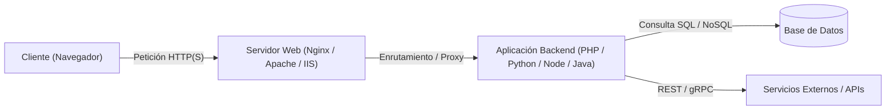
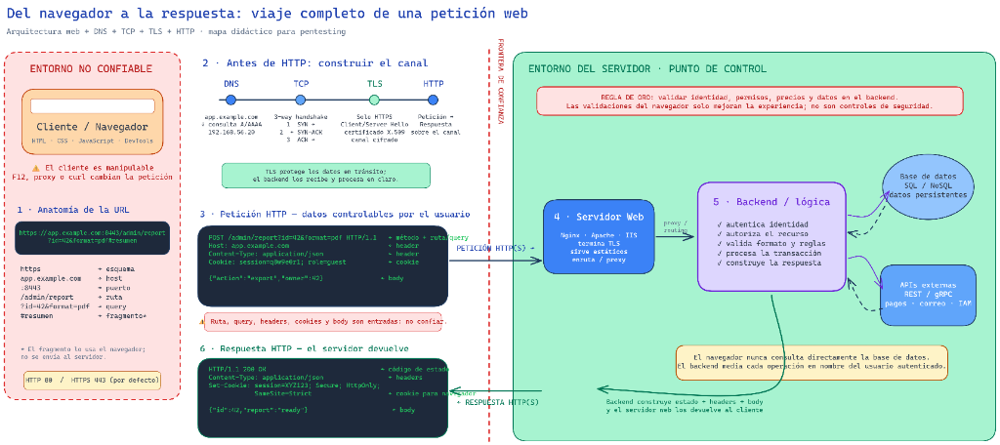
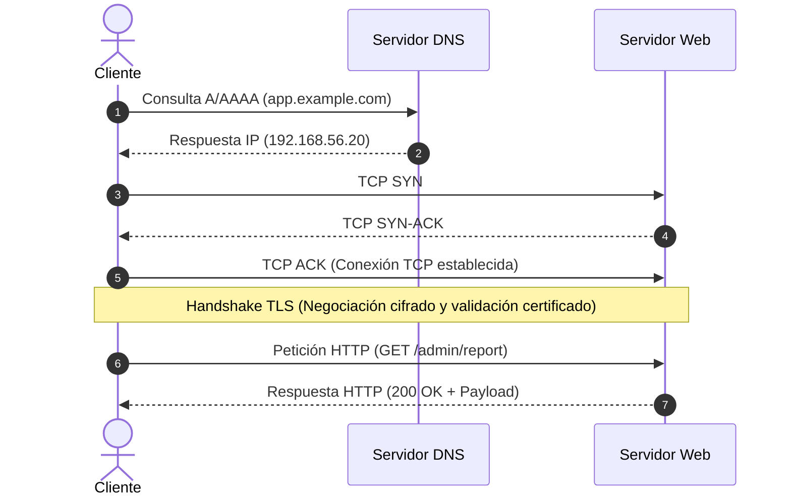
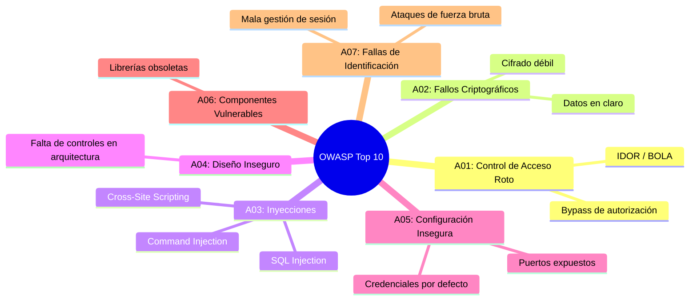

# Capítulo 01: Arquitectura Web y Protocolo HTTP

[Inicio](../../README.md) | [Pentesting Web](../README.md) | [Siguiente: Fundamentos de SQL](../02-fundamentos-sql/README.md)

---

## Objetivos de aprendizaje

Al finalizar este capítulo serás capaz de:

- Describir con rigor el modelo cliente-servidor web y justificar técnica y prácticamente por qué el navegador nunca representa una frontera de confianza (*Trust Boundary*).
- Trazar el ciclo de vida completo de una petición web a través de sus fases: desde la resolución DNS y negociación TCP/TLS hasta la respuesta del backend.
- Desglosar los componentes de una URL según el estándar RFC 3986 e identificar vectores de ataque e inyección en cada uno de sus segmentos.
- Comprender la premisa fundamental de TLS: protege el canal en tránsito por la red, pero el backend procesa los datos en texto claro sin mitigar vulnerabilidades en capa de aplicación.
- Analizar la anatomía de mensajes de petición y respuesta HTTP, reconociendo que cada método, ruta, cabecera, cookie y cuerpo es un dato de entrada manipulable por el auditor.
- Identificar la separación de funciones entre el Servidor Web perimetral (terminación TLS, archivos estáticos, proxy inverso) y el Backend (reglas de negocio, autenticación, autorización).
- Explicar por qué el navegador jamás dialoga directamente con la base de datos y cómo el desacoplamiento previene o expone fallos de seguridad.
- Diferenciar rigurosamente entre formateo, codificación (*encoding*) y cifrado (*encryption*), evaluando su impacto real en auditorías de seguridad.
- Auditar la configuración de seguridad de las cookies de sesión (`Secure`, `HttpOnly`, `SameSite`) y cabeceras defensivas de respuesta.
- Explicar el funcionamiento de un proxy de interceptación (Burp Suite / OWASP ZAP) y el mecanismo de ruptura TLS (MitM) mediante certificados de CA local.

---

## 1. El modelo de aplicaciones web y el viaje completo de una petición

Una aplicación web moderna no es un componente de software aislado; es una arquitectura distribuida y heterogénea donde interactúan el cliente, la red de transporte, servidores proxy perimetrales, servicios de backend, bases de datos y microservicios externos.



Para evaluar la seguridad de una aplicación web desde la perspectiva de un pentester profesional, es fundamental visualizar la trayectoria íntegra que recorren los datos:

### Mapa didáctico: Del navegador a la respuesta



Este mapa didáctico articula el flujo de una petición web en dos grandes dominios separados por la **Frontera de Confianza**:

1. **Entorno no confiable (Lado cliente)**: El navegador del usuario ejecuta HTML, CSS y JavaScript. El cliente es enteramente manipulable mediante DevTools (F12), scripts locales, llamadas directas con `curl` o proxies de interceptación.
2. **Construcción del canal (Red y transporte)**: Antes de intercambiar datos HTTP, se requiere resolver el dominio vía DNS, establecer la sesión TCP mediante el *3-way handshake* y negociar el túnel cifrado TLS.
3. **Petición HTTP (Datos de entrada)**: El mensaje con método, ruta, query string, cabeceras, cookies y cuerpo. Todo este contenido lo controla el usuario.
4. **Frontera de confianza (*Trust Boundary*)**: Límite estricto a partir del cual el servidor debe asumir que toda entrada está potencialmente contaminada.
5. **Entorno del servidor (Punto de control)**:
   - **Servidor Web (Nginx / Apache / IIS)**: Termina el túnel TLS, despacha archivos estáticos y enruta peticiones dinámicas mediante proxy inverso.
   - **Backend / Lógica de aplicación**: Autentica al usuario, autoriza el recurso solicitado, valida reglas de negocio y procesa la transacción.
   - **Base de Datos y APIs externas**: Almacenamiento persistente (SQL/NoSQL) y servicios de soporte (pagos, correo, IAM). **El navegador nunca dialoga directamente con la base de datos**.
6. **Respuesta HTTP**: El backend construye el estado y los datos devueltos, y el servidor web los retorna al cliente a través del canal protegido.

---

## 2. Fronteras de confianza: El cliente no es una autoridad

Uno de los principios cardinales en la seguridad de aplicaciones web es el concepto de **frontera de confianza** (*Trust Boundary*).

```text
[ ENTORNO NO CONFIABLE ]                     [ ENTORNO CONFIABLE ]
    Navegador / Cliente                             Servidor
+--------------------------+               +--------------------------+
| - HTML / CSS             |   HTTP(S)     | - Lógica de negocio      |
| - JavaScript             | ------------> | - Autenticación          |
| - Validaciones en form   |               | - Autorización por roles |
| - Almacenamiento local   |               | - Consultas a BD         |
+--------------------------+               +--------------------------+
     (Totalmente manipulable)                     (Punto único de control)
```

> [!CAUTION]
> **REGLA DE ORO DE SEGURIDAD WEB (CWE-602)**: Validar identidad, permisos, precios y datos en el backend. Las validaciones del navegador solo mejoran la experiencia de usuario (UX); **jamás son controles de seguridad**.

### Métodos de evasión de controles en el cliente

Cualquier restricción implementada en el cliente puede neutralizarse trivialmente por un atacante o auditor:

| Mecanismo en Frontend | Propósito pretendido (UX) | Técnica de bypass por el auditor |
|---|---|---|
| Atributo `maxlength="10"` | Limitar longitud de texto en `<input>` | Eliminar o editar el atributo mediante DevTools (F12) o enviar la petición vía `curl`. |
| Atributo `disabled` o `readonly` | Bloquear campos de formulario no modificables | Remover el atributo en el árbol DOM del navegador o generar la petición HTTP manualmente. |
| Validación JavaScript `checkForm()` | Verificar que el email tenga `@` o que la clave sea robusta | Desactivar JavaScript en el navegador o enviar el payload directo por Burp Suite / Repeater. |
| Campo oculto `<input type="hidden" name="price" value="100">` | Almacenar el precio del producto para enviarlo al checkout | Modificar el valor a `1` en DevTools o en el cuerpo de la petición POST interceptada. |
| Menú desplegable `<select>` con roles (`user`, `guest`) | Evitar que el usuario seleccione el rol `admin` | Inyectar `role=admin` en el cuerpo de la petición HTTP con Burp Suite o `curl`. |

Por tanto: **Toda decisión crítica de seguridad (identidad, permisos sobre el recurso, precios, saldos, transacciones) debe validarse estrictamente en el backend**.

---

## 3. Anatomía de una URL (RFC 3986) y vectores de entrada

Un Localizador Uniforme de Recursos (URL) es una cadena de caracteres estructurada que define la ubicación de un recurso y el protocolo para acceder a él.

Analicemos la URL del mapa didáctico:

```text
https://app.example.com:8443/admin/report?id=42&format=pdf#resumen
\___/   \_____________/ \__/ \__________/ \______________/ \_____/
  |            |          |        |              |           |
Esquema       Host      Puerto    Ruta       Query String  Fragmento
```

| Componente | Ejemplo | Función técnica | Vectores de Ataque en Pentesting |
|---|---|---|---|
| **Esquema (Scheme)** | `https` | Define el protocolo de transporte (`http`, `https`, `ftp`). | Determina si el canal va cifrado con TLS (`https`) o en claro (`http`). Superficie para ataques de *SSL Stripping* y políticas *HSTS*. |
| **Host** | `app.example.com` | FQDN o dirección IP que identifica el servidor de destino. | Determina la resolución DNS y la cabecera `Host:`. Vector de *Host Header Injection*, envenenamiento de caché web y enrutamiento en *Virtual Hosts*. |
| **Puerto** | `:8443` | Puerto TCP de escucha del servicio web. | Puertos no estándar (ej. 8080, 8443) suelen alojar paneles administrativos internos o APIs que eluden reglas de filtrado perimetral. |
| **Ruta (Path)** | `/admin/report` | Ubicación lógica del recurso o endpoint en el servidor. | Superficie para ataques de *Path Traversal* (`../`), enumeración de directorios ocultos y bypass de proxies por inconsistencias de normalización. |
| **Query String** | `?id=42&format=pdf` | Parámetros `clave=valor` separados por `&` e iniciados por `?`. | **Vector primordial de inyección**: Inyección SQL (SQLi), Cross-Site Scripting (XSS), Server-Side Request Forgery (SSRF), Local File Inclusion (LFI) e IDOR. |
| **Fragmento** | `#resumen` | Marcador de posición procesado en el DOM; **no se envía al servidor**. | Utilizado por aplicaciones SPA para enrutamiento interno (`/#/resumen`). Superficie exclusiva para vulnerabilidades de **DOM-based XSS**. |

> [!IMPORTANT]
> **Detalle crítico sobre el fragmento (`#`)**:
> Cuando el navegador solicita `https://app.example.com/admin/report#resumen`, la petición que se transmite por la red es:
> ```http
> GET /admin/report HTTP/1.1
> Host: app.example.com
> ```
> La sección `#resumen` es truncada por el propio navegador antes de emitir la trama de red. Por tanto, el fragmento jamás llega al servidor web ni al backend; su impacto de seguridad reside exclusivamente en el contexto del DOM del navegador cliente (*DOM-based XSS*).

### Puertos estándar por omisión

Si una URL no especifica el puerto explícitamente:
- En `http://`, se asume el puerto **TCP 80**.
- En `https://`, se asume el puerto **TCP 443**.

---

## 4. Antes de HTTP: Construir el canal de comunicación

Antes de transferir datos de la aplicación, el cliente y el servidor deben negociar las capas de transporte y seguridad:



```text
1. DNS:        app.example.com ---> Consulta A/AAAA ---> 192.168.56.20
2. TCP:        3-way Handshake:
               1. Cliente  --- SYN ------> Servidor
               2. Servidor <-- SYN-ACK --- Cliente
               3. Cliente  --- ACK ------> Servidor (Conexión establecida)
3. TLS:        Solo en HTTPS (Puerto 443 / 8443):
               - Client Hello / Server Hello
               - Validación de Certificado X.509
               - Intercambio criptográfico (ECDHE) -> Canal cifrado
4. HTTP:       Petición y Respuesta transmitidas sobre el canal seguro
```

### 4.1 Resolución DNS
El sistema operativo traduce el nombre de dominio (`app.example.com`) a una dirección IP accesible (`192.168.56.20`).
- **Riesgos**: *DNS Spoofing*, envenenamiento de caché y ataques de *DNS Rebinding* para interactuar con interfaces locales detrás del firewall.

### 4.2 Establecimiento de sesión TCP (3-way Handshake)
Garantiza la entrega ordenada y fiable de paquetes mediante números de secuencia y acuses de recibo (`SYN` $\to$ `SYN-ACK` $\to$ `ACK`).

### 4.3 Negociación TLS (Transport Layer Security)
En conexiones HTTPS:
1. **Client / Server Hello**: Intercambio de versiones de protocolo compatibles y suites criptográficas soportadas.
2. **Certificado X.509**: El servidor demuestra su identidad ante el cliente mediante un certificado digital emitido por una Autoridad de Certificación (CA).
3. **Canal cifrado**: Se acuerda una clave simétrica temporal (ej. AES-GCM) para cifrar todo el flujo de datos subsiguiente.

### 4.4 La premisa fundamental de TLS

> [!IMPORTANT]
> **TLS protege los datos en tránsito; el backend los recibe y procesa en claro**:
> El cifrado TLS protege el canal entre el cliente y el servidor frente a intermediarios pasivos en la red (redes Wi-Fi públicas, proveedores de acceso).
> 
> Sin embargo:
> - El servidor web descifra el paquete al recibirlo.
> - **El backend recibe y procesa los datos en texto claro**.
> - **TLS no previene vulnerabilidades en capa de aplicación**: un ataque de Inyección SQL, un XSS o una alteración de lógica funciona exactamente igual sobre HTTPS que sobre HTTP.

---

## 5. Anatomía de los mensajes HTTP: Superficie de ataque

HTTP (Hypertext Transfer Protocol) es un protocolo sin estado (*stateless*). En HTTP/1.1, cada mensaje es texto legible estructurado en secciones bien definidas.

### 5.1 Anatomía de una Petición HTTP

Observemos la petición analizada en el mapa didáctico:

```http
POST /admin/report?id=42&format=pdf HTTP/1.1
Host: app.example.com
Content-Type: application/json
Cookie: session=q8wdC0r1; role=guest

{"action":"export","owner":42}
```

Estructura técnica del mensaje:

```text
[1. LÍNEA DE PETICIÓN] -> POST /admin/report?id=42&format=pdf HTTP/1.1
                          \__/ \____________________________/ \______/
                         Método          Ruta / Query          Versión

[2. CABECERAS]         -> Host: app.example.com
                          Content-Type: application/json
                          Cookie: session=q8wdC0r1; role=guest

[3. LÍNEA EN BLANCO]   -> \r\n (CRLF obligatorio que delimita cabeceras de cuerpo)

[4. CUERPO O BODY]     -> {"action":"export","owner":42}
```

> [!WARNING]
> **Aviso para el auditor**: Cada componente de este mensaje es enteramente manipulable por el usuario. **Ruta, query, cabeceras, cookies y body son entradas: no confiar**.

### 5.2 Formatos comunes en el cuerpo (`Content-Type`)

1. **`application/x-www-form-urlencoded`**: Pares `clave=valor` separados por `&` con codificación URL:
   ```http
   username=ana&password=MiClave%20Segura%21
   ```
2. **`multipart/form-data`**: Utilizado para enviar archivos binarios junto con campos de texto mediante delimitadores (*boundaries*).
3. **`application/json`**: Cargas útiles estructuradas comunes en APIs REST y SPAs:
   ```http
   {"action": "export", "owner": 42}
   ```

---

## 6. Métodos HTTP y semántica REST

Los métodos HTTP indican al servidor la operación pretendida sobre el recurso:

| Método | Propósito estándar | ¿Seguro?* | ¿Idempotente?** | Relevancia en Pentesting |
|---|---|---|---|---|
| `GET` | Recuperar una representación del recurso. | **Sí** | **Sí** | Parámetros visibles en la URL y logs; análisis de inyecciones y fugas de datos. |
| `POST` | Enviar datos para crear un recurso o procesar una acción. | No | No | Formularios de login, transacciones, subida de archivos, ejecución de lógica. |
| `PUT` | Reemplazar completamente el recurso especificado. | No | **Sí** | Búsqueda de subida arbitraria de archivos en servidores con permisos desprotegidos. |
| `PATCH` | Aplicar modificaciones parciales al recurso. | No | No | Manipulación de campos restringidos (ej. alterar `role` o `saldo`). |
| `DELETE` | Eliminar el recurso identificado por la URL. | No | **Sí** | Pruebas de control de acceso roto (eliminar registros pertenecientes a terceros). |
| `OPTIONS` | Consultar los métodos y opciones permitidas. | **Sí** | **Sí** | Enumeración de verbos habilitados y auditoría de cabeceras de política CORS. |
| `HEAD` | Idéntico a `GET`, pero el servidor solo devuelve cabeceras sin cuerpo. | **Sí** | **Sí** | Comprobación rápida de existencia de recursos sin transferir la carga útil. |

> [!NOTE]
> - **Método seguro**: No modifica el estado de los recursos en el servidor.
> - **Método idempotente**: Ejecutar la misma petición varias veces consecutivas produce el mismo efecto final en el sistema que ejecutarla una sola vez.

---

## 7. Entorno del Servidor: Servidor Web vs Backend

Dentro del entorno del servidor conviven dos subsistemas con responsabilidades distintas:

### 7.1 El Servidor Web (Nginx, Apache, IIS)
- **Termina TLS**: Descifra los paquetes entrantes utilizando el certificado y la clave privada del servidor, liberando al backend de procesar criptografía.
- **Sirve recursos estáticos**: Entrega archivos HTML, CSS, JavaScript e imágenes con alto rendimiento.
- **Enruta y actúa como Proxy Inverso**: Mediante directivas como `proxy_pass` en Nginx o `mod_proxy` en Apache, reenvía las peticiones dinámicas al backend (ej. `http://127.0.0.1:8000`).

### 7.2 Las 5 responsabilidades de seguridad del Backend
El backend (PHP, Python, Node.js, Java, Go) es el punto de control donde residen las reglas de negocio:

1. **Autentica identidad**: Valida credenciales, tokens o sesiones de forma criptográfica.
2. **Autoriza el recurso**: Verifica que el usuario tenga privilegios sobre el objeto solicitado (prevención de BOLA / IDOR).
3. **Valida formato y reglas**: Comprueba tipos de datos y rangos permitidos. Jamás confía en precios o privilegios enviados desde el cliente.
4. **Procesa la transacción**: Ejecuta las operaciones en base de datos o llamadas auxiliares de forma atómica.
5. **Construye la respuesta**: Estructura el payload resultante y emite las cabeceras defensivas.

### 7.3 Aislamiento estricto de la Base de Datos

> [!CAUTION]
> **Aislamiento crítico**: **El navegador nunca consulta directamente la base de datos**.
> El backend media cada operación en nombre del usuario autenticado. Si el backend concatena entradas del usuario directamente dentro de consultas SQL sin parametrización, el atacante rompe esta mediación a través de una **Inyección SQL (SQLi)**.

### 7.4 APIs externas y microservicios
El backend frecuentemente dialoga con pasarelas de pago (Stripe), servicios de correo (SendGrid) o proveedores de identidad (IAM / OAuth).
- **Riesgo asociado**: Si el backend construye peticiones salientes basadas en parámetros que el usuario suministra, se origina una vulnerabilidad de **Server-Side Request Forgery (SSRF)**.

---

## 8. Anatomía de una Respuesta HTTP

Cuando el servidor procesa la petición, devuelve un mensaje de respuesta:

```http
HTTP/1.1 200 OK
Content-Type: application/json
Set-Cookie: session=XYZ123; Secure; HttpOnly; SameSite=Strict

{"id":42,"report":"ready"}
```

Estructura:
1. **Línea de estado (Status Line)**: Versión del protocolo (`HTTP/1.1`), código numérico (`200`) y frase descriptiva (`OK`).
2. **Cabeceras de respuesta (Response Headers)**: Tipo de contenido (`Content-Type`), directivas de cookies (`Set-Cookie`) y opciones de servidor.
3. **Línea en blanco (CRLF)**.
4. **Cuerpo de la respuesta (Body)**: Los datos generados (JSON, HTML, etc.).

### Códigos de estado HTTP fundamentales

| Código | Significado formal | Contexto para el Pentester |
|---|---|---|
| **`200 OK`** | Petición procesada satisfactoriamente. | Acceso concedido o resultado esperado. En bypasses confirma éxito. |
| **`201 Created`** | Recurso creado exitosamente. | Típico en endpoints de registro o APIs REST tras un `POST`. |
| **`301 Moved Permanently`** | Redirección definitiva (`Location:`). | Utilizado comúnmente para forzar la transición de HTTP a HTTPS. |
| **`302 Found / 307 Temporary`** | Redirección temporal. | Frecuente tras un inicio de sesión exitoso hacia el panel de usuario. |
| **`400 Bad Request`** | Sintaxis corrupta en la petición. | Parámetros no procesables o payloads JSON inválidos. |
| **`401 Unauthorized`** | Falta autenticación. | No se aportaron credenciales válidas; común en HTTP Basic o Bearer tokens. |
| **`403 Forbidden`** | Acceso denegado. | El servidor identifica al usuario pero rehúsa autorizarlo sobre el recurso. |
| **`404 Not Found`** | Recurso inexistente. | Guía para técnicas de fuzzing y enumeración de endpoints ocultos. |
| **`500 Internal Server Error`** | Excepción no controlada en el backend. | **Señal crítica de auditoría**: Provocado con frecuencia por inyecciones (SQLi) que rompen la sintaxis interna del servidor. |

---

## 9. Formato, codificación y cifrado: Distinciones críticas

Es habitual encontrar confusión entre estos tres conceptos. En pentesting, comprender con precisión su diferencia técnica es indispensable:

| Concepto | Definición técnica | ¿Garantiza confidencialidad? | ¿Requiere clave para revertirse? | Ejemplo práctico |
|---|---|---|---|---|
| **Formato** | Sintaxis para estructurar y organizar campos de datos para su intercambio entre sistemas. | No | No (es solo estructura) | `clave=valor` o `{"user": "ana"}` |
| **Codificación (Encoding)** | Representación alternativa de bytes o texto para permitir su transmisión por canales con restricciones de caracteres. | **No** | **No** (el algoritmo es público y reversible sin secreto) | Espacio en URL $\to$ `%20`<br>`admin` en Base64 $\to$ `YWRtaW4=` |
| **Cifrado (Encryption)** | Transformación matemática de un texto en claro a criptograma mediante un algoritmo y una clave criptográfica. | **Sí** | **Sí** (solo reversible si se posee la clave de descifrado) | Túnel HTTPS con TLS 1.3 (AES-GCM / ChaCha20) |

> [!IMPORTANT]
> **Regla de oro**: Codificar un dato en Base64 o en URL-encode **no oculta un secreto**. Cualquier intermediario o el propio servidor decodificará el valor instantáneamente. El cifrado TLS protege el canal en tránsito entre el cliente y el servidor, pero una vez la petición arriba al backend, el servidor procesa los datos en claro.

---

## 10. Gestión de sesiones y atributos de seguridad de cookies

Dado que el protocolo HTTP es intrínsecamente sin estado (*stateless*), el servidor no recuerda por sí mismo si una petición proviene del mismo usuario que inició sesión previamente. Para mantener la identidad en el tiempo, se emplean **cookies de sesión**.

```mermaid
sequenceDiagram
    autonumber
    actor U as Usuario (Navegador)
    participant S as Servidor Web / Backend
    U->>S: POST /login (username: ana, password: ***)
    Note over S: Valida credenciales contra BD.<br/>Genera ID de sesión criptográficamente seguro.
    S-->>U: 200 OK + Set-Cookie: session=XYZ123; Secure; HttpOnly; SameSite=Strict
    Note over U: El navegador guarda la cookie en su almacén local protegido.
    U->>S: GET /dashboard (Cookie: session=XYZ123)
    Note over S: Busca session en almacén de sesiones.<br/>Reconoce a "ana" y devuelve su panel.
```

### Atributos de seguridad de una Cookie

Cuando el servidor emite una cookie mediante la cabecera `Set-Cookie`, debe adjuntar directivas de seguridad para mitigar vectores de explotación comunes:

```http
Set-Cookie: session=XYZ123; Path=/; Domain=app.example.com; Secure; HttpOnly; SameSite=Strict
```

1. **`Secure` (CWE-614)**:
   - Instruye al navegador a transmitir la cookie **únicamente a través de conexiones cifradas mediante HTTPS**.
   - **Mitigación**: Previene la interceptación en texto claro del token de sesión por atacantes en la misma red local (ataques de *sniffing* en Wi-Fi o *SSL Stripping*).
2. **`HttpOnly` (CWE-1004)**:
   - Bloquea el acceso a la cookie desde el entorno de ejecución de scripts en el navegador (ej. `document.cookie` en JavaScript).
   - **Mitigación**: Si la aplicación sufre una vulnerabilidad de Cross-Site Scripting (XSS), el atacante podrá inyectar código JS, pero **no podrá extraer directamente la cookie de sesión**.
3. **`SameSite`**:
   - Controla si la cookie se adjunta a peticiones iniciadas desde sitios de terceros (*cross-site requests*).
   - **Valores posibles**:
     - `Strict`: La cookie jamás se envía en peticiones originadas desde un dominio externo. Máxima protección contra ataques de CSRF (*Cross-Site Request Forgery*).
     - `Lax`: La cookie se envía en navegaciones de alto nivel originadas en terceros (ej. hacer clic en un enlace externo con método `GET`), pero no en peticiones `POST` ni llamadas AJAX/`fetch`. Es el valor por defecto en navegadores modernos.
     - `None`: La cookie se envía en cualquier contexto cruzado. Requiere obligatoriamente la bandera `Secure`.
4. **`Domain` y `Path`**:
   - Restringen el alcance del navegador para enviar la cookie exclusivamente a los dominios y subrutas autorizados.

---

## 11. Proxies web e interceptación de tráfico

Un proxy es un intermediario de red que se sitúa entre el cliente y el servidor:

```text
1. Forward Proxy:
   Cliente ---> [ Forward Proxy ] -------------> Internet / Servidor
   (Configurado en el cliente para salir a Internet; anonimización, filtrado corporativo)

2. Reverse Proxy:
   Cliente ---------------------------> [ Reverse Proxy ] ---> Servidor Backend
   (Situado delante de la aplicación; terminación TLS, WAF, balanceo de carga)

3. Interception Proxy (Herramienta de Pentesting):
   Navegador ---> [ Burp Suite / OWASP ZAP ] -------------> Servidor Web
   (Permite al auditor capturar, pausar, inspeccionar y modificar peticiones al vuelo)
```

### Ruptura e inspección de HTTPS: Los dos canales TLS

Bajo condiciones normales, HTTPS establece un canal cifrado de extremo a extremo que ningún intermediario puede leer ni manipular sin provocar una alerta de certificado no confiable en el navegador.

Para que un proxy de interceptación (como Burp Suite o ZAP) pueda descifrar e inspeccionar el tráfico HTTPS en un laboratorio de auditoría:

```text
CONEXIÓN NORMAL:
Navegador <=================== Un único canal TLS ===================> Servidor Web

CONEXIÓN INTERCEPTADA EN LABORATORIO:
Navegador <===== TLS 1 (Cert. CA Burp) =====> Burp Suite <===== TLS 2 (Cert. Real) =====> Servidor Web
```

1. Se genera un certificado de Autoridad de Certificación raíz local (**CA local**) en el proxy.
2. Esta CA local se instala e importa como autoridad de confianza en el almacén de certificados del navegador de pruebas.
3. Ante cada petición HTTPS:
   - El proxy negocia un túnel TLS legítimo con el servidor real (Canal TLS 2).
   - El proxy emite dinámicamente un certificado firmado por su propia CA local para el dominio solicitado y negocia un túnel TLS con el navegador (Canal TLS 1).
   - En el punto central (la suite de pruebas), el mensaje HTTP existe en texto plano, permitiendo al pentester inspeccionar cabeceras, modificar parámetros y alterar la lógica antes de retransmitirla.

> [!CAUTION]
> **Norma de seguridad operativa**: La CA local del proxy debe instalarse **únicamente en perfiles de navegador dedicados exclusivamente a pruebas de seguridad**. Jamás instales una CA de pruebas en tu navegador personal o de uso diario, ya que facultaría a cualquier proceso con acceso a esa clave privada para interceptar todo tu tráfico cifrado.

---

## 12. Mapa metodológico y mapa de riesgos (OWASP Top 10)

El proyecto **OWASP (Open Worldwide Application Security Project)** publica periódicamente el estándar de facto que categoriza los riesgos más prevalentes en aplicaciones web:



A lo largo de este recurso, abordaremos sistemáticamente cada una de estas categorías, iniciando en el siguiente capítulo con el estudio de **Bases de Datos Relacionales y SQL**, base indispensable para comprender las **Inyecciones SQL (SQLi)**.

---

## Práctica guiada: Inspección manual con cURL, OpenSSL y DevTools

Un pentester profesional debe dominar las herramientas estándar del sistema operativo antes de recurrir a suites automatizadas. En esta práctica trazaremos experimentalmente las etapas de nuestro mapa didáctico.

### Ejercicio 1: Resolución DNS manual con `dig` o `host`
Comprueba la resolución de nombres hacia el host de tu laboratorio:

```bash
dig +short app.example.com
```
O utilizando `host`:
```bash
host app.example.com
```

### Ejercicio 2: Inspección de conexión TCP y Handshake TLS con `openssl`
Verifica la negociación criptográfica y el certificado X.509 presentado por el servidor web:

```bash
openssl s_client -connect app.example.com:443 -brief
```

Observa:
- Versión de TLS acordada (`TLSv1.3` o `TLSv1.2`).
- Suite de cifrado negociada (ej. `TLS_AES_256_GCM_SHA384`).
- Validación de la cadena de confianza del certificado.

### Ejercicio 3: Inspeccionar cabeceras de respuesta con `curl -I`
El modificador `-I` (o `--head`) solicita únicamente las cabeceras HTTP emitidas por el servidor:

```bash
curl -I https://app.example.com/
```

Salida esperada (ejemplo):
```http
HTTP/1.1 200 OK
Date: Sun, 06 Sep 2026 23:30:00 GMT
Server: Apache/2.4.58 (Debian)
Content-Type: text/html; charset=UTF-8
Set-Cookie: session=XYZ123; Path=/; Secure; HttpOnly; SameSite=Strict
```

### Ejercicio 4: Observar la transacción completa en modo depuración (`curl -v`)
El modificador `-v` (*verbose*) permite visualizar el ciclo de red íntegro:

```bash
curl -v -X GET "https://app.example.com/admin/report?id=42&format=pdf"
```

Interpretación de la salida:
- Líneas con `*`: Resolución DNS, conexión TCP y apretón de manos TLS.
- Líneas con `>`: Petición HTTP transmitida por el cliente hacia el servidor.
- Líneas con `<`: Respuesta HTTP emitida por el servidor web hacia el cliente.

### Ejercicio 5: Enviar peticiones POST estructuradas en JSON con cookies
Recrea la petición HTTP de nuestro mapa didáctico directamente desde la terminal:

```bash
curl -i -X POST "https://app.example.com/admin/report?id=42&format=pdf" \
  -H "Host: app.example.com" \
  -H "Content-Type: application/json" \
  -b "session=q8wdC0r1; role=guest" \
  -d '{"action":"export","owner":42}'
```

Observa cómo `curl` te permite definir arbitrariamente cada cabecera, cookie y byte del cuerpo sin ninguna restricción del navegador.

### Ejercicio 6: Demostración del comportamiento del Fragmento (`#`) en DevTools
1. Abre tu navegador web e ingresa a las Herramientas de Desarrollador (**F12**).
2. Dirígete a la pestaña **Red (Network)** y activa la casilla **Conservar registro (Preserve log)**.
3. Navega en la barra de direcciones a:
   ```text
   https://app.example.com/admin/report?id=42&format=pdf#resumen
   ```
4. Selecciona la petición capturada en la pestaña de Red e inspecciona la pestaña **Cabeceras (Headers)**.
5. **Comprobación**: Observa que la ruta solicitada en la cabecera es estrictamente `/admin/report?id=42&format=pdf`. El fragmento `#resumen` **no aparece en la petición transmitida**.
6. Dirígete a la pestaña **Consola (Console)** y escribe:
   ```javascript
   window.location.hash
   ```
   Comprueba que el fragmento `" #resumen"` vive exclusivamente en la memoria del navegador.

### Ejercicio 7: Modificación del DOM para eludir validaciones de frontend
1. En un formulario web con un campo de texto restringido por `maxlength="5"`, haz clic derecho sobre el campo y selecciona **Inspeccionar**.
2. En la pestaña **Elementos (Elements)** de DevTools, localiza el atributo `maxlength="5"` y bórralo o cámbialo a `maxlength="500"`.
3. Introduce una cadena larga de prueba e intenta enviar el formulario.
4. **Reflexión defensiva**: Si el backend no valida la longitud en el servidor, procesará la entrada sin objeción, confirmando que las validaciones del cliente no son controles de seguridad.

---

## Preguntas de autoevaluación

1. ¿Por qué una validación implementada mediante JavaScript o atributos HTML5 en un formulario web carece de valor defensivo frente a un atacante?
2. Si un endpoint web responde con un código `401 Unauthorized`, ¿qué diferencia sustancial existe con respecto a una respuesta `403 Forbidden`?
3. ¿Por qué el fragmento de una URL (`#seccion`) no puede ser explotado para provocar una inyección SQL o una lectura de archivos en el backend?
4. Si una aplicación transmite contraseñas protegidas mediante HTTPS pero las concatena directamente en una sentencia SQL en el servidor, ¿evita el cifrado TLS la vulnerabilidad de Inyección SQL? Justifica tu respuesta.
5. Explica qué ocurriría si una aplicación web gestiona la autenticación con cookies pero omite la bandera `HttpOnly`. ¿Qué vector de ataque se ve potenciado?
6. Si un parámetro viaja en el cuerpo codificado en Base64 (`YWRtaW4=`), ¿puede afirmarse que el dato viaja seguro frente a un atacante con acceso al tráfico? Justifica tu respuesta.
7. ¿Cuál es el propósito técnico de instalar el certificado de la CA local de Burp Suite en el navegador para interceptar peticiones HTTPS?
8. ¿Qué funciones cumple el Servidor Web (Nginx/Apache) antes de que la petición alcance la lógica del Backend en una arquitectura moderna?

---

[Volver al Índice de Pentesting Web](../README.md) | [Siguiente Capítulo: Fundamentos de SQL](../02-fundamentos-sql/README.md)
