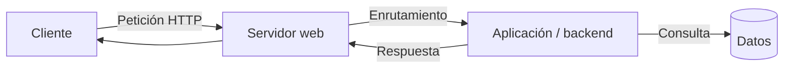
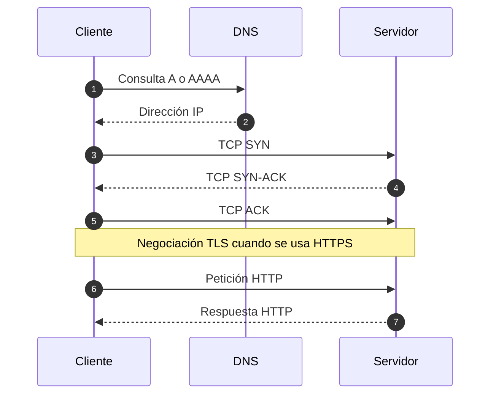
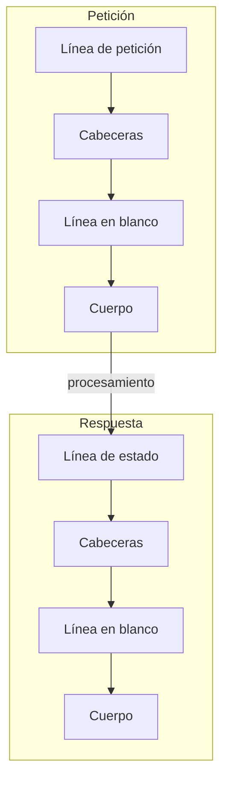
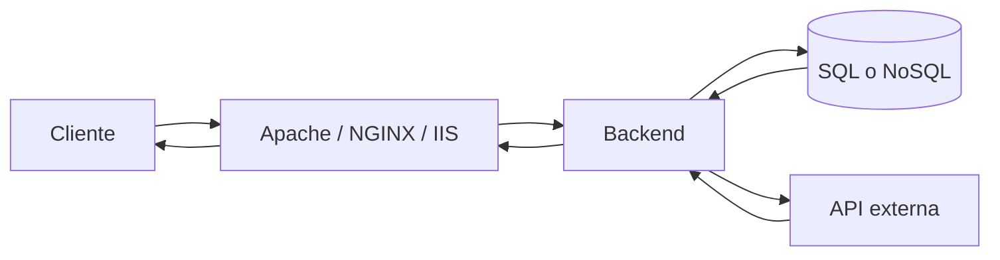
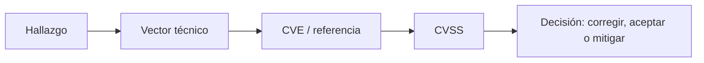
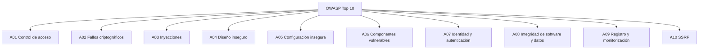
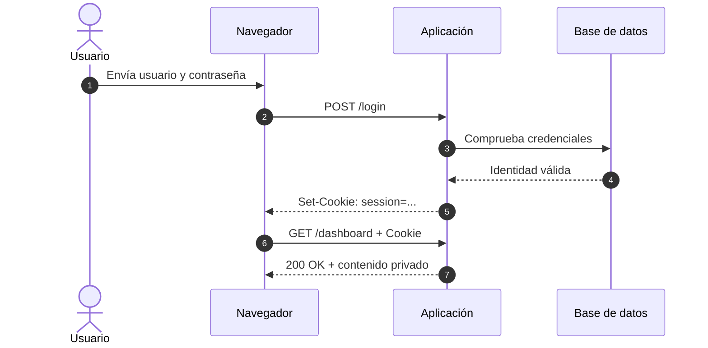
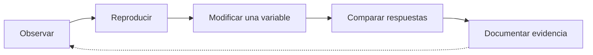
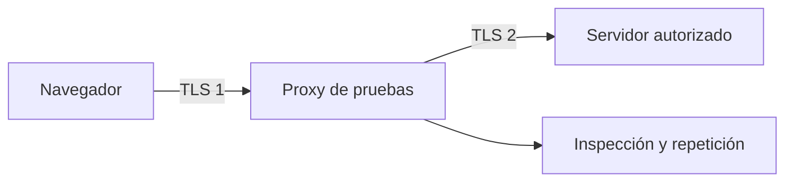

# Fundamentos web y HTTP

[Pentesting Web](../README.md) | [Laboratorio](./lab/) | [Siguiente: Fundamentos de SQL](../02-fundamentos-sql/README.md)

> **Nivel:** Inicial · **Duración:** 3 - 4 horas · **Prerrequisitos:** terminal, navegador y conceptos básicos de redes

> [!CAUTION]
> Practica solo en el laboratorio local o en sistemas para los que tengas autorización expresa. Los ejemplos de este capítulo están pensados para observar el comportamiento de una aplicación, no para probar objetivos de terceros.

## Cuestionario previo

Antes de empezar, intenta responder sin consultar documentación:

1. ¿Qué diferencia hay entre una página estática y una aplicación web?
2. ¿Qué partes de una petición HTTP puede modificar el usuario?
3. ¿En qué se diferencian `http://` y `https://`?
4. ¿Por qué una validación escrita en JavaScript no puede proteger por sí sola un precio o un rol?
5. ¿Cómo recuerda el servidor qué usuario inició sesión?

No es necesario acertar ahora. Estas preguntas sirven para identificar qué debes observar durante la lección.

## Introducción

El pentesting web no empieza con una lista de *payloads*. Empieza con una pregunta más básica: **¿cómo viajan los datos desde el cliente hasta la aplicación y cómo decide el servidor qué hacer con ellos?**

Una aplicación web recibe mensajes, interpreta sus partes y produce respuestas. Cada parte del mensaje puede tener un significado distinto:



Comprender este recorrido permite distinguir tres cosas que suelen confundirse:

- **Interfaz:** lo que el navegador muestra y valida para mejorar la experiencia.
- **Protocolo:** cómo se empaquetan y transportan las peticiones y respuestas.
- **Control:** las decisiones que el backend debe aplicar antes de aceptar una operación.

> **Idea central:** el navegador propone valores; el servidor autentica, autoriza, valida y decide.

---

## 1. Aplicaciones web y frontera de confianza

### ¿Qué es una aplicación web?

Una **aplicación web** es un sistema que expone recursos o acciones mediante HTTP. Puede devolver un archivo ya preparado o ejecutar lógica para construir una respuesta en tiempo real.

| Tipo | Funcionamiento | Qué interesa revisar |
|---|---|---|
| Sitio estático | Devuelve archivos como HTML, CSS, JavaScript o imágenes. | Rutas, permisos, configuración y versiones del servidor web. |
| Aplicación dinámica | Procesa entradas, sesión, reglas de negocio y datos persistentes. | Autenticación, autorización, validación, lógica y APIs. |

Una aplicación nativa se instala y ejecuta directamente en un sistema operativo. Una aplicación web se ejecuta principalmente dentro del navegador y expone su interfaz mediante una URL. Esta diferencia cambia la forma de auditarla, pero no elimina la necesidad de validar los datos en el servidor.

### El navegador no es una frontera de confianza

El cliente debe considerarse **no confiable**. El usuario puede editar el DOM, desactivar JavaScript, repetir una petición con `curl` o modificar cualquier campo antes de enviarlo.

```mermaid
flowchart LR
    subgraph CLIENTE["Entorno manipulable"]
        B[Navegador]
        F[Formulario y JavaScript]
        T[DevTools / curl]
        B --> F
        B -.-> T
    end

    subgraph SERVIDOR["Entorno controlado"]
        W[Servidor web]
        A[Backend]
        R[Reglas de seguridad]
        W --> A --> R
    end

    CLIENTE -->|HTTP(S): entrada controlable| SERVIDOR
```

El término **entorno controlado** es más preciso que “entorno confiable”: el servidor concentra los controles, pero sus servicios internos y sus dependencias también deben configurarse y validarse.

### Validación de interfaz frente a validación del servidor

Este campo limita el valor en el navegador:

```html
<input name="amount" type="number" max="100" required>
```

La restricción es útil para la experiencia de usuario, pero no impide que alguien construya otra petición:

```bash
curl -i -X POST "http://127.0.0.1:8000/" \
  -H "Content-Type: application/x-www-form-urlencoded" \
  -d "amount=9999"
```

El backend debe volver a comprobar el tipo, el rango y el permiso. En el laboratorio, PHP responde `400 Bad Request` porque rechaza valores fuera del rango `1 - 100`.

> [!IMPORTANT]
> `maxlength`, `disabled`, `readonly`, campos ocultos y validaciones JavaScript no son controles de autorización. Nunca deben decidir precios, roles, saldos, identidades ni permisos.

### Ejercicio de reflexión

Piensa en un formulario de cambio de rol que envía `role=user` en un campo oculto. ¿Qué tendría que comprobar el backend antes de aceptar `role=admin`? La respuesta no es “que el campo esté oculto”; es verificar la identidad, el permiso y la regla de negocio en el servidor.

---

## 2. El viaje de una petición

Antes de que el backend procese un parámetro, se construye el canal de comunicación:



### DNS

El **Domain Name System** traduce un nombre, como `app.example.com`, a una dirección IP. Durante una auditoría interesa comprobar que el nombre resuelve al activo autorizado y observar posibles nombres alternativos o subdominios dentro del alcance.

```bash
dig +short app.example.com
```

En el laboratorio local no necesitas DNS: `127.0.0.1` identifica directamente la máquina de pruebas.

### TCP

HTTP/1.1 y muchas implementaciones de HTTP/2 funcionan sobre TCP. El *three-way handshake* usa `SYN`, `SYN-ACK` y `ACK` para establecer una conexión fiable y ordenada.

```text
Cliente                         Servidor
   | -------- SYN ------------> |
   | <------ SYN-ACK ---------- |
   | -------- ACK ------------> |
```

### TLS

TLS autentica el servidor mediante un certificado y protege la confidencialidad e integridad de los datos **mientras atraviesan la red**. En términos simplificados:

```text
Cliente == canal TLS cifrado ==> servidor web --> backend
                                  aquí se descifra y procesa la entrada
```

TLS no corrige una consulta SQL insegura, un XSS, un control de acceso roto ni un error de lógica. El backend recibe los datos en una forma que puede procesar.

Para observar un certificado en un objetivo propio con HTTPS:

```bash
openssl s_client -connect app.example.com:443 -brief
```

No ejecutes este comando contra un host fuera del alcance autorizado.

### Una precisión sobre las versiones de HTTP

HTTP/1.x representa sus mensajes con una sintaxis textual. HTTP/2 utiliza *frames* binarios y HTTP/3 funciona sobre QUIC. Aunque cambie el transporte, se mantienen conceptos que el pentester debe reconocer: métodos, destinos, cabeceras, estados, cuerpos y reglas de caché.

---

## 3. La anatomía de una URL

Una URL identifica un recurso y puede transportar parámetros de consulta:

```text
https://app.example.com:8443/admin/report?id=42&format=pdf#resumen
\____/ \_______________/ \__/ \__________/ \______________/ \______/
scheme        host       port      path             query    fragment
```

| Parte | Ejemplo | Función | Pregunta de auditoría |
|---|---|---|---|
| Scheme | `https` | Define el protocolo de acceso. | ¿El canal está cifrado y el certificado corresponde al host? |
| Host | `app.example.com` | Identifica el destino lógico. | ¿Hay virtual hosts o rutas que dependan de `Host`? |
| Port | `8443` | Identifica el puerto TCP. | ¿Hay servicios web alternativos en puertos no estándar? |
| Path | `/admin/report` | Identifica el recurso o endpoint. | ¿La ruta aplica autenticación y autorización? |
| Query | `id=42&format=pdf` | Envía pares clave-valor al servidor. | ¿Se validan tipo, rango y pertenencia del objeto? |
| Fragment | `#resumen` | Indica una posición o estado para el cliente. | ¿El JavaScript lo usa de forma segura? |

El **fragmento no se envía al servidor**. Para la URL anterior, una petición HTTP equivalente contiene:

```http
GET /?id=42&format=pdf HTTP/1.1
Host: 127.0.0.1:8000
```

`#resumen` queda en el navegador y puede ser relevante para el enrutamiento de una SPA o para un DOM-based XSS, pero no aparece en los registros HTTP del backend como parte de esa petición.

### Codificación de URL

El *percent-encoding* representa caracteres mediante `%` y dos dígitos hexadecimales:

| Dato | Representación |
|---|---|
| Espacio | `%20` o `+` en formularios |
| Comilla simple (`'`) | `%27` |
| Comilla doble (`"`) | `%22` |
| Menor que (`<`) | `%3C` |
| Ampersand (`&`) dentro de un valor | `%26` |

Codificar no es cifrar. `%27`, Base64 y otras representaciones reversibles no ocultan un secreto.

### Doble codificación

En una doble codificación, `%` vuelve a codificarse como `%25`; por ejemplo, `%27` puede aparecer como `%2527`. Un WAF y el backend pueden interpretar la cadena en momentos distintos. El riesgo aparece cuando esas capas no comparten las mismas reglas de normalización.

La observación importante para el pentester no es memorizar una cadena, sino comparar qué valor ve cada componente y en qué momento se decodifica.

---

## 4. Mensajes HTTP: petición y respuesta

Un mensaje HTTP contiene una línea inicial, cabeceras, una línea en blanco y, cuando aplica, un cuerpo:



### Ejemplo de petición

```http
POST /?id=42 HTTP/1.1
Host: 127.0.0.1:8000
Content-Type: application/json
Cookie: session=lab-session

{"action":"export","owner":42}
```

1. **Línea de petición:** `POST`, ruta con query string y versión.
2. **Cabeceras:** contexto como host, formato, identidad de sesión o agente.
3. **Línea en blanco:** separa metadatos y cuerpo.
4. **Cuerpo:** datos enviados al endpoint, en este caso JSON.

Cada parte puede ser una entrada controlable. El hecho de que una petición proceda de un navegador no la convierte en válida.

### Formatos habituales de cuerpo

| `Content-Type` | Ejemplo | Uso frecuente |
|---|---|---|
| `application/x-www-form-urlencoded` | `amount=50&currency=EUR` | Formularios HTML sencillos. |
| `multipart/form-data` | Partes separadas por un *boundary*. | Subida de archivos y formularios complejos. |
| `application/json` | `{"id":42,"active":true}` | APIs y aplicaciones SPA. |
| `application/xml` | `<user><id>42</id></user>` | Servicios XML y SOAP. |

### Métodos y semántica

| Método | Uso previsto | Seguro | Idempotente | Interés para el pentester |
|---|---|---:|---:|---|
| `GET` | Obtener una representación. | Sí | Sí | Query strings, cachés, exposición en logs. |
| `POST` | Crear o procesar una acción. | No | No | Formularios, transacciones y cargas útiles. |
| `PUT` | Reemplazar un recurso. | No | Sí | Actualizaciones completas y control de acceso. |
| `PATCH` | Modificar parte de un recurso. | No | No | Asignación masiva y campos no autorizados. |
| `DELETE` | Eliminar un recurso. | No | Sí | Autorización sobre objetos de otros usuarios. |
| `OPTIONS` | Consultar opciones soportadas. | Sí | Sí | Métodos permitidos y CORS. |
| `HEAD` | Obtener cabeceras sin cuerpo. | Sí | Sí | Existencia y metadatos de recursos. |

**Seguro** significa que el método no pretende modificar el estado del servidor. **Idempotente** significa que repetir la misma operación produce el mismo estado final, no que la respuesta sea idéntica.

### Ejemplo de respuesta

```http
HTTP/1.1 200 OK
Content-Type: application/json
Set-Cookie: session=lab-session; Path=/; HttpOnly; SameSite=Lax

{"id":42,"report":"ready"}
```

| Código | Significado | Lectura durante una prueba |
|---|---|---|
| `200 OK` | Operación procesada. | La aplicación devuelve el resultado esperado. |
| `201 Created` | Recurso creado. | Común después de un `POST` de alta. |
| `301` / `302` | Redirección. | Puede revelar transiciones, login o normalización de rutas. |
| `400 Bad Request` | Entrada o sintaxis inválida. | El servidor rechazó el formato. |
| `401 Unauthorized` | Falta autenticación válida. | No confundir con falta de permiso. |
| `403 Forbidden` | Identidad conocida sin autorización. | Revisar control de acceso. |
| `404 Not Found` | Recurso no encontrado. | Puede ocultar o revelar rutas existentes. |
| `500 Internal Server Error` | Error no controlado. | Investigar sin provocar daño ni exponer datos. |

---

## 5. Qué ocurre detrás del servidor

### Servidor web, backend y datos

El servidor web suele aceptar conexiones, servir recursos estáticos y enrutar peticiones. El backend aplica la lógica de negocio y media el acceso a bases de datos o APIs.



Las cinco responsabilidades mínimas del backend son:

1. **Autenticar:** comprobar quién realiza la petición.
2. **Autorizar:** comprobar si esa identidad puede actuar sobre ese recurso.
3. **Validar:** comprobar tipos, longitud, rangos y reglas de negocio.
4. **Procesar:** ejecutar la operación de forma segura y consistente.
5. **Responder:** devolver datos y cabeceras sin filtrar información innecesaria.

El navegador no debería conectarse directamente a MySQL, Redis ni a una API privada. Si el backend concatena entradas en una consulta o construye una URL con datos no validados, la frontera de mediación se rompe.

### Arquitecturas que puede encontrar un auditor

| Arquitectura | Descripción | Punto de atención |
|---|---|---|
| Monolito LAMP/LEMP | Web, backend y datos en una máquina o red cercana. | Un compromiso puede exponer configuración, código y credenciales internas. |
| Balanceador y varios nodos | Varias instancias reciben tráfico detrás de un proxy. | Sesiones, cabeceras reenviadas y diferencias de configuración. |
| Microservicios | Servicios separados que se comunican por APIs o mensajería. | Autenticación interna, SSRF, permisos y movimiento lateral. |
| Serverless | Funciones efímeras activadas por eventos o APIs. | IAM, secretos, eventos y permisos excesivos en la nube. |

Una red privada no es una autorización. Cada servicio debe validar la identidad y el contexto de la petición que recibe.

### Frontend: HTML, CSS y JavaScript

Todo lo que el navegador descarga puede inspeccionarse y modificarse:

| Tecnología | Responsabilidad | Riesgo si se usa mal |
|---|---|---|
| HTML | Estructura del documento y formularios. | HTML Injection, formularios falsos y datos sensibles en el DOM. |
| CSS | Presentación visual. | Ocultar controles, manipular interfaz o exfiltrar atributos en contextos vulnerables. |
| JavaScript | Lógica de cliente y llamadas asíncronas. | DOM XSS, secretos expuestos y controles solo del lado cliente. |

`localStorage` y `sessionStorage` son accesibles para JavaScript del mismo origen. Una cookie `HttpOnly` no se puede leer directamente con `document.cookie`, pero un XSS todavía puede enviar acciones autenticadas desde el navegador de la víctima.

### APIs y servicios

| Estilo | Característica | Riesgo que conviene reconocer |
|---|---|---|
| REST | Recursos, URI, verbos HTTP y normalmente JSON. | BOLA/IDOR, validación incompleta y exceso de campos. |
| SOAP | Mensajes XML y contratos WSDL. | XXE, XPath Injection y parsers mal configurados. |
| GraphQL | Consultas del cliente sobre un endpoint. | Introspección pública y consultas demasiado costosas. |
| gRPC | HTTP/2 y Protocol Buffers, habitual entre servicios. | Autenticación interna, autorización y exposición accidental. |

No se debe asumir que un framework, ORM, API Gateway o service mesh elimina la necesidad de validar entradas y permisos.

### CVE, CVSS y OWASP

Una **CVE** identifica una vulnerabilidad pública. **CVSS** estima su severidad técnica en una escala de `0.0` a `10.0`; la puntuación depende de factores como vector de ataque, privilegios, interacción e impacto sobre confidencialidad, integridad y disponibilidad.

Este curso utiliza vectores CVSS v3.1 por continuidad con los ejemplos del material. CVSS v4.0 es una versión posterior y sus resultados no deben compararse mecánicamente con los de v3.1.



OWASP Top 10 ayuda a clasificar familias de riesgo, pero no sustituye el análisis del flujo real de la aplicación:



---

## 6. Sesiones y cookies

HTTP es un protocolo sin estado: cada petición debe llevar la información necesaria para ser procesada. Una **sesión** permite asociar varias peticiones con una identidad mediante un identificador, normalmente guardado en una cookie.



### Atributos de seguridad

```http
Set-Cookie: session=lab-session; Path=/; Secure; HttpOnly; SameSite=Lax
```

| Atributo | Qué hace | Qué no hace |
|---|---|---|
| `Secure` | Limita el envío a HTTPS. | No corrige TLS ni una aplicación vulnerable. |
| `HttpOnly` | Impide la lectura directa mediante `document.cookie`. | No impide que XSS ejecute acciones autenticadas. |
| `SameSite=Strict` | Reduce envíos en contextos cross-site. | No reemplaza todas las defensas contra CSRF. |
| `SameSite=Lax` | Permite ciertos usos de navegación y limita otros envíos cruzados. | Debe comprobarse según el flujo concreto. |
| `SameSite=None` | Permite envíos cross-site. | Requiere `Secure` y aumenta la exposición. |
| `Path` / `Domain` | Limita el alcance de la cookie. | No convierte el valor en un secreto cifrado. |

El laboratorio usa HTTP local, por lo que su cookie de demostración omite `Secure`. En un servicio real, una cookie de sesión debe transmitirse por HTTPS y configurarse con el alcance mínimo necesario.

---

## 7. Formato, codificación y cifrado

Estos conceptos describen operaciones diferentes:

| Concepto | Definición | ¿Oculta el dato? | Ejemplo |
|---|---|---:|---|
| Formato | Estructura campos para intercambiar información. | No | `{"user":"ana"}` |
| Codificación | Representa datos de otra forma para transportarlos. | No | `%20`, Base64 |
| Cifrado | Transforma datos usando un algoritmo y una clave. | Sí, mientras la clave esté protegida. | TLS, AES-GCM |

Ver `YWRtaW4=` o `%27` no significa que exista confidencialidad. Un auditor debe identificar si observa datos estructurados, codificados o realmente cifrados.

---

## 8. Método de observación del pentester

El objetivo de la primera interacción es crear una hipótesis verificable, no enviar cambios indiscriminados:



### Observar

Registra como mínimo:

- URL y método.
- Parámetros de ruta y query string.
- Cabeceras relevantes.
- Cookies y tokens, sin publicar secretos reales.
- Código, tamaño y comportamiento de la respuesta.

### Reproducir

El modificador `-i` muestra las cabeceras de respuesta:

```bash
curl -i "http://127.0.0.1:8000/?id=42"
```

El modo `-v` muestra el intercambio con más detalle:

```bash
curl -v "http://127.0.0.1:8000/?id=42"
```

Las líneas con `>` representan datos enviados por el cliente y las líneas con `<`, datos recibidos del servidor.

### Modificar una variable

Compara un valor válido con uno fuera de rango:

```bash
curl -i -X POST "http://127.0.0.1:8000/" \
  -H "Content-Type: application/x-www-form-urlencoded" \
  -d "amount=50"
```

```bash
curl -i -X POST "http://127.0.0.1:8000/" \
  -H "Content-Type: application/x-www-form-urlencoded" \
  -d "amount=9999"
```

La diferencia esperada es `200 OK` frente a `400 Bad Request`. Cambiar una sola variable permite atribuir la diferencia a una causa concreta.

### Proxy de interceptación

Burp Suite y OWASP ZAP actúan como intermediarios de prueba:



Para inspeccionar HTTPS, el navegador de pruebas confía temporalmente en una CA local del proxy. Instálala solo en un perfil aislado; esa CA permite al proxy descifrar el tráfico de ese perfil.

---

## Reto

Completa el [laboratorio de observación HTTP](./lab/README.md):

1. Comprueba la sintaxis de `app.php`.
2. Arranca el servidor solo en `127.0.0.1:8000`.
3. Captura una respuesta `GET` con `curl -i`.
4. Envía `amount=50` y después `amount=9999`.
5. Comprueba en DevTools que `#resumen` no llega al servidor.
6. Guarda las respuestas y escribe una conclusión sobre la frontera de confianza.

El reto está completo cuando puedes explicar cada línea observada sin depender de la interfaz del navegador.

## Cuestionario final

1. ¿Por qué el navegador no puede considerarse una frontera de confianza?
2. ¿Qué diferencia hay entre una validación de UX y una validación de seguridad?
3. ¿Qué función cumplen DNS, TCP y TLS antes de HTTP?
4. ¿Qué parte de una URL no se envía al servidor?
5. ¿Qué diferencia hay entre una cabecera y el cuerpo de una petición?
6. ¿Cuándo usarías `GET`, `POST`, `PUT`, `PATCH` y `DELETE` durante una revisión?
7. ¿Qué diferencia práctica existe entre `401` y `403`?
8. ¿Qué riesgo reduce `HttpOnly` y qué riesgo no elimina?
9. ¿Por qué Base64 y percent-encoding no son cifrado?
10. ¿Qué información debes conservar para que una prueba sea reproducible?

## Repaso y autoestudio

- Lee la sintaxis de URI en [RFC 3986](https://www.rfc-editor.org/rfc/rfc3986).
- Consulta la guía de [HTTP en MDN](https://developer.mozilla.org/en-US/docs/Web/HTTP).
- Revisa las definiciones de [cookies en MDN](https://developer.mozilla.org/en-US/docs/Web/HTTP/Cookies).
- Consulta el [OWASP Top 10](https://owasp.org/www-project-top-ten/) como catálogo de riesgos, no como sustituto del análisis.
- Busca un CVE de un servidor web en la [NVD](https://nvd.nist.gov/) y lee su vector CVSS sin intentar explotarlo.

## Entrega

Conserva:

- La salida de `php -l lab/app.php`.
- Una petición y una respuesta `GET`.
- Las respuestas `200` y `400` del ejercicio `amount`.
- La línea `Set-Cookie` y una explicación de sus atributos.
- Una nota sobre por qué el fragmento no aparece en la petición.

Cuando finalices este capítulo, continúa con [Fundamentos de SQL](../02-fundamentos-sql/README.md).
