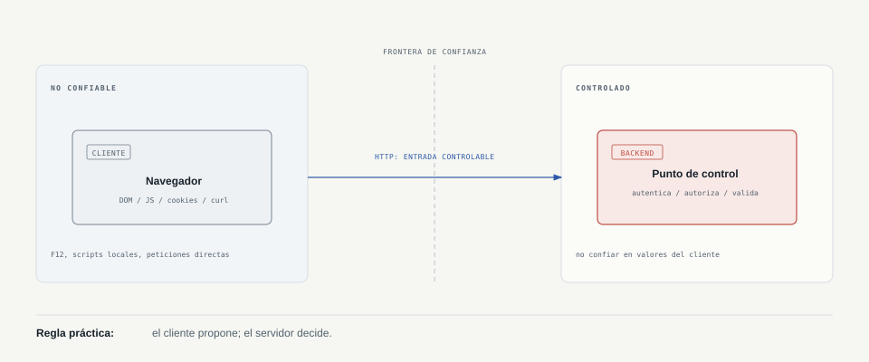
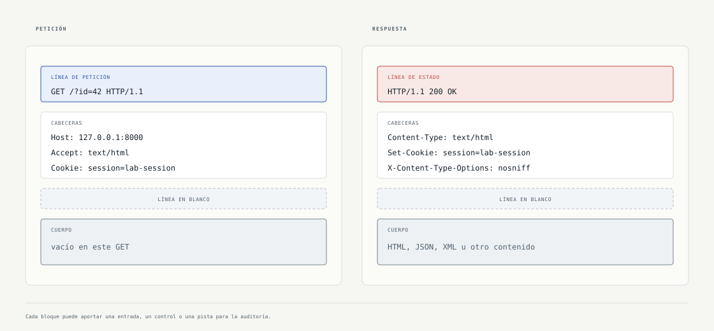

# Capítulo 01: Fundamentos web y HTTP

[Inicio](../../README.md) | [Pentesting Web](../README.md) | [Laboratorio](./lab/) | [Ampliación técnica](./ampliacion.md) | [Siguiente: Fundamentos de SQL](../02-fundamentos-sql/README.md)

> [!CAUTION]
> Practica únicamente en el laboratorio local o en sistemas para los que tengas autorización expresa. Los ejemplos de este capítulo están diseñados para observar y modificar peticiones sin afectar a terceros.

## Ficha rápida

| Elemento | Detalle |
|---|---|
| Nivel | Inicial |
| Duración | 2 - 3 horas |
| Prerrequisitos | Navegador, terminal y conceptos básicos de redes |
| Herramientas | DevTools, `curl` y PHP 8.1 o superior |
| Producto | Evidencias de peticiones, respuestas y atributos de cookies |

## Qué aprenderás

Al terminar podrás:

- Explicar qué ocurre entre un navegador y un servidor cuando se solicita una URL.
- Separar el entorno manipulable del cliente de los controles que deben vivir en el backend.
- Leer la estructura de una URL y de un mensaje HTTP.
- Reconocer el papel de DNS, TCP, TLS, cookies y códigos de estado.
- Reproducir y modificar una petición en un laboratorio controlado usando `curl`.

## Mapa del capítulo

1. [Cliente, servidor y frontera de confianza](#1-cliente-servidor-y-frontera-de-confianza)
2. [El viaje de una petición](#2-el-viaje-de-una-petición)
3. [URL y mensajes HTTP](#3-url-y-mensajes-http)
4. [Sesiones y cookies](#4-sesiones-y-cookies)
5. [Método de observación del pentester](#5-método-de-observación-del-pentester)
6. [Laboratorio y criterios de finalización](#6-laboratorio-y-criterios-de-finalización)

## 1. Cliente, servidor y frontera de confianza

### La idea esencial

Una **aplicación web** es un sistema que recibe peticiones, aplica reglas y devuelve datos. El navegador muestra la interfaz, pero el servidor debe tomar las decisiones de seguridad.

| Tipo | Qué ocurre | Superficie de análisis |
|---|---|---|
| Sitio estático | El servidor devuelve archivos ya preparados, como HTML, CSS o imágenes. | Servidor web, rutas y permisos de archivos. |
| Aplicación dinámica | El backend procesa entradas, sesión, reglas de negocio y datos persistentes. | Autenticación, autorización, validación, lógica y APIs. |

El cliente es **no confiable** porque el usuario puede:

- Editar el DOM con DevTools.
- Desactivar JavaScript.
- Repetir la petición fuera del navegador.
- Cambiar parámetros, cabeceras, cookies y cuerpo.



> [!IMPORTANT]
> Una validación HTML como `maxlength="5"` mejora la experiencia de usuario, pero no protege el sistema. La longitud, el precio, el rol y el permiso deben comprobarse de nuevo en el backend.

### Ejemplo: control en el cliente no es control de seguridad

Este formulario limita la entrada solo en la interfaz:

```html
<input name="amount" type="number" max="100" required>
```

Un auditor puede enviar directamente otro valor al endpoint:

```bash
curl -i -X POST "http://127.0.0.1:8000/" \
  -H "Content-Type: application/x-www-form-urlencoded" \
  -d "amount=9999"
```

La prueba no demuestra por sí misma una vulnerabilidad. Demuestra si el **servidor** aplica o no la regla que el navegador pretendía imponer.

## 2. El viaje de una petición

Cuando el usuario abre `http://127.0.0.1:8000/?id=42`, el flujo conceptual es:


| Fase | Pregunta que responde | Qué observa el pentester |
|---|---|---|
| DNS | ¿Qué dirección corresponde al nombre? | Registros, subdominios y resolución esperada. |
| TCP | ¿Se estableció el transporte? | Puerto, conectividad y errores de conexión. |
| TLS | ¿El canal está autenticado y cifrado? | Certificado, versión y nombre del host. |
| HTTP | ¿Qué operación pidió el cliente? | Método, ruta, cabeceras, cookies y cuerpo. |
| Backend | ¿Qué decide la aplicación? | Autenticación, autorización, validación y respuesta. |

### TLS no corrige fallos de aplicación

TLS protege los datos **en tránsito** entre cliente y servidor. Al terminar el túnel, el backend procesa la petición y puede hacerlo de forma insegura.

```text
Cliente  == canal TLS cifrado ==>  Servidor web  -->  Backend
                                     ^
                         aquí se descifra y procesa la entrada
```

Por eso HTTPS no elimina SQL Injection, XSS, control de acceso roto ni errores de lógica. Protege el canal; no convierte una aplicación vulnerable en una aplicación segura.

## 3. URL y mensajes HTTP

### Anatomía de una URL

```text
https://app.example:8443/report?id=42#resumen
\____/ \_________/ \__/ \_____/ \______/ \____/
scheme     host    port   path    query  fragment
```

- **Scheme**: `http` o `https`; indica el protocolo utilizado.
- **Host**: nombre o dirección del servidor.
- **Port**: puerto TCP; por defecto, 80 para HTTP y 443 para HTTPS.
- **Path**: recurso o endpoint solicitado.
- **Query**: parámetros enviados al servidor, como `id=42`.
- **Fragment**: posición usada por el navegador; `#resumen` no se transmite en la petición HTTP.

Los caracteres especiales pueden representarse mediante *percent-encoding*. Por ejemplo, una comilla simple (`'`) se representa como `%27`. Codificar no es cifrar: `%27` sigue siendo reversible sin una clave.

### Anatomía de una petición



```http
GET /?id=42 HTTP/1.1
Host: 127.0.0.1:8000
Accept: text/html
Cookie: session=lab-session

```

1. **Línea de petición**: método, ruta y versión.
2. **Cabeceras**: metadatos que aportan contexto.
3. **Línea en blanco**: separa cabeceras y cuerpo.
4. **Cuerpo**: datos enviados en métodos como `POST`, cuando aplica.

La misma petición puede escribirse con `curl`:

```bash
curl -i "http://127.0.0.1:8000/?id=42"
```

### Anatomía de una respuesta

```http
HTTP/1.1 200 OK
Content-Type: text/html; charset=UTF-8
Set-Cookie: session=lab-session; Path=/; HttpOnly; SameSite=Lax

<!doctype html>
```

La respuesta contiene una línea de estado, cabeceras, una línea en blanco y, normalmente, un cuerpo. HTTP/1.1 muestra estos elementos como texto; HTTP/2 y HTTP/3 usan otros formatos de transporte, pero mantienen la semántica de petición y respuesta.

| Código | Significado | Lectura rápida durante una prueba |
|---|---|---|
| `200` | Éxito | El servidor procesó la operación. |
| `302` | Redirección temporal | Puede aparecer después del login. |
| `400` | Petición inválida | La entrada no cumple el formato esperado. |
| `401` | No autenticado | Falta una identidad válida. |
| `403` | No autorizado | La identidad existe, pero no tiene permiso. |
| `404` | No encontrado | El recurso no está disponible en esa ruta. |
| `500` | Error interno | Puede revelar una excepción o un manejo deficiente de entrada. |

## 4. Sesiones y cookies

HTTP no recuerda automáticamente qué peticiones pertenecen al mismo usuario. Una **sesión** asocia varias peticiones con una identidad; una cookie suele transportar un identificador opaco de esa sesión.

```http
Set-Cookie: session=lab-session; Path=/; Secure; HttpOnly; SameSite=Lax
```

| Atributo | Qué limita | Matiz importante |
|---|---|---|
| `Secure` | Envía la cookie solo por HTTPS. | No sustituye la configuración correcta de TLS. |
| `HttpOnly` | Impide leerla directamente con `document.cookie`. | Un XSS todavía puede ejecutar acciones autenticadas. |
| `SameSite` | Controla envíos entre sitios. | `Lax` y `Strict` reducen el riesgo de CSRF, según el caso de uso. |
| `Path` / `Domain` | Reduce dónde se envía. | Un alcance menor limita exposición accidental. |

En el laboratorio la cookie es deliberadamente visible y no representa una credencial real. Nunca reutilices valores de prácticas en sistemas reales.

## 5. Método de observación del pentester

El objetivo inicial no es lanzar muchos payloads. Es construir un modelo comprobable de la aplicación:

1. **Observar**: registra la URL, método, parámetros, cabeceras, cookies, código y tamaño de la respuesta.
2. **Reproducir**: repite la petición con `curl` para separar el navegador de la aplicación.
3. **Modificar**: cambia una sola variable por vez.
4. **Comparar**: observa qué cambia en el código, cuerpo, cabeceras y tiempo de respuesta.
5. **Documentar**: guarda la petición original, la variante, el resultado y la conclusión.

### Ejemplo de comparación

Petición original:

```bash
curl -i "http://127.0.0.1:8000/?id=42"
```

Variante con un parámetro ausente:

```bash
curl -i "http://127.0.0.1:8000/"
```

La diferencia entre ambas respuestas enseña qué entrada es relevante. Todavía no es una explotación; es análisis de comportamiento.

## 6. Laboratorio y criterios de finalización

Sigue la [guía del laboratorio](./lab/README.md). El laboratorio levanta una aplicación PHP local en `127.0.0.1:8000` y permite inspeccionar:

- Una petición `GET` con query string.
- Una petición `POST` con cuerpo de formulario.
- Cabeceras de respuesta y una cookie de sesión de demostración.
- El hecho de que el fragmento `#resumen` no aparece en la petición transmitida.

### Evidencias que debes conservar

- Salida de `php -l lab/app.php`.
- Salida de una petición `curl -i` con su código de estado.
- Una petición con query string y otra con cuerpo `POST`.
- La línea `Set-Cookie` y sus atributos.
- Una nota breve explicando qué controles pertenecen al backend.

### Criterios de finalización

- [ ] Puedo describir la frontera de confianza sin llamar confiable al navegador.
- [ ] Puedo separar URL, cabeceras y cuerpo en una petición HTTP.
- [ ] Puedo explicar qué protege TLS y qué no protege.
- [ ] Puedo interpretar `200`, `302`, `401`, `403`, `404` y `500`.
- [ ] Puedo reproducir una petición del laboratorio fuera del navegador.

## Autoevaluación

1. ¿Por qué `maxlength` y `disabled` no son controles de autorización?
2. ¿En qué punto del flujo se descifra una petición HTTPS y por qué importa?
3. ¿Qué diferencia hay entre un parámetro de query y un fragmento de URL?
4. ¿Qué riesgo reduce `HttpOnly` y qué riesgo no elimina?
5. ¿Qué información registrarías antes de modificar una petición durante una auditoría?

## Para continuar

Cuando el flujo HTTP sea familiar, continúa con [Capítulo 02: Bases de Datos Relacionales y SQL](../02-fundamentos-sql/README.md).

La [ampliación técnica](./ampliacion.md) conserva arquitecturas distribuidas, frontend avanzado, APIs, CVE/CVSS, OWASP y más ejemplos para una segunda lectura.
