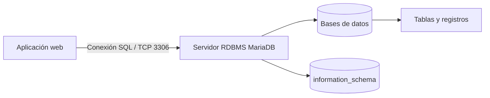
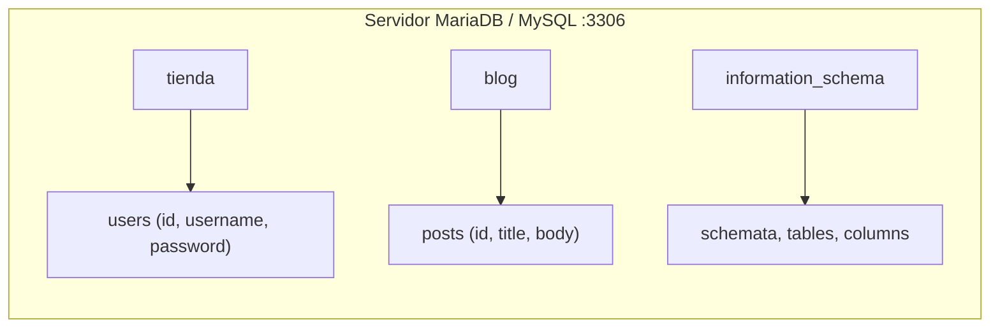
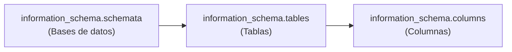
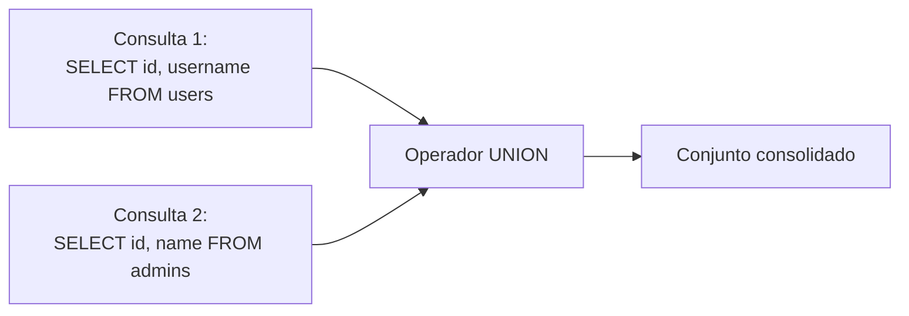
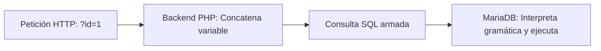

# Capítulo 02: Bases de datos relacionales y fundamentos de SQL

[Inicio](../../README.md) | [Pentesting Web](../README.md) | [Anterior: Fundamentos web y HTTP](../01-fundamentos-web-y-http/README.md) | [Siguiente: Inyecciones SQL y subversión de lógica](../03-sql-injection-fundamentos-y-logica/README.md) | [Laboratorio Práctico](./lab/)

> [!CAUTION]
> Practica únicamente en sistemas locales o con autorización expresa. La inspección de bases de datos y la manipulación de consultas SQL deben restringirse a entornos controlados.

## Introducción

Una **base de datos relacional** es un sistema estructurado para almacenar, gestionar y recuperar información de forma concurrente, íntegra y persistente. En las aplicaciones web modernas, el backend delega en el motor de base de datos el almacenamiento de usuarios, credenciales, sesiones y transacciones.

El pentesting de aplicaciones web exige comprender cómo procesa el motor SQL las sentencias, cómo organiza su catálogo interno y de qué manera la concatenación no validada en el backend rompe la frontera entre datos e instrucciones.



---

## 1. Modelo relacional y almacenamiento estructurado

### Definición y propiedades de un RDBMS

Un **RDBMS** (Relational Database Management System) organiza los datos en tablas compuestas por filas y columnas vinculadas mediante relaciones lógicas y restricciones de integridad.



### Ventajas frente al almacenamiento en archivos planos

1. **Concurrencia**: Múltiples peticiones HTTP simultáneas leen y escriben sin corromper el almacenamiento gracias a bloqueos y transacciones.
2. **Integridad y restricciones**: Cumplimiento de propiedades ACID (Atomicidad, Consistencia, Aislamiento y Durabilidad) y validación de tipos estrictos.
3. **Optimización de consultas**: Estructuras de indexación (árboles B-Tree en motores como InnoDB) que resuelven búsquedas sobre millones de registros en milisegundos.
4. **Control de acceso granular**: Privilegios asignables por base de datos, tabla, columna o procedimiento almacenado.

---

## 2. Arquitectura de conexión en MariaDB y MySQL

MariaDB y MySQL operan como servicios en segundo plano (*daemons*) que escuchan de forma predeterminada en el puerto **3306/TCP**.

### Conexión mediante cliente interactivo

Para administrar el servidor local desde la terminal en un entorno Linux:

```bash
sudo mysql -u root -p
```

- `-u root`: Especifica el usuario administrativo.
- `-p`: Solicita la contraseña de forma interactiva. En distribuciones basadas en Debian o Ubuntu, el acceso del usuario local suele autenticarse mediante sockets UNIX (`auth_socket`), permitiendo acceder directamente con `sudo mysql`.

### Exploración jerárquica del servidor

La auditoría y exploración técnica de un motor SQL sigue una secuencia ordenada:

```text
Servidor ---> Bases de datos (Schemas) ---> Tablas ---> Columnas y Tipos ---> Registros
```

Comandos interactivos de exploración:

```sql
-- 1. Listar bases de datos en el servidor
SHOW DATABASES;

-- 2. Seleccionar la base de datos de trabajo
USE tienda;

-- 3. Listar las tablas existentes en la base seleccionada
SHOW TABLES;

-- 4. Inspeccionar columnas, tipos y restricciones de una tabla
DESCRIBE users;
```

---

## 3. Estructura relacional: tablas, columnas, tipos y claves

- **Tabla**: Conjunto bidimensional de registros asociado a una entidad (ej. `users`, `products`).
- **Columna (Atributo)**: Campo con nombre único y tipo de dato específico (`id`, `username`, `password_hash`).
- **Fila (Tupla)**: Registro individual que contiene los valores asignados a cada columna.
- **Clave Primaria (Primary Key - PK)**: Columna o conjunto de columnas cuyo valor es único y no nulo en cada fila, identificando de manera inequívoca al registro.

### Tipos de datos SQL esenciales

| Tipo de dato | Ejemplo | Descripción técnica | Relevancia en Pentesting |
|---|---|---|---|
| `INT` / `BIGINT` | `42`, `1001` | Números enteros de longitud fija. | **No requiere comillas** en SQL (`WHERE id = 42`). Inyección numérica directa. |
| `VARCHAR(n)` | `'admin'`, `'ana'` | Cadenas alfanuméricas de longitud variable hasta $n$. | **Requiere comillas** delimitadoras (`WHERE username = 'admin'`). Objetivo de rotura sintáctica. |
| `TEXT` | `'Contenido...'` | Cadenas de gran tamaño sin límite estricto por registro. | Frecuentemente renderizado en HTML (superficie potencial para XSS almacenado). |
| `DATE` / `DATETIME` | `'2026-09-04 12:00:00'` | Fechas y marcas temporales de eventos. | Filtrado cronológico, inferencia temporal y auditoría. |
| `FLOAT` / `DECIMAL` | `19.99` | Números en coma flotante o precisión fija. | Pruebas de redondeo, lógica de negocio y balances. |

> [!NOTE]
> En SQL, las constantes numéricas no llevan comillas delimitadoras (`SELECT * FROM users WHERE id = 1`), mientras que las cadenas deben encerrarse entre comillas simples (`SELECT * FROM users WHERE username = 'admin'`). Esta distinción determina si un payload requiere romper comillas previas o concatenar operadores directamente.

---

## 4. Clasificación del lenguaje SQL: DDL y DML

El lenguaje SQL se estructura en dos subconjuntos con propósitos bien diferenciados:

### Lenguaje de Definición de Datos (DDL)

Gestiona la creación, modificación y eliminación de estructuras lógicas y físicas en el motor:

```sql
-- Crear una tabla con restricciones de clave y unicidad
CREATE TABLE users (
    id INT AUTO_INCREMENT PRIMARY KEY,
    username VARCHAR(32) NOT NULL UNIQUE,
    password VARCHAR(64) NOT NULL
);

-- Agregar una nueva columna a una tabla existente
ALTER TABLE users ADD email VARCHAR(64);

-- Eliminar una tabla completa y todos sus registros asociados
DROP TABLE users;
```

### Lenguaje de Manipulación de Datos (DML)

Gestiona la consulta, inserción, actualización y borrado de registros dentro de las tablas:

```sql
-- 1. Lectura de registros
SELECT * FROM users;

-- 2. Inserción de un nuevo registro
INSERT INTO users (username, password) VALUES ('ana', 'p@ssw0rd123');

-- 3. Modificación de registros existentes
UPDATE users SET password = 'nuevaPassword456' WHERE id = 1;

-- 4. Eliminación de registros
DELETE FROM users WHERE id = 1;
```

> [!CAUTION]
> En sentencias `UPDATE` y `DELETE`, omitir la cláusula `WHERE` provoca la modificación o eliminación de **todas** las filas de la tabla sin solicitar confirmación.

---

## 5. Catálogo maestro del servidor: information_schema

MariaDB y MySQL exponen una base de datos especial de solo lectura denominada **`information_schema`**. Funciona como el diccionario de datos del motor, indexando los metadatos de todas las bases de datos, tablas, columnas y privilegios configurados en la instancia.



### Vistas esenciales para auditoría técnica

#### 1. `information_schema.schemata`
Enumera todas las bases de datos presentes en la instancia:

```sql
SELECT schema_name FROM information_schema.schemata;
```

#### 2. `information_schema.tables`
Identifica las tablas existentes y su pertenencia a cada esquema:

```sql
SELECT table_name, table_rows 
FROM information_schema.tables 
WHERE table_schema = 'tienda';
```

#### 3. `information_schema.columns`
Detalla el nombre, posición y tipo de dato de cada columna:

```sql
SELECT column_name, data_type 
FROM information_schema.columns 
WHERE table_schema = 'tienda' AND table_name = 'users';
```

> [!IMPORTANT]
> Durante la explotación de inyecciones SQL basadas en UNION, el auditor desconoce a priori la estructura interna de la base de datos de la víctima. La consulta sistemática a `information_schema` permite reconstruir el mapa completo de tablas y columnas antes de exfiltrar credenciales o datos protegidos.

---

## 6. Consultas, filtrado y operadores en SQL

### Proyecciones con `SELECT`

La cláusula `SELECT` define las columnas que formarán el conjunto devuelto:

```sql
SELECT id, username FROM users;
```

### Cláusula `WHERE` y evaluación booleana

`WHERE` evalúa una expresión por cada registro; únicamente las filas cuya expresión resulte verdadera (`TRUE`) se incluyen en la respuesta:

```sql
SELECT * FROM users WHERE username = 'admin';
SELECT * FROM users WHERE id >= 10;
```

### Operadores lógicos: `AND`, `OR`, `NOT`

- **`AND`**: Requiere que ambas expresiones sean verdaderas simultáneamente.
- **`OR`**: Evalúa a verdadero si al menos una de las condiciones es verdadera.
- **`NOT`**: Invierte el valor de evaluación booleano.

```sql
-- Evaluación compuesta estricta
SELECT * FROM users WHERE id = 1 AND username = 'admin';

-- Evaluación inclusiva
SELECT * FROM users WHERE id = 1 OR id = 2;

-- Negación lógica
SELECT * FROM users WHERE NOT username = 'guest';
```

> [!TIP]
> Si una inyección introduce una expresión conectada mediante `OR` que siempre evalúa a verdadero (por ejemplo, `OR 1=1`), toda la condición `WHERE` se convierte en `TRUE`, forzando al motor a devolver todos los registros o eludiendo comprobaciones condicionales.

### Cláusula `ORDER BY` y ordenación por índice

`ORDER BY` ordena el conjunto resultante según una o más columnas, de forma ascendente (`ASC`) o descendente (`DESC`):

```sql
SELECT * FROM users ORDER BY username ASC;
SELECT * FROM users ORDER BY id DESC;
```

En SQL, es válido ordenar utilizando el índice numérico de la columna en la proyección:

```sql
-- Ordena por la primera columna (id)
SELECT id, username FROM users ORDER BY 1;

-- Ordena por la segunda columna (username)
SELECT id, username FROM users ORDER BY 2;
```

Si el índice supera el total de columnas devueltas por la consulta (`ORDER BY 3` en una consulta con 2 columnas), el motor devuelve un error de sintaxis: `Unknown column '3' in 'order clause'`. Este comportamiento permite determinar de forma determinista el número exacto de columnas devueltas por una consulta vulnerable.

### Cláusula `LIMIT`

Restringe el número de filas entregadas en la respuesta:

```sql
-- Obtener como máximo 2 registros
SELECT * FROM users LIMIT 2;

-- Omitir 1 registro y obtener los 2 siguientes (paginación)
SELECT * FROM users LIMIT 1, 2;
```

### Operador `LIKE` y comodines

Permite la búsqueda de patrones sobre cadenas de texto:
- `%`: Representa cero, uno o más caracteres cualesquiera.
- `_`: Representa exactamente un único carácter.

```sql
SELECT * FROM users WHERE username LIKE 'adm%';
SELECT * FROM users WHERE username LIKE '_ane';
```

---

## 7. Operador UNION y combinación de conjuntos

El operador `UNION` combina las salidas de dos o más sentencias `SELECT` independientes en una única estructura de respuesta:



```sql
SELECT username FROM users
UNION
SELECT role_name FROM roles;
```

### Requisitos sintácticos obligatorios de `UNION`

1. **Número idéntico de columnas**: Cada sentencia `SELECT` combinada mediante `UNION` debe proyectar exactamente el mismo número de columnas. De lo contrario, MariaDB genera el error: `The used SELECT statements have a different number of columns`.
2. **Tipos de datos compatibles**: Las columnas emparejadas en la misma posición ordinal deben poseer tipos de datos compatibles entre sí en el motor de base de datos.

---

## 8. Causa raíz: concatenación dinámica en el backend

La causa raíz de las inyecciones SQL se produce cuando el backend interpola variables controladas por el usuario directamente en la cadena de la consulta SQL:

```php
// Patrón vulnerable: interpolación de variable en cadena SQL
$id = $_GET['id'];
$query = "SELECT username FROM users WHERE id = '$id'";
$result = mysqli_query($conn, $query);
```



Cuando los datos del usuario contienen caracteres gramaticales de SQL (como `'`), el analizador sintáctico del motor no puede distinguir dónde terminan los datos fijados por el desarrollador y dónde comienzan los comandos suministrados por el cliente, alterando el Árbol de Sintaxis Abstracta (AST) de la consulta.

---

## 9. Práctica guiada en laboratorio local

Para comprobar estas sentencias y observar la interacción con el motor de base de datos en un entorno controlado:

👉 [Guía técnica del laboratorio de PHP y MariaDB](./lab/README.md)

Procedimiento del laboratorio:
1. Desplegar los servicios de Apache y MariaDB en una máquina aislada.
2. Cargar el script [`setup.sql`](./lab/setup.sql) para crear la base `tienda`, la tabla `users` y el usuario restringido `appuser`.
3. Publicar el script [`searchusers.php`](./lab/searchusers.php).
4. Analizar el tráfico y la respuesta del servidor ante consultas legítimas.

---

## Cheatsheet

Referencia rápida del capítulo en formato PDF: [cheatsheet.pdf](./cheatsheet.pdf).

---

[Anterior: Fundamentos web y HTTP](../01-fundamentos-web-y-http/README.md) | [Volver al índice](../README.md) | [Siguiente: Inyecciones SQL y subversión de lógica](../03-sql-injection-fundamentos-y-logica/README.md)
