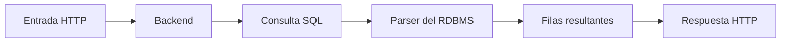
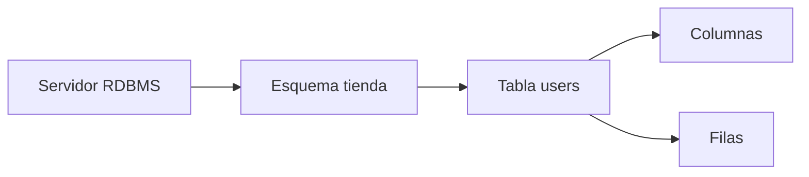
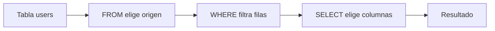
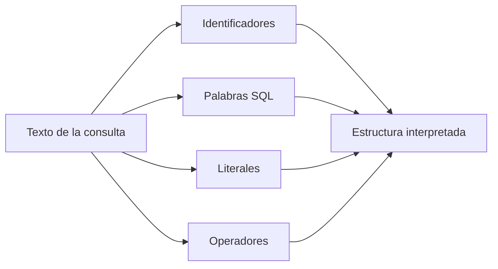
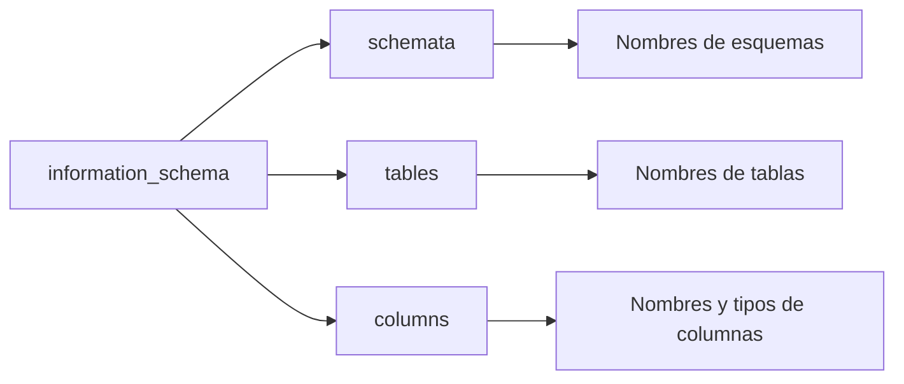
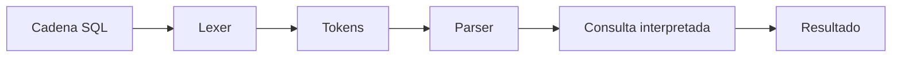

# Lección 01: Bases de datos relacionales y fundamentos de SQL

[Inicio](../../../README.md) | [Pentesting Web](../../README.md) | [Módulo SQLi](../README.md) | [Siguiente: Inyecciones SQL y subversión de lógica](../02-subversion-logica/README.md) | [Laboratorio](../lab/README.md)

> [!CAUTION]
> La inspección y manipulación de bases de datos debe limitarse a sistemas locales o expresamente autorizados. Los ejemplos de esta lección describen un entorno educativo controlado.

## Introducción

Una **base de datos** es un conjunto organizado de datos persistentes. Una **base de datos relacional** representa esos datos mediante tablas relacionadas, y un **RDBMS** (*Relational Database Management System*) es el programa que almacena las tablas, recibe consultas y devuelve resultados. MariaDB, MySQL, PostgreSQL, Microsoft SQL Server y Oracle Database son RDBMS.

En una aplicación web, el navegador no suele consultar el RDBMS directamente. Envía una entrada en una petición HTTP; el **backend**, que es el código ejecutado en el servidor, decide qué consulta enviar; el RDBMS la analiza y produce un resultado; y el backend convierte ese resultado en una respuesta HTTP.



Esta lección se concentra primero en la estructura y el significado de una consulta válida. La siguiente mostrará qué ocurre cuando el backend mezcla una entrada HTTP con esa consulta de forma insegura.

---

## 1. Tablas, filas y columnas

Una **tabla** agrupa datos sobre una clase de elemento, como usuarios o productos. Una **fila**, también llamada registro o tupla, representa un elemento concreto. Una **columna** representa una propiedad común a todas las filas y tiene un nombre, como `id` o `username`.

| `id` | `username` | `active` |
|---:|---|---:|
| 1 | `admin` | 1 |
| 2 | `ana` | 1 |
| 3 | `guest` | 0 |

En esta tabla, `users` sería el nombre de la tabla, cada línea de datos sería una fila y `id`, `username` y `active` serían columnas. Una **clave primaria** es una columna, o combinación de columnas, cuyo valor identifica cada fila de manera única; aquí puede ser `id`.

Un **esquema** es un espacio lógico que agrupa objetos como tablas y vistas. Una **vista** es una consulta guardada que se presenta como una tabla. El significado exacto de base de datos y esquema varía entre motores, por lo que no deben tratarse como sinónimos universales.



Las columnas suelen declarar un **tipo de dato**, es decir, la clase de valor prevista. `INT` representa enteros, `VARCHAR` texto de longitud variable y `DATETIME` una fecha y hora. Un RDBMS no siempre valida los tipos de manera estricta: según el motor, su configuración y el contexto, puede convertir valores automáticamente, advertir o rechazar la operación. El tipo declarado orienta el almacenamiento y la comparación, pero no garantiza por sí solo una validación rígida de toda entrada.

---

## 2. Consultas y cláusulas básicas

**SQL** (*Structured Query Language*) es el lenguaje utilizado para describir operaciones sobre datos relacionales. Una **consulta** es una instrucción SQL enviada al RDBMS. Una **cláusula** es una parte de esa instrucción con una función concreta.

En una consulta de lectura, `SELECT` elige las columnas que aparecerán en el resultado, `FROM` indica la tabla de origen y `WHERE` conserva solo las filas que cumplen una condición.

```sql
SELECT id, username
FROM users
WHERE active = 1;
```

La consulta se puede leer por partes:

1. `FROM users` establece que las filas proceden de `users`.
2. `WHERE active = 1` evalúa la condición para cada fila y descarta las que no la cumplen.
3. `SELECT id, username` forma el resultado con esas dos columnas.

El orden escrito sigue la sintaxis de SQL, mientras que esta lectura conceptual explica cómo se forma el resultado. El optimizador puede ejecutar internamente un plan distinto sin cambiar el significado lógico de la consulta.



El asterisco en `SELECT *` solicita todas las columnas disponibles. Es útil para ejemplos breves, pero nombrar las columnas hace explícita la forma del resultado.

---

## 3. Literales, identificadores y operadores

Un **identificador** es el nombre de un objeto SQL, como la tabla `users` o la columna `username`. Un **literal** es un valor escrito directamente en la consulta. En SQL, los literales de texto normalmente se delimitan con comillas simples, mientras que los números suelen escribirse sin ellas.

```sql
SELECT id, username
FROM users
WHERE username = 'ana';
```

En este ejemplo, `users` y `username` son identificadores, `'ana'` es un literal de texto y `=` es un **operador de comparación**, es decir, un símbolo que compara dos expresiones. Las comillas no forman parte del valor `ana`; marcan dónde comienza y termina el literal para el analizador SQL.



Las conversiones automáticas pueden afectar comparaciones entre texto y números. Su comportamiento difiere entre RDBMS y configuraciones, por lo que una aplicación no debe confiar en esas conversiones como mecanismo de validación.

---

## 4. Condiciones y lógica booleana

Una **condición** es una expresión que produce un valor lógico verdadero, falso o, en SQL, desconocido cuando interviene `NULL`. `WHERE` incluye una fila solo cuando su condición resulta verdadera.

Los operadores lógicos combinan condiciones:

| Operador | Significado sencillo |
|---|---|
| `AND` | Ambas condiciones deben ser verdaderas. |
| `OR` | Al menos una condición debe ser verdadera. |
| `NOT` | Invierte una condición. |

```sql
SELECT id, username
FROM users
WHERE active = 1 AND username = 'ana';
```

El RDBMS evalúa `active = 1` y `username = 'ana'` para cada fila. Solo devuelve las filas donde ambas comparaciones son verdaderas.

La **precedencia** es la regla que decide qué operador se evalúa antes. Habitualmente `AND` tiene mayor precedencia que `OR`, igual que la multiplicación se resuelve antes que la suma. Los paréntesis permiten expresar la intención sin depender de esa regla.

```sql
-- Primero se evalúa AND
WHERE username = 'admin' OR active = 1 AND id = 2

-- Los paréntesis cambian la agrupación
WHERE (username = 'admin' OR active = 1) AND id = 2
```

Una **tautología** es una condición que siempre resulta verdadera, como `1 = 1`. Introducir una tautología no garantiza por sí solo que una autenticación o un filtro se eludan: la precedencia, los paréntesis, el resto de la consulta, las filas seleccionadas y la forma en que el backend utiliza el resultado también determinan el comportamiento. La lección siguiente analizará esa diferencia sobre consultas ensambladas completas.

---

## 5. Forma y orden del resultado

El **conjunto de resultados** es la tabla temporal de filas y columnas que una consulta entrega al backend. `ORDER BY` ordena esas filas y `LIMIT` restringe cuántas se devuelven.

```sql
SELECT id, username
FROM users
WHERE active = 1
ORDER BY username ASC
LIMIT 2;
```

`ORDER BY 1` puede referirse a la primera expresión seleccionada y `ORDER BY 2`, a la segunda. Si se usa una posición fuera del rango del resultado, el motor suele emitir un error semántico o de resolución porque esa posición no existe. No es necesariamente un error de sintaxis: la sentencia puede estar bien formada gramaticalmente y aun así referirse a una columna imposible.

```sql
SELECT id, username FROM users ORDER BY 1;
SELECT id, username FROM users ORDER BY 2;
-- La posición 3 no existe en este resultado de dos columnas.
SELECT id, username FROM users ORDER BY 3;
```

La forma del resultado importa porque el backend puede leer solo la primera fila, exigir exactamente una fila o mostrar únicamente algunas columnas. Dos consultas que devuelven filas distintas pueden producir la misma respuesta HTTP si el código no expone esa diferencia.

---

## 6. Metadatos y catálogo del sistema

Los **metadatos** son datos que describen otros datos, por ejemplo nombres de esquemas, tablas, columnas y tipos. Los RDBMS publican parte de esa información mediante catálogos del sistema. En MariaDB y MySQL, `information_schema` contiene vistas normalizadas para consultarla.



```sql
SELECT table_name
FROM information_schema.tables
WHERE table_schema = 'tienda';

SELECT column_name, data_type
FROM information_schema.columns
WHERE table_schema = 'tienda' AND table_name = 'users';
```

La visibilidad del catálogo depende del motor y de los privilegios. Aplicar **menor privilegio**, es decir, conceder a la cuenta del backend solo las capacidades necesarias, reduce el impacto de una inyección, pero no implica necesariamente que la cuenta solo pueda conocer una tabla. Puede conservar acceso a metadatos, vistas, rutinas u otros objetos autorizados. Los permisos efectivos deben comprobarse en el RDBMS concreto.

---

## 7. Del texto SQL al resultado HTTP

El **parser** o analizador sintáctico es la parte del RDBMS que comprueba cómo se relacionan los elementos reconocidos en la consulta y construye una representación ejecutable. Antes interviene el **lexer** o analizador léxico, que separa el texto en unidades como palabras reservadas, identificadores, operadores y literales.



Una consulta puede superar el análisis gramatical y fallar después porque una tabla no existe, una posición de `ORDER BY` está fuera de rango o la cuenta carece de permisos. También puede ejecutarse correctamente y no devolver filas. Por ello, un código HTTP, un mensaje de error y el contenido de la página son señales relacionadas, pero no equivalentes.

La siguiente lección incorpora el eslabón que falta: cómo el backend crea la cadena SQL a partir de una plantilla y una entrada HTTP, y cómo una entrada puede cerrar un literal para cambiar la estructura que recibe el parser.

---

## Cheatsheet

Referencia rápida del capítulo en formato PDF: [cheatsheet.pdf](./cheatsheet.pdf).

---

[Volver al índice del módulo](../README.md) | [Siguiente: Inyecciones SQL y subversión de lógica](../02-subversion-logica/README.md)
