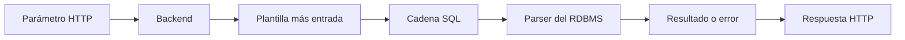
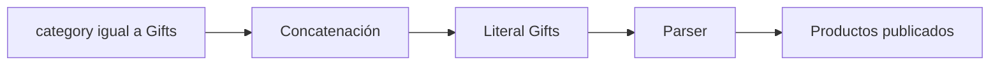
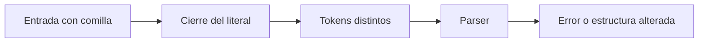
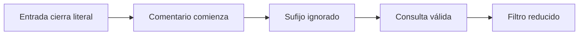
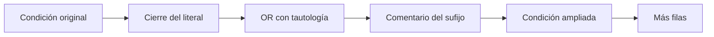
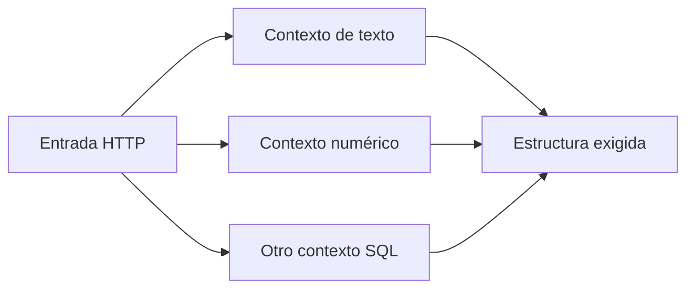
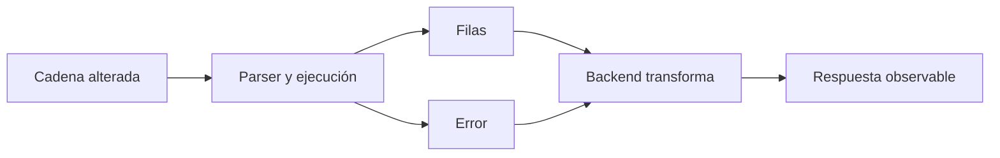
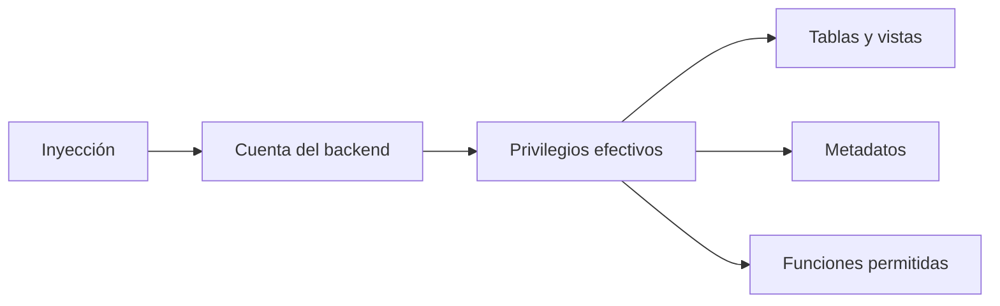

# Lección 02: Inyecciones SQL y subversión de lógica

[Inicio](../../../README.md) | [Pentesting Web](../../README.md) | [Módulo SQLi](../README.md) | [Anterior: Fundamentos de SQL](../01-fundamentos-sql/README.md) | [Siguiente: UNION SQL injection y Burp Suite](../03-union-sqli-y-burp-suite/README.md)

> [!CAUTION]
> Las técnicas descritas deben practicarse únicamente en máquinas locales aisladas o sistemas con autorización expresa. Las consultas vulnerables son ejemplos intencionales para comprender y prevenir CWE-89.

## Introducción

Una **inyección SQL**, clasificada como CWE-89, ocurre cuando una entrada no confiable modifica la estructura de una consulta SQL. La causa no es una comilla aislada, sino que el backend construye código y datos dentro de una misma cadena y obliga al RDBMS a interpretarlos juntos.

El modelo completo comienza en un parámetro HTTP. El backend extrae su valor, lo inserta en una plantilla SQL, envía la cadena ensamblada al parser del RDBMS y transforma las filas o el error resultante en una respuesta HTTP.



La **subversión lógica** consiste en cambiar el significado de una condición prevista por el desarrollador. Para entenderla con precisión, cada ejemplo separa plantilla, entrada y consulta final.

---

## 1. Concatenación y consulta ensamblada

La **concatenación** es la unión de fragmentos de texto para formar una cadena. Una **plantilla SQL** es el texto fijo de una consulta con un lugar donde el backend incorpora un valor. Si el backend concatena directamente una entrada HTTP, los caracteres SQL de esa entrada llegan al RDBMS dentro de la misma cadena que las instrucciones.

```php
// Vulnerable de forma intencional: uso exclusivo en laboratorio.
$category = $_GET['category'];
$sql = "SELECT id, name FROM products WHERE category = '" . $category . "' AND released = 1";
```

Con una petición legítima:

```http
GET /products.php?category=Gifts HTTP/1.1
Host: 127.0.0.1
```

el ensamblado ocurre paso a paso:

```text
Prefijo fijo:  SELECT id, name FROM products WHERE category = '
Entrada HTTP:  Gifts
Sufijo fijo:   ' AND released = 1
Cadena final:  SELECT id, name FROM products WHERE category = 'Gifts' AND released = 1
```

En la cadena final, `Gifts` permanece dentro de un literal de texto. El parser interpreta dos condiciones previstas por el desarrollador: pertenecer a esa categoría y estar publicado.



La concatenación no es peligrosa por unir texto en abstracto. Es peligrosa aquí porque no mantiene una frontera estructural entre la instrucción SQL y el dato recibido.

---

## 2. Cierre de un literal y trabajo del parser

El **lexer** separa la cadena SQL en unidades llamadas tokens; el **parser** verifica cómo encajan esos tokens en la gramática. Una comilla simple delimita normalmente un literal de texto. Si la entrada contiene una comilla y se concatena sin separación segura, puede cerrar el literal iniciado por la plantilla.

Con la entrada `Gifts'`, el ensamblado es:

```text
Prefijo fijo:  SELECT id, name FROM products WHERE category = '
Entrada HTTP:  Gifts'
Sufijo fijo:   ' AND released = 1
Cadena final:  SELECT id, name FROM products WHERE category = 'Gifts'' AND released = 1
```

La comilla de la entrada cierra el primer literal. La comilla añadida por el sufijo abre otro contexto de texto que no queda cerrado, por lo que este ejemplo suele terminar en un error de análisis. El detalle exacto del mensaje depende del RDBMS, su modo SQL, el controlador y la gestión de errores del backend.



Una respuesta `500`, un mensaje SQL o una diferencia de contenido puede revelar una anomalía, pero no demuestra por sí sola que exista una inyección explotable. La aplicación puede ocultar el error, escapar la entrada antes de usarla o fallar por otra causa. La evidencia sólida surge al relacionar cambios controlados de entrada con cambios repetibles en el resultado.

---

## 3. Comentarios y código residual

Un **comentario SQL** es texto que el parser ignora. En una consulta inyectada, un comentario puede neutralizar el sufijo que la plantilla añade después de la entrada, incluidas comillas y condiciones residuales. Su sintaxis no es idéntica en todos los motores.

| RDBMS | Comentario hasta fin de línea | Matiz relevante |
|---|---|---|
| MariaDB / MySQL | `-- ` o `#` | Tras `--` debe aparecer un carácter de espacio en blanco o de control. `-- -` conserva un carácter posterior visible. |
| PostgreSQL | `--` | Comenta hasta el final de la línea; no debe atribuirse la regla específica de whitespace de MySQL. |
| Microsoft SQL Server | `--` | Comenta hasta el final de la línea. |
| Oracle Database | `--` | Comenta hasta el final de la línea. |
| SQLite | `--` | Comenta hasta el final de la línea. |

Los bloques `/* ... */` también existen en varios motores, pero sus posibilidades y restricciones dependen del dialecto. Un **dialecto SQL** es la variante de SQL implementada por un RDBMS.

Para MariaDB, la entrada de laboratorio `Gifts' -- ` produce:

La marca `[espacio final]` hace visible el carácter requerido y no forma parte del valor.

```text
Prefijo fijo:  SELECT id, name FROM products WHERE category = '
Entrada HTTP:  Gifts' -- [espacio final]
Sufijo fijo:   ' AND released = 1
Cadena final:  SELECT id, name FROM products WHERE category = 'Gifts' -- ' AND released = 1
```

El literal queda cerrado después de `Gifts`; el comentario hace que el parser ignore la comilla y la condición `released = 1` del sufijo. La consulta válida resultante ya no aplica el control de publicación.



En una URL, espacios y caracteres especiales pueden necesitar codificación porcentual. Esa transformación pertenece a HTTP; el backend suele decodificar el parámetro antes de construir la cadena SQL.

---

## 4. Cambio de condición paso a paso

Una **tautología** es una expresión verdadera para cualquier fila, como `1 = 1`. Conectarla mediante `OR` puede ampliar el conjunto de filas, pero el efecto solo se entiende sobre la consulta completa.

En el mismo filtro, la entrada de laboratorio `Gifts' OR 1=1 -- ` se ensambla así:

```text
Prefijo fijo:  SELECT id, name FROM products WHERE category = '
Entrada HTTP:  Gifts' OR 1=1 -- [espacio final]
Sufijo fijo:   ' AND released = 1
Cadena final:  SELECT id, name FROM products WHERE category = 'Gifts' OR 1=1 -- ' AND released = 1
```

Tras aplicar el comentario, la condición efectiva es:

```sql
WHERE category = 'Gifts' OR 1 = 1
```

Para cada fila, `1 = 1` es verdadero; por ello, este ejemplo devuelve todas las filas visibles para la cuenta de base de datos. El efecto no procede de la palabra `OR` aislada, sino del cierre correcto del literal, una expresión válida y la neutralización del sufijo.



Una tautología no garantiza un bypass de autenticación. `AND` suele tener mayor precedencia que `OR`; los paréntesis pueden imponer otra agrupación; la consulta puede no devolver la fila objetivo; y el backend puede rechazar cero, varias o determinadas filas. También puede existir una segunda comprobación fuera de SQL.

Por ejemplo, una consulta de autenticación vulnerable puede ensamblarse así:

```sql
SELECT id, username
FROM users
WHERE username = 'admin' OR 1=1 -- ' AND password_hash = 'valor';
```

Aunque la condición devuelve filas, el resultado concreto depende de cuál elija el backend y de cómo valide la sesión. En cambio, una entrada que conserva un usuario concreto y comenta la comprobación posterior:

```sql
SELECT id, username
FROM users
WHERE username = 'admin' -- ' AND password_hash = 'valor';
```

solo evita la contraseña si el dialecto acepta el comentario, existe la fila `admin` y el backend considera suficiente ese resultado. La consulta ensamblada completa, no el fragmento, determina el comportamiento.

---

## 5. Contextos numéricos y estructura circundante

Un **contexto de inyección** es la posición gramatical donde se inserta la entrada. No todos los parámetros están dentro de comillas. Una búsqueda por identificador puede concatenar un número:

```php
// Vulnerable de forma intencional: uso exclusivo en laboratorio.
$id = $_GET['id'];
$sql = "SELECT id, username FROM users WHERE id = " . $id;
```

Con `id=2`, la cadena final es:

```sql
SELECT id, username FROM users WHERE id = 2;
```

En este contexto no hay un literal de texto que cerrar. Una entrada alterada tendría que encajar directamente en una expresión numérica. Otros contextos pueden estar dentro de paréntesis, una cláusula `ORDER BY`, una instrucción `INSERT` o un nombre de objeto. Cada uno impone una gramática distinta; por eso trasladar sin análisis una cadena que funcionó en otro parámetro produce errores o conclusiones falsas.



---

## 6. Resultado SQL y señal HTTP

Una **señal observable** es una diferencia que la aplicación permite medir después de procesar la consulta. Puede ser una fila visible, un mensaje de error, un cambio estable en el contenido, un código HTTP o un retraso. El backend puede ocultar o transformar cualquiera de estas señales.



La salida visible de columnas abre el camino a inyecciones con `UNION`, desarrolladas en la lección siguiente. Un error visible puede convertirse en un canal basado en errores. Si no se muestran ni filas ni errores, todavía pueden existir diferencias booleanas o temporales, conocidas como inyección ciega. Cuando la respuesta HTTP no ofrece un canal utilizable y el RDBMS posee las capacidades necesarias, una interacción fuera de banda puede usar otra vía, como DNS.

---

## 7. Impacto y privilegios efectivos

Los **privilegios** son permisos concedidos a la cuenta con la que el backend se conecta al RDBMS. Determinan qué objetos puede leer o modificar y qué funciones puede ejecutar. Una inyección no concede automáticamente privilegios nuevos: opera inicialmente con los permisos efectivos de esa cuenta.

El principio de **menor privilegio** consiste en conceder solo las capacidades necesarias. Reduce el impacto posible, pero no garantiza que la exposición quede limitada a una sola tabla. La cuenta puede acceder a varias tablas, vistas, rutinas o metadatos; una vista puede combinar información de diferentes orígenes; y algunos motores revelan partes del catálogo aunque restrinjan los datos. La mitigación principal sigue siendo separar instrucciones y valores mediante consultas parametrizadas, mientras que los privilegios actúan como una capa adicional de contención.



---

## Cheatsheet

Referencia rápida del capítulo en formato PDF: [cheatsheet.pdf](./cheatsheet.pdf).

---

[Anterior: Fundamentos de SQL](../01-fundamentos-sql/README.md) | [Volver al índice del módulo](../README.md) | [Siguiente: UNION SQL injection y Burp Suite](../03-union-sqli-y-burp-suite/README.md)
