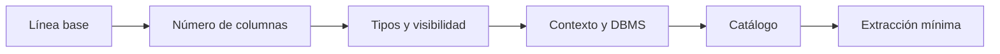
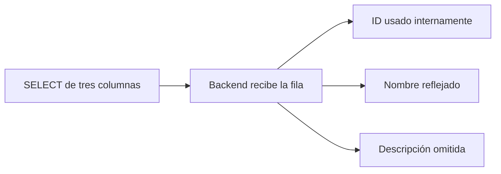
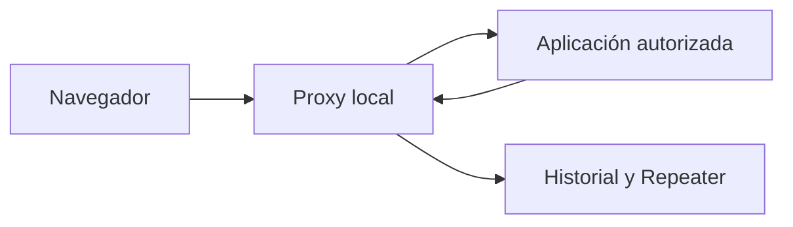

# Lección 03: UNION SQL injection y Burp Suite

[Inicio](../../../README.md) | [Pentesting Web](../../README.md) | [Módulo SQLi](../README.md) | [Anterior: Subversión de lógica](../02-subversion-logica/README.md) | [Siguiente: Inyecciones SQL basadas en error](../04-error-based-sqli/README.md)

> [!CAUTION]
> Practica la manipulación de consultas únicamente en aplicaciones locales vulnerables de forma intencional o en sistemas para los que exista autorización expresa. Los ejemplos describen el razonamiento técnico y no autorizan pruebas contra terceros.

## Introducción

La lección anterior mostró que una entrada concatenada puede cerrar un literal y cambiar la condición de una consulta. Esta lección conserva esa misma causa raíz, pero emplea **`UNION`** para añadir filas a las que ya produce un `SELECT`. La técnica resulta útil cuando la aplicación muestra al menos una parte del conjunto devuelto por la base de datos.

**`UNION`** es un operador SQL que combina los resultados de dos consultas compatibles. Una **columna** es una posición con nombre y tipo dentro de una tabla y, en un `SELECT`, también es cada posición de la fila resultante. Para combinar dos resultados, ambos lados deben devolver el mismo número de columnas y cada pareja de posiciones debe tener tipos compatibles según las reglas del gestor.



El método no consiste en memorizar una cadena. Consiste en conservar una referencia estable, modificar una sola propiedad cada vez y explicar cada diferencia observada. Burp Suite facilita esa observación y repetición; no descubre por sí solo la estructura SQL ni convierte una entrada incompatible en una consulta válida.

---

## 1. Cómo combina resultados `UNION`

Considérese una aplicación local que construye de forma insegura esta consulta:

```sql
SELECT id, name, description
FROM products
WHERE category = '$category' AND released = 1;
```

Con el valor normal `Gifts`, el servidor ensambla:

```sql
SELECT id, name, description
FROM products
WHERE category = 'Gifts' AND released = 1;
```

En un laboratorio MariaDB/MySQL, una entrada preparada para cerrar el literal, añadir un segundo `SELECT` y comentar el resto podría producir conceptualmente:

```sql
SELECT id, name, description
FROM products
WHERE category = 'Gifts'
UNION SELECT NULL, 'fila de control', NULL-- -' AND released = 1;
```

El segundo `SELECT` aporta tres posiciones, igual que el primero. Si la aplicación renderiza `name`, el texto `fila de control` puede aparecer junto a los productos. El comentario `-- -` se muestra porque forma parte del ensamblado de este ejemplo; su sintaxis y la necesidad de espacio cambian entre gestores y contextos.

### `UNION` frente a `UNION ALL`

`UNION` elimina filas duplicadas del resultado combinado. `UNION ALL` conserva todas las filas y suele evitar el trabajo adicional de deduplicación. En una auditoría controlada, `UNION ALL` puede preservar una fila de control que coincida con otra ya existente, pero no resuelve incompatibilidades de cantidad o tipos.

```sql
SELECT 1, 'azul'
UNION
SELECT 1, 'azul';

SELECT 1, 'azul'
UNION ALL
SELECT 1, 'azul';
```

La primera consulta devuelve una fila; la segunda, dos. El orden final de las filas no está garantizado sin un `ORDER BY` aplicable al conjunto combinado.

---

## 2. Condiciones que deben coincidir

Una inyección con `UNION` depende de tres propiedades distintas:

| Propiedad | Significado | Señal posible |
|---|---|---|
| Cantidad | Ambos `SELECT` proyectan el mismo número de columnas. | La consulta deja de fallar al usar la cantidad correcta. |
| Compatibilidad de tipos | Cada posición acepta valores que el DBMS puede convertir a un tipo común. | Un marcador de texto funciona en unas posiciones y falla en otras. |
| Visibilidad | El backend incorpora una posición del resultado a la respuesta. | Un marcador único aparece en HTML, JSON o una cabecera. |

La **compatibilidad de tipos** no exige que los tipos sean idénticos. Significa que el gestor puede reconciliarlos para esa operación. Sus reglas varían: algunos convierten valores implícitamente y otros rechazan combinaciones ambiguas. `NULL` suele ser un marcador inicial útil porque representa ausencia de valor y es compatible con muchos tipos, pero no constituye una garantía universal.

Una **columna visible** o **reflejada** es una posición del resultado cuyo valor llega de forma reconocible a la respuesta de la aplicación. No es una propiedad permanente de la columna de la tabla. El backend puede seleccionar tres posiciones y mostrar solo una, transformar su contenido, omitir filas, paginar resultados o serializar cada posición en un lugar diferente.



Por ello, una respuesta sin marcador no demuestra por sí sola que `UNION` sea imposible. También puede indicar que la posición no se renderiza, que la fila fue eliminada, que hubo una conversión, que existe caché o que el punto de entrada pertenece a otro contexto.

---

## 3. Método paso a paso desde una línea base

### 3.1 Establecer la línea base

La **línea base** es una petición legítima, repetible y con respuesta conocida. Deben conservarse su método HTTP, ruta, parámetros, cuerpo, cookies y cabeceras relevantes. Las señales útiles incluyen código de estado, longitud aproximada, texto estable, cantidad de elementos y tiempo de respuesta.

Por ejemplo, una petición local puede ser:

```http
GET /products?category=Gifts HTTP/1.1
Host: app.example.com
Cookie: session=valor-de-laboratorio
```

Las comparaciones posteriores solo son fiables si el estado funcional permanece estable. Una sesión caducada, un token CSRF ausente o contenido dinámico puede explicar una diferencia sin relación con SQL.

### 3.2 Inferir el número de columnas

Una opción consiste en variar un ordinal de ordenación:

```sql
ORDER BY 1
ORDER BY 2
ORDER BY 3
ORDER BY 4
```

Cuando `ORDER BY N` interpreta `N` como posición de salida, un valor fuera de rango suele causar un error de resolución, enlace u ordinal, **no necesariamente un error de sintaxis**. La aplicación puede ocultarlo, devolver una página genérica o no interpretar el número como ordinal en ese contexto. Cláusulas ya presentes, paréntesis, subconsultas y diferencias entre DBMS también alteran el resultado. El último ordinal aparentemente válido es una inferencia que debe contrastarse, no una prueba universal.

Otra opción es aumentar el número de marcadores `NULL`:

```sql
UNION SELECT NULL
UNION SELECT NULL, NULL
UNION SELECT NULL, NULL, NULL
```

Si solo la variante de tres posiciones reproduce una respuesta válida, existe evidencia de una proyección de tres columnas. También deben contemplarse errores ocultos, filtros, conversiones y respuestas sin filas antes de aceptar esa conclusión.

### 3.3 Separar compatibilidad y visibilidad

Con tres posiciones inferidas, se mueve un marcador textual único sin cambiar nada más:

```sql
UNION SELECT 'marca-031', NULL, NULL
UNION SELECT NULL, 'marca-032', NULL
UNION SELECT NULL, NULL, 'marca-033'
```

Un fallo al colocar texto en una posición sugiere incompatibilidad de tipos, aunque también puede proceder de otra parte de la sentencia. Una respuesta correcta sin marcador sugiere que la posición es compatible pero no visible. La aparición de `marca-032` aporta dos evidencias a la vez: la segunda posición admite el texto y el backend la refleja.

### 3.4 Reconstruir el contexto SQL y reconocer el DBMS

El **contexto SQL** es el lugar gramatical donde se inserta la entrada: un literal de texto, un número, una expresión, una cláusula `ORDER BY`, un identificador o una subconsulta. Determina si hacen falta comillas, paréntesis o un comentario y qué construcciones son válidas. Una cadena apropiada para `WHERE category = '$category'` puede ser inválida dentro de `ORDER BY $sort`.

El DBMS también determina funciones, comentarios, conversiones y catálogo. La identificación debe apoyarse en varias señales autorizadas, como mensajes de error, comportamiento conocido de la aplicación o una función inocua de versión. Ninguna función aislada debe tratarse como prueba concluyente si un proxy, driver o capa de compatibilidad puede modificarla.

| Dato del entorno | MariaDB / MySQL | PostgreSQL | SQL Server | Oracle |
|---|---|---|---|---|
| Versión | `version()` o `@@version` | `version()` | `@@version` | `v$version` mediante consulta |
| Base actual | `database()` | `current_database()` | `db_name()` | Depende del concepto de usuario y servicio |
| Usuario | `user()` o `current_user()` | `current_user` | `system_user` | `user` |

Estas expresiones no son intercambiables y su disponibilidad puede depender de versión y privilegios.

---

## 4. Del entorno al catálogo de metadatos

Los **metadatos** son datos que describen la propia base de datos: nombres de esquemas, tablas, columnas, tipos y permisos. El **catálogo** es el conjunto de vistas o tablas del sistema que almacena esa descripción. No contiene necesariamente los registros de negocio, sino el mapa para localizarlos.

En MariaDB/MySQL y PostgreSQL existe `information_schema`, aunque las columnas disponibles y su semántica no son idénticas. SQL Server también expone esas vistas junto con `sys.*`; Oracle utiliza vistas como `USER_TABLES` y `ALL_TAB_COLUMNS`. Los privilegios de la cuenta pueden limitar lo visible.

Partiendo del ejemplo de tres posiciones y de una segunda posición reflejada, una consulta mínima y acotada para el laboratorio puede ensamblarse así:

```sql
SELECT id, name, description
FROM products
WHERE category = 'Gifts'
UNION SELECT NULL, table_name, NULL
FROM information_schema.tables
WHERE table_schema = database()
ORDER BY table_name
LIMIT 1-- -' AND released = 1;
```

Cada fragmento cumple una función:

| Fragmento | Función |
|---|---|
| `NULL, table_name, NULL` | Mantiene tres posiciones y coloca texto en la visible. |
| `information_schema.tables` | Lee metadatos sobre tablas. |
| `table_schema = database()` | Restringe el alcance a la base activa en MariaDB/MySQL. |
| `ORDER BY table_name LIMIT 1` | Produce una salida pequeña y determinista dentro de lo posible. |

Tras conocer una tabla de demostración y una columna no sensible del laboratorio, la extracción mínima mantiene la misma forma:

```sql
SELECT id, name, description
FROM products
WHERE category = 'Gifts'
UNION SELECT NULL, name, NULL
FROM demo_categories
ORDER BY name
LIMIT 1-- -' AND released = 1;
```

Limitar la salida reduce ruido y facilita atribuir el cambio a una sola causa. La sintaxis concreta sigue siendo propia del contexto y del DBMS; por ejemplo, paginación, selección de una fila y catálogos difieren entre productos.

---

## 5. Burp Suite como instrumento de observación

**Burp Suite** puede actuar como proxy HTTP local entre el navegador y la aplicación autorizada. Su valor en este método es conservar la petición real y permitir cambios controlados mientras muestra la respuesta completa.



| Componente | Uso metodológico | Limitación |
|---|---|---|
| Proxy | Captura una petición válida con su contexto HTTP. | Interceptar tráfico no demuestra una vulnerabilidad. |
| HTTP history | Conserva peticiones y respuestas para comparar señales. | El contenido dinámico puede producir diferencias engañosas. |
| Repeater | Reenvía manualmente variantes de una misma petición. | No conoce la consulta ensamblada en el servidor. |
| Inspector | Facilita editar parámetros, cookies y codificación. | La codificación correcta no corrige una construcción SQL inválida. |

Un flujo de observación prudente consiste en enviar la línea base a Repeater, duplicar la pestaña, cambiar un único elemento y comparar estado, cuerpo y marcador. La representación debe respetar el transporte: caracteres con significado en una URL pueden necesitar codificación porcentual, mientras que un cuerpo JSON o un formulario siguen reglas diferentes.

Las funciones de automatización pueden generar muchas solicitudes y ocultar errores de razonamiento. Para determinar cantidad, tipo y visibilidad, una secuencia manual corta suele ofrecer mejor trazabilidad. Burp repite lo que se le proporciona; la interpretación continúa dependiendo del modelo de la consulta.

---

## 6. Límites de la técnica y transición a errores

`UNION` ofrece un canal directo solo cuando la sentencia admite una consulta combinada y alguna posición llega a la respuesta. Puede dejar de ser adecuado si el punto vulnerable está en una operación que no devuelve filas, el backend consume únicamente un valor interno, la aplicación descarta las filas añadidas o ninguna columna se refleja.

La ausencia de datos visibles no elimina la posibilidad de SQL injection. Si la aplicación expone excepciones del motor, la siguiente lección estudia cómo distinguir fallos accidentales de errores provocados de manera controlada. Si tampoco hay errores legibles, la lección 05 transforma diferencias de contenido o tiempo en un canal de inferencia ciega.

## Cheatsheet

Referencia rápida del capítulo en formato PDF: [cheatsheet.pdf](./cheatsheet.pdf).

---

[Anterior: Subversión de lógica](../02-subversion-logica/README.md) | [Volver al índice del módulo](../README.md) | [Siguiente: Inyecciones SQL basadas en error](../04-error-based-sqli/README.md)
