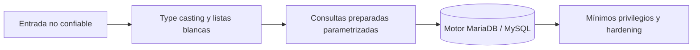
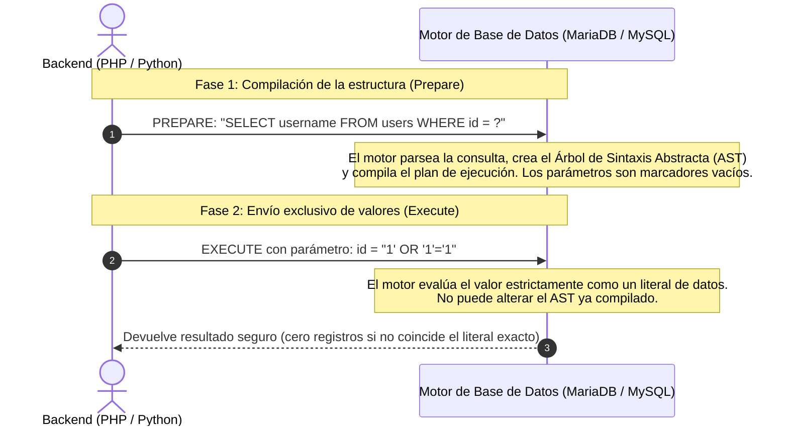
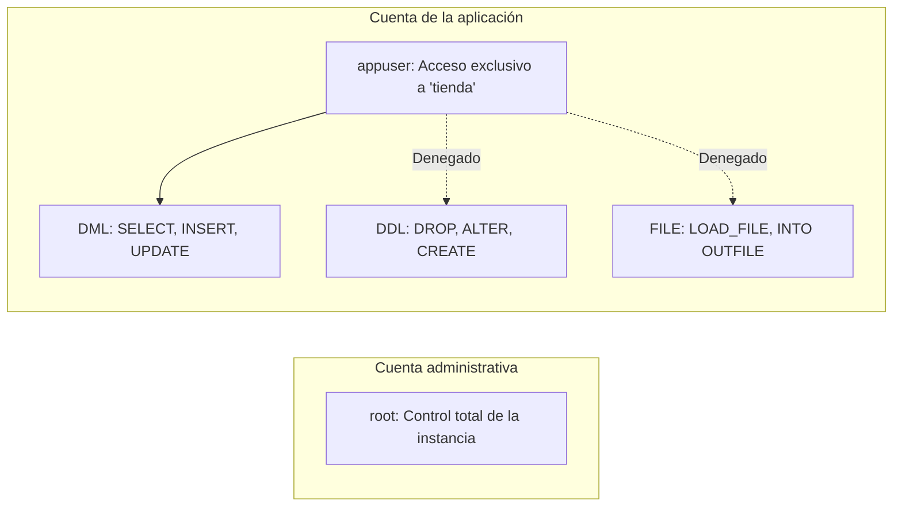

# Lección 04: Ingeniería defensiva y mitigaciones

[Inicio](../../../README.md) | [Pentesting Web](../../README.md) | [Módulo SQLi](../README.md) | [Anterior: UNION SQL injection y Burp Suite](../03-union-sqli-y-burp-suite/README.md)

> [!CAUTION]
> Aplica las medidas de mitigación y hardening de bases de datos y servidores web exclusivamente en entornos controlados y réplicas de desarrollo antes de transferirlas a producción.

## Introducción

La remediación de inyecciones SQL no se logra mediante expresiones regulares ni reemplazos de caracteres, sino restaurando la **separación estricta entre el código y los datos** a nivel de compilación interna del motor de base de datos.

La defensa en profundidad exige complementar las consultas preparadas con tipado estricto, listas blancas para identificadores de columnas, cuentas de base de datos con privilegios mínimos y almacenamiento criptográfico robusto de credenciales.



---

## 1. Consultas preparadas y separación semántica

Una **consulta preparada** (*parameterized query*) divide el ciclo de vida de la interacción con la base de datos en dos etapas completamente diferenciadas:



### Mecánica de inmunidad ante inyecciones

1. **Fase de Preparación (`PREPARE`)**: El backend envía al motor la plantilla SQL con marcadores posicionales (`?`) o nombrados (`:id`). El motor analiza la gramática, genera el Árbol de Sintaxis Abstracta (AST) e inmoviliza el plan de ejecución.
2. **Fase de Ejecución (`EXECUTE`)**: El backend transmite únicamente los literales que ocuparán los marcadores. El motor trata estos valores **estrictamente como datos**, independientemente de si contienen comillas simples (`'`), operadores lógicos (`OR`), delimitadores de comentarios (`--`) o sentencias apiladas.

---

## 2. Implementación de código seguro en PHP

### Implementación mediante PDO (PHP Data Objects)

PDO es la interfaz de abstracción de datos estándar en PHP.

#### Patrón vulnerable (concatenación)
```php
$id = $_GET['id'];
$sql = "SELECT username, email FROM users WHERE id = '$id'";
$result = $pdo->query($sql);
```

#### Patrón seguro con sentencias preparadas
```php
$id = $_GET['id'];

$sql = "SELECT username, email FROM users WHERE id = :id";
$stmt = $pdo->prepare($sql);
$stmt->execute(['id' => $id]);
$user = $stmt->fetch(PDO::FETCH_ASSOC);
```

> [!IMPORTANT]
> Para garantizar que PDO delegue la preparación real al servidor MySQL/MariaDB en lugar de realizar una emulación local de cadenas, debe configurarse la opción:
> ```php
> $pdo->setAttribute(PDO::ATTR_EMULATE_PREPARES, false);
> ```

---

### Implementación mediante MySQLi

#### Patrón vulnerable
```php
$id = $_GET['id'];
$query = "SELECT username FROM users WHERE id = '$id'";
$result = mysqli_query($conn, $query);
```

#### Patrón seguro con MySQLi Prepared Statements
```php
$id = $_GET['id'];

// 1. Preparar la plantilla con un marcador posicional (?)
$stmt = mysqli_prepare($conn, "SELECT username FROM users WHERE id = ?");

// 2. Vincular el parámetro indicando su tipo ('i' = integer, 's' = string)
mysqli_stmt_bind_param($stmt, "i", $id);

// 3. Ejecutar y recuperar resultados
mysqli_stmt_execute($stmt);
$result = mysqli_stmt_get_result($stmt);
$user = mysqli_fetch_assoc($result);
```

---

## 3. Manejo de identificadores dinámicos mediante listas blancas

Los marcadores de posición (`?` o `:nombre`) únicamente pueden sustituir literales de datos en cláusulas `WHERE`, `VALUES` o `SET`. **No admiten nombres de tablas, columnas ni directivas de ordenación**.

### Listas blancas estrictas (*Allowlists*)

Cuando el cliente controla la columna de ordenación (`?sort=price`), la validación debe realizarse contra un conjunto cerrado de identificadores permitidos:

```php
$allowed_columns = ['id', 'username', 'created_at', 'price'];

$sort = $_GET['sort'] ?? 'id';

// Validación estricta por lista blanca
if (!in_array($sort, $allowed_columns, true)) {
    $sort = 'id';
}

$direction = (isset($_GET['dir']) && strtoupper($_GET['dir']) === 'DESC') ? 'DESC' : 'ASC';

// La concatenación es segura al estar restringida al conjunto predefinido
$query = "SELECT id, username FROM users ORDER BY $sort $direction";
```

### Tipado fuerte (*Type Casting*)

En parámetros numéricos, forzar el tipo entero en el backend neutraliza cualquier intento de inyección antes de alcanzar la capa de consulta:

```php
// Cualquier payload como "1' OR 1=1" se convierte estrictamente en el entero 1
$id = (int)$_GET['id'];
```

---

## 4. Principio de menor privilegio en el motor de base de datos

Una arquitectura de base de datos reforzada mitiga el impacto de una posible brecha impidiendo que la aplicación ejecute operaciones destructivas o acceda a recursos del sistema operativo:



### Configuración de usuario restringido en MariaDB

```sql
-- 1. Crear usuario restringido al host local
CREATE USER 'appuser'@'localhost' IDENTIFIED BY 'ContraseñaFuerteYUnica#2026';

-- 2. Conceder privilegios exclusivos sobre la base de negocio
GRANT SELECT, INSERT, UPDATE ON tienda.* TO 'appuser'@'localhost';

-- 3. Recargar privilegios
FLUSH PRIVILEGES;
```

> [!TIP]
> Nunca asignes el privilegio global `FILE` ni permisos DDL (`DROP`, `ALTER`) al usuario utilizado por la aplicación web.

---

## 5. Almacenamiento seguro de credenciales con hashing adaptable

Las contraseñas nunca deben guardarse en texto claro ni mediante funciones de hash criptográfico rápido (MD5, SHA-1 o SHA-256).

### Limitaciones de los algoritmos rápidos para contraseñas

SHA-256 fue diseñado para verificar sumas de integridad y firmas digitales con alta eficiencia de procesamiento. Un atacante con hardware moderno (GPUs o ASICs) puede calcular miles de millones de hashes SHA-256 por segundo, permitiendo ataques de fuerza bruta y diccionarios con salt.

### Funciones de derivación de claves con coste adaptable

Deben emplearse algoritmos concebidos específicamente para contraseñas con factor de coste de memoria y CPU configurable:

- **Argon2id**: Estándar recomendado por el Password Hashing Competition (PHC), resistente a ataques paralelos en GPU y hardware dedicado.
- **bcrypt**: Algoritmo consolidado basado en cifrado por bloques Blowfish.

#### Implementación segura en PHP

```php
// 1. Hasheo automático con sal y coste adaptable
$hash = password_hash($plaintext_password, PASSWORD_ARGON2ID);
// Almacenar $hash en la columna 'password' (requiere VARCHAR(255))

// 2. Verificación durante el inicio de sesión
if (password_verify($password_ingresada, $hash_almacenado)) {
    // Autenticación satisfactoria
} else {
    // Credenciales inválidas
}
```

---

## 6. Endurecimiento de configuración y gestión de errores

1. **Supresión de errores detallados en producción**:
   - En `php.ini`:
     ```ini
     display_errors = Off
     log_errors = On
     error_log = /var/log/php/error.log
     ```
   - Ocultar los mensajes internos al cliente mitiga la fuga de información y dificulta los ataques basados en errores (*Error-based SQLi*).
2. **Cabeceras HTTP de seguridad**:
   - `Content-Security-Policy`: Mitiga inyecciones de script en el cliente (XSS).
   - `X-Content-Type-Options: nosniff`: Evita la reinterpretación errónea de tipos MIME.
   - `Strict-Transport-Security` (HSTS): Exige conexiones HTTPS estrictas.
3. **Seguridad en cookies de sesión**:
   - Emitir siempre cookies de sesión con atributos `Secure`, `HttpOnly` y `SameSite=Lax` o `SameSite=Strict`.

---

## Cheatsheet

Referencia rápida del capítulo en formato PDF: [cheatsheet.pdf](./cheatsheet.pdf).

---

[Anterior: UNION SQL injection y Burp Suite](../03-union-sqli-y-burp-suite/README.md) | [Volver al índice del módulo](../README.md)
