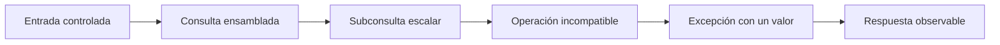
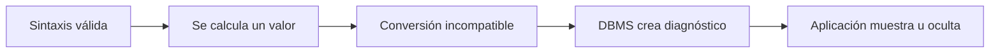
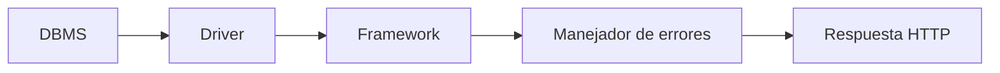

# Lección 04: Inyecciones SQL basadas en error

[Inicio](../../../README.md) | [Pentesting Web](../../README.md) | [Módulo SQLi](../README.md) | [Anterior: UNION SQL injection y Burp Suite](../03-union-sqli-y-burp-suite/README.md) | [Siguiente: Inyecciones SQL a ciegas](../05-blind-sqli/README.md)

> [!CAUTION]
> Provoca excepciones únicamente en aplicaciones locales vulnerables de forma intencional o en sistemas con autorización expresa. Los errores pueden registrar entradas, afectar transacciones y revelar información sensible; las pruebas deben ser acotadas y reversibles.

## Introducción

La lección 03 utilizó una columna visible para transportar filas añadidas con `UNION`. Una **inyección SQL basada en error** parte de una situación diferente: los datos normales de la consulta no aparecen en la respuesta, pero la aplicación sí deja pasar un **error de base de datos**, es decir, una excepción o diagnóstico emitido por el DBMS durante el análisis o la ejecución SQL.

El mensaje puede revelar el producto, una parte de la consulta o, en algunos casos, el valor que causó el fallo. La técnica basada en error intenta producir de forma predecible ese último caso. No todo error extrae datos y no todo gestor redacta sus excepciones del mismo modo.



El puente metodológico es directo: cuando `UNION` no tiene una columna reflejada, se estudia si existe un canal de excepciones. Cuando las excepciones se sustituyen por mensajes genéricos, la lección 05 utiliza señales booleanas o temporales sin depender de datos ni errores visibles.

---

## 1. Tres clases de error que no deben confundirse

### 1.1 Error de sintaxis

Un **error de sintaxis** ocurre cuando el parser no puede construir una sentencia válida. Una comilla sin cerrar o una palabra reservada fuera de lugar puede producirlo:

```sql
SELECT title FROM articles WHERE category = 'news;
```

Este fallo sirve como señal inicial de concatenación insegura, pero normalmente se produce antes de evaluar una subconsulta. Por ello, suele revelar texto técnico o un punto aproximado de la sentencia, no un dato elegido del catálogo.

### 1.2 Error de tipo

Un **error de tipo** aparece cuando la sentencia es gramaticalmente válida, pero una operación recibe un valor incompatible. Convertir el texto `academia_local` a un entero es un ejemplo sencillo:

```sql
SELECT CAST('academia_local' AS INTEGER);
```

Algunos DBMS incluyen el valor rechazado en el diagnóstico, como `invalid input syntax for type integer: "academia_local"`. Otros lo omiten, lo truncan, lo registran solo en el servidor o entregan un mensaje diferente a través del driver.

### 1.3 Error provocado de forma controlada

Un **error controlado** es un fallo de ejecución elegido para que ocurra solo después de calcular una expresión concreta. “Controlado” describe el método de la prueba, no una garantía sobre el texto de respuesta. La operación incompatible permanece constante y solo cambia el valor pequeño que se intenta observar.



Esta distinción evita sobrecargar una entrada con muchas funciones. Para demostrar el canal basta una subconsulta que devuelva un valor conocido y una única operación que falle de manera entendible.

---

## 2. La subconsulta escalar como pieza de enlace

Una **subconsulta escalar** es un `SELECT` usado donde la consulta exterior espera un solo valor. En términos sencillos, actúa como una casilla: debe entregar una columna y, normalmente, como máximo una fila.

```sql
SELECT (SELECT name FROM demo_settings WHERE id = 1);
```

Si devuelve varias columnas, no cabe en esa posición. Si devuelve varias filas, la mayoría de gestores genera un error del tipo “más de una fila devuelta por una subconsulta escalar”. Si no devuelve filas, suele producir `NULL`, cuyo efecto depende de la operación exterior.

Para conservar un resultado estable se emplea una selección determinista y pequeña. La sintaxis varía por DBMS:

```sql
-- PostgreSQL y MariaDB/MySQL
SELECT setting_name
FROM demo_settings
ORDER BY setting_name
LIMIT 1;

-- SQL Server
SELECT TOP (1) setting_name
FROM demo_settings
ORDER BY setting_name;
```

`LIMIT 1` o `TOP (1)` limita la cantidad, mientras que `ORDER BY` define cuál es la primera fila. Sin ordenación, el gestor puede devolver cualquier fila válida y cambiar entre ejecuciones.

---

## 3. Cómo un valor termina dentro de una excepción

El mecanismo puede entenderse sin una cadena extensa:

1. La subconsulta escalar calcula un texto corto.
2. La consulta exterior intenta usar ese texto como un entero.
3. La conversión falla durante la ejecución.
4. El DBMS construye un diagnóstico que puede citar el texto rechazado.
5. El driver y la aplicación deciden si ese diagnóstico llega a HTTP.

En un laboratorio PostgreSQL, la expresión mínima sería:

```sql
CAST((SELECT current_database()) AS INTEGER)
```

Ensamblada dentro de una consulta vulnerable de ejemplo:

```sql
SELECT title
FROM articles
WHERE id = 7
  AND 1 = CAST((SELECT current_database()) AS INTEGER);
```

Si la base activa se llama `academy_local`, PostgreSQL puede emitir un diagnóstico similar a:

```text
ERROR: invalid input syntax for type integer: "academy_local"
```

El valor no aparece porque una función “imprima” resultados, sino porque forma parte de la entrada que la conversión no pudo aceptar. La sentencia debe ser válida hasta ese punto y el plan de ejecución debe evaluar la expresión. Optimizaciones, cortocircuitos, valores convertibles o ramas que no se ejecutan pueden impedir el error.

En SQL Server, la misma idea puede expresarse con `CONVERT`:

```sql
CONVERT(INT, (SELECT DB_NAME()))
```

PostgreSQL también admite `CAST(... AS INTEGER)` y la notación `::integer`. MariaDB/MySQL aplica reglas de conversión diferentes y con frecuencia genera advertencias o valores numéricos en situaciones donde otros motores abortan. Por tanto, la conversión forzada es un patrón conceptual, no una técnica universal con idéntico resultado.

---

## 4. Del mensaje del DBMS a la respuesta HTTP

Entre la base de datos y el navegador existen varias capas. Cada una puede conservar, transformar o eliminar el diagnóstico:



| Capa | Comportamiento posible |
|---|---|
| DBMS | Genera código, clase y texto del error. |
| Driver | Convierte el diagnóstico en una excepción del lenguaje. |
| Framework | Añade traza, contexto o una página de depuración. |
| Aplicación | Muestra el texto, lo reemplaza o lo registra internamente. |
| Proxy o servidor web | Puede sustituir la respuesta por un error genérico. |

Un `500 Internal Server Error` sin detalle confirma un fallo de servidor, pero no un canal basado en error. Del mismo modo, recibir `200 OK` no descarta una excepción: algunas aplicaciones la capturan y muestran un aviso dentro de una página normal. La evidencia relevante es una variación repetible asociada al valor o a la operación probada.

La exposición de errores detallados es además un defecto defensivo independiente. En producción, el cliente debería recibir un mensaje genérico y el diagnóstico completo debería quedar en registros internos protegidos, con identificadores de correlación que no revelen consultas ni datos.

---

## 5. Selección y fragmentación sin límites inventados

Un mensaje de error no es un canal diseñado para transportar datos. Su longitud observable puede depender del DBMS, la versión, la función, el driver, la configuración, la codificación, el servidor web y la plantilla de error. No existe un límite fijo universal, tampoco uno de 32 caracteres aplicable a todas las técnicas o instalaciones.

La forma prudente de estudiar el canal es comenzar con un valor corto y conocido. Si una cadena se trunca, pueden seleccionarse fragmentos pequeños con las funciones propias del gestor:

```sql
-- PostgreSQL y MariaDB/MySQL: fragmento desde la posición 1
SUBSTRING((SELECT setting_value FROM demo_settings WHERE id = 1), 1, 8)

-- SQL Server: misma idea con sintaxis de tres argumentos
SUBSTRING((SELECT setting_value FROM demo_settings WHERE id = 1), 1, 8)
```

La longitud `8` es solo un ejemplo conservador, no un máximo. Antes de cambiar la ventana debe comprobarse que el mensaje conserva exactamente el fragmento esperado y que los caracteres multibyte, escapes o transformaciones del framework no alteran la interpretación.

Para varias filas, una subconsulta escalar necesita seleccionar una sola de manera determinista. Agregar todos los valores en una cadena suele aumentar el truncamiento y dificulta reconocer separadores; una fila corta cada vez produce evidencia más clara y menos carga.

---

## 6. Funciones XML heredadas en MySQL y MariaDB

Algunas referencias históricas emplean `ExtractValue()` o `UpdateXML()` para provocar diagnósticos XPath que incorporan parte de una expresión. Estas técnicas no son universales ni una base fiable para material moderno:

- MySQL las marcó como obsoletas y las retiró en MySQL 8.0.
- MariaDB puede conservarlas en determinadas versiones, con comportamiento propio.
- PostgreSQL, SQL Server y Oracle no implementan esas funciones con la misma semántica.
- El texto y truncamiento del diagnóstico dependen de versión y de las capas de la aplicación.

Una forma conceptual heredada es:

```sql
ExtractValue(1, CONCAT('~', (SELECT database())))
```

La intención era construir una expresión XPath inválida que contuviera un valor ya calculado. Antes de considerar este patrón en un laboratorio legado deben verificarse producto y versión. En MySQL 8 no debe esperarse que la función exista, y su ausencia no dice nada sobre la presencia de SQL injection.

---

## 7. Comparación cautelosa entre gestores

| DBMS | Mecanismo que puede ser observable | Matiz importante |
|---|---|---|
| PostgreSQL | Conversión explícita de texto no numérico a entero. | Suele citar la entrada inválida, pero la aplicación puede ocultarla. |
| SQL Server | `CAST` o `CONVERT` hacia un tipo incompatible. | La redacción y longitud dependen de versión, driver y tipo. |
| MariaDB / MySQL | Diagnósticos de funciones o expresiones concretas. | Muchas conversiones producen advertencia en vez de excepción; las funciones XML dependen de versión. |
| Oracle | Errores de conversión y funciones específicas del producto. | La evaluación, privilegios y texto observable cambian entre versiones y configuración. |

No existe una “función de error” común a todos los motores. El contexto SQL también sigue siendo decisivo: una expresión válida en `WHERE` puede no encajar en una lista de columnas, una cláusula de ordenación o una operación de escritura.

---

## 8. Del canal de error al canal ciego

La técnica basada en error requiere tres condiciones encadenadas: la entrada modifica una expresión ejecutable, el DBMS produce un diagnóstico útil y alguna capa lo expone de forma estable. Si falla cualquiera de ellas, repetir conversiones o añadir funciones no crea un canal.

Cuando la aplicación devuelve el mismo mensaje genérico para todos los fallos, la estrategia cambia. La lección 05 conserva la idea de subconsulta pequeña, pero reemplaza el texto de la excepción por una condición verdadera o falsa observable en el contenido o en el tiempo de respuesta. Así se mantiene la progresión: subversión lógica en 02, salida directa con `UNION` en 03, salida mediante excepciones en 04 e inferencia sin salida visible en 05.

## Cheatsheet

Referencia rápida del capítulo en formato PDF: [cheatsheet.pdf](./cheatsheet.pdf).

---

[Anterior: UNION SQL injection y Burp Suite](../03-union-sqli-y-burp-suite/README.md) | [Volver al índice del módulo](../README.md) | [Siguiente: Inyecciones SQL a ciegas](../05-blind-sqli/README.md)
