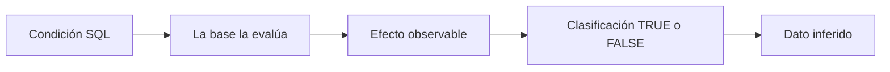
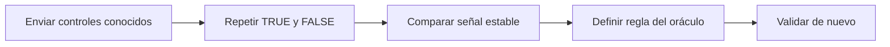
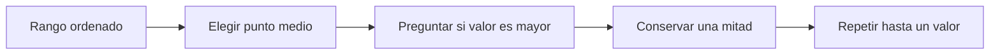

# Lección 05: Inyecciones SQL a ciegas (Boolean-based y Time-based)

[Inicio](../../../README.md) | [Pentesting Web](../../README.md) | [Módulo SQLi](../README.md) | [Anterior: Inyecciones SQL basadas en error](../04-error-based-sqli/README.md) | [Siguiente: Explotación avanzada: Archivos, RCE y OOB](../06-explotacion-avanzada-archivos-rce-oob/README.md)

> [!CAUTION]
> Las pruebas de inferencia, en especial las basadas en tiempo, pueden generar muchas consultas y agotar conexiones. Deben limitarse a entornos propios o expresamente autorizados, con pocos intentos, retardos mínimos y una tasa controlada.

## Introducción

Una **inyección SQL a ciegas** (*blind SQL injection*) existe cuando la aplicación ejecuta una expresión SQL controlable, pero no muestra directamente las filas obtenidas ni un error útil del motor. La palabra **ciega** no significa que no exista ninguna señal: significa que el dato no llega de forma directa y debe inferirse a partir de un efecto observable.

Ese efecto puede ser una diferencia estable en el contenido, el estado HTTP o el número de resultados. Si esas respuestas no cambian, también puede ser un retardo condicional. La lección anterior utilizaba errores como canal de salida; esta lección convierte señales más pequeñas en respuestas `TRUE` o `FALSE`. La siguiente estudiará por qué disponer de SQLi no implica automáticamente acceder a archivos, ejecutar comandos o usar la red.



---

## 1. El oráculo y la línea base

Un **oráculo** es una regla que traduce una observación repetible en una respuesta binaria. Por ejemplo: "aparece el texto `Resultado disponible`" puede significar `TRUE`, mientras que su ausencia significa `FALSE`. El oráculo no conoce el dato completo; solo permite comprobar una condición cada vez.

Antes de inferir datos se construye una **línea base** con dos condiciones cuyo resultado ya se conoce:

```sql
-- Condición de control verdadera
1 = 1

-- Condición de control falsa
1 = 0
```

Cada condición se envía varias veces dentro del mismo punto inyectable y manteniendo iguales el resto de la petición, la sesión y las cabeceras. Después se comparan señales como estas:

| Señal | Base `TRUE` | Base `FALSE` | Precaución |
|---|---|---|---|
| Texto estable | Mensaje presente | Mensaje ausente | Ignorar fechas, identificadores y contenido dinámico |
| Tamaño del cuerpo | Rango de tamaños A | Rango de tamaños B | No depender de un único byte de diferencia |
| Estado o redirección | Estado o destino A | Estado o destino B | Confirmar que no dependa de autenticación o caché |
| Tiempo | Distribución más lenta | Distribución normal | Repetir y comparar muestras, no una sola petición |

Una diferencia aislada no forma un oráculo fiable. Cachés, balanceadores, anuncios, consultas concurrentes y sesiones caducadas pueden producir falsos positivos. Si las distribuciones de `TRUE` y `FALSE` se solapan, la señal debe estabilizarse o descartarse.



---

## 2. Inferencia basada en respuestas booleanas

La técnica **boolean-based** inserta una condición que cambia de forma predecible el resultado lógico de la consulta original. La aplicación puede responder siempre con `200 OK` y aun así revelar la condición mediante una fila, un mensaje o una longitud diferente.

El contexto concreto decide cómo se integra la expresión. En un laboratorio donde el valor ya forma parte de una condición `WHERE`, el comportamiento conceptual es:

```sql
-- Devuelve el resultado normal del registro
... AND 1 = 1

-- Suprime ese resultado
... AND 1 = 0
```

No conviene asumir que cualquier fragmento funciona en cualquier parámetro. Un valor de texto, un número, una cláusula `ORDER BY` y una sentencia `UPDATE` tienen gramáticas y riesgos diferentes. Primero se confirma el contexto sin modificar datos.

### Longitud, posición y carácter

Una cadena se reconstruye en tres niveles:

1. **Longitud**: comprobar si el texto tiene más de cierto número de caracteres hasta acotar su tamaño.
2. **Posición**: seleccionar un carácter concreto; en las funciones SQL habituales la primera posición es `1`, no `0`.
3. **Carácter**: comparar ese carácter directamente o convertirlo a un valor numérico adecuado para el juego de caracteres.

Ejemplos de condiciones aisladas para una base local de demostración:

```sql
-- MySQL o MariaDB: longitud en caracteres y segundo carácter
CHAR_LENGTH('demo') = 4
SUBSTRING('demo', 2, 1) = 'e'

-- PostgreSQL: longitud en caracteres y segundo carácter
length('demo') = 4
substring('demo' from 2 for 1) = 'e'

-- SQL Server: segundo carácter; LEN omite espacios finales
SUBSTRING('demo', 2, 1) = 'e'
```

Las funciones de longitud no son equivalentes exactos entre motores:

| Motor | Caracteres | Bytes | Matiz relevante |
|---|---|---|---|
| MySQL / MariaDB | `CHAR_LENGTH(texto)` | `LENGTH(texto)` | Con UTF-8, un carácter puede ocupar varios bytes |
| PostgreSQL | `length(texto)` | `octet_length(texto)` | `length` cuenta caracteres para valores de texto |
| SQL Server | `LEN(texto)` | `DATALENGTH(texto)` | `LEN` excluye espacios finales; `DATALENGTH` depende del tipo y codificación |
| Oracle | `LENGTH(texto)` | `LENGTHB(texto)` | La semántica de bytes depende del juego de caracteres |

`ASCII()` resulta útil para ASCII, pero no representa de manera universal todos los caracteres Unicode. Antes de comparar números se identifica la codificación, el rango esperado y la función específica del motor. Comparar directamente caracteres puede ser más claro, aunque la intercalación (*collation*) puede ignorar mayúsculas, acentos u otras diferencias.

---

## 3. Búsqueda lineal y búsqueda binaria

La **búsqueda lineal** prueba candidatos uno tras otro: `a`, después `b`, después `c`. Es sencilla y funciona bien con alfabetos pequeños, pero en el peor caso necesita una consulta por cada candidato.

La **búsqueda binaria** ordena los candidatos y pregunta si el valor está por encima o por debajo del punto medio. Cada respuesta descarta aproximadamente la mitad restante. Para 128 valores posibles, bastan como máximo siete decisiones en lugar de hasta 128.



En palabras simples, para encontrar una letra entre `a` y `z`, primero se compara con `m`. Si es mayor, solo queda buscar entre `n` y `z`; si no, entre `a` y `m`. El proceso continúa dividiendo el grupo restante.

La búsqueda binaria exige un orden numérico estable. La intercalación de texto del motor puede producir órdenes inesperados, por lo que suele aplicarse sobre el código numérico del carácter cuando el alfabeto y la codificación están definidos. La búsqueda lineal sigue siendo preferible para conjuntos pequeños o no ordenados, como una lista de estados conocidos.

---

## 4. Inferencia basada en tiempo

La técnica **time-based** convierte `TRUE` en una espera deliberada y `FALSE` en una respuesta sin esa espera. Se utiliza cuando el contenido no ofrece una diferencia fiable, no como primera opción: es más lenta, consume recursos y es muy sensible al ruido.

Los mecanismos cambian según el motor y el contexto:

| Motor | Mecanismo de laboratorio | Observación |
|---|---|---|
| MySQL / MariaDB | `SLEEP(segundos)` dentro de `IF` | `IF` puede emplearse como expresión |
| PostgreSQL | `pg_sleep(segundos)` | Puede recibir un tiempo calculado por `CASE` |
| SQL Server | `WAITFOR DELAY` | Es una sentencia; suele requerir un bloque `IF` y que el contexto admita sentencias apiladas |
| Oracle | Paquetes de espera sujetos a permisos | No deben suponerse disponibles para la cuenta de la aplicación |
| SQLite | Sin función de espera SQL incorporada | Las operaciones costosas no constituyen un reloj preciso ni seguro |

Ejemplos mínimos para ejecutar exclusivamente en una consola SQL local:

```sql
-- MySQL o MariaDB: un segundo solo si la condición es verdadera
SELECT IF(1 = 1, SLEEP(1), 0);

-- PostgreSQL: un segundo o cero segundos según la condición
SELECT pg_sleep(CASE WHEN 1 = 1 THEN 1 ELSE 0 END);

-- SQL Server: WAITFOR es una sentencia, no una función escalar
IF 1 = 1 WAITFOR DELAY '00:00:01';
```

Un retardo de un segundo no implica que toda respuesta superior a un segundo sea `TRUE`. El tiempo observado incluye aplicación, red, cola de conexiones y carga del motor. La decisión se obtiene comparando grupos de mediciones de control con grupos de mediciones de la condición, alternando el orden para reducir sesgos.

### Calibración frente al ruido

Una clasificación temporal prudente sigue este flujo:

1. Medir varias veces los controles `TRUE` y `FALSE` sin concurrencia innecesaria.
2. Empezar con el menor retardo que separe claramente ambos grupos.
3. Repetir cualquier resultado cercano al límite o incompatible con las muestras anteriores.
4. Introducir pausas y limitar la tasa para no acumular consultas dormidas.
5. Detener la prueba si aumenta la latencia normal, aparecen errores o las señales dejan de separarse.

Los *timeouts* no equivalen automáticamente a `TRUE`: también pueden indicar pérdida de red, bloqueo, saturación o caída del servicio. La mediana de varias muestras suele resistir mejor los picos que una única medición, pero ninguna regla estadística corrige un canal inherentemente inestable.

---

## 5. Del dato inferido a la automatización

La extracción completa repite el mismo ciclo: determinar longitud, recorrer posiciones y resolver cada carácter mediante el oráculo. Antes de automatizar se comprueba manualmente que los controles son estables, que la consulta solo lee datos y que el rango de caracteres es correcto.

Una automatización segura debe apuntar a `127.0.0.1` o a un laboratorio aislado, imponer tiempo máximo, pocas repeticiones, pausas y un límite total de solicitudes. También debe registrar la condición y la medición para poder distinguir una inferencia real de un fallo de transporte. La siguiente lección amplía el modelo de impacto; la lección 07 mostrará cómo SQLMap automatiza la detección y estos oráculos sin eliminar la necesidad de calibrar alcance y riesgo.

---

## Cheatsheet

Referencia rápida del capítulo en formato PDF: [cheatsheet.pdf](./cheatsheet.pdf).

---

[Anterior: Inyecciones SQL basadas en error](../04-error-based-sqli/README.md) | [Volver al índice del módulo](../README.md) | [Siguiente: Explotación avanzada: Archivos, RCE y OOB](../06-explotacion-avanzada-archivos-rce-oob/README.md)
