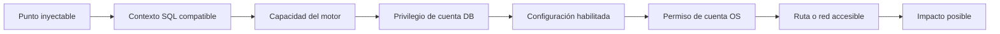
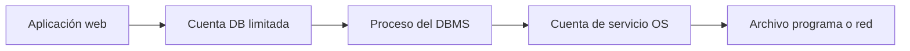
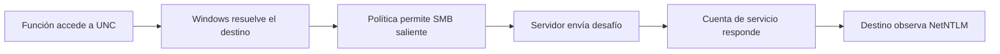
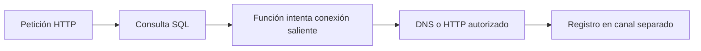

# Lección 06: Explotación avanzada: Archivos, RCE y canales fuera de banda (OOB)

[Inicio](../../../README.md) | [Pentesting Web](../../README.md) | [Módulo SQLi](../README.md) | [Anterior: Inyecciones SQL a ciegas](../05-blind-sqli/README.md) | [Siguiente: Automatización profesional con SQLMap](../07-automatizacion-sqlmap/README.md)

> [!CAUTION]
> El acceso a archivos, la ejecución de comandos y las conexiones salientes pueden alterar sistemas o exponer material de autenticación. Deben comprobarse solo en laboratorios aislados o dentro de un alcance autorizado que especifique técnicas, rutas y destinos permitidos.

## Introducción

Una inyección SQL permite influir en una consulta, pero **no concede automáticamente** acceso a archivos, ejecución remota de comandos (**RCE**) ni comunicación fuera de banda (**OOB**). Cada impacto exige que varias condiciones independientes coincidan.

La lección anterior mostró cómo inferir datos cuando la respuesta directa no existe. Esta lección amplía el análisis desde la base de datos hacia el sistema operativo y la red, pero mantiene separados tres niveles: lo que acepta el punto inyectable, lo que permite la cuenta de base de datos y lo que puede hacer la cuenta del proceso en el sistema operativo. La siguiente lección explicará cómo SQLMap comprueba capacidades compatibles, sin convertir una posibilidad teórica en una garantía.



Si falla un solo eslabón, esa cadena concreta no produce el impacto esperado. Por ejemplo, una función de lectura disponible no puede leer un archivo que la cuenta del servicio no puede abrir.

---

## 1. Contexto SQL y consultas apiladas

El **contexto SQL** es la parte de la sentencia donde se inserta la entrada: una cadena, un número, una expresión, un identificador o una cláusula concreta. Determina qué sintaxis puede evaluarse y si solo cabe una expresión de lectura o una sentencia independiente.

Las **consultas apiladas** (*stacked queries*) son varias sentencias enviadas en una misma ejecución y separadas normalmente por `;`:

```sql
-- Ejemplo conceptual en una consola local
SELECT 'primera';
SELECT 'segunda';
```

Que el motor entienda ambas sentencias no significa que el controlador de la aplicación las acepte. Muchos drivers deshabilitan múltiples sentencias, las parametrizaciones cambian el contexto y algunos puntos inyectables solo permiten una expresión. Las operaciones administrativas como cambiar configuración o invocar ciertos procedimientos suelen depender de consultas apiladas, mientras que algunas funciones de lectura caben en una sola expresión.

La validación debe empezar por una operación de solo lectura y bajo impacto. Una inyección dentro de `UPDATE`, `INSERT` o `DELETE` puede modificar datos incluso si la carga pretendía ser una simple comprobación.

---

## 2. Cuenta de base de datos y cuenta del sistema operativo

La **cuenta de base de datos** es la identidad con la que la aplicación se conecta al DBMS. Sus roles y privilegios deciden si puede consultar tablas, usar funciones especiales, acceder a archivos desde SQL o cambiar opciones del servidor.

La **cuenta del sistema operativo** es la identidad del proceso o servicio que ejecuta el DBMS. Sus permisos deciden qué archivos, directorios, programas y recursos de red puede alcanzar. No es la misma identidad que el usuario SQL.



Una cuenta SQL administrativa puede habilitar una función del motor, pero el proceso seguirá sujeto a controles del sistema operativo, ACL, SELinux o AppArmor, contenedores y permisos de red. A la inversa, una cuenta de servicio con acceso a un archivo no sirve si la cuenta SQL carece de la capacidad necesaria para solicitar su lectura.

---

## 3. Lectura y escritura de archivos

El acceso a archivos ocurre desde el host donde se ejecuta el DBMS, no desde el navegador. Requiere una función compatible, privilegios en la base de datos, configuración permisiva, una ruta visible para el proceso y permisos de la cuenta del sistema operativo.

### MySQL y MariaDB

El privilegio global **`FILE`** controla operaciones como `LOAD_FILE()` y `SELECT ... INTO OUTFILE`. La variable **`secure_file_priv`** añade una restricción de ubicación:

| Valor de `secure_file_priv` | Efecto general |
|---|---|
| Directorio concreto | Restringe las operaciones afectadas a ese directorio |
| `NULL` | Deshabilita las operaciones afectadas |
| Cadena vacía | No impone un directorio mediante esta variable |

Una cadena vacía **no concede por sí misma acceso a cualquier directorio**. Todavía hacen falta `FILE`, permisos del sistema operativo, una ruta válida y cualquier otro control del servidor.

`LOAD_FILE(ruta)` devuelve el contenido de un archivo local al servidor MySQL/MariaDB. Además de `FILE` y `secure_file_priv`, depende de que el archivo exista en el host del DBMS, sea legible por la cuenta del servicio y no exceda límites relevantes como `max_allowed_packet`. Puede devolver `NULL` cuando alguna condición falla, sin revelar cuál.

```sql
-- Ejemplo de solo lectura sobre un archivo creado para el laboratorio
SELECT LOAD_FILE('/srv/lab/sample.txt');
```

`INTO OUTFILE` crea un archivo nuevo con el resultado de una consulta. No sobrescribe normalmente un archivo existente y también depende de permisos, configuración y formato de salida. Escribir un archivo no implica RCE: además tendría que ubicarse en una ruta interpretada por otro servicio, contener contenido ejecutable y ser accesible bajo su configuración. Para validar únicamente escritura en un laboratorio basta un marcador inocuo:

```sql
SELECT 'prueba autorizada' INTO OUTFILE '/srv/lab/output.txt';
```

### PostgreSQL y SQL Server

En PostgreSQL, `COPY` con un archivo del servidor opera bajo la cuenta del proceso y requiere superusuario o roles predefinidos específicos, como `pg_read_server_files` o `pg_write_server_files`, según la operación y versión. `COPY` del lado servidor no debe confundirse con `\copy` de `psql`, que usa archivos del equipo cliente.

En SQL Server, mecanismos como `OPENROWSET(BULK...)` dependen de permisos SQL, opciones del servidor y acceso de la identidad efectiva al archivo. Una ruta local de laboratorio ilustra la sintaxis sin asumir que estará habilitada:

```sql
SELECT BulkColumn
FROM OPENROWSET(BULK 'C:\lab\sample.txt', SINGLE_CLOB) AS LabFile;
```

---

## 4. Ejecución remota de comandos

**RCE** (*Remote Code Execution*) significa que una entrada remota termina provocando la ejecución de instrucciones del sistema operativo. En SQLi, la base de datos actúa como puente; no toda ejecución SQL alcanza esa capacidad.

La cadena mínima incluye un punto que admita la sintaxis necesaria, una función de ejecución presente, privilegios para usarla, configuración habilitada y permisos de la cuenta del sistema operativo. Controles como listas de programas permitidos, aislamiento del servicio y políticas obligatorias pueden limitar el resultado.

### SQL Server y `xp_cmdshell`

`xp_cmdshell` es un procedimiento extendido de SQL Server para iniciar un proceso del sistema operativo. Suele estar deshabilitado y habilitarlo requiere privilegios elevados y una configuración modificable. La posibilidad de ejecutar sentencias apiladas tampoco concede por sí sola esos privilegios.

Cuando lo invoca un miembro de `sysadmin`, el proceso usa normalmente la cuenta de servicio de SQL Server. Para usuarios que no son `sysadmin`, puede configurarse una cuenta proxy específica. Esa identidad **no es habitualmente `SYSTEM` de forma general**: depende de cómo se instaló y configuró el servicio, y conserva los permisos y restricciones de esa cuenta.

```sql
-- Ejemplo local inocuo; solo funciona si la capacidad ya está autorizada y habilitada
EXEC xp_cmdshell 'whoami';
```

El ejemplo identifica el contexto efectivo y no habilita la función, descarga código ni crea persistencia. Activar `xp_cmdshell` cambia la superficie de ataque y no debe formar parte de una comprobación inicial.

### PostgreSQL y otros motores

PostgreSQL admite `COPY ... FROM PROGRAM` para identidades muy privilegiadas, como superusuarios o miembros autorizados de `pg_execute_server_program`. El programa se ejecuta como la cuenta del servicio PostgreSQL, no como el usuario SQL ni necesariamente como `root`.

MySQL y MariaDB no proporcionan una función SQL general equivalente a `xp_cmdshell`. Las vías basadas en UDF requieren, entre otras condiciones, escribir una biblioteca compatible en una ubicación cargable, privilegios suficientes, arquitectura correcta y permiso del sistema operativo. Por ello no deben describirse como una consecuencia directa de `FILE`.

---

## 5. Rutas UNC y material NetNTLM

Una ruta **UNC** (*Universal Naming Convention*) identifica un recurso de red de Windows con la forma `\\servidor\recurso`. Si SQL Server u otro proceso intenta acceder a una ruta UNC, Windows puede iniciar autenticación SMB usando la identidad del servicio.

En ese intercambio puede observarse material **NetNTLM**, una respuesta de desafío y respuesta derivada de credenciales. No es la contraseña y tampoco es el hash de contraseña almacenado en la base de cuentas. Su posibilidad de reutilización o comprobación depende del protocolo, las defensas y la configuración del entorno.



No todas las funciones que aceptan rutas provocan autenticación, ni todas las cuentas envían credenciales. La resolución de nombres, el cortafuegos, el bloqueo de SMB saliente, la firma SMB, la protección de credenciales y la identidad del servicio cambian el resultado. Para una comprobación estrictamente local puede usarse una ruta de bucle invertido como `\\127.0.0.1\lab`, sin capturar, retransmitir ni intentar recuperar credenciales.

---

## 6. Canales fuera de banda

Un canal **fuera de banda** (*Out-of-Band*, OOB) aparece cuando la señal no vuelve en la respuesta HTTP original, sino que viaja por otro canal. Por ejemplo, una consulta SQL puede causar una resolución DNS y el registro autoritativo de esa consulta confirma que cierta operación ocurrió.



OOB exige una función capaz de originar tráfico, permiso para invocarla, resolución de nombres o conectividad saliente y un destino controlado dentro del alcance. Si solo se observa una consulta DNS, se demuestra resolución de nombres; no se demuestra por sí sola conectividad HTTP, acceso a archivos ni RCE.

### DNS como señal

DNS se utiliza con frecuencia porque permite codificar una etiqueta breve en un nombre bajo un dominio controlado. El patrón conceptual es:

```text
identificador-de-prueba.attacker.example
```

`attacker.example` es un dominio reservado para documentación. En una auditoría real se usa exclusivamente infraestructura autorizada y se comienza con un identificador aleatorio no sensible. Incluir datos requiere autorización específica y controles de minimización.

DNS tiene límites importantes:

- Las etiquetas admiten un conjunto restringido de caracteres y una longitud limitada; los datos necesitan codificación y fragmentación.
- Los resolvers intermedios pueden almacenar respuestas en caché, reescribir nombres o impedir observar cada consulta.
- Muchas redes fuerzan un resolver interno; el DBMS no necesariamente contacta directamente con el servidor autoritativo.
- Las políticas de *egress*, los proxies, los cortafuegos y la falta de resolución externa pueden bloquear el canal.
- Una función puede estar deshabilitada, carecer de permisos o ejecutarse en un host sin ruta hacia el exterior.

HTTP OOB puede transportar respuestas más claras, pero normalmente está más sujeto a proxy, autenticación, filtrado y TLS. En ambos casos, la ausencia de interacción no descarta SQLi: solo indica que esa cadena OOB no quedó demostrada.

---

## 7. Evaluación ordenada del impacto

El análisis evita saltar directamente a la técnica más invasiva. Primero identifica el motor y el contexto; después comprueba los privilegios de la cuenta DB y la configuración mediante consultas de solo lectura. Solo dentro del alcance autorizado se valida una ruta de laboratorio, la identidad efectiva o un identificador OOB sin datos sensibles.

| Capacidad buscada | Condiciones adicionales principales | Evidencia mínima y segura |
|---|---|---|
| Leer archivo | Función, privilegio DB, configuración, permiso OS, ruta local | Archivo marcador del laboratorio |
| Escribir archivo | Función, privilegio DB, configuración, directorio escribible | Archivo de texto inocuo fuera del webroot |
| Ejecutar comando | Función o procedimiento, privilegio, configuración, permiso OS | Identidad efectiva en entorno local |
| Señal UNC | Función con acceso a rutas, resolución, SMB saliente, política de autenticación | Acceso de bucle invertido sin captura |
| Señal OOB | Función de red, DNS o HTTP, egress y destino autorizado | Identificador aleatorio no sensible |

Este orden separa capacidad de impacto y deja una evidencia interpretable. La automatización de la siguiente lección puede acelerar comprobaciones, pero debe respetar la misma cadena de condiciones y el principio de menor impacto.

---

## Cheatsheet

Referencia rápida del capítulo en formato PDF: [cheatsheet.pdf](./cheatsheet.pdf).

---

[Anterior: Inyecciones SQL a ciegas](../05-blind-sqli/README.md) | [Volver al índice del módulo](../README.md) | [Siguiente: Automatización profesional con SQLMap](../07-automatizacion-sqlmap/README.md)
