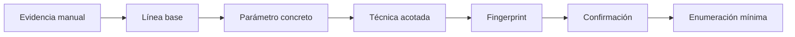

# Lección 07: Automatización con SQLMap

[Inicio](../../../README.md) | [Pentesting Web](../../README.md) | [Módulo SQLi](../README.md) | [Anterior: Explotación avanzada: Archivos, RCE y OOB](../06-explotacion-avanzada-archivos-rce-oob/README.md) | [Siguiente: Defensa y mitigaciones](../08-defensa-y-mitigaciones/README.md)

> [!CAUTION]
> SQLMap puede generar muchas peticiones y afectar al servicio o a sus datos. Debe utilizarse solo en laboratorios aislados o sistemas con autorización expresa, alcance definido y límites de carga acordados.

## Introducción

**SQLMap** es una herramienta que automatiza pruebas de inyección SQL. No sustituye el razonamiento manual: toma una petición conocida, modifica una entrada concreta, compara respuestas y aplica técnicas que antes deben entenderse de forma conceptual.

Una ejecución útil comienza con evidencia manual y termina con una conclusión verificable. Lanzar la herramienta sin conocer la petición, el parámetro o el comportamiento normal de la aplicación produce ruido y puede llevar a interpretar mal los resultados.



---

## 1. Automatizar el razonamiento previo

La automatización repite de forma sistemática el mismo modelo usado en una prueba manual:

1. Obtener una respuesta normal para usarla como referencia.
2. Cambiar una sola entrada controlable.
3. Observar diferencias de contenido, estado HTTP, errores o tiempo.
4. Probar una técnica compatible con ese comportamiento.
5. Repetir la comparación para reducir falsos positivos.

La **línea base** es la respuesta normal de la aplicación antes de introducir variantes. Incluye elementos como el código HTTP, el tamaño aproximado, el contenido estable y el tiempo habitual. Si la página cambia en cada petición por anuncios, marcas de tiempo o contenido personalizado, SQLMap necesita más muestras para distinguir esos cambios de una señal de inyección.

El **parámetro** es la entrada exacta que se va a evaluar, por ejemplo `id` en `/item?id=1`. Seleccionarlo evita probar sin necesidad cookies, cabeceras u otros campos fuera del alcance.

---

## 2. Definir la petición y el parámetro

Una URL permite describir casos sencillos:

```bash
sqlmap -u "https://app.example.com/item?id=1" -p id --level=1 --risk=1
```

`-u` indica la URL y `-p id` limita las pruebas al parámetro `id`. Empezar con los valores bajos de `--level` y `--risk` reduce el número y el impacto potencial de las comprobaciones.

Las solicitudes con método POST, JSON, cookies de sesión o cabeceras necesarias se representan mejor mediante una captura HTTP cruda. Un archivo `request.txt` puede contener:

```http
POST /api/item HTTP/1.1
Host: app.example.com
Content-Type: application/x-www-form-urlencoded
Connection: close

id=1&view=summary
```

SQLMap puede reutilizar la petición y evaluar solo `id`:

```bash
sqlmap -r request.txt -p id --level=1 --risk=1
```

La opción `-r` conserva el método, la ruta, las cabeceras y el cuerpo. Antes de usar una captura, deben retirarse tokens, cookies o datos que no sean necesarios para el laboratorio. Las sesiones también pueden caducar, por lo que una petición antigua no siempre representa el comportamiento actual.

---

## 3. Técnicas BEUSTQ

**BEUSTQ** es la forma abreviada con la que SQLMap identifica seis familias de pruebas. Cada letra representa una técnica, no una fase obligatoria:

| Letra | Técnica | Idea sencilla |
|---|---|---|
| **B** | Boolean-based blind | Compara respuestas ante condiciones verdaderas y falsas. |
| **E** | Error-based | Busca datos o señales devueltos dentro de errores del DBMS. |
| **U** | UNION query-based | Intenta combinar el resultado original con otra consulta mediante `UNION`. |
| **S** | Stacked queries | Comprueba si el contexto admite varias sentencias separadas. |
| **T** | Time-based blind | Usa retrasos controlados cuando la aplicación no muestra diferencias visibles. |
| **Q** | Inline queries | Prueba **inline queries**, consultas insertadas dentro de otra expresión SQL. |

No todas las técnicas funcionan en todos los gestores, drivers o puntos de inyección. La opción `--technique` permite indicar solo las familias justificadas por la evidencia previa. Por ejemplo, una aplicación que muestra errores y contenido podría evaluarse de forma acotada con:

```bash
sqlmap -r request.txt -p id --technique=BE --level=1 --risk=1
```

Priorizar técnicas observables y de bajo impacto evita comenzar con pruebas temporales, sentencias apiladas u otras variantes que el caso no necesita.

---

## 4. Alcance de `--level` y `--risk`

`--level` y `--risk` ajustan dimensiones distintas. No expresan por sí solos que una prueba sea segura ni garantizan una detección.

| Opción | Qué modifica | Criterio de uso |
|---|---|---|
| `--level=1..5` | Aumenta progresivamente las variantes de prueba y, en determinados niveles, las ubicaciones HTTP consideradas. | Empezar en `1` y subir solo si el alcance incluye esas entradas y la evidencia lo justifica. |
| `--risk=1..3` | Habilita grupos de pruebas con distinto potencial de carga o efectos no deseados según el contexto SQL. | Mantener `1` al inicio y elevarlo únicamente con autorización y revisión del comportamiento del endpoint. |

En versiones habituales, niveles superiores pueden incorporar pruebas sobre cookies y ciertas cabeceras, además de más variantes. Los riesgos superiores pueden incorporar pruebas temporales más costosas o expresiones que serían peligrosas si el parámetro terminara dentro de una operación de escritura. El efecto real depende de la consulta del backend, el DBMS y los datos tratados; por eso estos valores no deben interpretarse como una garantía absoluta.

`--technique` suele ser el control más claro para reducir el conjunto de familias probadas. Después se ajustan `--level` y `--risk` solo cuando hace falta ampliar la cobertura.

---

## 5. Fingerprint y confirmación

El **fingerprint** es la identificación razonada del gestor de base de datos y, cuando existe evidencia suficiente, de su versión o tecnología relacionada. SQLMap combina mensajes de error, sintaxis aceptada, funciones disponibles y comportamiento de las respuestas. Una cabecera del servidor web o una suposición previa no bastan para identificar el DBMS.

La **confirmación** exige una señal repetible y coherente con al menos una técnica. La salida de SQLMap debe revisarse para comprobar el parámetro, el tipo de inyección, la técnica y el DBMS inferido. Advertencias sobre contenido dinámico, tiempos inestables o respuestas bloqueadas reducen la confianza y requieren volver a la línea base.

Una comprobación limitada del contexto confirmado puede usar:

```bash
sqlmap -r request.txt -p id --technique=BE --fingerprint --current-db --current-user
```

`--fingerprint` solicita una identificación más detallada. `--current-db` y `--current-user` consultan el contexto de la conexión y sirven para comprobar que los resultados son consistentes con el alcance esperado.

---

## 6. Enumeración mínima

La **enumeración** obtiene información sobre la estructura del DBMS después de confirmar la vulnerabilidad. Debe aplicarse el principio de mínima información: consultar solo lo necesario para demostrar el hallazgo y explicar su impacto.

Una secuencia contenida consiste en identificar la base actual, conocer el usuario de conexión y, si el alcance lo permite, listar las tablas de esa base:

```bash
sqlmap -r request.txt -p id --current-db --current-user
sqlmap -r request.txt -p id -D app_db --tables
```

`app_db` es un marcador y debe sustituirse únicamente por el nombre confirmado dentro del laboratorio. El volcado de registros, la lectura o escritura de archivos y la obtención de una shell no forman parte de una validación mínima. Son capacidades de alto impacto que requieren una necesidad explícita, autorización adicional y controles específicos.

---

## 7. Límites, filtros y transformaciones

Un bloqueo por WAF no demuestra que el parámetro sea seguro, y tampoco justifica intentar evasiones de forma automática. Primero se revisan la línea base, el alcance, los límites de frecuencia y los registros defensivos.

Los *tamper scripts* transforman la representación de una prueba, pero pueden cambiar su significado o impedir que el backend la procese. Una transformación Base64 solo tiene sentido cuando la aplicación decodifica ese parámetro antes de construir la consulta; no es una evasión genérica. Para una introducción a SQLMap basta con reconocer estas capacidades como parte del alcance avanzado, no como el siguiente paso predeterminado.

---

## Cheatsheet

Referencia rápida del capítulo en formato PDF: [cheatsheet.pdf](./cheatsheet.pdf).

---

[Anterior: Explotación avanzada: Archivos, RCE y OOB](../06-explotacion-avanzada-archivos-rce-oob/README.md) | [Volver al índice del módulo](../README.md) | [Siguiente: Defensa y mitigaciones](../08-defensa-y-mitigaciones/README.md)
