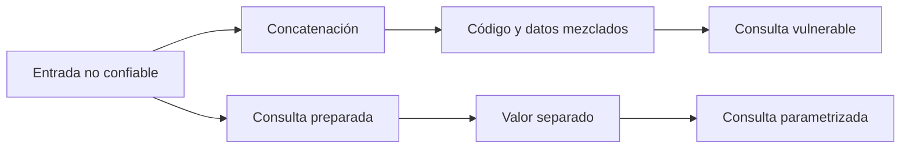

# Lección 08: Defensa y mitigaciones

[Inicio](../../../README.md) | [Pentesting Web](../../README.md) | [Módulo SQLi](../README.md) | [Anterior: Automatización con SQLMap](../07-automatizacion-sqlmap/README.md)

> [!CAUTION]
> Los cambios de código, permisos y configuración deben probarse en un entorno controlado antes de desplegarse. Una migración incorrecta puede interrumpir la aplicación o ampliar permisos de forma accidental.

## Introducción

La causa raíz de una inyección SQL es la mezcla de **código** y **datos** al construir una consulta. Si una entrada no confiable se concatena dentro del texto SQL, el gestor puede interpretar parte de esa entrada como sintaxis. La defensa principal consiste en mantener fija la estructura de la consulta y enviar los valores por separado.



Las consultas preparadas corrigen esta separación para los valores. La validación, las listas permitidas, los privilegios mínimos, el manejo seguro de errores y el hashing de contraseñas añaden capas que previenen usos incorrectos o reducen el impacto de un fallo.

---

## 1. Modelo vulnerable y modelo seguro

En el modelo vulnerable, el backend forma una única cadena con fragmentos SQL y datos externos:

```php
// Vulnerable: la entrada pasa a formar parte del texto SQL.
$id = $_GET['id'];
$sql = "SELECT username, email FROM users WHERE id = '$id'";
$result = $pdo->query($sql);
```

La comilla y otros caracteres de `$id` llegan al analizador SQL dentro de la misma cadena que contiene `SELECT` y `WHERE`. El gestor no conoce la intención original del programador; solo interpreta el texto final.

En el modelo seguro, el SQL contiene un marcador y el valor se vincula mediante la interfaz del driver:

```php
$sql = 'SELECT username, email FROM users WHERE id = :id';
$stmt = $pdo->prepare($sql);
$stmt->execute(['id' => $_GET['id']]);
$user = $stmt->fetch(PDO::FETCH_ASSOC);
```

El marcador `:id` representa un valor, no un fragmento de sintaxis. Comillas, operadores o comentarios presentes en la entrada se tratan como parte del dato y no cambian la estructura prevista de la consulta.

---

## 2. Consultas preparadas

Una **consulta preparada** o **consulta parametrizada** define por separado la plantilla SQL y sus valores. Dependiendo del lenguaje, el driver y el DBMS, la preparación puede ocurrir en el servidor, en el cliente o mediante una combinación de ambos.

La seguridad no depende de que el plan de ejecución quede inmóvil ni de que siempre se reutilice. Algunos gestores vuelven a optimizar planes y algunos drivers emulan la preparación. La propiedad importante es que la API parametrizada codifique y vincule cada valor según su posición, sin concatenarlo como sintaxis SQL.

### PDO

```php
$pdo = new PDO($dsn, $dbUser, $dbPassword, [
    PDO::ATTR_ERRMODE => PDO::ERRMODE_EXCEPTION,
    PDO::ATTR_EMULATE_PREPARES => false,
]);

$stmt = $pdo->prepare('SELECT username FROM users WHERE id = :id');
$stmt->execute(['id' => $_GET['id']]);
```

Desactivar `PDO::ATTR_EMULATE_PREPARES` solicita preparaciones nativas cuando el driver las admite y puede preferirse por compatibilidad o comportamiento de tipos. La emulación de PDO no equivale automáticamente a concatenación insegura: sigue siendo una API parametrizada, aunque sus detalles y limitaciones dependen del driver. La documentación del driver concreto es la referencia para elegir el modo.

### MySQLi

```php
$id = $validatedId;
$stmt = mysqli_prepare($conn, 'SELECT username FROM users WHERE id = ?');
mysqli_stmt_bind_param($stmt, 'i', $id);
mysqli_stmt_execute($stmt);
$result = mysqli_stmt_get_result($stmt);
```

`mysqli_stmt_bind_param` vincula el valor y declara su tipo. Esta vinculación no debe sustituirse por interpolación manual aunque la entrada ya haya sido validada.

---

## 3. Validación como complemento

La **validación** comprueba que un dato cumple las reglas de negocio, como formato, longitud, rango o conjunto de valores aceptados. Mejora la calidad de los datos y reduce entradas inesperadas, pero no sustituye las consultas preparadas.

Convertir una entrada con `(int)` puede ser apropiado para obtener un entero, pero por sí solo no es la defensa principal contra SQLi. Puede ocultar datos inválidos, cambiar su significado y no protege otros campos ni futuras modificaciones de la consulta. El valor debe validarse y, después, enviarse como parámetro:

```php
$id = filter_input(INPUT_GET, 'id', FILTER_VALIDATE_INT);

if ($id === false || $id === null || $id < 1) {
    throw new InvalidArgumentException('Identificador no válido');
}

$stmt = $pdo->prepare('SELECT username FROM users WHERE id = :id');
$stmt->execute(['id' => $id]);
```

---

## 4. Allowlist para identificadores

Los marcadores representan valores, pero normalmente no pueden ocupar el lugar de nombres de tablas, columnas, palabras clave ni direcciones de ordenación. Cuando uno de estos **identificadores SQL** debe variar, el backend lo selecciona desde una **allowlist** o lista cerrada controlada por la aplicación.

```php
$columns = [
    'name' => 'username',
    'date' => 'created_at',
];

$sortKey = $_GET['sort'] ?? 'name';
$sortColumn = $columns[$sortKey] ?? $columns['name'];

$directions = ['asc' => 'ASC', 'desc' => 'DESC'];
$directionKey = strtolower($_GET['direction'] ?? 'asc');
$direction = $directions[$directionKey] ?? 'ASC';

$sql = "SELECT id, username FROM users ORDER BY $sortColumn $direction";
$stmt = $pdo->query($sql);
```

La cadena final solo contiene identificadores elegidos por el servidor. Una expresión regular amplia o el escapado pensado para valores no ofrecen la misma garantía para esta parte de la gramática SQL.

---

## 5. Menor privilegio

El **principio de menor privilegio** concede a la cuenta de la aplicación únicamente las operaciones y objetos que necesita. No elimina la inyección, pero limita lo que una vulnerabilidad puede alcanzar.

Una aplicación de lectura no debería conectarse como administrador ni disponer de `FILE`, `CREATE`, `ALTER` o `DROP`. Si distintos componentes tienen funciones diferentes, pueden utilizar cuentas separadas, por ejemplo una de consulta y otra de escritura limitada.

```sql
CREATE USER 'app_reader'@'localhost'
    IDENTIFIED BY '<SECRETO_GESTIONADO_EXTERNAMENTE>';

GRANT SELECT ON app_db.* TO 'app_reader'@'localhost';
```

El marcador representa un secreto generado y almacenado fuera del código y de la documentación. Los permisos deben revisarse periódicamente y revocarse cuando dejan de ser necesarios.

---

## 6. Errores y registros

Los detalles internos del DBMS no deben devolverse al cliente. La aplicación presenta un mensaje genérico y conserva el diagnóstico en registros protegidos:

```php
$requestId = bin2hex(random_bytes(8));

try {
    $stmt->execute(['id' => $id]);
} catch (PDOException $exception) {
    error_log('Database query failed; request_id=' . $requestId);
    http_response_code(500);
    echo 'No se pudo procesar la solicitud.';
}
```

Ocultar errores reduce la información disponible para una técnica basada en errores, pero no corrige la consulta vulnerable. Los registros deben incluir contexto útil, como un identificador de petición y la operación afectada, sin guardar contraseñas, cadenas de conexión, tokens ni entradas sensibles completas. El acceso, la retención y las alertas sobre errores repetidos también forman parte del control.

---

## 7. Hashing de contraseñas y reducción de impacto

El **hashing de contraseñas** no evita SQLi. Reduce el impacto si una vulnerabilidad permite acceder a la tabla de usuarios, porque la base no contiene la contraseña original.

Las contraseñas se almacenan con funciones adaptativas diseñadas para este fin, como Argon2id o bcrypt, usando las API mantenidas por el lenguaje. No deben usarse texto claro ni hashes rápidos generales como MD5, SHA-1 o SHA-256.

```php
$passwordHash = password_hash($password, PASSWORD_ARGON2ID);

if (password_verify($submittedPassword, $storedPasswordHash)) {
    // Continuar con el proceso de autenticación.
}
```

Las API de contraseñas generan y almacenan la sal dentro del formato del hash. El coste debe ajustarse al entorno y revisarse con el tiempo. Esta medida se combina con consultas parametrizadas, acceso mínimo a la tabla y protección de los registros.

---

## 8. Defensa en profundidad

Las capas defensivas cumplen funciones diferentes:

| Control | Función principal |
|---|---|
| Consultas preparadas | Evitar que los valores se interpreten como sintaxis SQL. |
| Validación | Aplicar formato, rango y reglas de negocio. |
| Allowlist de identificadores | Elegir de forma segura las partes SQL que no admiten parámetros. |
| Menor privilegio | Limitar datos y operaciones accesibles tras un fallo. |
| Errores genéricos y logs protegidos | Reducir fugas y facilitar detección e investigación. |
| Hashing adaptativo | Reducir el impacto del acceso a hashes de contraseñas. |

Ninguna cabecera HTTP corrige la separación entre código y datos en SQL. Controles como CSP o HSTS pueden ser útiles para otros riesgos web, pero pertenecen al hardening general y no son mitigaciones de SQLi.

---

## Cheatsheet

Referencia rápida del capítulo en formato PDF: [cheatsheet.pdf](./cheatsheet.pdf).

---

[Anterior: Automatización con SQLMap](../07-automatizacion-sqlmap/README.md) | [Volver al índice del módulo](../README.md)
