# Capítulo 02: Inyecciones SQL (SQL Injection)

[Inicio](../../README.md) | [Pentesting Web](../README.md) | [Anterior: Fundamentos web y HTTP](../01-fundamentos-web-y-http/README.md) | [Siguiente: Cross-Site Scripting (XSS)](../03-cross-site-scripting-xss/README.md) | [Laboratorio](./lab/)

> [!CAUTION]
> Las técnicas de auditoría, manipulación y explotación de inyecciones SQL deben ejecutarse exclusivamente en entornos de laboratorio controlados o sistemas bajo autorización expresa y por escrito.

## Introducción

Las **inyecciones SQL** (clasificadas internacionalmente como **CWE-89**) representan una de las familias de vulnerabilidades más críticas y de mayor impacto en la seguridad de aplicaciones web. Se producen cuando una aplicación interpola datos no confiables suministrados por el usuario directamente en una sentencia SQL, provocando una **confusión de contexto** en el motor de base de datos entre las instrucciones del desarrollador y los datos del cliente.

Este capítulo unifica todo el conocimiento teórico y práctico necesario para comprender, auditar, explotar y mitigar inyecciones SQL con rigor profesional: desde la arquitectura de almacenamiento relacional y la rotura sintáctica en el analizador léxico, pasando por técnicas en banda (`UNION` y basadas en error), inferencia a ciegas (booleana y temporal), interacción avanzada con el sistema operativo (lectura/escritura de archivos, RCE y canales fuera de banda DNS), hasta la automatización con SQLMap y la ingeniería defensiva definitiva con consultas preparadas parametrizadas.

```mermaid
flowchart LR
    A["1. Bases de Datos y SQL"] --> B["2. Subversión de Lógica"]
    B --> C["3. UNION SQLi y Burp"]
    C --> D["4. Inyecciones por Error"]
    D --> E["5. Inyecciones Ciegas"]
    E --> F["6. Archivos, RCE y OOB"]
    F --> G["7. Automatización SQLMap"]
    G --> H["8. Defensa y Mitigaciones"]
```

---

## Índice de lecciones

El contenido de este capítulo se estructura en ocho lecciones progresivas e interconectadas:

| # | Lección | Descripción técnica | Práctica / Lab | Estado |
|---|---|---|---|---|
| **01** | [**Bases de datos relacionales y fundamentos de SQL**](./01-fundamentos-sql/README.md) | Arquitectura de MariaDB/MySQL, administración interactiva, sintaxis DDL/DML, evaluación lógica con `WHERE`, operador `UNION` y exploración del catálogo `information_schema`. | Exploración interactiva en terminal | **Disponible** |
| **02** | [**Inyecciones SQL y subversión de lógica**](./02-subversion-logica/README.md) | Causa raíz de CWE-89, confusión de contexto, comportamiento del lexer y parser ante la comilla simple (`'`), tautologías booleanas, delimitadores de comentarios por motor y bypass de autenticación. | [Laboratorio vulnerable PHP/MariaDB](./lab/) | **Disponible** |
| **03** | [**UNION SQL injection y Burp Suite**](./03-union-sqli-y-burp-suite/README.md) | Metodología de 5 fases para inyecciones basadas en `UNION`, reflejo de columnas, volcado ordenado de `information_schema` y operativa profesional con Burp Suite (Proxy, Repeater, Intruder). | PortSwigger Web Security Academy | **Disponible** |
| **04** | [**Inyecciones SQL basadas en error**](./04-error-based-sqli/README.md) | Provocación de excepciones técnicas, conversiones forzadas de tipo (`CAST`/`CONVERT` en MSSQL y PostgreSQL), funciones XML (`extractvalue`/`updatexml` en MySQL) y manejo de límites de buffer. | Entornos con verbose SQL errors | **Disponible** |
| **05** | [**Inyecciones SQL a ciegas (Boolean y Time-based)**](./05-blind-sqli/README.md) | Diseño de oráculos binarios, inferencia booleana condicional, optimización algorítmica con búsqueda binaria (bisección) y bitwise ANDing (`SQL-Anding`), e inferencia temporal (`SLEEP`, `WAITFOR DELAY`, `pg_sleep`). | Scripting de oráculos en Python | **Disponible** |
| **06** | [**Explotación avanzada: Archivos, RCE y OOB**](./06-explotacion-avanzada-archivos-rce-oob/README.md) | Lectura y escritura en el sistema de archivos (`LOAD_FILE`, `INTO OUTFILE`, `COPY`), ejecución remota de comandos con `xp_cmdshell` y UDF, robo de hashes NetNTLM y exfiltración fuera de banda vía DNS. | Captura SMB y Burp Collaborator | **Disponible** |
| **07** | [**Automatización profesional con SQLMap**](./07-automatizacion-sqlmap/README.md) | Motor de técnicas BEUSTQ, ingesta de peticiones Burp (`-r`), calibración de `--level` y `--risk`, evasión de WAF con Tamper Scripts y obtención de shells interactivas (`--os-shell`). | Laboratorios de automatización | **Disponible** |
| **08** | [**Ingeniería defensiva y mitigaciones**](./08-defensa-y-mitigaciones/README.md) | Implementación de consultas preparadas en PDO y MySQLi, listas blancas estrictas para identificadores dinámicos, type casting, principio de menor privilegio en BD y hardening del motor. | Análisis y refactorización defensiva | **Disponible** |

---

## Laboratorio práctico del capítulo

El capítulo incluye un entorno reproducible local para practicar la detección, validación y explotación controlada de inyecciones SQL en un servidor MariaDB con backend PHP:

👉 [Guía técnica del laboratorio de SQL Injection](./lab/README.md)

- **Instalación y despliegue:** Scripts [`setup.sql`](./lab/setup.sql) y aplicación de búsqueda [`searchusers.php`](./lab/searchusers.php).
- **Objetivos prácticos:** Observar la rotura del analizador léxico, comprobar bypasses de autenticación, verificar inyecciones basadas en UNION y analizar el comportamiento defensivo con consultas parametrizadas.

---

## Cheatsheet

Referencia rápida del capítulo en formato PDF: [cheatsheet.pdf](./cheatsheet.pdf).

---

[Anterior: Fundamentos web y HTTP](../01-fundamentos-web-y-http/README.md) | [Volver al índice de la ruta](../README.md) | [Siguiente: Cross-Site Scripting (XSS)](../03-cross-site-scripting-xss/README.md)
