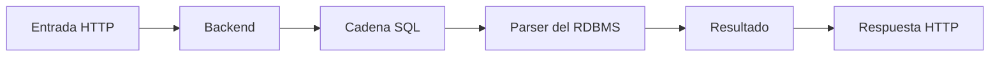
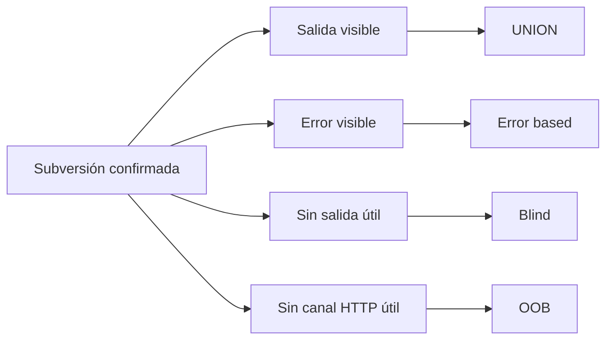

# Capítulo 02: Inyecciones SQL

[Inicio](../../README.md) | [Pentesting Web](../README.md) | [Anterior: Fundamentos web y HTTP](../01-fundamentos-web-y-http/README.md) | [Laboratorio](./lab/README.md)

> [!CAUTION]
> Las técnicas de inyección SQL deben utilizarse exclusivamente en laboratorios aislados o sistemas para los que exista autorización expresa y por escrito.

## Introducción

Una **inyección SQL** es una vulnerabilidad en la que una entrada no confiable deja de tratarse solo como dato y pasa a modificar una consulta SQL. La ruta estudia el problema desde la petición HTTP hasta la respuesta de la aplicación, sin depender de cargas útiles memorizadas.

---

## 1. Mapa de las ocho lecciones

Las lecciones forman una secuencia: primero presentan los datos relacionales y la lógica de una consulta; después explican cómo una entrada altera esa lógica; por último seleccionan técnicas según el canal observable y cierran con automatización y defensa.

| # | Lección | Función dentro de la ruta | Duración | Nivel | Práctica / Lab | Estado |
|---|---|---|---:|---|---|---|
| **01** | [**Bases de datos relacionales y fundamentos de SQL**](./01-fundamentos-sql/README.md) | Establece tablas, filas, columnas, consultas, literales, filtros y evaluación lógica. | 75 min | Inicial | Consultas locales | **Disponible** |
| **02** | [**Inyecciones SQL y subversión de lógica**](./02-subversion-logica/README.md) | Conecta la entrada HTTP con la cadena SQL y explica cierre de literales, comentarios y cambio de condiciones. | 75 min | Inicial | [PHP y MariaDB](./lab/README.md) | **Disponible** |
| **03** | [**UNION SQL injection y Burp Suite**](./03-union-sqli-y-burp-suite/README.md) | Aprovecha una salida visible para combinar filas controladas con el resultado original. | 90 min | Intermedio | PortSwigger y Burp Suite | **Disponible** |
| **04** | [**Inyecciones SQL basadas en error**](./04-error-based-sqli/README.md) | Utiliza errores visibles del motor como canal para obtener información. | 75 min | Intermedio | Respuestas con errores SQL | **Disponible** |
| **05** | [**Inyecciones SQL a ciegas**](./05-blind-sqli/README.md) | Infiere datos cuando la aplicación no muestra filas ni errores útiles, mediante diferencias booleanas o temporales. | 105 min | Intermedio | Oráculos y scripts locales | **Disponible** |
| **06** | [**Explotación avanzada: archivos, RCE y OOB**](./06-explotacion-avanzada-archivos-rce-oob/README.md) | Estudia capacidades dependientes de privilegios y canales fuera de banda cuando la respuesta HTTP no sirve para recuperar datos. | 105 min | Avanzado | Entorno aislado y colaborador OOB | **Disponible** |
| **07** | [**Automatización profesional con SQLMap**](./07-automatizacion-sqlmap/README.md) | Automatiza una hipótesis ya comprendida y controla alcance, técnica y ruido. | 90 min | Intermedio | SQLMap contra laboratorio | **Disponible** |
| **08** | [**Ingeniería defensiva y mitigaciones**](./08-defensa-y-mitigaciones/README.md) | Separa instrucciones y datos con parámetros, valida partes no parametrizables y reduce impacto mediante privilegios. | 90 min | Inicial - Intermedio | Refactorización defensiva | **Disponible** |

---

## 2. Puente entre señales y técnicas

Una **señal** es una diferencia observable causada por la consulta, como datos mostrados, un error, un cambio de contenido o un retraso. La señal disponible determina qué lección continúa el análisis: salida visible conduce a `UNION`; error visible, a técnicas basadas en error; ausencia de salida útil, a inferencia ciega; y ausencia de un canal HTTP utilizable, a un canal **fuera de banda** u **OOB**, que provoca una interacción por otra vía, como DNS. La automatización viene después de identificar el comportamiento, y la defensa corrige la causa raíz.

Las ramas no son garantías de explotación. La estructura de la consulta, el motor, el tratamiento de errores, el código que consume las filas y los privilegios de la cuenta de base de datos pueden hacer que una técnica no sea aplicable.

---

## 3. Entorno compartido

El [laboratorio local de PHP y MariaDB](./lab/README.md) conserva el mismo recorrido que la teoría: una petición a `127.0.0.1` llega al backend, el backend ensambla una consulta vulnerable, MariaDB la procesa y PHP transforma el resultado en una respuesta HTTP. Las lecciones posteriores amplían ese modelo sin cambiar su causa raíz.

La ruta debe estudiarse en orden. Las lecciones 01 y 02 proporcionan el lenguaje necesario para interpretar las señales; las lecciones 03 a 06 desarrollan canales de observación; la 07 automatiza comprobaciones entendidas; y la 08 elimina la confusión entre datos e instrucciones.

---

## Cheatsheet

Referencia rápida del capítulo en formato PDF: [cheatsheet.pdf](./cheatsheet.pdf).

---

[Anterior: Fundamentos web y HTTP](../01-fundamentos-web-y-http/README.md) | [Volver al índice de la ruta](../README.md)
