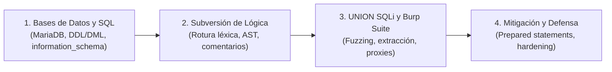

# Capítulo 02: Inyecciones SQL (SQL Injection)

[Inicio](../../README.md) | [Pentesting Web](../README.md) | [Anterior: Fundamentos web y HTTP](../01-fundamentos-web-y-http/README.md) | [Laboratorio](./lab/)

> [!CAUTION]
> Las técnicas de auditoría y explotación de inyecciones SQL deben ejecutarse exclusivamente en entornos de laboratorio controlados o sistemas bajo autorización expresa y por escrito.

## Introducción

Las **inyecciones SQL** (clasificadas internacionalmente como **CWE-89**) representan una de las clases de vulnerabilidades más críticas en la historia de la seguridad web. Se producen cuando una aplicación web interpola datos no confiables suministrados por el usuario directamente en una sentencia SQL, provocando una **confusión de contexto** en el motor de base de datos entre los comandos del desarrollador y los datos del cliente.

Este capítulo unifica todo el conocimiento teórico y práctico necesario para comprender, detectar, validar y remediar inyecciones SQL de forma integral: desde la arquitectura de almacenamiento en bases de datos relacionales hasta la extracción masiva mediante operadores de conjunto y la ingeniería de remediación definitiva con consultas preparadas.

---

## Índice de lecciones

El contenido de este capítulo se estructura en cuatro lecciones progresivas e interconectadas:

| # | Lección | Descripción técnica | Duración | Práctica / Lab | Estado |
|---|---|---|---|---|---|
| **01** | [**Bases de datos relacionales y fundamentos de SQL**](./01-fundamentos-sql/README.md) | Arquitectura de MariaDB/MySQL, administración interactiva, sintaxis DDL/DML, evaluación lógica con `WHERE`, operador `UNION` y exploración del catálogo `information_schema`. | 3 - 4 h | Exploración interactiva en terminal | **Disponible** |
| **02** | [**Inyecciones SQL y subversión de lógica**](./02-subversion-logica/README.md) | Causa raíz de CWE-89, confusión de contexto, comportamiento del lexer y parser ante la comilla simple (`'`), tautologías booleanas, delimitadores de comentarios por motor y manipulación de filtros. | 3 - 4 h | [Laboratorio vulnerable PHP/MariaDB](./lab/) | **Disponible** |
| **03** | [**UNION SQL injection y Burp Suite**](./03-union-sqli-y-burp-suite/README.md) | Metodología de 5 fases para inyecciones basadas en `UNION`, reflejo de columnas, volcado ordenado de `information_schema` y operativa profesional con Burp Suite (Proxy, Repeater, Intruder). | 4 - 5 h | PortSwigger Web Security Academy | **Disponible** |
| **04** | [**Ingeniería defensiva y mitigaciones**](./04-defensa-y-mitigaciones/README.md) | Implementación de consultas preparadas en PDO y MySQLi, listas blancas estrictas para identificadores dinámicos, type casting, principio de menor privilegio en BD y hashing seguro con Argon2id. | 3 - 4 h | Análisis y refactorización defensiva | **Disponible** |

---

## Laboratorio práctico del capítulo

El capítulo incluye un entorno reproducible local para practicar la detección y validación de inyecciones SQL en un servidor MariaDB con backend PHP:

👉 [Guía técnica del laboratorio de SQL Injection](./lab/README.md)

- **Instalación y despliegue:** Scripts [`setup.sql`](./lab/setup.sql) y aplicación de búsqueda [`searchusers.php`](./lab/searchusers.php).
- **Objetivos prácticos:** Observar la rotura del analizador léxico, comprobar bypasses de autenticación y validar la exfiltración de registros.

---

## Cheatsheet

Referencia rápida del capítulo en formato PDF: [cheatsheet.pdf](./cheatsheet.pdf).

---

[Anterior: Fundamentos web y HTTP](../01-fundamentos-web-y-http/README.md) | [Volver al índice de la ruta](../README.md)
