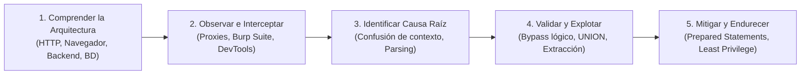
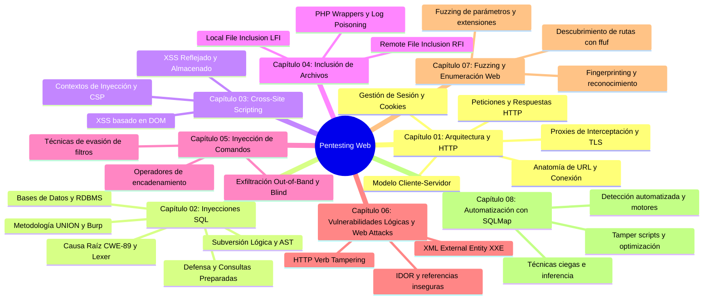

# Pentesting Web: Guía Práctica e Integral de Seguridad Web

[Inicio](../README.md) | [Configurar laboratorio](../setup/README.md)

Un recurso técnico, abierto y estructurado como libro de aprendizaje para comprender la arquitectura de las aplicaciones web, dominar el análisis e interceptación de tráfico HTTP, auditar vulnerabilidades críticas desde la raíz y aplicar ingeniería defensiva en entornos controlados.

> [!CAUTION]
> **Alcance y Ética**: El material, código y laboratorios publicados en este recurso tienen un propósito estrictamente educativo y de investigación defensiva. Las técnicas aquí expuestas deben practicarse exclusivamente en máquinas virtuales locales aisladas o sistemas para los que cuentes con autorización expresa por escrito. El autor no se responsabiliza del uso indebido de esta información.

---

## Prólogo y Filosofía de Aprendizaje

Para evaluar la seguridad de una aplicación web de forma profesional, no basta con ejecutar herramientas automáticas ni memorizar listas de *payloads*. La verdadera maestría en pentesting web requiere **comprender con rigor cómo interactúan los protocolos de red, los servidores web, los lenguajes de backend y los motores de bases de datos**.

Este libro digital se estructura bajo la metodología:



---

## Roadmap de Estudio



---

## Tabla de Contenidos (Índice de Capítulos)

| # | Capítulo | Descripción técnica | Duración | Nivel | Práctica / Lab | Estado |
|---|---|---|---|---|---|---|
| **01** | [**Fundamentos Web y HTTP**](./01-fundamentos-web-y-http/README.md) | Modelo cliente-servidor, fronteras de confianza, anatomía de URL, ciclo de vida TCP/TLS/HTTP, métodos, cabeceras y cookies. | 3 - 4 h | Inicial | [Laboratorio HTTP local](./01-fundamentos-web-y-http/lab/) | **Disponible** |
| **02** | [**Inyecciones SQL (SQL Injection)**](./02-sql-injection/README.md) | Arquitectura RDBMS, rotura léxica, subversión booleana, metodología UNION, operativa con Burp Suite y remediación definitiva con consultas preparadas. | 12 - 16 h | Inicial - Intermedio | [Laboratorio SQLi local](./02-sql-injection/lab/) | **Disponible** |
| **03** | [**Cross-Site Scripting (XSS)**](./03-cross-site-scripting-xss/README.md) | Tipología XSS (reflejado, almacenado y basado en DOM), contextos de inyección HTML/JS, evasión de filtros y defensas mediante CSP y sanitización. | 4 - 5 h | Intermedio | Laboratorios guiados de XSS | *Planificado* |
| **04** | [**Inclusión de Archivos (LFI y RFI)**](./04-inclusion-de-archivos-lfi-rfi/README.md) | Vectores LFI y RFI, PHP Wrappers (`php://filter`, `data://`), bypass de extensiones, envenenamiento de logs y escalada a ejecución de código. | 4 - 5 h | Intermedio | Entornos controlados LFI/RFI | *Planificado* |
| **05** | [**Inyección de Comandos del Sistema Operativo**](./05-inyeccion-de-comandos/README.md) | Operadores de control de flujo, inyección ciega, exfiltración out-of-band (DNS/HTTP) y técnicas de evasión de listas negras y caracteres especiales. | 3 - 4 h | Intermedio | Desafíos de Command Injection | *Planificado* |
| **06** | [**Vulnerabilidades Lógicas y Web Attacks**](./06-vulnerabilidades-logicas-y-web-attacks/README.md) | Insecure Direct Object References (IDOR), inyección de entidades externas XML (XXE) y manipulación de verbos HTTP (*Verb Tampering*). | 4 - 5 h | Intermedio - Avanzado | Retos de ataques lógicos y APIs | *Planificado* |
| **07** | [**Fuzzing y Enumeración Web**](./07-fuzzing-y-enumeracion-web/README.md) | Enumeración pasiva y activa de aplicaciones, descubrimiento de rutas, archivos y parámetros con `ffuf`, filtrado de respuestas y wordlists. | 4 - 5 h | Inicial - Intermedio | Laboratorios de fuzzing con ffuf | *Planificado* |
| **08** | [**Automatización y Explotación con SQLMap**](./08-automatizacion-y-herramientas-especializadas/README.md) | Metodología de análisis automatizado con `sqlmap`, técnicas ciegas (time/boolean), evasión con tamper scripts y extracción masiva. | 3 - 4 h | Intermedio | Prácticas con SQLMap Essentials | *Planificado* |

---

## Organización del Capítulo 01

El primer capítulo sigue una única lección progresiva para que los fundamentos queden visibles y se puedan practicar de principio a fin:

```text
01-fundamentos-web-y-http/
|-- README.md          # Lección teórica, diagramas Mermaid y Cheatsheet
`-- lab/
    |-- README.md       # Pasos, resultados y evidencias
    `-- app.php         # Aplicación PHP local de demostración
```

Empieza por la [lección](./01-fundamentos-web-y-http/README.md) y ejecuta el [laboratorio](./01-fundamentos-web-y-http/lab/) cuando llegues a la práctica.

---

## Matriz de Cobertura de Estándares

| Estándar | Identificador | Nombre | Capítulo cubierto |
|---|---|---|---|
| **OWASP Top 10** | A01:2021 | Broken Access Control (Control de Acceso Roto) | [Capítulo 01](./01-fundamentos-web-y-http/README.md), [Capítulo 02](./02-sql-injection/README.md), [Capítulo 06](./06-vulnerabilidades-logicas-y-web-attacks/README.md) |
| **OWASP Top 10** | A03:2021 | Injection (Inyecciones) | [Capítulo 02](./02-sql-injection/README.md), [Capítulo 03](./03-cross-site-scripting-xss/README.md), [Capítulo 04](./04-inclusion-de-archivos-lfi-rfi/README.md), [Capítulo 05](./05-inyeccion-de-comandos/README.md), [Capítulo 08](./08-automatizacion-y-herramientas-especializadas/README.md) |
| **OWASP Top 10** | A07:2021 | Identification and Authentication Failures | [Capítulo 01](./01-fundamentos-web-y-http/README.md), [Capítulo 02](./02-sql-injection/README.md) |
| **CWE** | CWE-89 | Improper Neutralization of Special Elements used in an SQL Command ('SQL Injection') | [Capítulo 02](./02-sql-injection/README.md), [Capítulo 08](./08-automatizacion-y-herramientas-especializadas/README.md) |
| **CWE** | CWE-79 | Improper Neutralization of Input During Web Page Generation ('Cross-site Scripting') | [Capítulo 03](./03-cross-site-scripting-xss/README.md) |
| **CWE** | CWE-78 | Improper Neutralization of Special Elements used in an OS Command ('OS Command Injection') | [Capítulo 05](./05-inyeccion-de-comandos/README.md) |
| **CWE** | CWE-98 | Improper Control of Generation of Code ('PHP Remote File Inclusion') | [Capítulo 04](./04-inclusion-de-archivos-lfi-rfi/README.md) |
| **CWE** | CWE-639 | Authorization Bypass Through User-Controlled Key ('IDOR') | [Capítulo 06](./06-vulnerabilidades-logicas-y-web-attacks/README.md) |
| **CWE** | CWE-611 | Improper Restriction of XML External Entity Reference ('XXE') | [Capítulo 06](./06-vulnerabilidades-logicas-y-web-attacks/README.md) |
| **CWE** | CWE-602 | Client-Side Enforcement of Server-Side Security | [Capítulo 01](./01-fundamentos-web-y-http/README.md) |
| **CWE** | CWE-614 | Sensitive Cookie in HTTPS Session Without 'Secure' Attribute | [Capítulo 01](./01-fundamentos-web-y-http/README.md) |
| **CWE** | CWE-1004 | Sensitive Cookie Without 'HttpOnly' Flag | [Capítulo 01](./01-fundamentos-web-y-http/README.md) |
| **CWE** | CWE-250 | Execution with Unnecessary Privileges | [Capítulo 02](./02-sql-injection/README.md) |

---

## Preparación del Entorno de Prácticas

Para ejecutar los laboratorios prácticos de este recurso:
1. Revisa la [Guía de Configuración del Laboratorio](../setup/README.md).
2. Utiliza una máquina virtual Debian, Ubuntu o Kali Linux configurada en una red aislada (*Host-Only*).
3. Asegúrate de tener instalados los servicios esenciales:
   ```bash
   sudo apt update
   sudo apt install -y apache2 mariadb-server php php-mysql curl ffuf
   ```
4. Para la interceptación y resolución de laboratorios avanzados, descarga [Burp Suite Community Edition](https://portswigger.net/burp/communitydownload).

---

## Cómo Progresar

1. Estudia los capítulos en orden secuencial comenzando por el [Capítulo 01](./01-fundamentos-web-y-http/README.md).
2. Lee con atención la teoría, analiza los diagramas de arquitectura y consulta la Cheatsheet de referencia al final de cada lección.
3. Monta el laboratorio local de [Inyecciones SQL](./02-sql-injection/lab/README.md) y reproduce manualmente cada una de las pruebas descritas.
4. Conecta con los retos guiados de Web Security Academy en la [Lección 03 de SQLi](./02-sql-injection/03-union-sqli-y-burp-suite/README.md).

[Volver al Catálogo Principal del Repositorio](../README.md)
