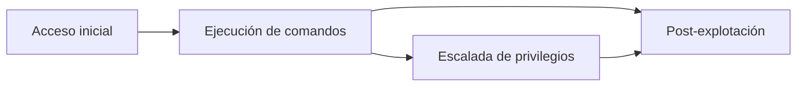
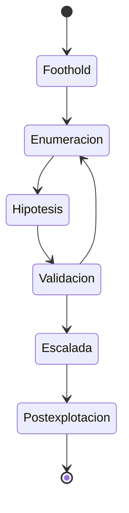

# Capítulo 01: De acceso inicial a post-explotación

[Inicio](../../README.md) | [Privilege Escalation](../README.md) | [Siguiente: Enumeración local del sistema](../02-enumeracion-local/README.md)

> [!CAUTION]
> Todo el material de esta ruta se practica exclusivamente en máquinas virtuales propias y aisladas o en sistemas con autorización expresa y por escrito. Escalar privilegios sin autorización es un delito y este capítulo no enseña a hacerlo fuera de un laboratorio controlado.

## Introducción

Obtener acceso a un sistema y controlarlo son dos cosas distintas. Un **acceso inicial** puede ser una credencial válida, una sesión web autenticada o la ejecución de un servicio remoto; en todos los casos representa un punto de entrada, no el dominio de la máquina. Entre el primer contacto y el control administrativo existe un trabajo de análisis que separa lo que el sistema permite hacer de lo que el atacante cree poder hacer.

La distinción central de este capítulo es la diferencia entre **ejecución de comandos** y **identidad privilegiada**. Ejecutar comandos significa que el sistema interpreta instrucciones bajo una cuenta concreta; obtener una identidad privilegiada significa que esas instrucciones se evalúan con permisos muy superiores, típicamente los de `root`. Un *foothold* puede ofrecer lo primero sin ofrecer lo segundo, y confundir ambos estados lleva a conclusiones falsas y a acciones destructivas sobre el sistema.

Este capítulo no enseña una técnica de explotación concreta: modela el terreno. Define qué es el privilegio en Linux, qué factores externos al usuario lo condicionan, qué puede y qué no puede hacer un punto de apoyo inicial, y por qué la enumeración es el puente obligatorio hacia cualquier escalada real. Las superficies de escalada específicas se abordan en los capítulos posteriores.

---

## 1. Los cuatro momentos de una intrusión

Toda operación ofensiva sobre un sistema Linux puede describirse como una secuencia de cuatro momentos, aunque no todos ocurran siempre ni en el mismo orden.

- El **acceso inicial** es la entrada: una credencial reutilizada, una vulnerabilidad en un servicio expuesto o una sesión ya abierta. Por sí solo no garantiza ninguna capacidad de ejecución.
- La **ejecución de comandos** convierte ese acceso en la posibilidad de que el sistema procese instrucciones bajo una identidad. Es el primer estado realmente útil, porque permite observar el entorno desde dentro.
- La **escalada de privilegios** amplía los permisos de esa identidad hasta una cuenta de mayor autoridad, normalmente `root`. Se apoya en una configuración insegura, no en adivinar contraseñas.
- La **post-explotación** es el uso de los nuevos privilegios: leer secretos, modificar el sistema, instalar persistencia, acceder a otros recursos o borrar huellas.



La escalada no es un requisito absoluto para la post-explotación: con un *foothold* sin privilegios ya pueden leerse archivos accesibles, descubrir la red interna o recolectar información del entorno. Sin embargo, sin escalada el alcance queda limitado a lo que esa cuenta concreta puede ver. La escalada cambia la naturaleza del compromiso: la cuenta deja de ser un inquilino y pasa a controlar el sistema.

---

## 2. Qué es el privilegio en Linux

En Linux, el privilegio se expresa principalmente a través de **identificadores de usuario** (UID) e **identificadores de grupo** (GID). Cada proceso en ejecución arrastra varios, y no todos se usan para lo mismo.

- El **UID real** (*real UID*) identifica al usuario que lanzó el proceso. Determina la propiedad de los archivos nuevos y a quién pertenece el proceso a efectos de señales.
- El **UID efectivo** (*effective UID*) es el que el kernel consulta al comprobar permisos sobre archivos, al aplicar límites y al evaluar capacidades. Es el privilegio que realmente cuenta.
- El **UID guardado** (*saved set-user-ID*) es una copia del UID efectivo que permite a un proceso con privilegios renunciar temporalmente a ellos y recuperarlos después.
- El **GID real**, el **GID efectivo** y los **grupos suplementarios** funcionan de forma análoga para los permisos de grupo.

En un proceso normal, los tres UID coinciden y el sistema concede exactamente los permisos de la cuenta. Esa igualdad se rompe en el mecanismo `setuid`: cuando un binario tiene activado el bit **SUID**, el kernel asigna a su UID efectivo el del propietario del archivo durante la ejecución. Si el propietario es `root` (UID 0), el programa se ejecuta con privilegios administrativos independientemente de quién lo invoque. El binario `/usr/bin/passwd` es el ejemplo clásico: cualquier usuario puede ejecutarlo y su UID efectivo pasa a 0, lo justo para modificar su propia entrada en `/etc/shadow`.

| Identificador | Uso principal | Efecto de SUID |
|---|---|---|
| UID real | Propiedad del proceso y contabilidad. | No. |
| UID efectivo | Comprobación de permisos y capacidades. | Sí, pasa a ser el del propietario. |
| UID guardado | Permite recuperar el privilegio tras renunciar a él. | Sí, guarda el valor elevado. |
| GID real / efectivo | Permisos de grupo. | Solo con el bit SGID. |

**`root` es simplemente el UID 0.** El nombre es una convención; lo que importa es el número. Cualquier proceso con UID efectivo 0 salta las comprobaciones de permisos convencionales, porque el kernel le concede la capacidad `CAP_DAC_OVERRIDE` entre muchas otras. Por eso los identificadores importan más que el nombre de la cuenta.

El modelo tradicional es todo o nada: o se es el UID 0, o no se es. Las **capabilities** fragmentan ese privilegio en unidades concretas y permiten conceder permisos acotados sin entregar `root` entero. `CAP_NET_ADMIN` permite administrar la red; `CAP_DAC_READ_SEARCH` permite leer archivos sin respetar sus permisos; `CAP_SYS_ADMIN` concentra una autoridad enorme. Un binario o proceso puede recibir una capability determinada en lugar del bit SUID, lo que reduce el impacto de un abuso, pero también crea superficies nuevas que se estudian en el capítulo 05.

```bash
$ id
uid=1000(student) gid=1000(student) groups=1000(student)
$ id -ru
1000
$ id -u
1000
```

En una shell normal ambos valores coinciden porque no hay SUID en juego. La diferencia solo se observa al ejecutar un binario con el bit `s` activado o al inspeccionar el estado interno de un proceso privilegiado.

---

## 3. El contexto no es solo el usuario

El UID efectivo explica buena parte del privilegio, pero no todo. Un mismo usuario con los mismos UID puede disponer de capacidades muy distintas según dónde y cómo se ejecute. Varias capas externas al usuario recortan o amplían lo que un proceso puede hacer.

- Los **contenedores** aíslan el sistema de archivos, la red, los procesos y los espacios de nombres (*namespaces*). Dentro de un contenedor, ser `root` puede no equivaler a ser `root` en el anfitrión, porque el kernel aplica límites adicionales.
- **AppArmor** y **SELinux** implementan control de acceso obligatorio (**MAC**). Aunque un proceso tenga UID 0, un perfil de AppArmor o un contexto de SELinux puede negarle operaciones que el modelo tradicional de permisos permitiría.
- El atributo **`no_new_privs`** impide que un proceso y sus descendientes adquieran privilegios nuevos mediante `setuid` o capacidades de archivo. Es habitual en servicios endurecidos y en algunos gestores de contenedores.
- Las **shells restringidas**, como `rbash`, bloquean `cd`, la modificación de `PATH`, la redirección y la ejecución de rutas absolutas, reduciendo la superficie disponible tras el acceso.
- La **ejecución no interactiva**, típica de una inyección de comandos o de una *webshell*, suele carecer de terminal, de variables de entorno completas y de un usuario con privilegios.

Estas capas se combinan. Un `foothold` que consigue una shell en un contenedor con `no_new_privs` y un perfil de AppArmor restrictivo tiene un margen de acción muy distinto al de una sesión SSH normal en el servidor físico, aunque en ambos casos se ejecuten comandos como `student`. Por eso la enumeración no se limita a mirar el usuario: debe reconstruir el entorno completo antes de proponer cualquier escalada.

```text
Intención: "soy student, puedo leer archivos"
Realidad:  contenedor + AppArmor + no_new_privs + shell limitada
Resultado: el alcance real es mucho menor que el aparente
```

---

## 4. El *foothold*: control de comando frente a control de identidad

Un **foothold** es el punto de apoyo inicial desde el que se trabaja. Lo que define su valor no es la tecnología que lo produjo, sino la identidad con la que el sistema lo atiende y los permisos que esa identidad arrastra.

Un foothold típico suele permitir observar el sistema, recorrer directorios accesibles, leer archivos con permisos de lectura para el usuario o el grupo, ejecutar binarios que no requieran privilegios, listar procesos y conexiones de red, y detectar configuraciones como reglas de `sudo` o binarios SUID. Esa capacidad de reconocimiento es precisamente lo que habilita el capítulo siguiente.

Lo que un foothold sin privilegios no permite es igualmente importante. No puede leer `/etc/shadow`, porque solo `root` tiene permiso; no puede modificar archivos del sistema, cargar módulos del kernel, inspeccionar la memoria de procesos ajenos, matar procesos de otros usuarios ni escribir en directorios protegidos. Tampoco puede concederse privilegios a sí mismo: el hecho de ejecutar comandos no implica poder cambiar la identidad con la que se ejecutan.

| Capacidad | Foothold sin privilegios | Identidad `root` |
|---|---|---|
| Leer archivos propios y públicos | Sí. | Sí. |
| Leer `/etc/shadow` | No. | Sí. |
| Modificar binarios del sistema | No. | Sí. |
| Escuchar la red | Limitado por permisos. | Sí. |
| Ver procesos de otros usuarios | Parcial. | Sí. |
| Persistir en el arranque | No. | Sí. |

La confusión entre "puedo ejecutar comandos" y "puedo hacer lo que quiera" es el error conceptual más costoso en esta fase. La escalada consiste, precisamente, en transformar un control de comando en un control de identidad: pasar de que el sistema interprete órdenes a que las interprete con un UID efectivo superior.

---

## 5. La cadena de escalada y el puente hacia la enumeración

La escalada de privilegios no es un acto único, sino un ciclo guiado por evidencia. Cada vuelta del ciclo reduce la incertidumbre y descarta hipótesis falsas antes de intentar cualquier abuso.

1. Se **enumeran** el usuario, los grupos, el kernel, los servicios, los montajes y los permisos del entorno.
2. A partir de esa información se **formula una hipótesis**: por ejemplo, que una regla de `sudo` mal configurada permite ejecutar un binario concreto.
3. La hipótesis se **valida de forma controlada**, comprobando si la configuración es realmente explotable y sin causar daños.
4. Si se confirma, se **escala** y se documenta la causa raíz; si no, se **vuelve a enumerar** con lo aprendido.



El paso que más se subestima es la enumeración. Sin ella, la escalada se convierte en una colección de intentos a ciegas; con ella, se vuelve una deducción justificada. El capítulo 02 construye ese inventario completo del sistema local: usuarios, grupos, kernel y versión, procesos, servicios, red, montajes, permisos y el árbol de archivos. Sobre ese inventario se apoyan los capítulos 03 a 06, cada uno dedicado a una superficie concreta: `sudo`, binarios SUID y SGID, capabilities y tareas programadas. El capítulo 07 integra los hallazgos y enseña a priorizarlos según impacto y ruido.

Este primer capítulo deja, por tanto, un punto de partida claro: un foothold sin privilegios, un entorno del que aún no se conoce la configuración y un método de trabajo basado en evidencia. Antes de escalar, hay que entender qué se controla y qué no.

## Práctica

El laboratorio de este capítulo se documenta en [lab/README.md](./lab/README.md).

---

## Cheatsheet

Referencia rápida del capítulo en formato PDF: [cheatsheet.pdf](./cheatsheet.pdf).

---

[Volver al índice](../README.md) | [Siguiente: Enumeración local del sistema](../02-enumeracion-local/README.md)
