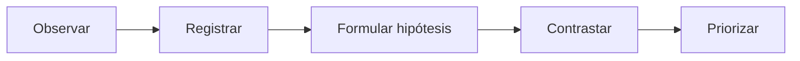
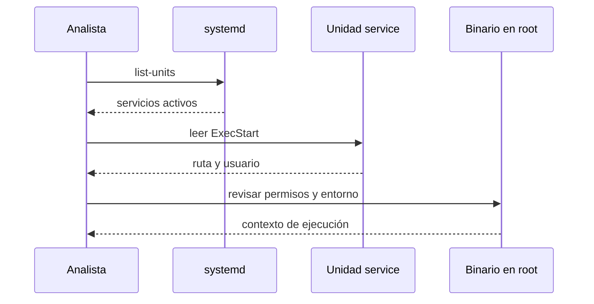
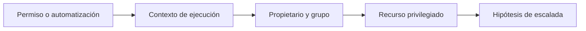
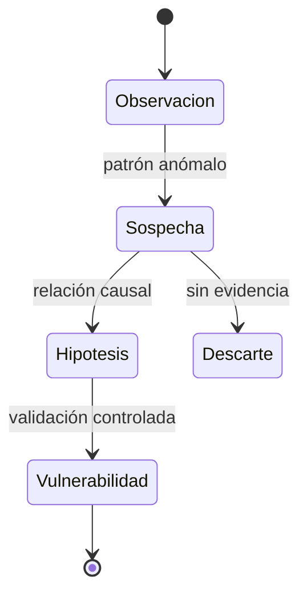

# Capítulo 02: Enumeración local del sistema

[Inicio](../../README.md) | [Privilege Escalation](../README.md) | [Anterior: De acceso inicial a post-explotación](../01-acceso-inicial-y-post-explotacion/README.md) | [Siguiente: Privilegios delegados con sudo](../03-privilegios-delegados-sudo/README.md)

> [!CAUTION]
> Este capítulo solo inspecciona el sistema: no explota ninguna configuración. Ejecuta los comandos únicamente dentro de la máquina virtual aislada de laboratorio o en sistemas para los que exista autorización expresa y por escrito. Revisar un sistema sin autorización constituye acceso indebido.

## Introducción

La **enumeración local** es el proceso de reconstruir el estado real de una máquina desde dentro, con el contexto del usuario que ya ha obtenido algún tipo de acceso. No es una colección de comandos ejecutados a ciegas ni una carrera por lanzar la herramienta más ruidosa. Es una actividad de **recolección de evidencia**: cada comando responde a una pregunta técnica concreta y su salida se conserva porque sostiene una conclusión posterior.

El objetivo operativo es reducir la incertidumbre. Al terminar el capítulo 01 se dispone de un *foothold*, es decir, una posición de ejecución concreta. Esa posición tiene una identidad, unos grupos, unos procesos visibles, unas interfaces de red, unos montajes y unos permisos. La diferencia entre ese contexto y el contexto de `root` es exactamente lo que se busca: la **superficie de escalada** está formada por todas las configuraciones donde un usuario sin privilegios puede influir en algo que `root` ejecuta, lee o confía.

Enumerar bien evita dos errores frecuentes. El primero es explotar lo primero que aparece y ensuciar el sistema sin entender la causa. El segundo es depender de que una herramienta externa encuentre la ruta correcta por nosotros. Las herramientas aceleran la recolección, pero la interpretación de la evidencia es humana. Este capítulo entrega el método y las fuentes de datos; los capítulos 03 a 06 amplían cada superficie concreta.

---

## 1. Método: observar, registrar, formular hipótesis

La enumeración es un ciclo, no una lista. El ciclo comienza **observando** una fuente concreta del sistema —una cuenta, un proceso, un montaje—, continúa guardando la salida como evidencia, deriva de ella una **hipótesis** de escalada y la contrasta con una definición de riesgo. Solo al final se prioriza, porque no todo hallazgo permite elevar privilegios y no todos requieren la misma urgencia.



La disciplina clave es separar la **observación** de la **interpretación**. La observación es un hecho verificable: `svc-backup` existe y su shell es `/usr/sbin/nologin`. La interpretación es una afirmación sobre el riesgo: ese usuario no puede iniciar sesión interactiva, por lo que no representa una vía directa. Mezclar ambas produce conclusiones que no resisten una revisión.

Tres reglas prácticas ordenan el trabajo:

1. **Registrar siempre el comando y su salida.** Una captura o un volcado sin el comando asociado pierde valor probatorio al reconstruir el análisis.
2. **Enumerar antes de explotar.** Cada configuración observada alimenta una hipótesis; explotar sin hipótesis es ensayo y error destructivo.
3. **Cubrir las superficies en orden.** Identidad, sistema, procesos, red, montajes, permisos y automatizaciones. Saltarse una deja zonas ciegas que los capítulos posteriores asumen revisadas.

---

## 2. Identidad y cuentas

La primera fuente es la propia identidad efectiva. `id` muestra el UID, el GID y todos los grupos suplementarios del proceso actual. La distinción entre **UID real** y **UID efectivo** importa: un binario con el bit SUID puede ejecutarse con un UID efectivo distinto del que inició la sesión.

```bash
whoami
id
id -a
```

La base de datos local de cuentas vive en `/etc/passwd`. Cada línea tiene siete campos separados por dos puntos: `nombre:clave:UID:GID:GECOS:home:shell`. El segundo campo contiene la letra `x`, que delega la verificación de la contraseña a `/etc/shadow`.

```text
root:x:0:0:root:/root:/bin/bash
student:x:1000:1000:Cuenta de laboratorio:/home/student:/bin/bash
svc-backup:x:998:998:Cuenta de servicio:/var/lib/svc-backup:/usr/sbin/nologin
```

Filtrar por shells interactivas revela qué cuentas pueden abrir sesión. Las rutas como `/usr/sbin/nologin` o `/bin/false` bloquean el acceso interactivo, pero no implican que la cuenta sea inofensiva: un proceso puede ejecutarse con ese UID.

```bash
getent passwd
grep -vE '/(nologin|false)$' /etc/passwd
cat /etc/shells
```

`getent` consulta el conmutador de servicios de nombres (NSS), por lo que incluye usuarios provenientes de LDAP, SSSD o NIS, no solo los del archivo local. Cuando un sistema está integrado con un directorio, leer `/etc/passwd` directamente deja fuera parte de la realidad.

Los grupos concentran privilegios de forma silenciosa. La pertenencia a ciertos grupos equivale a `root` en la práctica, aunque la cuenta no tenga UID 0. La tabla siguiente resume los más relevantes en Ubuntu.

| Grupo | Por qué importa |
|---|---|
| `sudo` | Permite ejecutar comandos como `root` según `/etc/sudoers`. |
| `adm` | Lectura de registros del sistema en `/var/log`, útil para reconocimiento. |
| `docker` | Acceso al socket de Docker, que equivale a `root` al poder montar el sistema en un contenedor. |
| `lxd` / `lxc` | Permite crear contenedores privilegiados con acceso al host. |
| `disk` | Acceso de lectura y escritura a dispositivos de bloque, saltándose los permisos del sistema de archivos. |
| `shadow` | Lectura de `/etc/shadow`. |

```bash
getent group
getent group sudo adm docker lxd disk shadow
```

Finalmente, los permisos de `/etc/shadow` condicionan si las contraseñas hasheadas son legibles. En una instalación correcta de Ubuntu, el archivo pertenece a `root:shadow` con modo `640`, de modo que un usuario sin el grupo `shadow` no puede leerlo.

```bash
ls -l /etc/shadow /etc/passwd /etc/group
```

---

## 3. Sistema y kernel

La identidad del sistema determina qué técnicas tienen sentido. La versión de la distribución orienta la gestión de paquetes, los servicios por defecto y las rutas de configuración. La versión del kernel acota la superficie de vulnerabilidades locales.

```bash
uname -a
uname -r
cat /etc/os-release
```

`/etc/os-release` entrega el nombre, la versión y el identificador de la distribución de forma estable entre distribuciones. Es preferible a leer archivos específicos como `/etc/lsb-release` o `/etc/debian_version`, que no existen en todos los sistemas.

El inventario de paquetes instalados revela software fuera de lo común, versiones antiguas o componentes con historial de vulnerabilidades. En Ubuntu:

```bash
dpkg -l
dpkg -l | wc -l
apt list --installed 2>/dev/null
dpkg -l | grep -iE 'sudo|openssh|apache|mysql|vim|screen|tmux'
```

La versión del kernel merece una advertencia explícita. Un kernel desactualizado puede corresponder a una vulnerabilidad local conocida, pero **explotar el kernel no es la primera opción**. Un fallo en el kernel puede provocar pánico, corrupción de datos o inestabilidad, requiere que la configuración y la arquitectura coincidan y, en muchos casos, un reinicio. Además, dentro de un contenedor `uname` muestra el kernel del host, no el del contenedor, lo que puede inducir a error. La enumeración registra la versión como dato de contexto; la decisión de aprovecharla se estudia en el capítulo 07 junto con la priorización.

---

## 4. Procesos y servicios

Un proceso que corre como `root` y consume algo que un usuario sin privilegios controla es una hipótesis de escalada. La enumeración busca ese desajuste entre el dueño del proceso y los recursos que utiliza.

```bash
ps aux
ps -eo user,pid,ppid,cmd --sort=user
ps -ef
```

Las columnas útiles de `ps aux` son el usuario propietario, el PID, el padre (PPID) y la línea de comandos completa. Los procesos cuyo comando incluye rutas en directorios escribibles, variables sin comillas, scripts en `/tmp` o intérpretes que cargan configuración externa son candidatos a revisión.

Los servicios gestionados por `systemd` describen unidades con la ruta del binario, el usuario de ejecución y las dependencias. La cadena desde la unidad hasta el binario y su configuración es exactamente el objeto de análisis.

```bash
systemctl list-units --type=service --state=running
systemctl list-unit-files --type=service
systemctl cat nombre-del-servicio
```



La red complementa la imagen. Los puertos en escucha muestran servicios accesibles y, con privilegios suficientes, el proceso asociado. Sin `sudo`, la opción `-p` no puede resolver nombres de proceso para sockets de otros usuarios, pero el puerto y la dirección siguen siendo visibles.

```bash
ss -tulpn
ss -tulp
ss -tulpn 2>/dev/null | grep 127.0.0.1
```

Un servicio vinculado a `127.0.0.1` solo es alcanzable desde la propia máquina, lo que a menudo indica un componente interno —paneles de administración, bases de datos o agentes— con controles de acceso más débiles que los expuestos al exterior.

---

## 5. Almacenamiento y montajes

Los montajes definen qué sistemas de archivos están presentes y qué opciones de seguridad aplican. Una partición montada con opciones débiles puede anular defensas que el resto del sistema sí respeta.

```bash
mount
findmnt -l
cat /etc/fstab
df -h
```

Tres opciones de montaje son determinantes para la escalada en Linux:

| Opción | Efecto |
|---|---|
| `nosuid` | Ignora los bits SUID y SGID de los binarios de ese sistema de archivos. |
| `nodev` | Ignora los archivos de dispositivo presentes en el montaje. |
| `noexec` | Impide la ejecución directa de binarios y scripts del montaje. |

Un montaje sin `nosuid` permite que un binario SUID colocado ahí conserve su efecto. Un montaje sin `noexec` permite ejecutar payloads desde directorios que quizá son escribibles. Estas opciones protegen sobre todo a sistemas de archivos que usuarios sin privilegios pueden modificar, como `/tmp` o `/home`.

Los montajes de red añaden una capa de confianza. En NFS, la opción `no_root_squash` del lado servidor hace que un cliente que se presente como `root` sea tratado como `root` sobre los archivos exportados, lo que convierte un montaje en una vía de escritura privilegiada. En CIFS/SMB conviene revisar el usuario con el que se monta y los permisos efectivos.

```bash
grep -E 'nfs|cifs|smb' /proc/mounts
cat /etc/fstab | grep -vE '^#'
```

---

## 6. Permisos y búsquedas

El sistema de permisos de Linux combina los bits clásicos con bits especiales. El bit **SUID** en un ejecutable hace que el proceso se ejecute con el UID efectivo del propietario del archivo; el bit **SGID** hace lo propio con el GID. Si el propietario es `root`, el binario corre con privilegios elevados sin importar quién lo invoque.

```bash
find / -perm -4000 -type f 2>/dev/null
find / -perm -2000 -type f 2>/dev/null
find / \( -perm -4000 -o -perm -2000 \) -type f -exec ls -l {} \; 2>/dev/null
```

La búsqueda de archivos escribibles por cualquier usuario identifica puntos de influencia. Un archivo `world-writable` que `root` lee o ejecuta es una hipótesis directa; un directorio escribible que aparece en el `PATH` de `root` permite sustituir un binario.

```bash
find / -type f -perm -0002 2>/dev/null
find / -type d -perm -0002 2>/dev/null
printf '%s\n' "$PATH"
```

Las **capabilities** fragmentan los privilegios de `root` en unidades asignables a binarios concretos. Una capability sensible como `cap_setuid` o `cap_dac_read_search` es tan potente como el bit SUID para fines prácticos.

```bash
getcap -r / 2>/dev/null
```

Las automatizaciones son otra superficie: los trabajos de `cron`, los timers de `systemd` y los scripts que ejecutan con privilegios. Enumerar sus archivos y rutas es una tarea de descubrimiento, no de explotación, en este capítulo.

```bash
ls -la /etc/cron* /var/spool/cron/crontabs 2>/dev/null
cat /etc/crontab
systemctl list-timers --all
```



Los bits SUID/SGID, las capabilities y las tareas programadas se amplían en los capítulos 04, 05 y 06 respectivamente. Aquí solo se registran como pistas con su ruta y su propietario.

---

## 7. Herramientas de apoyo

Las herramientas de enumeración automatizan la recolección y proponen posibles rutas. La más conocida es **LinPEAS**, un script de shell que clasifica hallazgos por color. Junto a ella, `linux-exploit-suggester` compara el kernel y el software con catálogos de vulnerabilidades públicas, y **pspy** observa procesos sin necesidad de privilegios para detectar ejecuciones periódicas.

```bash
# LinPEAS: ejecución completa y volcado a un archivo de evidencia
bash linpeas.sh -a | tee /tmp/linpeas-$(date +%Y%m%d).txt

# Sugerencias de exploits a partir de la versión del kernel
bash linux-exploit-suggester.sh

# Monitorización de procesos y de tareas programadas
./pspy64
```

La transferencia de estas herramientas se realiza dentro de la red aislada. Un servidor HTTP atendido en la interfaz local es suficiente para el laboratorio.

```bash
# En la máquina que sirve las herramientas
python3 -m http.server 8000 --bind 127.0.0.1

# En la VM de laboratorio
curl -O http://127.0.0.1:8000/linpeas.sh
```

Dos cautelas acompañan a estas herramientas. La primera es que su salida es **ruidosa**: marcan decenas de elementos y generan falsos positivos, por lo que cada hallazgo debe verificarse manualmente antes de llamarlo vulnerabilidad. La segunda es que los binarios descargados deben provenir de fuentes confiables y, cuando sea posible, verificarse por hash; una herramienta de enumeración tiene acceso a mucha información del sistema. Entender la salida importa más que ejecutarla.

---

## 8. De hallazgo a hipótesis

No todo lo observado es una vulnerabilidad. La progresión va de la observación neutra a la confirmación, pasando por la sospecha. Una observación es un hecho; una sospecha es una relación causal plausible pero no comprobada; una vulnerabilidad confirmada es una hipótesis validada de forma controlada y reproducible.



Un ejemplo ordena los niveles. Observación: el directorio `/opt/shared` tiene permisos `0777`. Sospecha: si un proceso con privilegios consume archivos de ese directorio, un usuario sin privilegios podría influir en su contenido. Hipótesis: existe un script ejecutado por `root` que lee de `/opt/shared`. Vulnerabilidad confirmada: ese script se ejecuta y además confía en el contenido sin validarlo. Los capítulos posteriores demuestran cómo cerrar cada eslabón; el capítulo 02 se detiene en la formulación de hipótesis sustentadas por evidencia.

---

## Práctica

El laboratorio de este capítulo reproduce un escenario observable y guía la recolección de evidencia sin explotar ninguna configuración. Guía completa: [Enumeración local guiada](./lab/README.md).

---

## Cheatsheet

Referencia rápida del capítulo en formato PDF: [cheatsheet.pdf](./cheatsheet.pdf).

---

[Anterior: De acceso inicial a post-explotación](../01-acceso-inicial-y-post-explotacion/README.md) | [Volver al índice](../README.md) | [Siguiente: Privilegios delegados con sudo](../03-privilegios-delegados-sudo/README.md)
