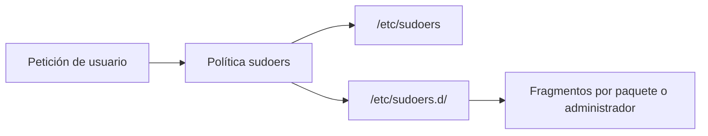
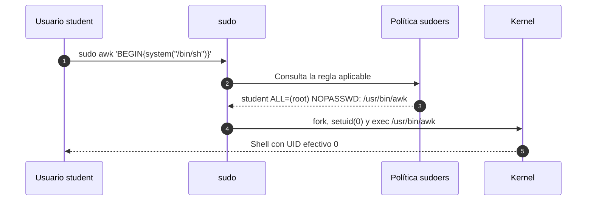
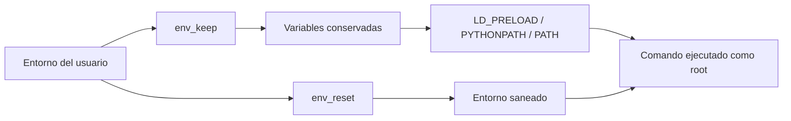

# Capítulo 03: Privilegios delegados con sudo

[Inicio](../../README.md) | [Privilege Escalation](../README.md) | [Anterior: Enumeración local del sistema](../02-enumeracion-local/README.md) | [Siguiente: Binarios SUID y SGID](../04-binarios-suid-y-sgid/README.md)

> [!CAUTION]
> Las reglas de `sudo` inseguras permiten ejecutar comandos como `root`. Practica esta técnica únicamente en la máquina virtual aislada del laboratorio o en sistemas para los que exista autorización expresa y por escrito.

## Introducción

**sudo** (*superuser do*) es el mecanismo que permite a una cuenta ejecutar comandos con los privilegios de otra, normalmente `root`, sin conocer su contraseña. La concesión no la decide cada proceso ni el usuario en el momento de invocarlo: se define en una política central llamada **sudoers**, formada por `/etc/sudoers` y los fragmentos que se incluyen desde `/etc/sudoers.d/`.

La diferencia con `su` es decisiva para entender el modelo. `su` cambia de identidad y exige la contraseña de la cuenta destino. `sudo`, en cambio, conserva la identidad de origen, registra cada operación y concede solo lo que la política autoriza. Por ese motivo `sudo` es el estándar de administración delegada en Linux y, a la vez, una de las superficies de escalada más habituales: cualquier regla más amplia de lo necesario convierte una cuenta sin privilegios en `root` efectivo.



La auditoría de `sudo` no consiste en adivinar contraseñas, sino en leer la política vigente y decidir si alguna regla permite ejecutar un comando capaz de eludir la propia restricción. El comando `sudo -l` resume esa política para el usuario actual y es el primer punto de inspección.

---

## 1. Qué son sudo y sudoers

`sudo` es un binario con el bit SUID activo (propietario `root`, modo `4755`) que se ejecuta como `root` sin que el usuario que lo invoca lo sea. Al arrancar, consulta la política de **sudoers** para saber si ese usuario, en ese host, puede ejecutar el comando solicitado y con qué identidad destino.

La sintaxis general de una regla es:

```text
usuario host = (usuario_destino : grupo_destino) etiquetas : comando
```

Cada campo delimita la concesión:

- `usuario`: la cuenta o el grupo (`%grupo`) que recibe la delegación.
- `host`: la máquina a la que aplica la regla.
- `usuario_destino` y `grupo_destino`: la identidad con la que se ejecutará el comando; `root` es el objetivo típico.
- `etiquetas`: modificadores como `NOPASSWD`, `PASSWD`, `NOEXEC` o `SETENV`.
- `comando`: la ruta absoluta autorizada, opcionalmente con argumentos.

Una regla mínima y peligrosa sería:

```conf
student ALL=(root) NOPASSWD: /usr/bin/awk
```

En `/etc/sudoers` y en los fragmentos de `/etc/sudoers.d/` los archivos deben pertenecer a `root:root` y tener permisos `0440`, porque una política editable por otros usuarios perdería todo su valor. La herramienta `visudo` valida la sintaxis antes de guardar y debe usarse para comprobar cualquier cambio.

La directiva `@includedir /etc/sudoers.d` hace que todo archivo válido de esa carpeta se cargue como parte de la política. Separar las reglas por paquete o por administrador facilita el mantenimiento, pero también dispersa la revisión: una auditoría completa obliga a leer `/etc/sudoers` y cada fragmento incluido.

### Enumerar la política con sudo -l

`sudo -l` muestra las reglas que afectan al usuario actual. Si la cuenta no necesita contraseña para listar, la salida es inmediata; en otro caso, `sudo` pide la contraseña del propio usuario antes de mostrar la política.

```bash
sudo -l
```

La salida típica incluye las entradas de `Defaults` y las reglas por host:

```text
Matching Defaults entries for student on lab:
    env_reset, mail_badpass, secure_path=/usr/local/sbin:/usr/local/bin:/usr/sbin:/usr/bin:/sbin:/bin

User student may run the following commands on lab:
    (root) NOPASSWD: /usr/bin/awk
```

Desde una cuenta administradora puede consultarse la política de otro usuario sin cambiar de sesión:

```bash
sudo -l -U student
sudo -l -n -l
```

La primera forma inspecciona la política de `student`; la segunda evita cualquier petición interactiva de contraseña. Cada regla que aparezca en la salida es una hipótesis de escalada que debe contrastarse con el catálogo de binarios y con los argumentos permitidos.

---

## 2. Cómo eleva sudo

Para comprender la elevación hay que distinguir dos identificadores de proceso. El **UID real** (RUID) identifica al usuario que inició la sesión y determina qué archivos y recursos le pertenecen. El **UID efectivo** (EUID) determina los permisos que el núcleo aplica a las operaciones del proceso en curso. Un proceso con EUID `0` puede leer, escribir y ejecutar como `root` aunque su RUID siga siendo el de `student`.

`sudo` aprovecha esa separación. Como binario con SUID, arranca con EUID `0`; valida la política y, si la regla lo autoriza, crea el comando hijo con la identidad destino. El resultado es un proceso con EUID `0` cuyo RUID puede seguir siendo el original. La etiqueta `NOPASSWD` elimina además la autenticación previa.



Cuando no existe `NOPASSWD`, `sudo` pide la contraseña del usuario que invoca, no la de `root`, y la memoriza durante unos minutos mediante un *timestamp*. Ese caché es comodidad, no una segunda autorización: si la regla concede el comando, la elevación ocurre igual.

La consecuencia práctica es que el binario autorizado hereda el EUID `0`. Si ese binario es capaz de lanzar una shell, de ejecutar un comando externo o de escribir archivos arbitrarios, la restricción de sudoers se vuelve decorativa.

---

## 3. Reglas inseguras

La mayoría de las escaladas por `sudo` no provienen de un error del binario `sudo`, sino de una regla demasiado permisiva. Los patrones más frecuentes son los siguientes.

### Comodines y comodines de argumentos

sudoers admite comodines en la ruta y en los argumentos. Una regla como `student ALL=(root) NOPASSWD: /usr/bin/*` autoriza cualquier binario del directorio y equivale a una concesión total. Del mismo modo, permitir argumentos con `*` puede habilitar opciones que abren una shell o leen un archivo sensible aunque el comando base parezca inocuo.

### Listas amplias y ALL

La regla `student ALL=(ALL:ALL) ALL` concede todos los comandos como cualquier usuario. Incluso variantes más acotadas, como `(root) /bin/cat` sin más, permiten leer `/etc/shadow` cuando se combinan con rutas que el usuario controla. Cuanto más genérica es la regla, más corta es la enumeración de alternativas.

### Binarios con escape a shell o a ejecución

Muchas utilidades legítimas incorporan funciones para invocar comandos o abrir intérpretes. Editores, paginadores, procesadores de texto, shells de scripting y clientes de red suelen incluir esa capacidad. Un listado no exhaustivo incluye `awk`, `sed`, `find`, `vi`, `less`, `man`, `python`, `perl`, `nmap` y `tar`. Cuando una regla autoriza uno de ellos como `root`, el binario ofrece su propio mecanismo de escape.

### Scripts sin ruta fija o en directorios escribibles

Si la regla apunta a un script que el usuario puede modificar, este cambia el contenido y el siguiente `sudo` ejecuta el código manipulado como `root`. El riesgo es mayor cuando la ruta no es absoluta o cuando el directorio que contiene el script es escribible por la cuenta sin privilegios. La política debe referirse siempre a rutas absolutas propiedad de `root`.

---

## 4. GTFOBins

**GTFOBins** es un catálogo curado de binarios Unix que, en determinadas condiciones, permiten eludir restricciones de seguridad. Para cada binario documenta líneas de comando que consiguen abrir una shell, leer o escribir archivos, subir o descargar datos o establecer persistencia. El proyecto se consulta en `gtfobins.github.io` y no ejecuta código: es una referencia de consulta.

La forma de usarlo durante una auditoría es directa:

1. Ejecutar `sudo -l` y extraer la lista de comandos autorizados.
2. Localizar cada binario en el catálogo.
3. Revisar la sección `Sudo`, que asume que el binario se ejecuta como `root` mediante `sudo`.
4. Comprobar que la versión instalada admite la técnica documentada.
5. Seleccionar la línea que produce una shell o la lectura del objetivo concreto.

El catálogo organiza las funciones en categorías, porque un mismo binario puede servir para fines distintos según los privilegios y los argumentos disponibles. La utilidad de GTFOBins radica en que convierte la intuición en una lista verificable: en lugar de improvisar payloads, el auditor comprueba qué ha documentado la comunidad para el binario exacto que la política autoriza.

---

## 5. Entorno heredado

`sudo` no ejecuta el comando en el entorno original del usuario. Por defecto aplica `env_reset`, que construye un entorno mínimo y predecible para el proceso privilegiado. Esto evita que variables controladas por el usuario influyan en la ejecución como `root`.

Sin embargo, la directiva `env_keep` permite conservar variables concretas. Cada variable que sobrevive al `env_reset` es un canal potencial desde la cuenta sin privilegios hacia el proceso con EUID `0`. Las más peligrosas son las que alteran qué código se carga o qué binario se ejecuta:

- **`LD_PRELOAD`**: fuerza la carga de una biblioteca antes que las demás, lo que permite ejecutar código dentro del proceso privilegiado. Es equivalente a un secuestro de bibliotecas.
- **`LD_LIBRARY_PATH`**: cambia las rutas donde se buscan bibliotecas compartidas y puede provocar que se cargue una versión controlada por el usuario.
- **`PYTHONPATH`**: añade directorios a la búsqueda de módulos de Python; si un script privilegiado importa un módulo, se puede suplantar.
- **`PATH`**: decide qué ejecutable se encuentra cuando el comando se invoca por nombre en lugar de por ruta absoluta.



La defensa es coherente con el riesgo: mantener `env_reset` activo y evitar cualquier `env_keep` sobre variables que condicionen la carga de código o la resolución de ejecutables. Como refuerzo, el ajuste `secure_path` fija una ruta de búsqueda controlada para los comandos que `sudo` lanza.

---

## 6. Ejemplo conceptual con AWK

`awk` es un procesador de texto orientado a registros. Su programa se organiza en bloques; el bloque `BEGIN` se ejecuta una vez, antes de leer cualquier entrada. Además, `awk` expone la función `system()`, que entrega una cadena al shell del sistema. La combinación de ambas características convierte a `awk` en un binario capaz de lanzar comandos.

Si la política contiene `NOPASSWD: /usr/bin/awk`, la cuenta sin privilegios puede ejecutar ese binario como `root` y, con él, invocar una shell que hereda el EUID `0`:

```bash
sudo -l
```

```text
User student may run the following commands on lab:
    (root) NOPASSWD: /usr/bin/awk
```

El escape consiste en pedir a `awk` que ejecute `/bin/sh` desde el bloque `BEGIN`:

```bash
sudo awk 'BEGIN{system("/bin/sh")}'
```

La shell resultante pertenece a `root`, aunque el usuario que la inició no lo sea:

```bash
id
```

```text
uid=0(root) gid=0(root) groups=0(root)
```

El mismo mecanismo permite escribir archivos privilegiados. La instrucción siguiente crearía un archivo en un directorio reservado a `root`:

```bash
sudo awk 'BEGIN{print "contenido" > "/root/archivo.txt"}'
```

La elevación no depende de una vulnerabilidad en `awk`, sino de que la política permite ejecutarlo con identidad `root` y el propio binario ofrece una vía de escape. Este es exactamente el patrón que el laboratorio del capítulo reproduce.

---

## 7. Defensa

La mitigación se centra en reducir cada regla a la operación estrictamente necesaria y en retirar cualquier capacidad de escape.

- **Rutas absolutas y sin comodines**: referenciar el binario o el script exacto y evitar `*` tanto en la ruta como en los argumentos.
- **Evitar binarios con escape**: no autorizar utilidades que abren shell, ejecutan comandos externos o editan archivos arbitrarios. Cuando la tarea lo exija, envolverla en un script propio con argumentos controlados.
- **Preferir `sudoedit`**: para edición de archivos privilegiados, `sudoedit` aplica las comprobaciones de la política y evita el escape de un editor interactivo.
- **Revisar `/etc/sudoers.d/`**: comprobar permisos `0440`, propiedad `root:root` y validar con `visudo -cf` cada fragmento.
- **Mantener el entorno saneado**: conservar `env_reset` y no añadir a `env_keep` variables como `LD_PRELOAD`, `LD_LIBRARY_PATH`, `PYTHONPATH` o `PATH`.
- **Aplicar mínimo privilegio**: restringir el usuario destino en lugar de `(ALL:ALL)` y limitar los argumentos cuando la herramienta lo permita.
- **Auditar y registrar**: revisar la política de forma periódica y vigilar los eventos de `sudo`, que dejan traza del comando y del usuario que lo solicitó.

## Práctica

El laboratorio reproduce una regla `NOPASSWD: /usr/bin/awk`, comprueba cómo la cuenta `student` obtiene una shell con UID `0` y recupera un archivo reservado a `root`. Instrucciones en el [laboratorio: regla de sudo insegura](./lab/README.md).

## Cheatsheet

Referencia rápida del capítulo en formato PDF: [cheatsheet.pdf](./cheatsheet.pdf).

---

[Anterior: Enumeración local del sistema](../02-enumeracion-local/README.md) | [Volver al índice](../README.md) | [Siguiente: Binarios SUID y SGID](../04-binarios-suid-y-sgid/README.md)
