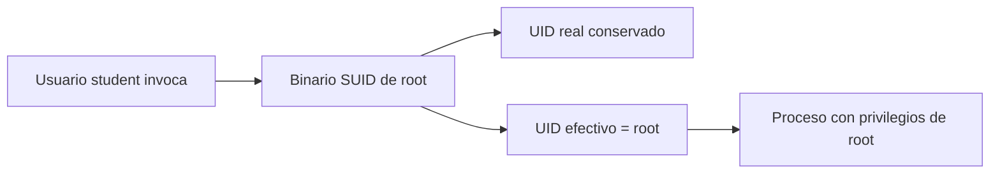
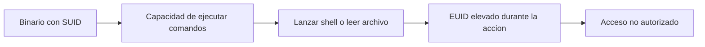
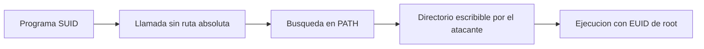

# Capítulo 04: Binarios SUID y SGID

[Inicio](../../README.md) | [Privilege Escalation](../README.md) | [Anterior: Privilegios delegados con sudo](../03-privilegios-delegados-sudo/README.md) | [Siguiente: Linux capabilities](../05-linux-capabilities/README.md)

> [!CAUTION]
> Las técnicas de este capítulo permiten obtener una shell con privilegios de `root`. Practícalas únicamente en máquinas virtuales propias y aisladas o en sistemas para los que exista autorización expresa por escrito. Los binarios SUID son una superficie de escalada real; no los provoques ni los modifiques en sistemas de producción.

## Introducción

El capítulo 03 delegó privilegios desde fuera del binario: una regla en `/etc/sudoers` decidía qué usuario podía ejecutar qué programa como `root`. Los **permisos especiales** siguen otra lógica: el privilegio queda **incrustado en el propio archivo**. Cuando un binario marcado con **SUID** y propiedad de `root` se ejecuta, el núcleo de Linux le concede los privilegios de `root` durante su ejecución, con independencia de quién lo haya lanzado.

Ese mecanismo es legítimo y necesario. Sin él, un usuario común no podría cambiar su propia contraseña, porque `passwd` necesita escribir en `/etc/shadow`, un archivo que solo `root` puede modificar. El problema no es el bit SUID en sí, sino concederlo a un programa que no está preparado para operar con privilegios elevados o que ofrece una vía para ejecutar comandos arbitrarios.

Un binario SUID es, por tanto, una puerta controlada: la pregunta defensiva es siempre si esa puerta se abre exactamente donde se pretende y hacia dónde conduce. Los capítulos 03, 04 y 05 comparten una misma idea: superficies de escalada distintas que otorgan la misma capacidad efectiva, ejecutar código como `root`.

---

## 1. Permisos especiales: setuid, setgid y sticky

Además de los tres bits clásicos de lectura, escritura y ejecución, el sistema de archivos de Linux reserva tres **bits especiales**. Se representan con la cuarta cifra en la notación octal y con letras concretas en la notación simbólica de `chmod`.

| Bit | Octal | Símbolo | Sobre un ejecutable | Sobre un directorio |
|---|---|---|---|---|
| **setuid** (SUID) | `4000` | `s` en el propietario | El proceso ejecuta con el UID efectivo del propietario del archivo. | Ignorado en Linux. |
| **setgid** (SGID) | `2000` | `s` en el grupo | El proceso ejecuta con el GID efectivo del grupo del archivo. | Los archivos creados heredan el grupo del directorio. |
| **sticky** | `1000` | `t` en otros | Sin efecto relevante. | Solo el propietario del archivo, el dueño del directorio o `root` pueden borrar o renombrar. |

`ls -l` revela estos bits en la posición de ejecución. Si la `s` o la `t` aparecen **en minúscula**, el permiso de ejecución también está activo y el bit tiene efecto. Si aparecen **en mayúscula** (`S` o `T`), el bit especial está puesto pero falta la ejecución correspondiente, una combinación que casi siempre indica una configuración descuidada.

```text
-rwsr-xr-x 1 root root    68208 /usr/bin/passwd
-rwxr-sr-x 1 root shadow  44712 /usr/bin/crontab
drwxrwxrwt 1 root root     4096 /tmp
```

En el primer ejemplo, la `s` del bloque del propietario convierte a `passwd` en un binario SUID de `root`. En el segundo, la `s` en el bloque del grupo hace que `crontab` herede el grupo `shadow`. En el tercero, la `t` final identifica el *sticky bit* del directorio compartido `/tmp`.

La asignación puede hacerse de forma simbólica o numérica:

```bash
chmod u+s binario   # activa SUID
chmod g+s carpeta   # activa SGID
chmod +t carpeta    # activa sticky
chmod 4755 binario  # SUID + rwxr-xr-x
chmod 2755 binario  # SGID + rwxr-xr-x
chmod 1777 carpeta  # sticky + rwxrwxrwx
```

El efecto central de SUID se resume en la separación entre quién invoca el programa y con qué identidad se ejecuta:



El UID real permanece ligado al usuario que lanzó el proceso; el UID efectivo, que es el que el núcleo consulta para autorizar operaciones, pasa a ser el del propietario del archivo. Esta distinción se detalla en la sección siguiente.

---

## 2. El UID efectivo durante `exec`

Cada proceso en Linux lleva asociados varios identificadores. Los tres relevantes para entender SUID y SGID son:

| Identificador | Significado |
|---|---|
| **UID real** (RUID) | Identifica al usuario que inició el proceso. Sirve para señales y contabilidad. |
| **UID efectivo** (EUID) | Determina los permisos del proceso frente al resto del sistema. |
| **UID guardado** (*saved set-user-ID*) | Permite subir o bajar privilegios durante la ejecución mediante `setuid()`. |

En un proceso normal, RUID y EUID coinciden. Al invocar `execve()` sobre un archivo con el bit SUID activo, el núcleo cambia el EUID del proceso al del propietario del archivo. Con SGID actúa de forma análoga sobre el **GID efectivo** (EGID). A partir de ese momento, cada comprobación de acceso —abrir un archivo, escribir en un socket, crear un proceso— se resuelve con el EUID o el EGID elevados.

El caso legítimo de `passwd` ilustra el diseño: un usuario común necesita actualizar `root:shadow`, un archivo con permisos `0640`. Al ejecutar `/usr/bin/passwd`, el EUID pasa a `0`, y el programa, escrito con cuidado, limita esa capacidad a la operación concreta de cambio de contraseña.

El riesgo aparece cuando el binario elevado no controla lo que hace con esos privilegios. Vulnerabilidades de desbordamiento de búfer, el uso de comandos con rutas relativas, la escritura en directorios temporales predecibles o el fallo al limpiar el entorno amplían el efecto: cualquier comportamiento del programa se ejecuta como `root`. Por eso un binario SUID es tan sensible: no basta con que su función principal sea inofensiva, debe estar libre de fallos explotables.

Dos matices prácticos conviene retener:

1. El privilegio se concede al **propietario del archivo**. Un SUID propiedad de un usuario sin privilegios solo eleva a ese usuario; el interés ofensivo está en los SUID propiedad de `root` o de grupos privilegiados.
2. Los intérpretes de *script* no respetan el bit SUID por diseño. Al ejecutar un guion con `#!/bin/bash`, el núcleo lanza el intérprete y descarta la elevación. Por eso SUID es útil sobre binarios compilados, no sobre scripts.

---

## 3. Enumeración de binarios con permisos especiales

La primera tarea tras obtener acceso es inventariar qué binarios portan estos bits. `find` con el predicado de permisos recorre el árbol y filtra:

```bash
find / -perm -4000 -type f 2>/dev/null
find / -perm -2000 -type f 2>/dev/null
```

- `-perm -4000` selecciona archivos que tienen **todos** los bits de SUID activos; `-perm -2000` hace lo propio con SGID.
- `-type f` restringe a archivos regulares; los directorios con SGID o sticky no interesan para esta búsqueda.
- `2>/dev/null` oculta los errores de permisos al recorrer directorios ilegibles.

En un sistema real conviene afinar la búsqueda para no atravesar sistemas de archivos ajenos al sistema operativo y para obtener metadatos útiles:

```bash
find / -xdev -perm -4000 -type f -ls 2>/dev/null
find / -xdev \( -perm -4000 -o -perm -2000 \) -type f -ls 2>/dev/null
```

`-xdev` evita descender a otros montajes, lo que separa lo que pertenece al sistema operativo de discos o recursos externos. Existe una diferencia sutil entre `-perm -4000` y `-perm /4000`: el primero exige que el bit SUID esté presente, mientras que el segundo coincide si **cualquiera** de los bits indicados lo está. Para aislar SUID conviene el guion; para combinar SUID y SGID, el paréntesis con `-o`.

Enumerar es solo el principio. El paso siguiente es **distinguir** los binarios legítimos del sistema de los añadidos por un administrador o por un atacante. Criterios útiles:

- **Ruta**: los binarios del gestor de paquetes viven en `/usr/bin`, `/bin` o `/usr/sbin`. Apariciones en `/usr/local/bin`, `/opt`, `/tmp` o el directorio *home* de un usuario merecen revisión.
- **Procedencia**: `dpkg -S /ruta/binario` (Debian/Ubuntu) o `rpm -qf /ruta/binario` (RHEL) indican a qué paquete pertenece el archivo. Si no pertenece a ninguno, se instaló manualmente.
- **Fechas y metadatos**: `stat` muestra propietario, fechas de modificación y cambio. Un SUID reciente respecto al resto del sistema es una señal de alerta.
- **Integridad**: comparar contra la lista de SUID esperada del sistema operativo o contra una base de referencia; cualquier alta no prevista es un hallazgo.

Una lista de referencia de un Ubuntu Server incluye binarios como `passwd`, `su`, `sudo`, `mount`, `umount`, `ping`, `newgrp`, `chsh`, `chfn`, `gpasswd` o `crontab`. Lo relevante no es memorizarlos todos, sino separar lo previsible de lo anómalo.

---

## 4. GTFOBins: binarios legítimos con salida a shell

**GTFOBins** es un catálogo de binarios legítimos de Unix que, por su propia funcionalidad, permiten escapar a una shell, leer o escribir archivos o eludir restricciones. Muchos de esos binarios sirven tanto con `sudo` como con SUID, siempre que conserven los privilegios elevados durante la ejecución.

El caso paradigmático es `find`, porque es un binario del sistema que en muchas distribuciones no necesita SUID y, sin embargo, ofrece una vía directa cuando lo tiene. Su opción `-exec` permite lanzar un comando por cada archivo encontrado:

```bash
/usr/bin/find . -exec /bin/sh -p \; -quit
```

El fragmento `. -exec ... -quit` busca en el directorio actual y ejecuta la shell sobre el primer resultado, cerrando después con `-quit`. La clave está en el argumento `-p`: `sh` abandona los privilegios cuando el EUID no coincide con el RUID, por seguridad, salvo que se indique explícitamente `-p` (*privileged*). Sin esa opción, la shell arrancaría con privilegios normales.

La estructura general de la escalada es siempre la misma:



Otros binarios del catálogo (editores como `vim` o `less`, intérpretes como `python3`, `perl` o `awk`, empaquetadores como `tar`, `zip` o `nmap` en modo interactivo) ofrecen capacidades equivalentes. No todos funcionan igual como SUID: algunos reinician su identidad efectiva o dependen de variables de entorno y solo son abusables desde `sudo`. La lección del capítulo 07 retoma el catálogo como herramienta transversal; aquí basta con entender que un binario de sistema con SUID y una funcionalidad potente es una superficie de escalada casi garantizada.

---

## 5. Binarios propios mal programados y secuestro de `PATH`

No todas las escaladas por SUID dependen de utilidades conocidas. Un binario propio, compilado para una tarea administrativa concreta, puede contener fallos más sutiles. El más frecuente en material educativo es la invocación de comandos **sin ruta absoluta**.

Cuando un programa llama a `system("nombre-comando")`, a `popen()` o a `execlp("nombre-comando", ...)`, el intérprete o la propia glibc resuelven `nombre-comando` recorriendo las rutas de la variable de entorno `PATH` en orden. Si en esa ruta aparece primero un directorio escribible por el atacante, el programa ejecutará el binario malicioso en lugar del legítimo. Si el programa porta SUID de `root`, ese binario malicioso se ejecuta como `root`.



El patrón de explotación es conceptualmente sencillo: identificar el nombre del comando invocado, asegurarse de que `PATH` incluye un directorio controlado antes que `/bin` o `/usr/bin`, colocar allí un ejecutable homónimo y lanzar el programa vulnerable. La corrección defensiva es igualmente directa: usar rutas absolutas en todas las invocaciones internas, sanear `PATH` al inicio y preferir funciones que no consulten el entorno.

Este tipo de fallo muestra que el bit SUID amplifica cualquier error de programación. Un programa benigno puede escribir archivos temporales con nombres predecibles, confiar en variables de entorno como `LD_PRELOAD` o `PYTHONPATH`, o ejecutar un comando mediante un `PATH` heredado. En binarios SUID, el cargador dinámico ignora `LD_PRELOAD` y `LD_LIBRARY_PATH` por diseño, pero esa protección no cubre los comandos lanzados internamente ni los subprocesos que no la respetan.

---

## 6. SGID: ejecución con el grupo del propietario

El bit **SGID** aplica la misma idea sobre el **GID**. Un ejecutable con SGID y grupo propietario `docker`, `shadow` o `www-data` correrá con el GID efectivo de ese grupo durante su ejecución. Si el grupo posee acceso a recursos relevantes —el socket de Docker, `/etc/shadow`, directorios de servicios— el proceso puede operar sobre ellos aunque el usuario no pertenezca al grupo.

El ejemplo clásico en Ubuntu es `crontab`, con grupo `shadow`, que necesita escribir en `/var/spool/cron/crontabs` con los permisos del grupo. Otro caso frecuente es `locate`, con SGID para leer la base de datos de nombres de archivo. La superficie de escalada del SGID suele ser menor que la del SUID, pero es significativa cuando el grupo implicado es **privilegiado**: pertenecer de forma efectiva al grupo `docker` equivale en la práctica a disponer de `root`, y un SGID abusado sobre `shadow` puede abrir la lectura de hashes de contraseñas.

Sobre **directorios**, SGID cambia su semántica: los archivos creados dentro heredan el grupo del directorio en lugar del grupo primario del usuario. Es un mecanismo legítimo para espacios de trabajo compartidos, pero si el directorio es escribible por un usuario y su contenido se procesa con privilegios, esa herencia de grupo puede transportar la elevación a otros archivos.

La enumeración de SGID sigue el mismo patrón que la de SUID:

```bash
find / -xdev -perm -2000 -type f -ls 2>/dev/null
find / -xdev -perm -2000 -type d -ls 2>/dev/null
```

---

## 7. Defensa: reducir, aislar y auditar

La defensa frente a SUID y SGID no consiste en eliminar los bits por completo —son parte del modelo de permisos de Unix— sino en reducirlos al mínimo, aislarlos y detectar cambios.

- **Minimizar binarios con permisos especiales.** Auditar periódicamente la lista de SUID y SGID y retirar el bit a todo lo que no lo necesite de forma estricta. `chmod u-s` o `chmod g-s` revierten la configuración.
- **Montar con `nosuid`.** Las opciones de montaje `nosuid`, `nodev` y `noexec` impiden que un montaje respete los bits SUID/SGID o ejecute archivos. Aplicarlas a particiones como `/tmp`, `/dev/shm` o `/home` bloquea muchas rutas de escalada.
  ```bash
  mount | grep nosuid
  findmnt -o TARGET,OPTIONS | grep nosuid
  ```
- **Preferir capabilities a SUID de root.** El capítulo 05 desarrolla este punto: en lugar de conceder todos los privilegios de `root` a un binario, las **capabilities** permiten otorgar solo la capacidad necesaria.
- **Auditar cambios de integridad.** Herramientas como `auditd`, `AIDE` o `Tripwire` detectan la aparición de nuevos SUID, la modificación de propietarios y la creación de archivos en directorios sensibles. Una comprobación programada con `find` o la comparación con un inventario de referencia complementan esa vigilancia.
- **Programar de forma segura.** En binarios con privilegios, usar rutas absolutas, limpiar el entorno, crear archivos temporales con `mkstemp`, validar todas las entradas y abandonar privilegios tan pronto como dejen de ser necesarios.

La detección en el lado defensivo se apoya en la misma enumeración que usa el atacante: si el sistema mantiene una línea base de binarios con permisos especiales, cualquier alta inesperada es un indicio de compromiso o de mala configuración.

---

## Práctica

El laboratorio asociado provisiona un binario SUID inseguro en una VM Ubuntu aislada y recorre su abuso paso a paso desde una cuenta sin privilegios. Instrucciones en [`./lab/README.md`](./lab/README.md).

## Cheatsheet

Referencia rápida del capítulo en formato PDF: [cheatsheet.pdf](./cheatsheet.pdf).

---

[Anterior: Privilegios delegados con sudo](../03-privilegios-delegados-sudo/README.md) | [Volver al índice](../README.md) | [Siguiente: Linux capabilities](../05-linux-capabilities/README.md)
