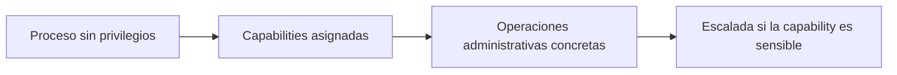
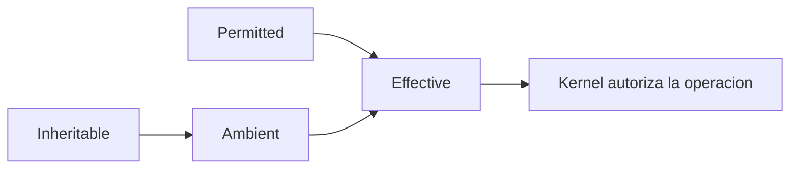

# Capítulo 05: Linux capabilities

[Inicio](../../README.md) | [Privilege Escalation](../README.md) | [Anterior: Binarios SUID y SGID](../04-binarios-suid-y-sgid/README.md) | [Siguiente: Tareas programadas y rutas escribibles](../06-tareas-programadas-y-rutas-escribibles/README.md)

> [!CAUTION]
> Las capacidades permiten delegar privilegios administrativos muy concretos y, mal configuradas, equivalen a la cuenta `root`. Practica exclusivamente en una máquina virtual propia, aislada y con instantánea previa; no apliques estas técnicas contra sistemas de terceros sin autorización por escrito.

## Introducción

Durante décadas, el diseño de permisos en Linux se apoyó en una distinción binaria: un proceso se ejecuta como `root` y omite casi todas las comprobaciones, o se ejecuta como un usuario común y queda sujeto a ellas. El **bit SUID** del capítulo anterior explota justamente ese modelo: un binario propiedad de `root` con SUID obtiene el UID 0 completo durante su ejecución, aunque solo necesite una fracción de esos poderes para funcionar.

Las **capabilities** (capacidades) nacen para romper esa dicotomía. En lugar de conceder al proceso todos los privilegios de `root`, el kernel lo faculta para realizar operaciones administrativas muy específicas sin cambiar su UID ni convertirlo en administrador total. El resultado es un modelo de mínimo privilegio a nivel de kernel: cada comprobación sensible se asocia a una capacidad concreta y el proceso solo supera las verificaciones de las capacidades que posee.



La consecuencia ofensiva es directa. Muchas capacidades, aunque parezcan inofensivas, permiten ejecutar código privilegiado o leer y escribir archivos protegidos. Cuando un administrador aplica `setcap` a un intérprete, a `tar` o a cualquier binario capaz de ejecutar comandos, conceder una sola capacidad puede ser tan contundente como un SUID mal puesto.

---

## 1. Por qué existen las capabilities

Una **capability** es una unidad discreta de privilegio que el kernel verifica de forma independiente antes de permitir una operación. El kernel divide el poder histórico de `root` en decenas de capacidades; un proceso puede conservar su UID normal y, aun así, recibir solo la que necesita. El proceso no se convierte en `root`; simplemente deja de ser bloqueado en los puntos exactos cubiertos por las capacidades que posee.

Cuatro capacidades ilustran bien el riesgo cuando caen en el binario equivocado:

| Capability | Poder que concede | Riesgo de escalada |
|---|---|---|
| `CAP_NET_RAW` | Crear sockets crudos y capturar o fabricar paquetes. | Escucha de tráfico y suplantación de red; puede facilitar ataques posteriores. |
| `CAP_SETUID` | Cambiar el UID del proceso a cualquier valor, incluido `0`. | Equivale a `root`: basta setear el UID y lanzar un shell. |
| `CAP_DAC_READ_SEARCH` | Ignorar las comprobaciones de lectura de archivos y de recorrido de directorios. | Lectura de `/etc/shadow`, claves y cualquier archivo protegido. |
| `CAP_SYS_ADMIN` | Montajes, namespaces, ajustes de alto nivel del sistema. | Extremadamente amplia; habilita escapes de contenedor y manipulaciones profundas. |

La regla práctica es tajante: cualquier capacidad que permita ejecutar código arbitrario o modificar el UID debe tratarse como **root-equivalente**, aunque el binario no tenga el bit SUID. `CAP_SETUID`, `CAP_SETGID`, `CAP_DAC_OVERRIDE` y `CAP_SYS_ADMIN` encabezan la lista de capacidades peligrosas.

---

## 2. Conjuntos de una capability

Una capability no es un valor único: el kernel administra varios **conjuntos** (sets) por proceso, y una capacidad puede estar activa en unos y no en otros. Comprenderlos explica por qué asignar `+p` no siempre produce el efecto esperado y por qué la notación `cap_setuid+ep` aparece en la práctica.

- **Permitted** (`p`): límite superior. Una capacidad presente aquí puede activarse después, pero por sí sola no autoriza todavía la operación.
- **Effective** (`e`): capacidades que el kernel aplica realmente en este instante. Si algo no está en effective, la operación se deniega.
- **Inheritable** (`i`): capacidades que un proceso puede transmitir a un hijo a través de `execve`, siempre que el binario también lo permita.
- **Ambient** (`a`): capacidades heredadas por procesos no privilegiados sin necesitar un binario con capacidades previas; mecanismo moderno para conservar privilegios entre ejecuciones.



La **notación** de `setcap` combina el nombre de la capacidad con los conjuntos que se activan o desactivan. En `cap_setuid+ep`, el sufijo indica que `CAP_SETUID` se añade (`+`) a los conjuntos **effective** (`e`) y **permitted** (`p`). Sin `e`, la capacidad quedaría permitida pero inactiva y la operación seguiría fallando. Otros operadores son `-` para retirar y `=` para fijar exactamente los conjuntos indicados.

Internamente, las capacidades de un binario se almacenan como un atributo extendido llamado `security.capability` sobre el inodo. Por eso copiar el archivo con herramientas que no preservan atributos puede eliminar la capacidad, y por eso `getcap` la consulta directamente del sistema de archivos.

---

## 3. Enumeración

La enumeración de capacidades es tan importante como la de binarios SUID. Una capacidad mal asignada no aparece en el listado de permisos clásico (`ls -l`), de modo que pasa desapercibida si solo se buscan bits SUID.

La herramienta principal es `getcap`, incluida en el paquete `libcap2-bin`. El barrido recursivo de todo el sistema de archivos revela cada binario con capacidades asignadas; los errores de permiso se descartan redirigiendo el error estándar:

```bash
getcap -r / 2>/dev/null
```

En una máquina recién instalada el comando suele devolver muy poco; con frecuencia solo unos pocos binarios de red. Una línea como la siguiente reclama atención inmediata:

```text
/usr/local/bin/pycap = cap_setuid+ep
```

Para procesos ya en ejecución, `getpcaps` consulta las capacidades de un PID concreto. Consultar el shell actual y el proceso 1 ayuda a perfilar el entorno:

```bash
getpcaps $$
getpcaps 1
```

La misma información reside en `/proc/<pid>/status`, en campos en hexadecimal que el kernel expone por proceso:

```bash
grep -E 'Cap(Inh|Prm|Eff|Bnd|Amb)' /proc/$$/status
```

Para traducir esas máscaras a nombres legibles se emplea `capsh`:

```bash
capsh --decode=0x0000000000000000
```

Durante una auditoría conviene combinar ambos enfoques: `getcap` encuentra los binarios marcados en disco y `getpcaps` / `/proc/<pid>/status` describen lo que un proceso tiene activo en memoria. Los conjuntos **bounding** y **ambient** también importan, porque delimitan qué capacidades podrá recibir un proceso hijo.

---

## 4. Abuso de capabilities sensibles

El abuso consiste en conseguir que un binario con una capacidad sensible ejecute una operación que beneficie al atacante. La vía más limpia aparece cuando el binario con capacidad es un **intérprete** capaz de ejecutar código: si `python3` o `perl` tienen `CAP_SETUID`, el intérprete ya puede cambiar el UID del propio proceso y convertirse en `root`.

Este fragmento es el núcleo del abuso con `CAP_SETUID`: el proceso pide el UID 0 y, como la capacidad se lo permite, el kernel acepta el cambio antes de lanzar un shell:

```python
import os
os.setuid(0)
os.system("/bin/bash")
```

La forma compacta, sin archivo intermedio, es:

```bash
/usr/local/bin/pycap -c 'import os; os.setuid(0); os.system("/bin/bash")'
```

El equivalente en Perl utiliza la misma idea a través de `POSIX`:

```bash
perl -e 'use POSIX qw(setuid); POSIX::setuid(0); exec "/bin/sh";'
```

Otras capacidades abren caminos distintos aunque igualmente efectivos:

- **`CAP_DAC_READ_SEARCH`** con `tar`. `tar` puede leer y archivar archivos aunque el usuario no tenga permiso de lectura, de modo que la capacidad permite extraer contenido protegido. Un patrón típico archiva `/etc/shadow` y lo vuelca por la salida estándar:

  ```bash
  tar -czf /tmp/copia.tgz /etc/shadow
  tar -xOzf /tmp/copia.tgz etc/shadow
  ```

- **`CAP_DAC_OVERRIDE`** con cualquier binario que escriba archivos. Salta por completo las comprobaciones de lectura, escritura y ejecución, así que permite modificar `/etc/passwd` o `/etc/shadow` y añadir un usuario con UID 0. Con un intérprete basta abrir el archivo en modo escritura:

  ```python
  open("/etc/passwd", "a").write("backdoor::0:0:root:/root:/bin/bash\n")
  ```

- **`CAP_SYS_ADMIN`** con `mount` o `unshare`. Es tan amplia que sirve para montar sistemas de archivos, crear namespaces y escapar de contenedores; en la práctica se considera un privilegio de administrador completo.

La capacidad de `CAP_SETUID` sobre un binario arbitrario es la más determinista: no depende de leer ni de escribir un archivo concreto, sino de que el proceso pueda cambiar su UID. Por eso el laboratorio del capítulo la usa como escenario.

---

## 5. Comparación con SUID

SUID y capabilities resuelven el mismo problema —conceder privilegios a un ejecutable— con filosofías opuestas. La siguiente tabla contrasta sus diferencias operativas, que determinan cómo se descubre y cuánto poder concede cada mecanismo.

| Criterio | Bit SUID | Capabilities |
|---|---|---|
| Granularidad | Concede el UID (o GID) completo del propietario. | Concede unidades de privilegio concretas. |
| Descubrimiento | `find / -perm -4000 2>/dev/null`. | `getcap -r / 2>/dev/null`. |
| Alcance | El proceso hereda todos los poderes del UID efectivo, normalmente `root`. | El proceso solo opera dentro de las capacidades asignadas. |
| Almacenamiento | Bit en el inodo, visible con `ls -l`. | Atributo extendido `security.capability`, invisible con `ls -l`. |
| Riesgo típico | Cualquier binario SUID que abra shell es `root`. | Solo las capacidades sensibles equivalen a `root`. |

La diferencia clave para la defensa y para el ataque es la **granularidad**. Un SUID mal puesto es siempre una escalada total; una capability mal puesta solo lo es si pertenece al subconjunto sensible. `getcap` es por tanto un comando tan obligatorio en la enumeración como `find -perm -4000`, y con frecuencia descubre hallazgos que el hallazgo clásico no ve.

---

## 6. Defensa

La defensa de capacidades se apoya en un principio único: **conceder solo lo imprescindible y revisar con regularidad lo concedido**. A diferencia de SUID, donde suele bastar con retirar el bit, aquí el problema es más sutil porque una capability aparentemente inocua puede ser root-equivalente.

La medida más directa es retirar las capacidades innecesarias. `setcap -r` elimina todas las capacidades de un binario y lo devuelve a su estado normal:

```bash
sudo setcap -r /usr/local/bin/pycap
```

En auditorías, `getcap -r / 2>/dev/null` debe ejecutarse junto al barrido de SUID y contrastarse con la lista de binarios que realmente necesitan privilegios. Cualquier intérprete, editor, archivador o herramienta de ejecución con capacidades sensibles es un hallazgo de alta prioridad. Cuando un servicio necesite una capacidad concreta, lo preferible es aislarla en una unidad de `systemd` con `AmbientCapabilities` acotadas, en lugar de marcar un binario global y persistente.

Por último, conviene recordar que retirar la capacidad no es suficiente si el binario ya era vulnerable por otra vía: la causa raíz es haber delegado un privilegio sensible sobre un ejecutable que permite control de código. La corrección de fondo es rediseñar la tarea para que no necesite esa capacidad o para que se ejecute en un servicio dedicado y supervisado.

---

## Práctica

El laboratorio reproduce el escenario más determinista de este capítulo: un intérprete de Python con `cap_setuid+ep` que permite obtener un shell de `root` y leer un archivo protegido.

[Ir al laboratorio: capability sensible](./lab/README.md)

## Cheatsheet

Referencia rápida del capítulo en formato PDF: [cheatsheet.pdf](./cheatsheet.pdf).

---

[Anterior: Binarios SUID y SGID](../04-binarios-suid-y-sgid/README.md) | [Volver al índice](../README.md) | [Siguiente: Tareas programadas y rutas escribibles](../06-tareas-programadas-y-rutas-escribibles/README.md)
