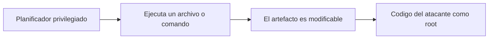
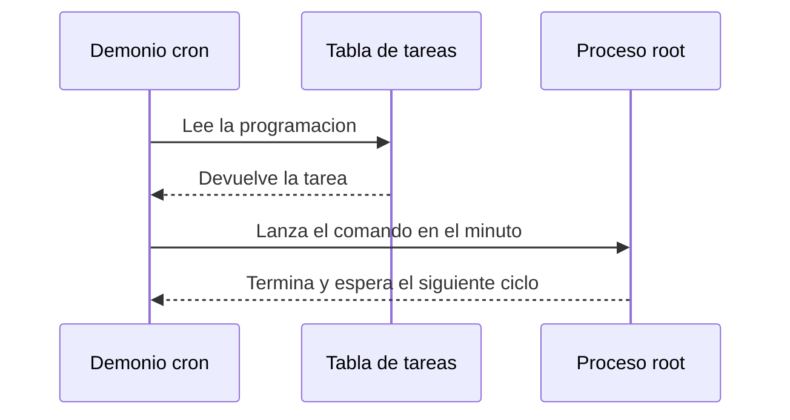
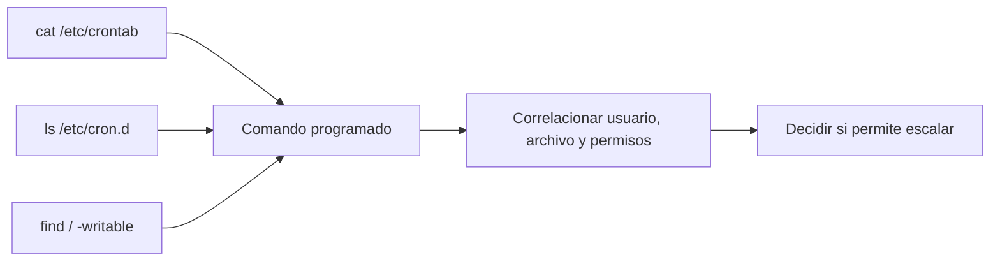

# Capítulo 06: Tareas programadas y rutas escribibles

[Inicio](../../README.md) | [Privilege Escalation](../README.md) | [Anterior: Linux capabilities](../05-linux-capabilities/README.md) | [Siguiente: Secretos, GTFOBins y priorización](../07-secretos-y-priorizacion/README.md)

> [!CAUTION]
> Las técnicas de este capítulo permiten ejecutar código con privilegios elevados de forma automática. Practícalas únicamente en máquinas virtuales propias y aisladas o en sistemas con autorización expresa y por escrito. No modifiques tareas programadas en sistemas de producción ajenos.

## Introducción

Una **tarea programada** es una orden que el sistema ejecuta por sí solo en un instante definido, sin que ningún usuario tenga que lanzarla. El sistema operativo mantiene un planificador privilegiado que despierta, consulta su calendario y arranca el trabajo acordado. En Linux conviven dos planificadores principales: el demonio **cron** y los **timers de systemd**.

La propiedad que convierte este mecanismo en una superficie de escalada es sencilla: los trabajos del sistema se ejecutan con un usuario distinto al que los define, y con frecuencia lo hacen como `root`. Por tanto, cualquier archivo o comando que ese trabajo invoque pasa a formar parte de lo que `root` va a ejecutar. Si el artefacto —el script, un binario auxiliar o un directorio de la ruta— puede ser modificado por una cuenta sin privilegios, esa cuenta decide qué código corre como administrador. Ese es el objeto de este capítulo.



El capítulo no explota un fallo del planificador, sino una decisión de configuración: un propietario inadecuado, un permiso de escritura sobrante, una ruta relativa o un comodín mal usado. Comprender la cadena completa —planificador, usuario de ejecución, artefacto invocado y permisos intermedios— es lo que permite distinguir una configuración peligrosa de una simplemente llamativa.

---

## 1. `cron` y timers de `systemd`

### 1.1 El demonio cron y sus formatos

El demonio `cron` despierta una vez por minuto, revisa las tablas de tareas y lanza las que correspondan a ese instante. Las tablas no se guardan en un único archivo, sino en varias ubicaciones con formatos parecidos pero no idénticos. La diferencia decisiva es si la línea incluye un campo de usuario.

| Ubicación | Formato de la línea | Usuario | Se ejecuta como |
|---|---|---|---|
| `/etc/crontab` | 5 campos de tiempo + usuario + comando | Campo explícito | El usuario indicado, habitualmente `root` |
| `/etc/cron.d/*` | Igual que `/etc/crontab` | Campo explícito | El usuario indicado |
| `/etc/cron.hourly`, `.daily`, `.weekly`, `.monthly` | Scripts ejecutados por `run-parts` | Sin campo | `root` |
| `crontab -l` de cada usuario | 5 campos de tiempo + comando | El propietario | El propietario de la tabla |

Los cinco campos de tiempo son, en orden, minuto, hora, día del mes, mes y día de la semana. El asterisco `*` significa “cualquier valor”. Una entrada del archivo principal del sistema puede verse así:

```conf
# /etc/crontab
SHELL=/bin/sh
PATH=/usr/local/sbin:/usr/local/bin:/sbin:/bin:/usr/sbin:/usr/bin
17 *    * * *   root    cd / && run-parts --report /etc/cron.hourly
```

Un archivo dentro de `/etc/cron.d` usa exactamente el mismo formato, incluido el campo de usuario:

```conf
# /etc/cron.d/privesc-lab
* * * * * root /opt/maintenance/backup.sh
```

El detalle importante es el campo `root`: aunque el archivo lo pueda leer cualquier usuario, la tarea se ejecuta con los privilegios de `root`. En cambio, la tabla personal de un usuario (`crontab -l`) omite ese campo porque siempre corre como su propietario:

```bash
crontab -l
```

Los directorios `cron.hourly`, `cron.daily`, `cron.weekly` y `cron.monthly` no contienen líneas de texto, sino archivos ejecutables que `run-parts` recorre en orden. En Debian y Ubuntu, `run-parts` ignora los nombres de archivo que contienen puntos, de modo que un script llamado `backup.d` no se ejecutaría. Estos directorios se ejecutan como `root` y son un destino frecuente de configuraciones peligrosas.

### 1.2 El concepto de timer

Un **timer de systemd** es una unidad `.timer` que activa una unidad `.service` según una expresión de calendario o un intervalo. Cumple el papel de `cron`, pero forma parte del mismo sistema de unidades que los servicios, lo que permite expresar dependencias, usuario de ejecución y endurecimiento.

```ini
# /etc/systemd/system/backup.timer
[Unit]
Description=Dispara la copia de mantenimiento

[Timer]
OnCalendar=*-*-* *:*:00
Persistent=true

[Install]
WantedBy=timers.target
```

La unidad anterior activa cada minuto el servicio asociado, que define qué se ejecuta:

```ini
# /etc/systemd/system/backup.service
[Unit]
Description=Copia de mantenimiento

[Service]
Type=oneshot
ExecStart=/opt/maintenance/backup.sh
```

Los timers se consultan con `systemctl list-timers --all` y su contenido con `systemctl cat`. A diferencia de `cron`, systemd no necesita reiniciarse para releer las unidades si se usa `systemctl daemon-reload`.

### 1.3 El ciclo de ejecución

El ciclo es el mismo en ambos planificadores: algo define la tarea, el planificador la lee y arranca el comando con el usuario previsto.



El momento exacto importa durante la explotación. `cron` despierta al inicio de cada minuto, no de forma continua; un cambio hecho en el segundo 45 de un minuto no se ejecutará hasta el inicio del siguiente. Este desfase, de hasta sesenta segundos, condiciona la validación de cualquier prueba.

---

## 2. El riesgo de los scripts en rutas escribibles

Un trabajo programado puede invocar directamente un comando o, con mayor frecuencia, un script que agrupa varias operaciones. Ese script es el eslabón crítico. Si una tarea de `root` ejecuta `/opt/maintenance/backup.sh` y una cuenta sin privilegios puede reescribir ese archivo, esa cuenta controla el código que corre como administrador en el siguiente ciclo.

Conviene separar dos conceptos que a menudo se confunden: **ser propietario** de un archivo y **poder escribir** en él. El propietario es quien figura como dueño según `chown`; el permiso de escritura es el bit `w` para el propietario, el grupo o el resto (`u`, `g`, `o`). Ninguno implica al otro.

| Configuración | Propietario | Grupo | Escritura por `student` |
|---|---|---|---|
| `root:root 0755` | `root` | `root` | No |
| `root:root 0644` | `root` | `root` | No |
| `root:student 0770` | `root` | `student` | Sí, por el bit `g+w` |
| `student:student 0700` | `student` | `student` | Sí, como propietario |

Así, un archivo `0770` con propietario `root` y grupo `student` es peligroso aunque su dueño sea `root`: el bit de escritura del grupo permite a cualquier miembro de `student` alterar su contenido. Ese es el escenario que reproduce el laboratorio.

El permiso del archivo no es lo único que importa. Si el **directorio** que lo contiene es escribible, un usuario puede borrar o renombrar el archivo y crear otro con el mismo nombre, aunque el archivo original no sea escribible. El bit *sticky* (`t`, como en `/tmp`) impide borrar archivos ajenos dentro de un directorio compartido, pero no afecta a la escritura del propio archivo. Del mismo modo, un enlace simbólico creado por el usuario puede redirigir la ruta que `root` cree estar leyendo.

### La distinción entre ruta y contenido

Un archivo puede resultar inofensivo por su contenido y, aun así, ser abusable por su ubicación. El enunciado técnico de un hallazgo no es “este script es peligroso”, sino “este trabajo se ejecuta como `root` e invoca un artefacto que el usuario puede modificar”. La causa raíz está en la combinación de un ejecutor privilegiado, un artefacto modificable y una ruta sin control de acceso. Eliminar cualquiera de los tres rompe la cadena.

---

## 3. Rutas relativas y `PATH` en `cron`

`cron` no hereda el entorno del usuario que inició sesión. Ejecuta los comandos a través de `/bin/sh -c` con un entorno mínimo y un `PATH` reducido, que en Debian y Ubuntu suele ser `/usr/bin:/bin` salvo que la tabla lo fije explícitamente con una línea `PATH=`. El directorio de trabajo tampoco es el del usuario: los trabajos del sistema suelen arrancar en `/`, y las tablas personales en el directorio *home* del propietario.

La consecuencia es que un comando escrito sin ruta absoluta se resuelve buscando su nombre en los directorios de `PATH`, en orden. Si un directorio escribible precede a uno del sistema, basta con colocar allí un ejecutable con el nombre esperado para secuestrar la llamada. Un script que invoca `tar`, `date` o `cp` sin ruta absoluta depende de que el `PATH` sea fiable; si no lo es, el binario legítimo puede ser sustituido.

```conf
# Entrada vulnerable: el script interno usa nombres de comando sin ruta absoluta
* * * * * root cd /home/student && ./rotate-logs.sh
```

En el ejemplo, `root` entra en `/home/student`, un directorio que el usuario controla, y ejecuta un script relativo. El usuario puede editar `rotate-logs.sh` o cualquier comando que este llame. Una variante igual de peligrosa es una ruta relativa dentro de un script privilegiado:

```bash
#!/usr/bin/env bash
# /opt/maintenance/backup.sh (version vulnerable)
./helpers/cleanup.sh
tar czf /root/backup.tar.gz /srv/data
```

Aquí `./helpers/cleanup.sh` se resuelve contra el directorio de trabajo, no contra la ubicación del script, y `tar` se resuelve contra el `PATH`. Si cualquiera de los dos puede ser influido, la ejecución privilegiada queda a merced del usuario. La defensa directa es escribir rutas absolutas y fijar un `PATH` controlado.

---

## 4. Comodines y argumentos controlados

Un **comodín** (`*`, `?`, `[...]`) es expandido por el shell antes de ejecutar el comando, normalmente dentro del propio script privilegiado. Si el patrón recorre un directorio que el usuario puede escribir, los nombres de archivo dejan de ser datos inertes y pasan a convertirse en argumentos de la herramienta. Cuando esos argumentos empiezan por `-`, la herramienta los interpreta como **opciones**, no como nombres. A este fenómeno se le llama **inyección de argumentos**.

```bash
# Script privilegiado que comprime todo el contenido de un directorio escribible
tar czf /root/backup.tar.gz *
```

En GNU tar, un archivo llamado `--checkpoint-action=exec=sh payload.sh` no se trata como un fichero más: `tar` lo lee como una opción que ejecuta un comando durante el proceso. El usuario no necesita tocar el script; le basta con crear nombres de archivo maliciosos en el directorio que el comodín recorre.

El mismo problema aparece en herramientas como `chown`, `rm` o `find` cuando reciben un `*` sin delimitador. Las contramedidas son conocidas: terminar las opciones con `--` antes de los nombres, usar `./*` para que la expansión produzca rutas que no empiezan por guion, o sustituir el comodín por `find` con `-exec` y `-maxdepth`. El comodín no es intrínsecamente inseguro: lo es cuando su expansión incorpora nombres que un tercero controla.

---

## 5. Timers y servicios con `ExecStart` modificable

En systemd, la directiva `ExecStart=` define el comando del servicio y `ExecStartPre=`, `ExecStartPost=` y `ExecCondition=` añaden órdenes que corren alrededor del principal. Si cualquiera apunta a una ruta que el usuario puede modificar, reaparece el mismo riesgo que en `cron`. Además, otras directivas influyen en el resultado:

- `User=` y `Group=` determinan con qué identidad se ejecuta el servicio.
- `WorkingDirectory=` fija el directorio de trabajo, del que dependen las rutas relativas.
- `Environment=` y `EnvironmentFile=` inyectan variables; un `EnvironmentFile` escribible permite alterar `PATH` o cualquier variable usada por el proceso.

```ini
# Servicio vulnerable: ExecStart apunta a un script de grupo escribible
[Service]
Type=oneshot
User=root
ExecStart=/opt/maintenance/backup.sh
```

systemd no interpreta la línea `ExecStart=` con un shell: separa los argumentos por sí mismo y no expande comodines ni resuelve `PATH` del mismo modo que `bash`. Por eso conviene no envolver el comando en `/bin/sh -c "..."`, porque hacerlo reintroduce la semántica de shell, con sus comodines y su `PATH`, justo lo que se intentaba evitar. Antes de auditar un servicio, `systemctl cat` y `systemctl show <unidad> -p ExecStart` muestran la definición efectiva.

---

## 6. Enumeración y correlación

La enumeración de tareas programadas busca tres datos por cada trabajo: quién lo ejecuta, qué archivo o comando invoca y cómo son los permisos a lo largo de la ruta. Ninguno de los tres, por separado, demuestra escalada; la evidencia surge de su intersección.

```bash
cat /etc/crontab
ls -la /etc/cron.d /etc/cron.hourly /etc/cron.daily 2>/dev/null
crontab -l
systemctl list-timers --all
systemctl list-units --type=service --state=running
find / -writable -type f 2>/dev/null
find / -writable -type d 2>/dev/null
```

Para inspeccionar cada componente de la ruta se usa `namei -l`, que resuelve los permisos de todos los directorios intermedios, y `getfacl` para listas de control de acceso:

```bash
namei -l /opt/maintenance/backup.sh
getfacl /opt/maintenance/backup.sh
```

El proceso se ordena así: se localiza el trabajo, se identifica su usuario de ejecución y su artefacto, se comprueba si el artefacto o su directorio son modificables por la cuenta actual, y solo entonces se concluye. Correlacionar evita falsos positivos: un archivo escribible que ningún trabajo privilegiado usa no es una vía de escalada.



---

## 7. Defensa

La estrategia defensiva reproduce, en sentido inverso, cada eslabón de la cadena de ataque. La meta es que ningún trabajo privilegiado consuma un artefacto que un usuario sin privilegios pueda modificar.

- **Propiedad y permisos**: los scripts y sus directorios deben pertenecer a `root`, con modo `0755` o más restrictivo. Ningún bit de escritura para grupo o resto. Evitar combinaciones como `root:grupo 0770`.
- **Rutas absolutas**: escribir rutas completas tanto en la línea del planificador como dentro de los scripts, y no depender del directorio de trabajo.
- **`PATH` controlado**: fijar un `PATH` explícito y seguro si el trabajo invoca comandos por nombre, o llamarlos por ruta absoluta.
- **Sin comodines sobre directorios ajenos**: usar `--`, `./*` o `find` en lugar de un `*` que incorpore nombres controlados por terceros.
- **systemd al mínimo**: `ExecStart` directo sin shell, `User=` sin privilegios cuando el trabajo no los requiera, y `EnvironmentFile` no escribible.
- **Auditoría continua**: revisar periódicamente `/etc/crontab`, `/etc/cron.d` y las unidades `.timer` con `namei -l`, y detectar cambios con herramientas de integridad como AIDE o `auditd`.

| Configuración vulnerable | Configuración defensiva |
|---|---|
| `root:student 0770` en el script | `root:root 0755` |
| `* * * * * root backup.sh` | `* * * * * root /usr/local/sbin/backup.sh` |
| `ExecStart=/opt/scripts/task.sh` de grupo escribible | `ExecStart=/usr/local/sbin/task.sh` con `User=` dedicado |
| `tar czf backup.tar.gz *` | `tar czf backup.tar.gz -- *` |

La defensa no consiste en confiar en que el planificador se comporte bien, sino en garantizar que el sistema de archivos impida que un usuario sin privilegios determine el contenido de lo que `root` ejecuta.

---

## Práctica

El laboratorio aprovisiona una tarea `cron` que ejecuta como `root` un script escribible por el grupo `student`, y demuestra la ejecución privilegiada modificando ese script.

- [Laboratorio: script de root escribible](./lab/README.md)

## Cheatsheet

Referencia rápida del capítulo en formato PDF: [cheatsheet.pdf](./cheatsheet.pdf).

---

[Anterior: Linux capabilities](../05-linux-capabilities/README.md) | [Volver al índice](../README.md) | [Siguiente: Secretos, GTFOBins y priorización](../07-secretos-y-priorizacion/README.md)
