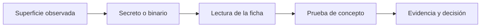
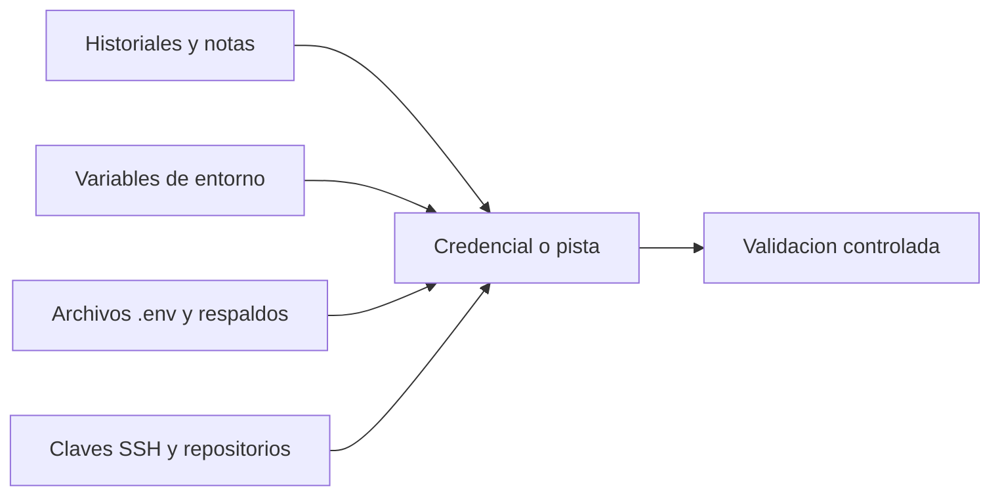
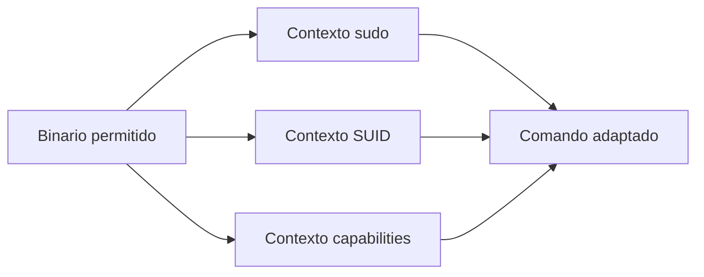
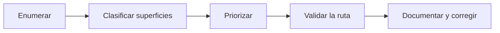

# Capítulo 07: Secretos, GTFOBins y priorización

[Inicio](../../README.md) | [Privilege Escalation](../README.md) | [Anterior: Tareas programadas y rutas escribibles](../06-tareas-programadas-y-rutas-escribibles/README.md)

> [!CAUTION]
> Las técnicas de este capítulo manipulan credenciales, binarios y reglas de `sudo`. Practícalas únicamente en una máquina virtual aislada o en sistemas con autorización expresa y por escrito. Un secreto encontrado pertenece al propietario del sistema: no debe reutilizarse fuera del alcance autorizado ni conservarse tras la prueba.

## Introducción

La enumeración del capítulo 02 produce una lista larga de observaciones: salidas de `sudo -l`, binarios con SUID, *capabilities*, tareas programadas y archivos de configuración. Esa lista no es todavía una ruta de escalada. El trabajo restante consiste en interpretar cada hallazgo y decidir cuál conviene ejecutar primero.

Un **secreto** es cualquier dato que concede acceso o reduce el trabajo necesario para obtenerlo: una contraseña, una clave privada, un token de API o una variable de entorno con credenciales. Una **ficha de GTFOBins** es la descripción pública de cómo un binario legítimo puede abrir una shell o leer y escribir archivos según el privilegio con que se ejecute. La **priorización** es el criterio que ordena los hallazgos según el impacto y el riesgo operativo de explotarlos.



El capítulo cierra la ruta: reúne el método de enumeración, el catálogo de superficies y la validación controlada en una sola decisión justificada.

---

## 1. Dónde aparecen secretos

Los secretos rara vez están donde el administrador cree. El descuido habitual no es una base de datos mal cifrada, sino un archivo de texto que un proceso privilegiado dejó accesible por comodidad. La búsqueda debe ser dirigida: se inspeccionan rutas conocidas por acumular información operativa.



### 1.1 Historiales de shell y notas

El archivo `~/.bash_history` conserva los comandos ejecutados por el usuario, incluidos aquellos que contienen contraseñas escritas en la línea de comandos. El mismo riesgo existe en `~/.zsh_history`, `~/.mysql_history`, `~/.python_history` y en notas sueltas del escritorio o del directorio `Documentos`.

```bash
cat ~/.bash_history
grep -iE "pass|passwd|token|secret|key" ~/.bash_history
find /home -maxdepth 3 -type f \( -iname "*nota*" -o -iname "*todo*" -o -iname "*.txt" \) 2>/dev/null
```

Una contraseña antigua solo es útil si sigue siendo válida. El valor debe tratarse como candidato, no como credencial confirmada, hasta comprobar su vigencia en el sistema.

### 1.2 Variables de entorno y archivos `.env`

Los procesos heredan variables de entorno que a veces contienen credenciales. Un archivo `.env`, un `docker-compose.yml` o una unidad de `systemd` pueden declarar contraseñas en claro. El árbol de procesos permite ver el entorno de cada proceso en `/proc/<pid>/environ`.

```bash
env
cat /proc/self/environ | tr '\0' '\n'
sudo cat /proc/1/environ | tr '\0' '\n'
find / -name ".env" -o -name "*.env" 2>/dev/null
```

### 1.3 Respaldos y copias antiguas

Los respaldos suelen conservar versiones anteriores de archivos de configuración con permisos más laxos. Un `backup.tar.gz`, un `config.php.bak` o un directorio `.git` dentro de `/var/www` exponen credenciales que ya no deberían estar activas.

```bash
find / -type f \( -name "*.bak" -o -name "*.old" -o -name "*.save" -o -name "*.tar.gz" -o -name "*.zip" \) 2>/dev/null
find / -type d -name ".git" 2>/dev/null
```

### 1.4 Claves SSH y credenciales en repositorios

Una clave privada sin passphrase es equivalente a una contraseña. El directorio `~/.ssh` debe revisarse junto con cualquier repositorio Git que contenga un archivo de credenciales versionado.

```bash
ls -la ~/.ssh
find / -name "id_rsa" -o -name "id_ed25519" -o -name "*.pem" 2>/dev/null
```

Un secreto hallado no se prueba contra servicios fuera del alcance. La validación se limita al propio sistema del laboratorio y a las cuentas declaradas.

---

## 2. Cómo interpretar GTFOBins

**GTFOBins** es un catálogo que documenta cómo binarios legítimos del sistema pueden usarse para eludir restricciones de seguridad. Cada ficha describe un binario y las funciones que puede cumplir según el contexto de privilegio. La ficha no distingue por sí sola qué configuración existe en el sistema: hay que cruzarla con la enumeración local.



### 2.1 Leer la ficha de un binario

Cada entrada del catálogo se organiza por funciones. Las más relevantes para escalada son `shell`, que abre una shell interactiva; `file-read` y `file-write`, que permiten leer o modificar archivos con los privilegios del binario; y `sudo`, `suid` y `capabilities`, que indican en qué contexto la técnica es aplicable. Además del nombre, la ficha ofrece la sintaxis concreta y en ocasiones una variante que evita la shell para reducir el ruido.

### 2.2 Distinguir el contexto

La misma invocación no funciona igual en todos los contextos. La diferencia es el privilegio efectivo que el sistema concede al proceso.

| Contexto | Cómo se detecta | Qué concede |
|---|---|---|
| `sudo` | Entrada en `sudo -l` | El binario se ejecuta como el usuario objetivo de la regla. |
| SUID | Bit `s` en el propietario del archivo | El proceso adopta el UID del propietario durante `exec`. |
| Capabilities | Salida de `getcap -r /` | El proceso conserva una capacidad concreta, no todos los privilegios. |
| Sin privilegio | Permisos ordinarios | El binario se ejecuta con el UID del invocante. |

### 2.3 Adaptar el comando

La adaptación consiste en tomar la sintaxis de la ficha y encajarla en la restricción observada. Una regla de `sudo` que autoriza `/usr/bin/env` sin argumentos restringidos permite pasar cualquier programa como argumento, porque `env` ejecuta el comando que recibe.

```bash
sudo -l
sudo /usr/bin/env /bin/sh
id
```

Si la regla incluyera argumentos específicos o comodines mal escritos, la sintaxis cambiaría. Leer la regla completa y no solo el nombre del binario evita intentos infructuosos.

---

## 3. Falsos positivos

Un **falso positivo** es un hallazgo que parece explotable pero no conduce a privilegios superiores. Descartarlo con argumentos es tan importante como explotar la ruta válida: evita perder tiempo y reduce el ruido generado en el sistema.

Las causas más frecuentes son las siguientes:

- **Archivos escribibles sin consumidor privilegiado.** Un script con permisos `0777` solo es peligroso si un proceso con más privilegios lo ejecuta. Si ningún `cron`, timer o servicio lo invoca, no existe ruta de escalada por esa vía.
- **Binarios SUID legítimos.** Muchos binarios del sistema tienen SUID por diseño y su ficha de GTFOBins puede no aplicar a la versión o a la configuración concreta. La presencia del bit no garantiza explotabilidad.
- **Credenciales caducadas.** Una contraseña en un historial puede pertenecer a una cuenta eliminada, haber sido rotada o no ser válida en el sistema. Debe comprobarse su vigencia antes de considerarla una ruta.
- **Archivos sensibles ya inaccesibles.** Un supuesto respaldo puede pertenecer a otro usuario y no ser legible, o contener datos de ejemplo que no conceden acceso.

La verificación de un falso positivo se apoya en la evidencia: comprobar propietario y permisos, confirmar si existe un consumidor privilegiado y validar si el valor del secreto es aceptado por el sistema.

```bash
ls -la /opt/tools
grep -R "cleanup.sh" /etc/cron* /etc/systemd 2>/dev/null
```

---

## 4. Priorización

Una vez clasificados los hallazgos, se ordenan antes de ejecutar nada. La priorización no elige la técnica más vistosa, sino la que maximiza la probabilidad de éxito con el menor riesgo operativo. Se evalúan cinco criterios.

- **Impacto.** Qué privilegio concede la ruta. Una shell como `root` supera a la lectura de un archivo aislado.
- **Fiabilidad.** Si el resultado es determinista o depende de condiciones que pueden cambiar entre ejecuciones.
- **Ruido generado.** Cuántos registros, procesos o cambios deja la técnica. Una regla de `sudo` genera menos rastro que modificar un servicio.
- **Reversibilidad.** Si el cambio puede deshacerse con facilidad. Una modificación de `sudoers` es reversible; sobrescribir un binario del sistema, no.
- **Alcance autorizado.** Si la ruta permanece dentro de los límites de la autorización. Una superficie que exige actuar sobre terceros queda descartada.

La matriz de decisión resume la comparación. Las puntuaciones son un ejemplo de laboratorio y solo ordenan las opciones; no sustituyen al juicio técnico.

| Hallazgo | Impacto | Fiabilidad | Ruido | Reversible | Prioridad |
|---|---|---|---|---|---|
| Regla `sudo` sobre `/usr/bin/env` | Alto | Alta | Bajo | Sí | 1 |
| Cron apuntando a script de `root` no escribible | Alto | Nula | Medio | No | Descartado |
| Script `0777` sin consumidor | Alto | Nula | Bajo | Sí | Descartado |
| Contraseña en historial no válida | Medio | Nula | Bajo | Sí | Descartado |
| Token de API ficticio en `.env` | Bajo | Nula | Bajo | Sí | Descartado |

El orden resultante se ejecuta de arriba abajo. En cuanto una ruta concede el privilegio objetivo, se detiene la explotación y se documenta la evidencia. Ejecutar rutas adicionales multiplica el rastro sin aportar información nueva.

---

## 5. Documentación

La documentación convierte una prueba accidental en un resultado reproducible. Un informe breve debe responder a cuatro preguntas: qué se observó, por qué el sistema lo permite, qué consecuencia tiene y cómo se corrige.

La estructura mínima de un informe técnico es la siguiente:

```text
1. Contexto
   - Host, usuario inicial y privilegio efectivo.
   - Fecha y alcance autorizado.

2. Evidencia
   - Salida literal de la enumeración que sustenta el hallazgo.
   - Comandos ejecutados y su resultado.

3. Causa raíz
   - Configuración o decisión que origina el privilegio excesivo.

4. Impacto
   - Privilegio alcanzado y alcance del daño potencial.

5. Remediación
   - Cambio concreto que elimina la ruta.
```

La **evidencia** debe ser literal y verificable: la línea de `sudo -l`, la salida de `ls -la` o el fragmento de `crontab`. La **causa raíz** explica la decisión que concede el privilegio, por ejemplo una regla `NOPASSWD` sobre un binario que ejecuta comandos arbitrarios. El **impacto** describe el privilegio obtenido, no solo el comando que lo obtuvo. La **remediación** propone la corrección que cierra la superficie sin depender de la técnica concreta.

Una remediación útil es específica: restringir la regla de `sudo` a un comando con argumentos fijos, retirar el bit SUID innecesario, acotar la *capability* o hacer que el script privilegiado sea propiedad de `root` y no escribible por otros.

---

## 6. Cierre de la ruta

La ruta de escalada no termina con una shell de `root`, sino con un método repetible. Ese método encadena tres etapas: enumerar el estado real del sistema, clasificar las superficies encontradas y validar únicamente la ruta priorizada.



La **enumeración** del capítulo 02 alimenta todas las superficies estudiadas en los capítulos 03 a 06: reglas de `sudo`, binarios SUID y SGID, *capabilities* y tareas programadas. El capítulo 07 añade la lectura de secretos y el catálogo de GTFOBins como fuentes de rutas. La **clasificación** distingue lo explotable del señuelo. La **priorización** ordena por impacto y riesgo. La **validación** confirma la hipótesis con la menor intervención posible. La **documentación** cierra el ciclo y permite corregir la causa raíz.

Aplicar este orden de forma constante evita dos errores opuestos: ejecutar técnicas sin entender el sistema y acumular hallazgos sin decidir cuáles importan. Un pentester competente no demuestra cuántas rutas conoce, sino que justifica por qué la ruta elegida conduce al objetivo con el menor coste.

## Práctica

El laboratorio asociado materializa este capítulo: un escenario con una ruta real y varios señuelos que deben clasificarse antes de actuar.

- [Laboratorio: análisis y priorización de hallazgos](./lab/README.md)

## Cheatsheet

Referencia rápida del capítulo en formato PDF: [cheatsheet.pdf](./cheatsheet.pdf).

---

[Anterior: Tareas programadas y rutas escribibles](../06-tareas-programadas-y-rutas-escribibles/README.md) | [Volver al índice](../README.md)
