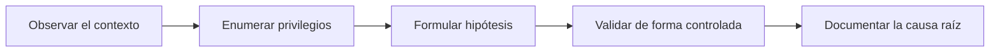
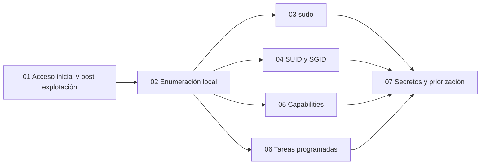

# Privilege Escalation: Escalada de privilegios en Linux

[Inicio](../README.md) | [Configurar laboratorio](../setup/README.md)

Ruta práctica para pasar de un acceso inicial con pocos privilegios al control administrativo de un sistema Linux, comprendiendo primero cómo se enumeran los privilegios reales y, después, cómo se abusa de configuraciones inseguras concretas dentro de una máquina virtual aislada.

> [!CAUTION]
> **Alcance y ética**: todo el material y los laboratorios de esta ruta existen con fines educativos y de defensa. Las técnicas deben practicarse exclusivamente en máquinas virtuales propias y aisladas o en sistemas para los que exista autorización expresa y por escrito. El autor no se responsabiliza del uso indebido de esta información.

---

## Prólogo: por qué enumerar antes de explotar

La escalada de privilegios no consiste en ejecutar un *exploit* al azar. Consiste en **comprender el estado real del sistema** y detectar la diferencia entre el contexto que tenemos y el contexto que el sistema concede a otros procesos. Casi todas las rutas de escalada nacen de una decisión de configuración: una regla de `sudo` demasiado amplia, un binario con el bit SUID, una *capability* mal asignada o un archivo privilegiado que cualquiera puede escribir.

La ruta sigue una metodología explícita:



Cada capítulo añade una superficie de escalada y se apoya en el anterior. El objetivo no es memorizar comandos, sino aprender a leer la evidencia y a justificar por qué una configuración concreta permite elevar privilegios.

---

## Roadmap de estudio

El recorrido avanza desde el acceso inicial hasta la priorización de hallazgos. Los capítulos 01 y 02 preparan el método; los capítulos 03 a 06 estudian las superficies de escalada más frecuentes en Linux; el capítulo 07 integra todo en una decisión sustentada por evidencia.



---

## Tabla de contenidos

| # | Capítulo | Descripción técnica | Nivel | Práctica / Lab | Estado |
|---|---|---|---|---|---|
| **01** | [**De acceso inicial a post-explotación**](./01-acceso-inicial-y-post-explotacion/README.md) | Diferencia entre acceso inicial, ejecución de comandos y escalada; contexto real del usuario frente a privilegios efectivos; límites de un *foothold*. | Inicial | [Reconocer el contexto inicial](./01-acceso-inicial-y-post-explotacion/lab/README.md) | **Disponible** |
| **02** | [**Enumeración local del sistema**](./02-enumeracion-local/README.md) | Usuarios, grupos, kernel, procesos, servicios, red, montajes, permisos, árbol de archivos y herramientas de enumeración. | Inicial | [Enumeración guiada](./02-enumeracion-local/lab/README.md) | **Disponible** |
| **03** | [**Privilegios delegados con `sudo`**](./03-privilegios-delegados-sudo/README.md) | `sudoers`, `sudo -l`, reglas con comodines, binarios que abren shell, entorno heredado y `LD_PRELOAD`. | Intermedio | [Regla de `sudo` insegura](./03-privilegios-delegados-sudo/lab/README.md) | **Disponible** |
| **04** | [**Binarios SUID y SGID**](./04-binarios-suid-y-sgid/README.md) | Permisos especiales, UID efectivo durante `exec`, binarios de GTFOBins, secuestro de `PATH` y montajes `nosuid`. | Intermedio | [Binario SUID inseguro](./04-binarios-suid-y-sgid/lab/README.md) | **Disponible** |
| **05** | [**Linux capabilities**](./05-linux-capabilities/README.md) | Modelo de capacidades, conjuntos efectivo y permitido, enumeración con `getcap` y abuso de capacidades sensibles. | Intermedio | [Capability sensible](./05-linux-capabilities/lab/README.md) | **Disponible** |
| **06** | [**Tareas programadas y rutas escribibles**](./06-tareas-programadas-y-rutas-escribibles/README.md) | `cron`, timers de `systemd`, scripts privilegiados, rutas relativas y directorios escribibles consumidos por `root`. | Intermedio | [Script de `root` escribible](./06-tareas-programadas-y-rutas-escribibles/lab/README.md) | **Disponible** |
| **07** | [**Secretos, GTFOBins y priorización**](./07-secretos-y-priorizacion/README.md) | Archivos con credenciales, catálogo GTFOBins, descarte de falsos positivos y priorización de rutas por impacto y ruido. | Intermedio - Avanzado | [Análisis de hallazgos](./07-secretos-y-priorizacion/lab/README.md) | **Disponible** |

Duración total estimada: **525 minutos, aproximadamente 8 h 45 min**.

---

## Entorno de prácticas

Todos los laboratorios se ejecutan sobre una única VM Ubuntu Server 22.04 LTS con dos cuentas:

- una cuenta sin privilegios administrativos, que representa el acceso inicial;
- la cuenta `root`, que representa el objetivo de la escalada.

Cada laboratorio incluye un script `setup.sh` que se ejecuta con `sudo` y prepara una configuración vulnerable intencional. El entorno se restaura revirtiendo la instantánea (*snapshot*) creada antes de la práctica.

```text
VM Ubuntu aislada (host-only)
|-- usuario sin privilegios  -> acceso inicial
|-- root                     -> objetivo de la escalada
`-- setup.sh                 -> provisiona un escenario concreto
```

Requisitos generales:

- Ubuntu Server 22.04 LTS o superior en una red host-only.
- Una instantánea limpia antes de cada laboratorio.
- `sudo`, `cron` y herramientas básicas (`find`, `tar`, `python3`, `getcap`).
- Autorización expresa sobre todos los sistemas del alcance.

La preparación detallada del entorno está en la [guía de configuración](../setup/README.md).

---

## Cómo progresar

1. Prepara la VM Ubuntu aislada y crea una instantánea limpia.
2. Estudia el capítulo 01 y realiza su laboratorio para fijar el contexto inicial.
3. Avanza por los capítulos en orden: la enumeración del capítulo 02 es necesaria para los capítulos 03 a 06.
4. Ejecuta cada `setup.sh` solo dentro de la VM aislada y restaura la instantánea al terminar.
5. En el capítulo 07, integra los hallazgos y justifica qué ruta escalar antes de ejecutarla.

---

## Uso responsable

- No pruebes estas técnicas contra sistemas de terceros sin autorización.
- No conectes la VM vulnerable directamente a Internet.
- No introduzcas persistencia, movimiento lateral ni cambios fuera de la VM de laboratorio.
- Restaura la instantánea al acabar para eliminar la configuración vulnerable creada.

[Volver al catálogo principal del repositorio](../README.md)
